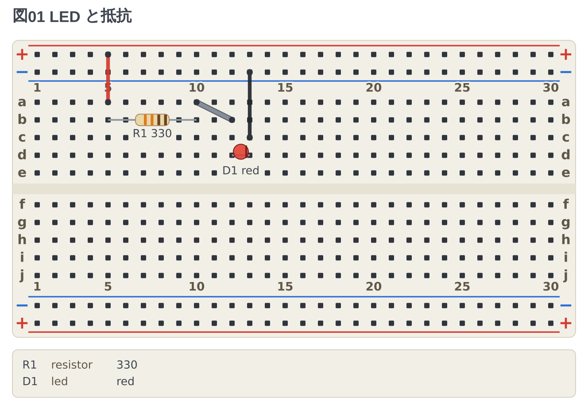

# tommie-fence

[English](README.md) | [日本語](README.ja.md)

A family of Markdown fence languages that draw electronics, kept in one
monorepo: schematic, breadboard, and perfboard.

| Package | Fence | Draws |
| --- | --- | --- |
| circuit-fence | ` ```circuit ` | Schematics — parts placed by grid address, netlist derived |
| breadboard-fence | ` ```breadboard ` | Breadboard wiring diagrams — netlist derived from the strips inside the board |
| perfboard-fence | ` ```perfboard ` | Perfboard layouts — every hole independent, connections made only by wires |

The languages are separate; the manners are shared: YAML-hosted fences,
positions written as addresses, and mistakes reported with Markdown line
numbers and the content of the offending line.

## Try it without installing anything

**[Open the playground](https://tommie-jp.github.io/tommie-fence/)** — no
account, no sign-up. Type on the left, the drawing appears on the right, and
**all three fences draw** — schematics included, with TeX running in
WebAssembly (the engine is fetched only the first time you draw a circuit).
**The map opens there too**: drag a part and the address in the fence is
rewritten, the same editor the extensions carry. It carries 125 examples,
including the deliberately broken ones that show how mistakes are reported.
What you write goes into the URL, so a link is enough to hand it to someone.

[](https://codespaces.new/tommie-jp/tommie-fence?quickstart=1)

**For all three for real, use Codespaces.** VS Code opens in the browser with
the extension installed and [examples/try-me.md](examples/try-me.md) in
front of you. Open the Markdown preview (`Ctrl+Shift+V`) and the fences turn
into drawings; you can also turn the `.md` tab itself into a drawing editor. A
GitHub account is needed (the free tier is 120 core-hours a month).

The extensions come from the `.vsix` files on the releases page. **Nothing is
built from source there** — the demo shows a released version, not the tip of
main.

## Status

**This is the new home of circuit-fence and breadboard-fence.** The two
original repositories ([circuit-fence](https://github.com/tommie-jp/circuit-fence)
and [breadboard-fence](https://github.com/tommie-jp/breadboard-fence)) were
archived on 2026-09-01. Every commit came along, so
`git log packages/circuit-fence` reaches back to the first one.

**Releases come from here.** Version tags are prefixed with the package name
(`breadboard-fence-v0.4.0`, `circuit-fence-v0.3.1`). The archived repositories
keep their releases up to `v0.3.0`; everything after that is on the
[releases page](https://github.com/tommie-jp/tommie-fence/releases).

The four packages build, test and package from the repository root through npm
workspaces.

```text
tommie-fence
├── packages/fence-kit          shared: newline normalisation, fence extraction, markup escaping
├── packages/circuit-fence     library + CLI
├── packages/breadboard-fence  library + CLI
├── packages/perfboard-fence   library + CLI
├── packages/tommie-fence      the VS Code extension: all three folded into one
└── packages/playground        one page that runs all three in a browser
```

`fence-kit` only holds code that was **already duplicated** — nothing is put
there in advance. The packages that use it bundle it with esbuild, so it has
no build step and no runtime dependency of its own.

## Documentation

Each package carries its own reference and a set of worked examples. The prose
is Japanese; the fences themselves are language-neutral. **[examples/](examples/README.md)
is the gallery** — every fence next to the drawing it produces.

[](examples/README.md)

[](examples/README.md)

| Package | Reference | Cheatsheet | Examples |
| --- | --- | --- | --- |
| circuit-fence | [docs/01-syntax.md](packages/circuit-fence/docs/01-syntax.md) | [docs/02-cheatsheet.md](packages/circuit-fence/docs/02-cheatsheet.md) | [examples/](packages/circuit-fence/examples/) — 15 circuits, 5 error cases |
| breadboard-fence | [docs/01-syntax.md](packages/breadboard-fence/docs/01-syntax.md) | [docs/02-cheatsheet.md](packages/breadboard-fence/docs/02-cheatsheet.md) | [examples/](packages/breadboard-fence/examples/) — 13 circuits, 2 error cases |

Every example is followed by the drawing it produces (`examples/out/`), so the
files read as documentation in the Markdown preview. Rebuild them with
`npm run examples --workspace=<package>`.

## Development

One `npm install` at the root covers every package, and there is a single
lockfile.

```bash
npm install
npm run check                                # typecheck + tests, all packages
npm run check --workspace=circuit-fence      # just one
npm run examples --workspace=circuit-fence   # rebuild the drawings
npm run build --workspace=playground         # build the try-it page into dist/
./doBuild.sh                                 # build the .vsix, reinstall into VS Code
./doVersion.sh circuit-fence minor           # bump the version
```

**Do not call `vsce` directly.** Workspaces hoist dependencies to the root
`node_modules`, and `vsce package` then walks outside the package and picks up
the same file by two routes, refusing to pack. `doBuild.sh` copies the package
out and installs it on its own first, which is why it is the only supported way
to build a `.vsix`.

The `Makefile` holds the steps; `doBuild.sh` only translates its arguments into
make goals. **Packages you have not touched are not rebuilt.** You can call make
directly:

```bash
make                  # build the .vsix (if it changed)
make install          # the above, plus reinstalling into VS Code
make tommie-fence     # the extension only
make CHECK=0 install  # skip the typecheck and the tests
make clean            # drop the rebuild marks, the staging area, the .vsix files
make help             # list the goals
```

## License

MIT
