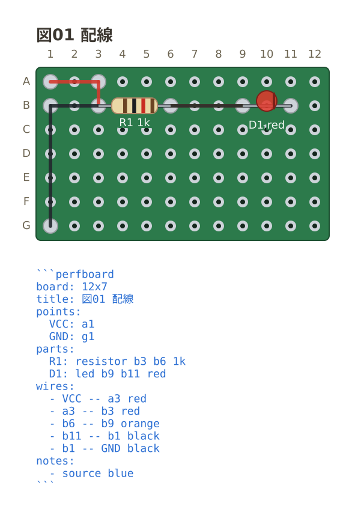
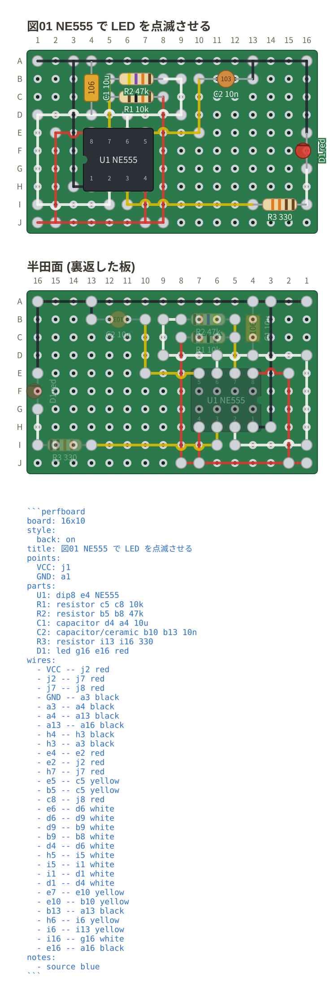
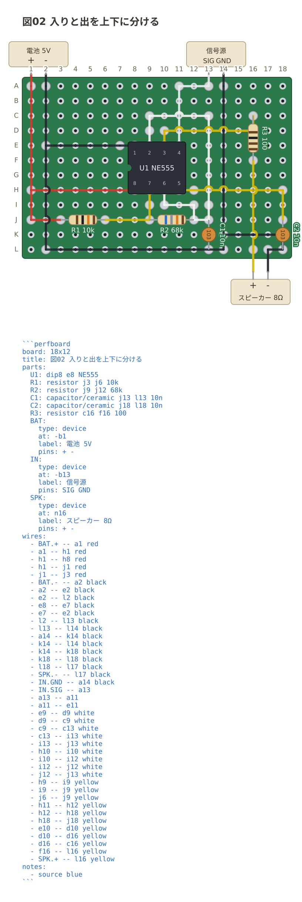
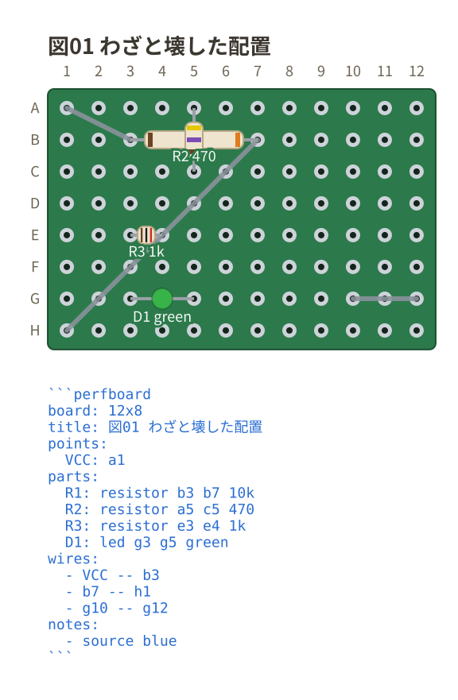

# 例

[English](README.md) | [日本語](README.ja.md)

**実体は各パッケージの中にある。** ここはリポジトリ直下からの入口。

| フェンス | 例 | 索引 |
| --- | --- | --- |
| circuit | 回路 15 本 + わざと壊した例 5 本 | [packages/circuit-fence/examples/](../packages/circuit-fence/examples/README.md) |
| breadboard | 回路 13 本 + わざと壊した例 2 本 | [packages/breadboard-fence/examples/](../packages/breadboard-fence/examples/README.md) |
| perfboard | 回路 8 本 + わざと壊した例 1 本 | [packages/perfboard-fence/examples/](../packages/perfboard-fence/examples/README.md) |

どの例も、フェンスの直後に**そのフェンスを描いた図**が貼ってある。
GitHub のようにフェンスが描画されない場所で、書き方と出力を対で読むためのもの。
VS Code のプレビュー (`Ctrl+Shift+V`) ではフェンス自体が図になる。

## circuit — 回路図

部品を番地で置き、配線を `--` で引くと、ネットリストまで出る。
座標計算も分岐の黒丸の手打ちも要らない。

### RC ローパス

いちばん小さい例。番地・部品・配線・ネットリストが一通り出てくる
([01-rc-lowpass.md](../packages/circuit-fence/examples/01-rc-lowpass.md))。

### 非反転増幅回路

オペアンプの向き (`+up`) と、足の名前への配線の引き方
([04-non-inverting-amp.md](../packages/circuit-fence/examples/04-non-inverting-amp.md))。

### ロジックゲート

ゲート記号、DIP の IC、切り替えスイッチ
([11-logic.md](../packages/circuit-fence/examples/11-logic.md))。

### 電流の矢と電圧の符号

`i=` と `v=` で、解析の向きを図に書き込む
([15-arrows.md](../packages/circuit-fence/examples/15-arrows.md))。

### そのほか

- [02-parts.md](../packages/circuit-fence/examples/02-parts.md) — 2 端子部品 44 種と 1 端子の記号 4 種
- [08-themes.md](../packages/circuit-fence/examples/08-themes.md) — `auto` / `light` / `dark` / `mono`
- [12-notes.md](../packages/circuit-fence/examples/12-notes.md) — 印・枠・指し棒・字の注釈
- [14-half-step.md](../packages/circuit-fence/examples/14-half-step.md) — 交点の間の番地 (`a_1.5`)
- [errors/](../packages/circuit-fence/examples/errors/) — 読めなかったときに何が出るか

## breadboard — ブレッドボード実体配線図

穴の番地に部品を挿すと、**ボード内部の導通から**ネットリストが出る。
**番号は読む順**で、最小の回路から実験回路まで難しくなる。

### LED と抵抗

いちばん小さい例。抵抗 1 本と LED 1 個
([01-led.md](../packages/breadboard-fence/examples/01-led.md))。

### Raspberry Pi Pico

マイコンボードを板にまたがせて、LED とボタンをつなぐ
([07-pico.md](../packages/breadboard-fence/examples/07-pico.md))。

### 1 石中波ラジオ

板の外の機器 (バーアンテナ・ポリバリコン・イヤホン・電池) を `device` で置き、
図の下に部品リストを出した例
([09-am-radio.md](../packages/breadboard-fence/examples/09-am-radio.md))。

### B-H カーブ測定回路

オペアンプ・測定器・トロイダルコアを含む実験回路
([10-bh-ad2.md](../packages/breadboard-fence/examples/10-bh-ad2.md))。

### そのほか

- [03-board-variants.md](../packages/breadboard-fence/examples/03-board-variants.md) — 板の印字を手元の実物に寄せる
- [05-capacitors.md](../packages/breadboard-fence/examples/05-capacitors.md) — 部品の姿を選ぶ (`capacitor/ceramic` など)
- [11-sensors.md](../packages/breadboard-fence/examples/11-sensors.md) — CdS・サーミスタ・ダイオードの仲間
- [13-points.md](../packages/breadboard-fence/examples/13-points.md) — 番地に名前を付ける (`points:`)
- [errors/](../packages/breadboard-fence/examples/errors/) — わざと読めなく書いたもの

## perfboard — ユニバーサル基板

穴の番地に部品を置き、配線を `--` で引く。**全穴が独立している**ので、
挿しただけでは何もつながらず、ネットリストは書いた配線からだけ出る。

### 配線とネットリスト

いちばん小さい例。2 つの穴をまっすぐ結ぶだけで、経路探索は要らない
([03-wires.md](../packages/perfboard-fence/examples/03-wires.md))。

### IC と 3 本足の部品

DIP は 1 番ピンだけ書けば足が並ぶ。トランジスタは穴を 3 つ書く
([06-ic.md](../packages/perfboard-fence/examples/06-ic.md))。

### 板の外の機器

電池やスピーカーは `device` として板の外の帯に置き、`SPK.1` の形で指す。
線は**その足から穴まで**引かれるので、どこへ半田付けするかが図に出る
([07-device.md](../packages/perfboard-fence/examples/07-device.md))。

### つなぎ忘れを見張る (ERC)

繋ぎ忘れは図の上で沈黙するので、浮いた足・短絡した部品・部品につながらない
配線を行番号つきで名指す
([05-erc.md](../packages/perfboard-fence/examples/05-erc.md))。

### そのほか

- [01-board.md](../packages/perfboard-fence/examples/01-board.md) — 板の穴数 (列 × 行) と名前 (`akizuki-c`)、26 行を超える板の番地
- [02-parts.md](../packages/perfboard-fence/examples/02-parts.md) — 抵抗のカラーコード、LED の色、斜めに置く
- [04-points.md](../packages/perfboard-fence/examples/04-points.md) — 穴に名前を付ける (`points:`)
- [08-notes.md](../packages/perfboard-fence/examples/08-notes.md) — 注釈 (`notes:`) と、テーマ・幅 (`style:`)
- [errors/](../packages/perfboard-fence/examples/errors/) — わざと読めなく書いたもの

## なぜ実体をここに置かないか

例はドキュメントではなく、**ビルドとテストの一部**だから。
パッケージの外へ出すと 3 つとも壊れる。

- `examples/out/` はスナップショットテストの**期待値**
  (`src/core/examples.test.ts` がパッケージ相対で読む)
- `npm run examples --workspace=<パッケージ>` はパッケージの中で回る
- README の相対リンクは `vsce` が**パッケージを基準に**絶対 URL へ書き換える
  (Marketplace と拡張ページの図はこれで出ている)
