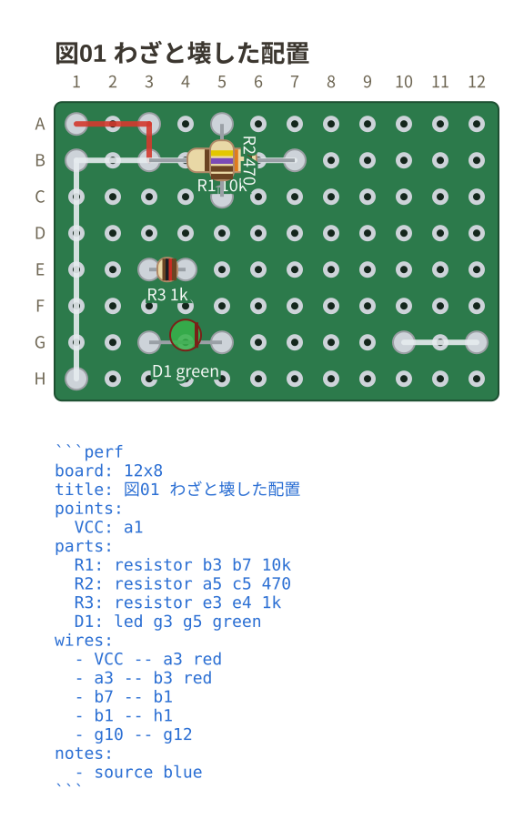
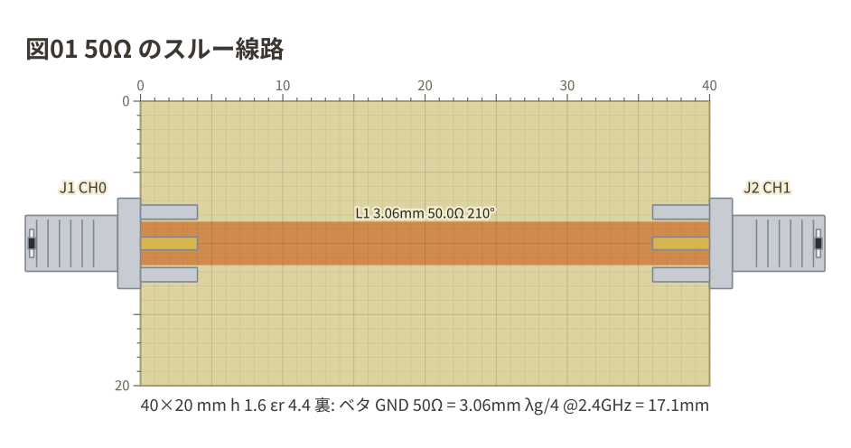
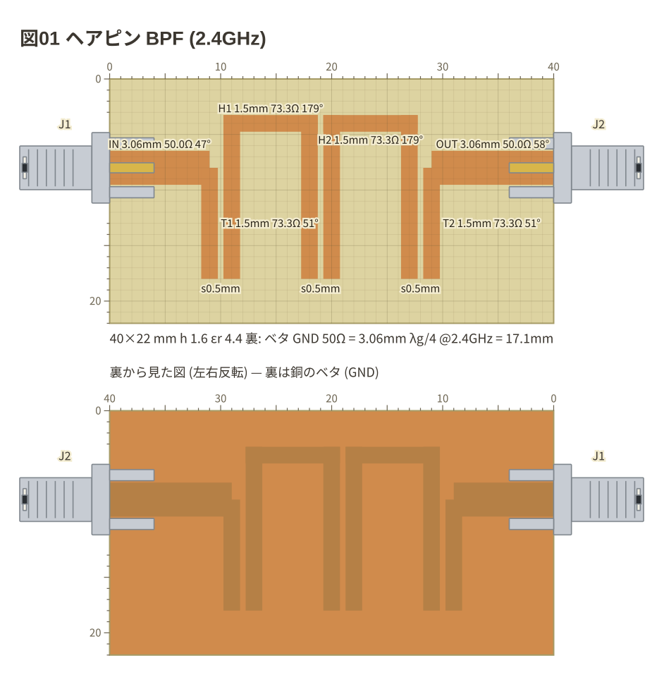

# Examples

[English](README.md) | [日本語](README.ja.md)

**The files live inside the packages.** This page is the way in from the
repository root. The prose in them is Japanese; the fences are language-neutral.

| Fence | Examples | Index |
| --- | --- | --- |
| circuit | 15 circuits + 5 deliberately broken | [packages/circuit-fence/examples/](../packages/circuit-fence/examples/README.md) |
| breadboard | 13 circuits + 2 deliberately broken | [packages/breadboard-fence/examples/](../packages/breadboard-fence/examples/README.md) |
| perfboard | 8 circuits + 1 deliberately broken | [packages/perfboard-fence/examples/](../packages/perfboard-fence/examples/README.md) |
| copper | 9 fixtures + 1 deliberately broken | [packages/copper-fence/examples/](../packages/copper-fence/examples/README.md) |
| vna | 5 measurements + 1 deliberately broken | [packages/vna-fence/examples/](../packages/vna-fence/examples/README.md) |

Every example carries **the drawing that fence produces** right after it, so the
source and the result read as a pair where fences are not rendered (GitHub, for
one). In the VS Code preview (`Ctrl+Shift+V`) the fence itself becomes the
drawing.

## circuit — schematics

Parts are placed by grid address and wired with `--`; the netlist follows.
No coordinate arithmetic, no hand-placed junction dots.

### RC low-pass

The smallest example: addresses, parts, wires and a netlist in one go
([01-rc-lowpass.md](../packages/circuit-fence/examples/01-rc-lowpass.md)).

### Non-inverting amplifier

Op-amp orientation (`+up`) and wiring to named pins
([04-non-inverting-amp.md](../packages/circuit-fence/examples/04-non-inverting-amp.md)).

### Logic gates

Gate symbols, DIP ICs and changeover switches
([11-logic.md](../packages/circuit-fence/examples/11-logic.md)).

### Current arrows and voltage signs

`i=` and `v=` write the direction you are solving for into the drawing
([15-arrows.md](../packages/circuit-fence/examples/15-arrows.md)).

### More

- [02-parts.md](../packages/circuit-fence/examples/02-parts.md) — 44 two-terminal parts and 4 one-terminal symbols
- [08-themes.md](../packages/circuit-fence/examples/08-themes.md) — `auto` / `light` / `dark` / `mono`
- [12-notes.md](../packages/circuit-fence/examples/12-notes.md) — marks, frames, pointers and text
- [14-half-step.md](../packages/circuit-fence/examples/14-half-step.md) — addresses between crossings (`a_1.5`)
- [errors/](../packages/circuit-fence/examples/errors/) — what comes back when a fence cannot be read

## breadboard — breadboard wiring diagrams

Parts go into numbered holes, and the netlist is derived **from the strips
inside the board**. **The numbering is the reading order**, from the smallest
circuit to bench ones.

### An LED and a resistor

The smallest example: one resistor, one LED
([01-led.md](../packages/breadboard-fence/examples/01-led.md)).

### Raspberry Pi Pico

A microcontroller board straddling the board, with an LED and a button
([07-pico.md](../packages/breadboard-fence/examples/07-pico.md)).

### A one-transistor AM radio

Things off the board (ferrite rod antenna, tuning capacitor, earphone, battery)
placed as `device`, with the parts list under the drawing
([09-am-radio.md](../packages/breadboard-fence/examples/09-am-radio.md)).

### A B-H curve rig

A bench circuit with an op-amp, instruments and a toroidal core
([10-bh-ad2.md](../packages/breadboard-fence/examples/10-bh-ad2.md)).

### More

- [03-board-variants.md](../packages/breadboard-fence/examples/03-board-variants.md) — matching the silkscreen of the board on your desk
- [05-capacitors.md](../packages/breadboard-fence/examples/05-capacitors.md) — choosing a package (`capacitor/ceramic` and so on)
- [11-sensors.md](../packages/breadboard-fence/examples/11-sensors.md) — CdS cells, thermistors, the diode family
- [13-points.md](../packages/breadboard-fence/examples/13-points.md) — naming holes (`points:`)
- [errors/](../packages/breadboard-fence/examples/errors/) — fences written wrong on purpose

## perfboard — perfboard layouts

Parts go into numbered holes and are wired with `--`. **Every hole is
independent**, so placing a part connects nothing and the netlist comes only
from the wires you wrote.

### Wires and the netlist

The smallest example: a wire runs straight between two holes, with no routing to
work out ([03-wires.md](../packages/perfboard-fence/examples/03-wires.md)).

### ICs and three-lead parts

A DIP needs only pin 1 written; a transistor takes three holes
([06-ic.md](../packages/perfboard-fence/examples/06-ic.md)).

### Things off the board

A battery or a speaker is a `device`, drawn in a band beside the board and wired
to as `SPK.1`. The line is drawn **from its pin to the hole**, so where to solder
it is in the picture
([07-device.md](../packages/perfboard-fence/examples/07-device.md)).

### Watching for a missing connection (ERC)

A missing connection is silent in the picture, so the ERC names an unconnected
pin, a part the wiring shorts out and a wire that reaches no pin, each with the
line it was written on
([05-check.md](../packages/perfboard-fence/examples/05-check.md)).

### More

- [01-board.md](../packages/perfboard-fence/examples/01-board.md) — board size (columns by rows) and names (`akizuki-c`), addresses past 26 rows
- [02-parts.md](../packages/perfboard-fence/examples/02-parts.md) — resistor colour codes, LED colours, parts lying at an angle
- [04-points.md](../packages/perfboard-fence/examples/04-points.md) — naming holes (`points:`)
- [08-notes.md](../packages/perfboard-fence/examples/08-notes.md) — annotations (`notes:`), themes and width (`style:`)
- [errors/](../packages/perfboard-fence/examples/errors/) — fences written wrong on purpose

## copper — copper-clad boards

Positions in millimetres, lines with a width, and the Z0 of every line in its
caption. For the GHz fixtures of a NanoVNA: microstrip, coplanar lines and
Manhattan islands.

### A 50-ohm through line

The smallest fixture: a 3.06 mm line on 1.6 mm FR4 between two edge-mount SMAs
([00-through.md](../packages/copper-fence/examples/00-through.md)).

### A hairpin band-pass filter

The gaps between coupled lines are measured, not written
([05-coupled.md](../packages/copper-fence/examples/05-coupled.md)).

### More

- [03-parts.md](../packages/copper-fence/examples/03-parts.md) — a series chip that cuts the line, a shunt chip, a SOT-89 MMIC
- [04-manhattan.md](../packages/copper-fence/examples/04-manhattan.md) — Manhattan islands on a board whose front is ground
- [06-ground.md](../packages/copper-fence/examples/06-ground.md) — vias, slots and a patch antenna
- [08-check.md](../packages/copper-fence/examples/08-check.md) — what the ERC says

## vna — the NanoVNA screen

Log Mag, Smith chart, SWR, phase, group delay, impedance and TDR. An ideal model
(`dut:`) is drawn dashed before you measure; a Touchstone file saved next to the
Markdown (`data:`) is drawn solid over it.

### A series fixture: model and measurement

100 Ω between CH0 and CH1: −6.02 dB both ways, and where the measurement leaves
the model ([00-series.md](../packages/vna-fence/examples/00-series.md)).

### More

- [01-traces.md](../packages/vna-fence/examples/01-traces.md) — every trace format: magnitude, phase, delay, SWR, Smith, polar
- [02-parts.md](../packages/vna-fence/examples/02-parts.md) — parts with parasitics: a capacitor's SRF, a coil's parallel resonance, a crystal
- [03-lines.md](../packages/vna-fence/examples/03-lines.md) — lines, stubs and TDR
- [04-notes.md](../packages/vna-fence/examples/04-notes.md) — annotations (`notes:`) and style

## Why the files are not kept here

The examples are not documentation — they are **part of the build and the
tests**. Moving them out of the packages breaks three things at once.

- `examples/out/` holds the **expected values** of the snapshot tests
  (`src/core/examples.test.ts` reads it relative to its own package)
- `npm run examples --workspace=<package>` runs inside the package
- `vsce` rewrites the relative links in a README to absolute URLs **based on the
  package**, which is how the drawings appear on the Marketplace and on the
  extension page
