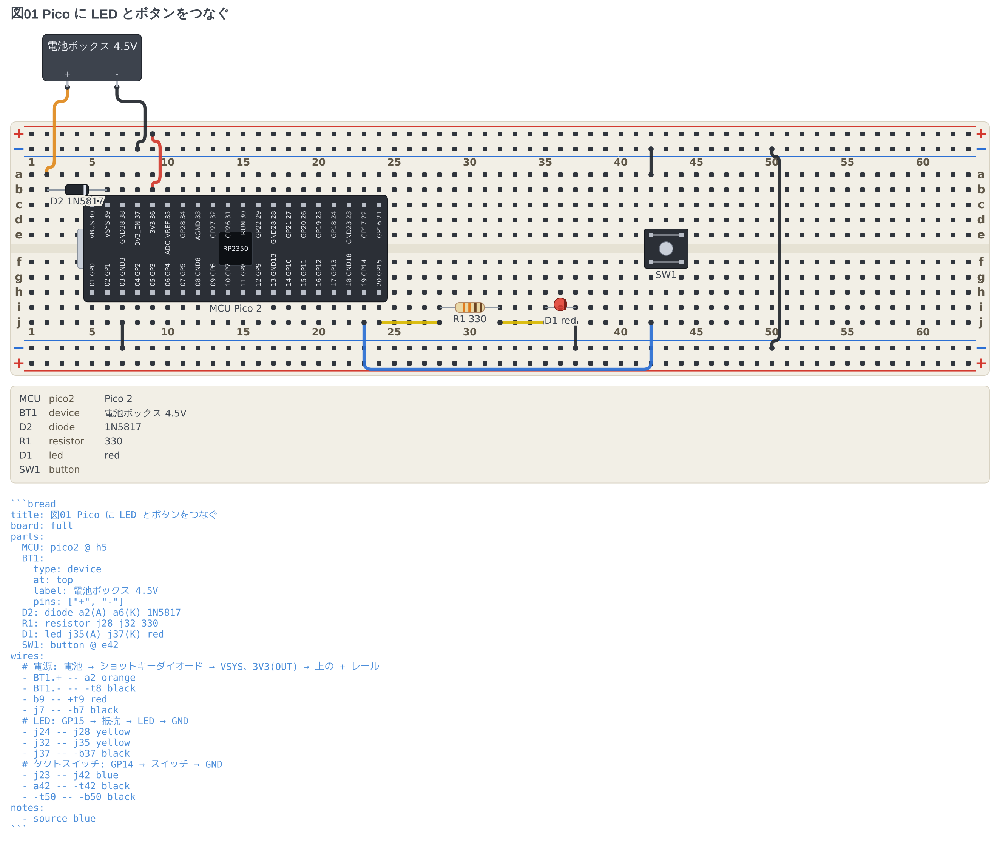
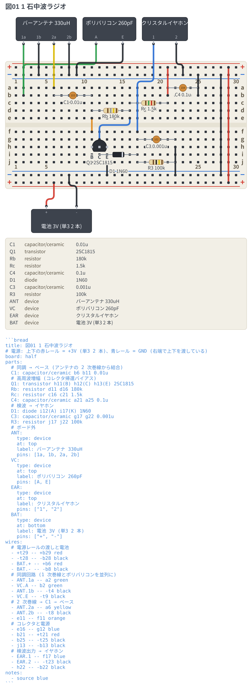
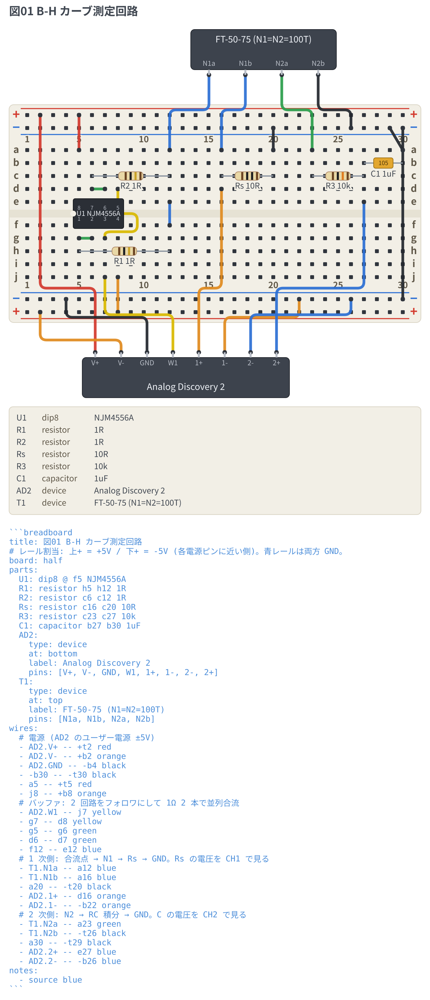

# Examples

[English](README.md) | [日本語](README.ja.md)

**The files live inside the packages.** This page is the way in from the
repository root. The prose in them is Japanese; the fences are language-neutral.

| Fence | Examples | Index |
| --- | --- | --- |
| circuit | 15 circuits + 5 deliberately broken | [packages/circuit-fence/examples/](../packages/circuit-fence/examples/README.md) |
| breadboard | 13 circuits + 2 deliberately broken | [packages/breadboard-fence/examples/](../packages/breadboard-fence/examples/README.md) |
| perfboard | none yet (board, holes, two-lead parts, wires and ERC all work) | [packages/perfboard-fence/](../packages/perfboard-fence/README.md) |

Every example carries **the drawing that fence produces** right after it, so the
source and the result read as a pair where fences are not rendered (GitHub, for
one). In the VS Code preview (`Ctrl+Shift+V`) the fence itself becomes the
drawing.

## circuit — schematics

Parts are placed by grid address and wired with `--`; the netlist follows.
No coordinate arithmetic, no hand-placed junction dots.

### RC low-pass

[](../packages/circuit-fence/examples/01-rc-lowpass.md)

The smallest example: addresses, parts, wires and a netlist in one go
([01-rc-lowpass.md](../packages/circuit-fence/examples/01-rc-lowpass.md)).

### Non-inverting amplifier

[](../packages/circuit-fence/examples/04-non-inverting-amp.md)

Op-amp orientation (`+up`) and wiring to named pins
([04-non-inverting-amp.md](../packages/circuit-fence/examples/04-non-inverting-amp.md)).

### Logic gates

[](../packages/circuit-fence/examples/11-logic.md)

Gate symbols, DIP ICs and changeover switches
([11-logic.md](../packages/circuit-fence/examples/11-logic.md)).

### Current arrows and voltage signs

[](../packages/circuit-fence/examples/15-arrows.md)

`i=` and `v=` write the direction you are solving for into the drawing
([15-arrows.md](../packages/circuit-fence/examples/15-arrows.md)).

### More

- [02-parts.md](../packages/circuit-fence/examples/02-parts.md) — 44 two-terminal parts and 4 one-terminal symbols
- [08-themes.md](../packages/circuit-fence/examples/08-themes.md) — `auto` / `light` / `dark` / `mono`
- [12-notes.md](../packages/circuit-fence/examples/12-notes.md) — marks, frames, pointers and text
- [14-half-step.md](../packages/circuit-fence/examples/14-half-step.md) — addresses between crossings (`a_1.5`)
- [errors/](../packages/circuit-fence/examples/errors/) — what comes back when a fence cannot be read

## breadboard — breadboard wiring diagrams

Parts go into numbered holes, and the netlist is derived **from the strips
inside the board**. **The numbering is the reading order**, from the smallest
circuit to bench ones.

### An LED and a resistor

[](../packages/breadboard-fence/examples/01-led.md)

The smallest example: one resistor, one LED
([01-led.md](../packages/breadboard-fence/examples/01-led.md)).

### Raspberry Pi Pico

[](../packages/breadboard-fence/examples/07-pico.md)

A microcontroller board straddling the board, with an LED and a button
([07-pico.md](../packages/breadboard-fence/examples/07-pico.md)).

### A one-transistor AM radio

[](../packages/breadboard-fence/examples/09-am-radio.md)

Things off the board (ferrite rod antenna, tuning capacitor, earphone, battery)
placed as `device`, with the parts list under the drawing
([09-am-radio.md](../packages/breadboard-fence/examples/09-am-radio.md)).

### A B-H curve rig

[](../packages/breadboard-fence/examples/10-bh-ad2.md)

A bench circuit with an op-amp, instruments and a toroidal core
([10-bh-ad2.md](../packages/breadboard-fence/examples/10-bh-ad2.md)).

### More

- [03-board-variants.md](../packages/breadboard-fence/examples/03-board-variants.md) — matching the silkscreen of the board on your desk
- [05-capacitors.md](../packages/breadboard-fence/examples/05-capacitors.md) — choosing a package (`capacitor/ceramic` and so on)
- [11-sensors.md](../packages/breadboard-fence/examples/11-sensors.md) — CdS cells, thermistors, the diode family
- [13-points.md](../packages/breadboard-fence/examples/13-points.md) — naming holes (`points:`)
- [errors/](../packages/breadboard-fence/examples/errors/) — fences written wrong on purpose

## perfboard — perfboard layouts

**Three-lead parts and DIPs are still to come.** The board, its holes, two-lead
parts, wires and the netlist all work
([packages/perfboard-fence](../packages/perfboard-fence/README.md)).

```yaml
board: 14x8
points:
  VCC: a1
parts:
  R1: resistor b3 b6 1k
  D1: led b9 b11 red
wires:
  - VCC -- b3 red
  - b6 -- b9 orange
```

The size is written **columns by rows** — the order the board itself is sold in
(`72×47.5mm` is long side by short side). Addresses read `b3`, and carry on as
`aa3` on a board taller than 26 rows. A part lies along the line between its two
holes; a resistor gets its colour code when the value reads as a resistance, and
an LED glows in the colour that was written. A wire runs straight between two
holes — no routing to work out, since there is no ravine and no power rail and
every hole sits on the same grid.

**The difference from a breadboard is physical**: every hole on a perfboard is
independent. Placing a part connects nothing, and the netlist comes only from
the wires you wrote. The flip side is that a missing connection is silent in the
picture, which is what **the ERC watches** — it names an unconnected pin, a part
the wiring shorts out, and a wire that reaches no pin at all, each with the line
it was written on.

Example `.md` files arrive once the package has an `npm run examples`.

## Why the files are not kept here

The examples are not documentation — they are **part of the build and the
tests**. Moving them out of the packages breaks three things at once.

- `examples/out/` holds the **expected values** of the snapshot tests
  (`src/core/examples.test.ts` reads it relative to its own package)
- `npm run examples --workspace=<package>` runs inside the package
- `vsce` rewrites the relative links in a README to absolute URLs **based on the
  package**, which is how the drawings appear on the Marketplace and on the
  extension page
