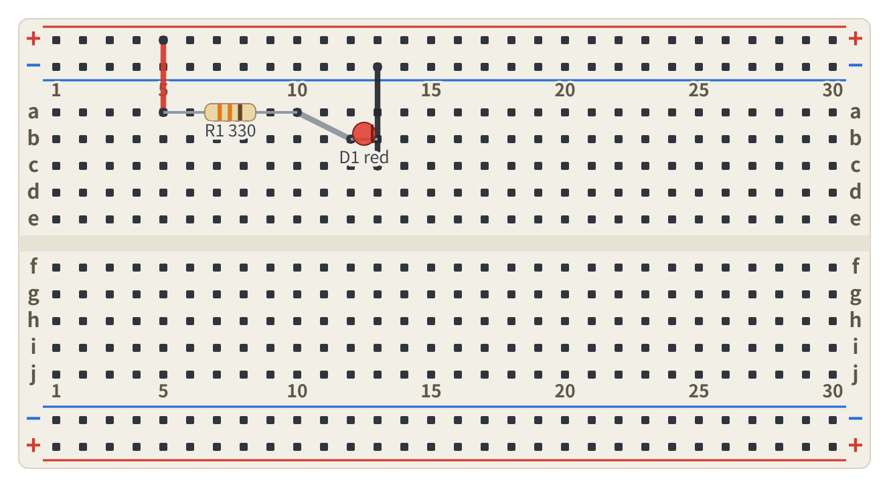
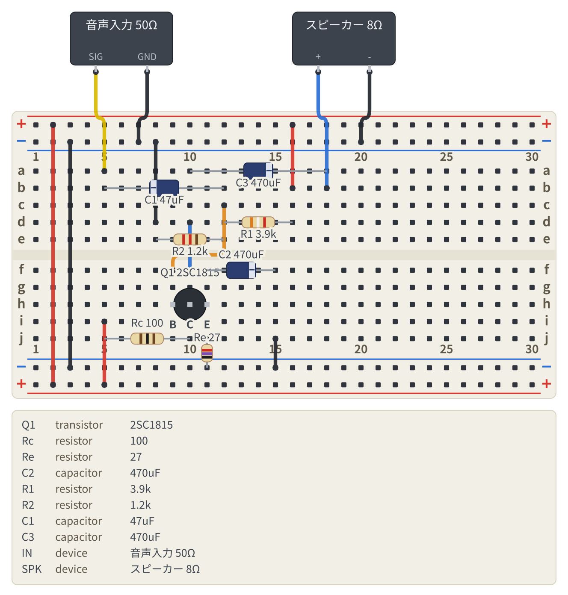

# Breadboard Fence

Markdown の ` ```breadboard ` フェンスに YAML で配線を書くと、VS Code のプレビューに
ブレッドボードの実体配線図がレンダリングされる拡張機能。

````markdown
```breadboard
board: half
parts:
  R1: resistor a5 a10 330
  D1: led b12(A) b13(K) red
wires:
  - +t5 -- a5 red
  - a10 -- b12
  - c13 -- -t13 black
```
````



図と同時に、**穴の導通からネットリストを導出**する。描いた図が意図した回路に
なっているかを機械的に突き合わせられる。

```text
+t : R1.1
N1 : R1.2, D1.A
-t : D1.K
```

## なぜあるか

回路図 (schematic) をテキストで描く手段は枯れている (CircuiTikZ、Schemdraw)。
一方で**ブレッドボードの実体配線図をテキストから描く手段は空白地帯**だった
(Mermaid / PlantUML / Kroki いずれも非対応)。実験の手順メモに「どの穴に挿すか」を
そのまま書き残せると、後から再現できる。

文法は LLM に書かせても崩れないことを狙って、
**絶対座標を書かせない・接続は名前ベース・配置は穴番地**の 3 点を守っている。

## 使い方

必要なのは **VS Code 1.75 以上と Node.js 20 以上**。Marketplace には出していないので、
`.vsix` を自分で作って入れる。

```bash
npm install
npm run package                       # breadboard-fence-x.y.z.vsix を作る
```

`.vsix` の中身は素の JavaScript (実行時の依存は YAML パーサだけ) なので、
**同じファイルがどの OS でも使える**。違うのは「どこに入れるか」だけ。

| 環境 | 拡張が動く場所 | インストール |
| --- | --- | --- |
| Windows | Windows 側 | PowerShell で `code --install-extension (Get-Item breadboard-fence-*.vsix).FullName` |
| WSL2 | **WSL 側** (`~/.vscode-server/extensions`) | WSL のシェルで `code --install-extension breadboard-fence-*.vsix` |
| Linux / macOS | そのマシン | `code --install-extension breadboard-fence-*.vsix` |
| Remote-SSH / Dev Container / Codespaces | **接続先** | 接続先のシェルで上と同じコマンド |

入れたら Markdown を開いて Markdown プレビュー
(`Ctrl+Shift+V` / macOS は `Cmd+Shift+V`) を出す。

`code` が PATH に無いときは、拡張ビュー (`Ctrl+Shift+X`) の右上の `...` →
「VSIX からのインストール」でも同じことができる
(macOS ならコマンドパレットの `Shell Command: Install 'code' command in PATH` で
`code` を通せる)。

### 更新するとき

**ソースを直しただけでは、入っている拡張は変わらない。** `.vsix` を作り直して
入れ直すまで、プレビューは前のビルドのまま動く。

```bash
npm run package
code --install-extension breadboard-fence-0.1.0.vsix --force
```

- バージョン番号を上げずに入れ直すときは `--force` が要る。
- 入れ直したら**ウィンドウを再読み込みする** (コマンドパレットの
  `Developer: Reload Window`)。プレビューを開き直すだけでは古いままのことがある。
- 拡張が古いと、後から入った文法が「知らないキーです」というエラーで出る。
  文法を足したつもりが図に反映されないときは、まずここを疑う。

### Windows で気をつけること

- Node.js は `winget install OpenJS.NodeJS.LTS` で入る。
- PowerShell と cmd はワイルドカードを展開せず `breadboard-fence-*.vsix` を
  そのまま渡してしまう。上の表のように `Get-Item` で実体のパスにするか、
  ファイル名を直接書く。

### WSL2 で気をつけること

- この拡張は**ワークスペース側 (WSL) で動く**。Windows 側に入れただけでは
  WSL のウィンドウでフェンスが図にならない。拡張ビューに
  「WSL: &lt;ディストリ&gt; にインストール」のボタンが出たら押す。
- リポジトリは Linux 側 (`~/breadboard-fence` など) に置く。`/mnt/c/...` の下は
  ファイルアクセスが遅く、`npm install` とテストが目に見えて重くなる。
- **Windows と WSL で `node_modules` を共有しない**。esbuild と sharp は
  プラットフォーム別のバイナリを入れるので、片方で `npm install` したものは
  もう片方で動かない。混ざったら `rm -rf node_modules && npm install` でやり直す。

### CLI

GitHub に貼れるスタンドアロン SVG を書き出せる。事前に `npm run build`
(または `npm run package`) が要る。コマンドは PowerShell でも同じ。

```bash
node dist/cli.cjs render examples --out examples/out
```

引数はファイルでもディレクトリでもよく、展開は CLI 側でやる
(ワイルドカードを展開しないシェルでもそのまま動く)。`--out` を省くと入力と同じ
場所に書く。`npm run examples` は PNG も書き出すが、こちらは sharp
(プラットフォーム別のバイナリ) が要るので開発環境でだけ使う。

## 文法

[docs/syntax.md](docs/syntax.md) に一覧と出力例がある。要点だけ:

| 要素 | 書き方 | 例 |
| --- | --- | --- |
| ボード | `board: half` (30 列) / `full` (63 列) | `board: half` |
| 穴番地 | 行 `a`〜`e` / `f`〜`j` + 列番号 | `a5`, `j30` |
| レール番地 | `+`/`-` + `t`/`b` + 列番号 | `+t5`, `-b20` |
| 2 端子部品 | `ID: 種類 穴 穴 値` | `R1: resistor a5 a10 10k` |
| 極性 | 穴にピン名を付ける | `D1: led b12(A) b13(K) red` |
| 3 端子部品 | 足の数だけ穴を書く | `Q1: transistor h9(B) h10(C) h11(E) 2SC1815` |
| DIP | ピン 1 の穴だけ書けば残りは自動 | `U1: dip8 @ e5 NJM4556A` |
| ボード外の機器 | マップ形式で `type: device` | 下のサンプル参照 |
| 配線 | `- 端点 -- 端点 [色]` | `- a10 -- b12 red` |
| 迂回ヒント | 角括弧で道順を指定 (20 = 穴 1 つ) | `- j20 -- -b20 black [v-20]` |

部品は resistor / capacitor / led / transistor / dipN / device。
抵抗の値はカラーコードとして描かれ、コンデンサに `(+)` `(-)` を付けると
電解コンデンサとして帯が付く。

## サンプル

| ファイル | 内容 |
| --- | --- |
| [examples/led.md](examples/led.md) | 抵抗と LED だけの最小例 |
| [examples/common-emitter.md](examples/common-emitter.md) | 2SC1815 のエミッタ接地アンプ (電源 5V、スピーカー出力) |
| [examples/bh-ad2.md](examples/bh-ad2.md) | B-H カーブ測定回路 (オペアンプ・測定器・トロイダルコア) |



## 仕組み

描画コアは **DOM にも Node の API にも依存しない同期の純関数**
`renderBreadboard(source) => { svg, netlist, errors }` で、外部リソースを
参照しない完結した SVG 文字列を返す。VS Code のプレビュー・CLI・
別アプリのサーバー側描画のどこから呼んでも同じ絵になる。

| ディレクトリ | 中身 |
| --- | --- |
| `src/core/` | 描画コア (parser / model / placement / router / render) |
| `src/extension/` | VS Code 拡張 (markdown-it の fence ルールを差し替えるだけ) |
| `src/cli/` | SVG 書き出しコマンド |
| `syntaxes/` | フェンス内 YAML のシンタックスハイライト (injection grammar) |

実行時の依存は YAML パーサ 1 つだけ。バンドルは拡張・CLI ともに約 135 KB。

## 開発

```bash
npm test          # ユニットテスト
npm run check     # 型チェック + テスト
npm run examples  # examples/*.md → examples/out/*.svg (+ PNG)
```

VS Code で F5 を押すと拡張機能をデバッグ実行し、`examples/` を開いた
ウィンドウが立ち上がる。

図の描画を変えると `examples/out` のスナップショットテストが落ちる。
`npm run examples` で作り直し、git diff で図の変化を確認してからコミットする。

## ライセンス

[MIT](LICENSE)
