# フェンス構文

実装済みの文法と、その出力。
図の生成は [src/core/](../src/core/) の純関数 `renderBreadboard(source)` が担当する。

1 画面に収めた早見表は [02-cheatsheet.md](02-cheatsheet.md)
(LLM に書かせるときは、そちらをプロンプトに貼る)。
回路ごとの実例は [examples/](../examples/)。

Markdown には次のように書く。VS Code のプレビュー (`Ctrl+Shift+V`) で図になる。

````markdown
```breadboard
board: half
parts:
  R1: resistor a5 a10 330
wires:
  - +t5 -- a5 red
```
````

**この文書のフェンスはすべて本物**で、直後にそのフェンスを描いた図を貼ってある
([out/](out/))。GitHub のようにフェンスが描画されない場所で、
書き方と出力を対で読むためのもの。作り直しは `npm run docs`。

```breadboard
title: 図01 最小の例
board: half
parts:
  R1: resistor a5 a10 330
wires:
  - +t5 -- a5 red
```

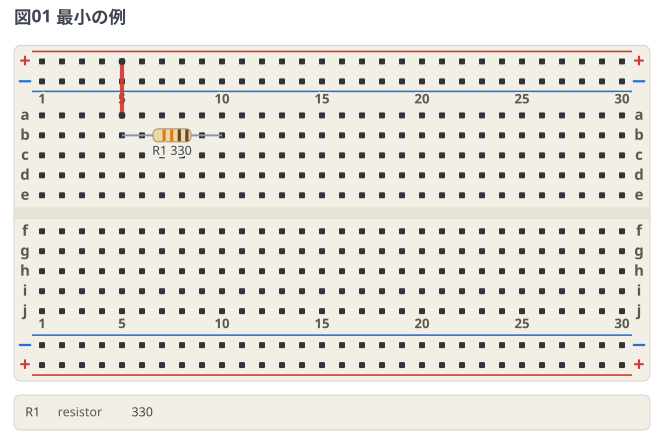

## 文法

| 要素 | 書き方 | 例 |
| --- | --- | --- |
| 題 | `title:` の 1 行。図の左上に載る → [題](#題-title) | `title: 図01 LED を点ける` |
| 点の名前 | `points:` で番地に名前を付ける → [番地に名前を付ける](#番地に名前を付ける-points) | `vin: a5` |
| ボード | `board: mini` (17 列) / `half` (30 列) / `full` (63 列)。省略時は half。レールの有無と印字を変えるときはマップ → [ボードの印字](#ボードの印字-board) | `board: half` |
| 見た目 | `style: <テーマ名>`、または個別に上書きするマップ | `style: dark` |
| 穴番地 | 行 `a`〜`e` (上ブロック) / `f`〜`j` (下ブロック) + 列番号 | `a5`, `j30` |
| レール番地 | `+`/`-` + `t`/`b` (上/下) + 列番号 | `+t5`, `-b20` |
| 2 端子部品 | `ID: 種類 穴 穴 値` | `R1: resistor a5 a10 10k` |
| 極性つき部品 | 穴にピン名を付ける | `D1: led b12(A) b13(K) red` |
| 部品の姿 | `種類/姿` で実物のかたちを選ぶ → [部品の姿](#部品の姿-variant) | `C1: capacitor/ceramic a5 a8 0.1u` |
| 3 端子部品 | 足の数だけ穴を書く | `Q1: transistor h9(B) h10(C) h11(E) 2SC1815` |
| DIP 部品 | `ID: dipN @ 穴 ラベル` | `U1: dip8 @ e5 NJM4556A` |
| 1 列ヘッダ | `ID: sipN @ 穴 ラベル`。足名は `pins:` で付ける | `M1: sip4 @ a20 OLED` |
| 押しボタン | `ID: button @ 穴`。溝をまたぐ 4 本足 | `SW1: button @ e5` |
| マイコンボード | `ID: 種類 @ 穴`。ピン名は実物の印字 | `MCU: pico2 @ h5` |
| ボード外の機器 | マップ形式で `type: device` + `at:` + `pins:` → [ボード外の機器](#ボード外の機器-device) | `at: top` |
| 配線 | `- 端点 -- 端点 [-- 端点 …] [色]` | `- a10 -- b12 red` |
| ピン参照 | `部品ID.ピン名` を端点に書ける | `U1.7`, `AD2.V+` |
| ラベル | `l=字` で図に出るラベルだけを差し替える (値と両方は書けない) | `M1: sip4 @ a20 l=OLED` |
| 部品リスト | `parts-list: none` で図の下のリストを消す → [部品リスト](#部品リスト-parts-list) | `parts-list: none` |
| 注釈 | `notes:` に印と字を並べる → [注釈](#注釈-notes) | `- circle R1` |
| コメント | 行内の `#` 以降 | `# 電源まわり` |

- 部品の種類:
  - 2 本足 — `resistor` / `capacitor` / `led` / `diode` / `buzzer` / `crystal` / `inductor`
  - 2 本足 (センサー) — `photoresistor` / `thermistor` / `thermistor-ntc` /
    `thermistor-ptc` / `varistor`
  - 2 本足 (ダイオードの仲間) — `zener` / `schottky` / `photodiode` / `varicap` / `diac`
  - 2 本足 (ガラス封止) — `reed` / `fuse` / `lamp`
  - 3 本足 — `transistor` / `potentiometer` / `slide-switch` / `thyristor` / `triac`
  - まとまった足 — `button` / `dipN` / `sipN`
  - マイコンボード — `pico` / `pico-w` / `pico2` / `pico2-w`
  - ボード外の機器 — `device`
- 略記でも書ける → [種類の略記](#種類の略記)。図・部品リスト・エラーには
  正式名だけが出る。
- 配線の色: red, black, white, gray (grey も可), orange, yellow, green, blue,
  purple, brown, pink。
  知らない色名は図に書き込まず、行番号つきのエラーにする
  → [エラーとお知らせの出方](#エラーとお知らせの出方)。
- コンデンサは `capacitor/ceramic` のように姿を選べる → [部品の姿](#部品の姿-variant)。
  **姿を書かないときは `(-)` の有無だけ**で角い胴と缶を選び分ける
  (`capacitor a5(+) a8` は角い胴のまま。缶にしたいときは姿を書く)。
- **極性・向きのある 2 端子は、先に書いた穴が + 側 (アノード)** →
  [極性と向き](#極性と向き)。
- `transistor` は TO-92 の丸い本体で描く。**パッケージの平らな面の向きは図では示さない**
  (足の並びは品種ごとに違うため)。どの穴がどの足かはピン名で示す。
- ボード外の機器 (`device`) が箱に出すのは **`label` (書かなければ ID)** だけ。
  `value` は図のどこにも出ないので、書くと行番号つきでお知らせに出して図からは落とす。
- `at:` は**機器を上下どちらの帯に置くか**の指定。板に挿す部品の位置は `holes` で
  決まるので、機器以外に `at:` を書いたときも同じように知らせて落とす。
- DIP はピン 1 の穴だけを書く。`e` 行に置けばピン 1〜N/2 が e 行を左から右へ、
  残りが f 行を右から左へ並ぶ (`f` 行に置けば上下反転)。ピン 1 と ピン N は
  実物と同じく溝をはさんで隣り合う。
- **DIP と 1 列ヘッダのラベルは、本体の枠に収まるまで字を縮めて描く。**
  長い品番や日本語のラベルを書いても枠から出ない (板の上のキャプションのように
  `…` で切ることはしない。品番は最後まで読めるほうが実物と突き合わせやすい)。
- 抵抗の値 (`10k` `4k7` `1R` `2.2M`) はカラーコードの帯として描かれる。
- **値とラベルの両方を書くと、図に出るのは値。** 部品リストの値は図と同じ字である
  約束なので、ラベルを勝たせるわけにいかない。両方書いたときはお知らせに出す。

## ボードの印字 (board)

`board:` はサイズだけのスカラーのほか、サイズと印字のマップでも書ける。
実物のシルク印刷はメーカーごとに割れているので、手元のボードに図を寄せるための設定。
**番地系はどの印字でも共通**で、変わるのは図の見た目だけ。
並べた図は [examples/03-board-variants.md](../examples/03-board-variants.md)。

サイズは実売の系列に合わせた 3 段。

| サイズ | 列数 | 実物 | レールの既定 |
| --- | --- | --- | --- |
| `mini` | 17 | 170 穴 | 無し |
| `half` (既定) | 30 | 400 穴 | 有り |
| `full` | 63 | 830 穴 | 有り |

```breadboard
title: 図02 ボードの印字を手元の実物に寄せる
board:
  size: half        # mini / half (既定) / full
  rails: "+-+-"     # レール 4 本の上から順の極性。none でレール無し
  letters: upper    # lower (既定) / upper
  numbers: all      # every-5 (既定) / all
parts:
  R1: resistor b5 b10 330
wires:
  - +t5 -- a5 red
  - e10 -- -b10 black
```

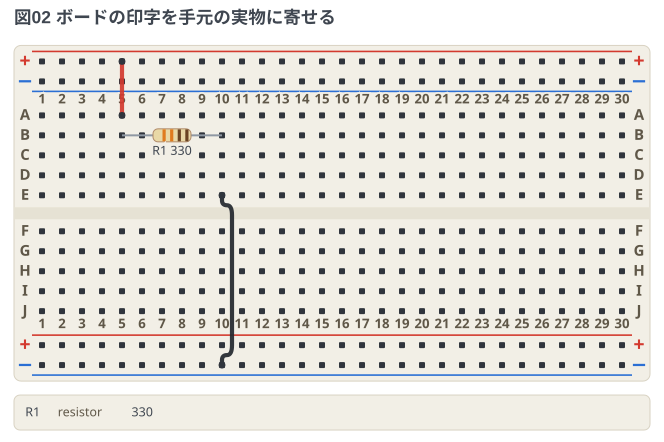

- `rails` は上外・上内・下内・下外の 4 文字で、上下それぞれに `+` と `-` を 1 つずつ。
  書けるのは `+--+` `+-+-` `-++-` `-+-+` の 4 通り。YAML の解釈事故を避けるため引用符を推奨。
- **レールの有無はサイズと直交する。** `rails: none` でどのサイズからもレールを外せるし、
  `rails: "+--+"` と書けば mini にも付けられる。実物のレールも板と一体ではなく
  両面テープ留めの独立ストリップなので、剥がした 400 穴も、レールを継ぎ足した
  170 穴も組める。書かなかったときだけサイズの既定 (上の表) が効く。
- レールの無いボードで `+t5` のようなレール番地を使うと、**行番号つきのエラー**になる
  (図には出ない)。挿す先が無いので、黙って描くより書き直せるほうがよい。
- レール番地は**極性ベース** (`+b` = 下側の + レール) なので、`rails` を変えても
  配線の書き方は変わらない。図の中で挿す行が入れ替わるだけ。
- `letters: upper` は行ラベルの印字を A〜J にする。番地の入力は印字の設定と無関係に
  大小どちらでも書ける (`A5` == `a5`、レール番地の `+T5` == `+t5` も同様)。
  エラーとネットリストは小文字に正規化して出す。
- 番地の形をした語は大小に関わらず穴として読むので、部品の値やラベルには
  `J5` のような語は使えない (数字や単位つきの値 `330` `10k` は番地の形にならないので安全)。
- `numbers: all` は列番号を全列に印字する。既定の `every-5` は 1, 5, 10, … と間引いて
  図の読みやすさを優先する。
- 電源レールが中央で電気的に分割されているボードが実在する (特にフルサイズ)。
  この図はレール 1 本を全通として扱うので、分割レール品で組むときは中央をジャンパで橋渡しすること。

## 見た目 (style)

`style:` にテーマ名を書くと図の配色と大きさが変わる。
**省略したときは `presentation`** で描く (そのままスライドや記事に貼れる大きさ)。
並べた図は [examples/02-themes.md](../examples/02-themes.md)。

```breadboard
title: 図03 テーマを選ぶ
style: dark
parts:
  R1: resistor a5 a10 330
  D1: led b12(A) b13(K) red
wires:
  - +t5 -- a5 red
  - a10 -- b12
  - c13 -- -t13 black
```

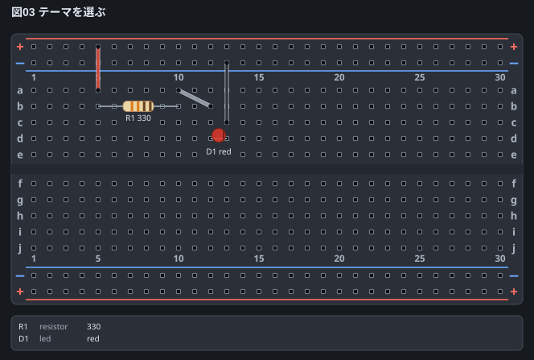

| テーマ | 用途 |
| --- | --- |
| `classic` | 実物のブレッドボードに寄せた配色で、字も線も小さめ。地は塗らず、貼り先の背景が透ける |
| `dark` | 暗い文書やスライドに貼る。穴は明るい縁で立たせ、配線には縁取りを敷く |
| `high-contrast` | プロジェクタ投影やコピーの劣化に耐える。輪郭を黒で締め、字と線を太く |
| `mono` | 白黒印刷向け。板と印字だけをグレーに落とす |
| `presentation` | **既定**。板と部品の色は classic のまま、字と線と穴を大きく。地は白で塗る |

**配線の色・抵抗のカラーコード・LED の色はどのテーマでも変わらない。**
あれは実物の色そのもの (何色の線を挿すか、何オームか) で、
塗り替えると図が嘘になるため。`mono` が白黒にするのは板と印字だけ。

テーマを土台にして、気になるところだけ上書きできる。

```breadboard
title: 図04 テーマを上書きする
style:
  theme: dark        # 省略すると presentation
  text-size: 13      # 部品のラベル (6〜24)
  text-color: "#e2e8f0"
  text-background: "#2b3038"   # ラベルの縁取り。省略すると板の色に追従する
  wire-width: 5      # 配線の太さ (1〜8)
  board-color: "#2b3038"
  hole-size: 6       # 穴の大きさ (2〜14)
  hole-color: "#0d1014"
  debug: off         # on (既定) / off。お知らせを図の下に出すか
  stamp: on          # on / off (既定)。図の右下に処理系の版を刻むか
parts:
  R1: resistor a5 a10 330
  D1: led b12(A) b13(K) red
wires:
  - +t5 -- a5 red
  - a10 -- b12
  - c13 -- -t13 black
```

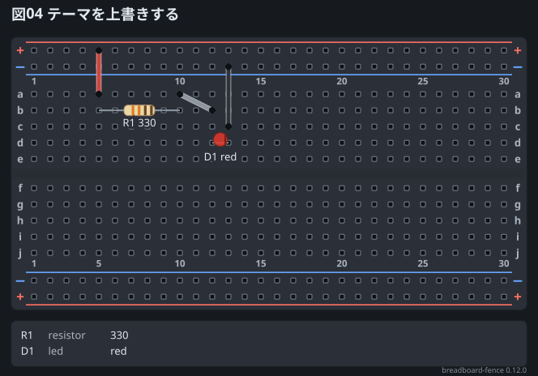

`width` (出力の横ドット数、120〜4000) もここに書ける。上の図では貼る大きさを
変えないために省いてある。

- 色は **`#rgb` か `#rrggbb` だけ**。名前や `rgb()` は書式エラーにする
  (検証していない値を図に書き込まないため)。名前で選びたいときはテーマを使う。
- `width` は座標系 (viewBox) を変えず、外側の大きさだけを変える。
  中の配置も配線の経路も動かないので、同じ図をそのまま拡大縮小できる。
- `board-color` を書くと、板の縁と溝の色もそこから作る。ただし印字の色は動かないので、
  板を大きく変えるときは**まず近いテーマを選んでから**細かいところを上書きする。
- 範囲を外れた数値は端まで寄せて描き、そのことを行番号つきでお知らせに出す。
- `debug: off` で伏せられるのは**お知らせだけ**。読めなかった行は伏せられない
  → [エラーとお知らせの出方](#エラーとお知らせの出方)。
- `stamp: on` は右下に `breadboard-fence 0.4.0` と小さく刻む。**字は選べない**
  (処理系が埋めるものなので)。刻まない図にも SVG の根に
  `data-breadboard-fence` が入るので、あとから「どの版が描いた図か」を
  図そのものに聞ける。
- `style:` を 2 回書いたときは**重ねる**。後に書いたほうが勝つが、書かれていない
  項目は前のまま残る (`style: dark` のあとに `style: {text-size: 20}` と
  書いてもテーマは消えない)。`board:` と同じ扱い。
- テーマの配色は 1.0 までは調整することがある。`classic` だけは変えない
  (`style: classic` と書いた図の見え方を固定しておくため)。

## 部品リスト (parts-list)

図の下に、`parts:` に書いた部品が **ID・種類・値の順に 1 行ずつ**並ぶ。
図だけを渡された人が、何を用意すればよいか図の外を見ずに分かるようにするため、
**既定で出る**。並べた図は [examples/04-parts-list.md](../examples/04-parts-list.md)。

```breadboard
title: 図05 部品リスト (既定)
parts:
  R1: resistor a5 a10 330
  C1: capacitor/ceramic a14 a17 0.1u
  D1: led b20(A) b21(K) red
```

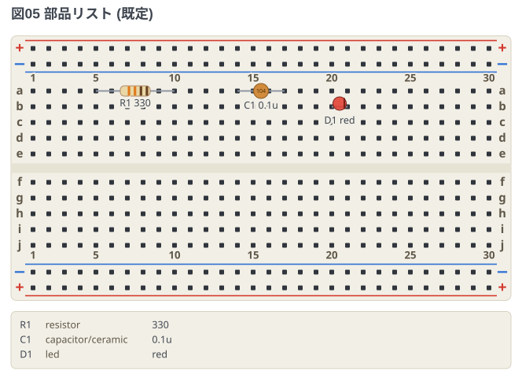

```breadboard
title: 図06 部品リストを消す
parts-list: none    # below (既定) / none
parts:
  R1: resistor a5 a10 330
  C1: capacitor/ceramic a14 a17 0.1u
  D1: led b20(A) b21(K) red
```

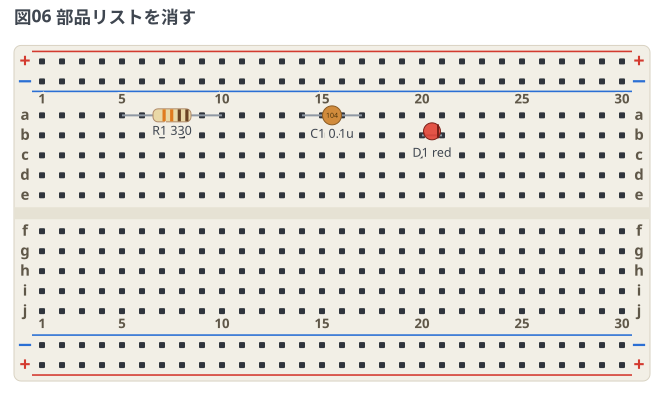

| 値 | 意味 |
| --- | --- |
| `below` | **既定**。図の下にリストを出す |
| `none` | リストを出さない。図の高さもそのぶん縮む |

- 並ぶ順は**書いた順**で、同じ値の部品をまとめたりはしない。
  図の中の `R1` と 1 対 1 で突き合わせるための表なので、行と部品がずれると用を成さない。
- 値は図に出ているのと**同じ文字列**をそのまま出す (`4k7` を `4.7kΩ` に直したりしない)。
  値を書かなかった部品は 2 列だけになり、`device` は箱に出るラベルがそのまま並ぶ。
- 載るのは**図に描けた部品だけ**。読めなかった部品は図の外の帯にだけ出る。
- **ID は切らない**。切ると図の部品と突き合わせられなくなるため。板に収まらない値は
  末尾を `…` で切り、ID が長くて値の列が残らないときは値のほうを省く
  (値は図のキャプション `R1 330` にも出ている)。
- **図の中のキャプションも板に収まらなければ `…` で切る**。長い値を板の端の部品に
  付けると、切らずに置いた字は画布の外へ出て黙って消えてしまうため。
  リストとキャプションの両方が切れたときは、書いた値のほうを短くする。
- 60 個を超えたぶんは「ほかに N 件」の 1 行にまとめる。
  ブレッドボード 1 枚に挿さる部品数より十分多いので、実際に頭を打つことはない。
- リストは図と同じ 1 枚の SVG の中にある。貼り先で図とリストがはぐれることはない。

## 配線 (wires)

```breadboard
title: 図07 配線の書き方
parts:
  R1: resistor a5 a10 330
  D1: led a14(A) a17(K) red
  D2: led a21(A) a24(K) green
  Re: resistor j17 j20 100
wires:
  - +t5 -- b5 red [h-10, v74]     # 迂回ヒント: 半列ずらして a5 の足をよける
  - b10 -- b14 -- b21 orange      # つないで書く (区間ごとに開かれる)
  - j20 -- -b20 black             # Re の足と同じ穴 → Re が i 行へ寄る
  - -t17 -- b17 -- b24 black
```

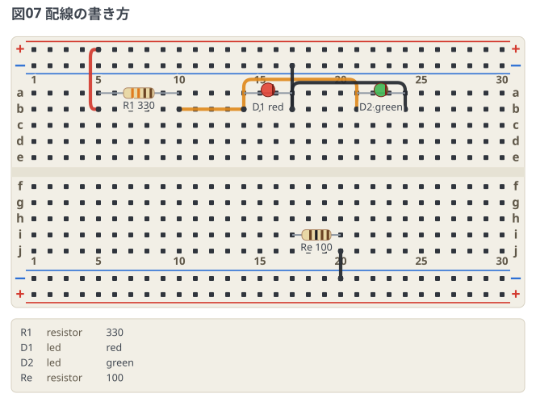

- 端点は**穴番地・レール番地・ピン参照 (`U1.7`)・点の名前**のどれでもよい。
- **端点が部品の足と同じ穴なら、部品のほうが同じ列の空いている行へ寄って描かれる**
  (上の図の Re は `j17 j20` と書いたが i 行に出る)。実物では同じ穴に足とジャンパを
  挿せないため。同じ列の中の移動なので、導通もネットリストも変わらない。
  寄せる先が無いときは書かれたまま描き、お知らせで言う。
  ピン参照 (`Re.2`) は「そのピンにつなぐ」という意味なので寄せは起きない。
- **同じ行の 2 穴は、行に沿って 1 本の直線で結ばれる** (上の図の `b10 -- b14`)。
  実物のジャンパも板の上に寝るので、レーンへ回るより近い姿になる。
  ただし**またぐ穴が空いているときだけ**で、途中の穴に部品の足や別の配線の端が
  来ていれば今までどおりレーンへ回る (線が穴を隠すので、そこにもつながって
  見えてしまうため)。上の図の `b14 -- b21` が回っているのは、間の `b17` に
  黒い配線の端があるから。
- **端点は 3 つ以上つなげて書ける。** 隣り合う端点ごとの区間に開かれるので、
  1 行が 1 本の信号の道として読める。色は行全体で共有し、行番号は書いた 1 行のまま。
  上限 (500 本) は開いたあとの区間の数で数えるので、
  「配線 500 本」の意味は書き方によって変わらない。
- **迂回ヒントを書く行は端点を 2 つだけにする。** 数字はピクセルで 20 が穴 1 つぶん
  (`v` が縦・`h` が横、負は上・左)。ヒントは 1 区間ぶんの道順なので、
  つないで書いた行ではどの区間のことか決まらない。行番号つきで断る。
- 上限 (500 本) は**開いたあとの区間の数**で数える。1 行に端点を並べても頭を打つ。

## 題 (title)

図の左上に 1 行だけ載る題。

```breadboard
title: 図08 題は図の左上に載る
parts:
  R1: resistor a5 a10 330
wires:
  - +t5 -- a5 red
```

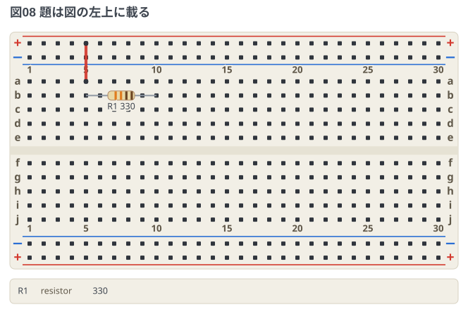

- **大きさ・太さ・色は選べない。** 選べるようにすると題ではなく注釈になる。
  字を自由に置きたいときは [注釈](#注釈-notes) の `text` がある。
- 60 文字まで。折り返さないので、板より長い題は末尾を `…` で切る。
- 題を書くと、そのぶん図全体が下にずれて画布が高くなる。
  図の中の座標は動かないので、配線の経路も部品の位置も変わらない。

## 番地に名前を付ける (points)

穴番地に名前を付けると、節点を動かすときの編集が 1 箇所で済む。
並べた図は [examples/13-points.md](../examples/13-points.md)。

```breadboard
title: 図09 番地に名前を付ける
points:
  vin: a3
  fb:  a8
parts:
  R1: resistor vin fb 10k
  R2: resistor b8 b13 4k7
wires:
  - +t3 -- vin red
  - c13 -- -t13 black
notes:
  - circle fb blue
```

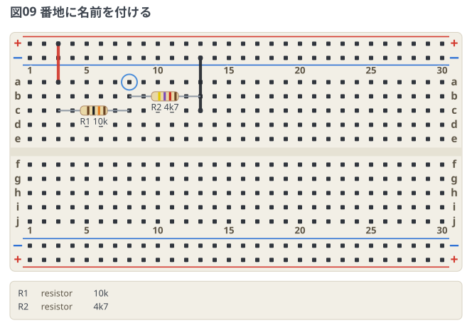

- **番地が書ける場所すべて**で使える。部品の穴・配線の端点・注釈の指し先のどれでも同じ。
- `points:` はフェンスのどこに書いてもよい。**部品より下に書いても解決する。**
- 名前の字種は部品 ID と同じ (英数字と `_` `-` の 32 文字まで)。
  **番地の形 (`a5`) は使えず、部品 ID との重複もエラー**にする。
  注釈の指し先が「部品 ID か番地」の両取りなので、3 つ目の名前空間を重ねると
  解決順の説明が要る。禁じれば説明ごと消える。
- **値は穴番地そのもの**で、別の点の名前は書けない (名前から名前へはたどらない)。
  たどれるようにすると、名前の環をどう扱うかの説明が要る。
- **名前は値より先に読まれる。** 1 行の記法は「番地に見える語は穴、それ以外は値」で
  割っており、点の名前もそこで穴の側に入る。`10k` `red` `2N3904` のような
  **値に使う語を点の名前にしない**こと。穴が足りている部品なら
  「穴番地を 2 つ書きます (今は 3 つ)」になるが、**足りない部品では黙って通り、
  値のつもりの語が離れた穴になる**。そのときはお知らせを出す
  (「points: の名前なので、値ではなく穴として読みました」)。
- ハイフンだけの名前 (`--`) と**レールの名前** (`-t` `-b` など) は使えない。
  前者は配線の区切りと、後者はネットリストに出るレール名とぶつかる。
- **ネットリストにも同じ名前が出る**ので、図を見ずに突き合わせられる。
  優先順は**レール > 点の名前 > `N` 連番**で、レールの名前は極性そのものなので先に立てる。
  同じネットに 2 つ乗ったら、先に書いたほうを使う。
- 100 個まで。

同じ番地を 2 行に書いておいて片方だけ直すと、**エラーにできない間違い**
(別のつなぎ方をした、それ自体は正しい回路) が黙って出る。
名前にしておけばその入口が塞がる。

## 注釈 (notes)

図の上に印と字を重ねる。並べた図は [examples/12-notes.md](../examples/12-notes.md)。

```breadboard
title: 図10 印・枠・指し棒・字
parts:
  R1: resistor a5 a10 330
  D1: led a14(A) a17(K) red
notes:
  - circle R1
  - box g3 h20 blue solid
  - arrow d22 R1
  - line +t26 -t26 green
  - text d24 red bold: 電流を決めるのはここ
  - text i3 blue: この段はまだ組んでいない
```

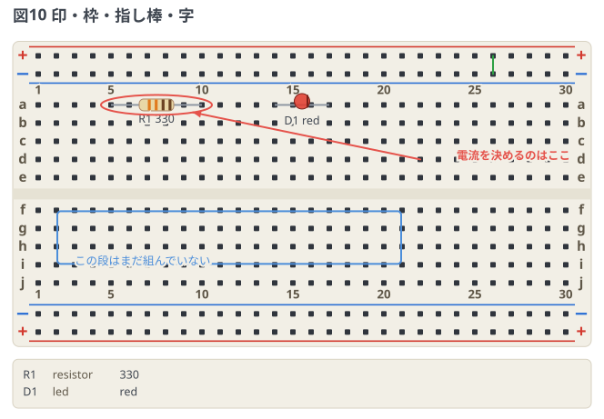

| 書き方 | 出るもの |
| --- | --- |
| `- circle 指し先 [語]` | 囲む楕円 |
| `- box 番地 番地 [語]` | 2 点を対角にした枠。既定は破線、`solid` で実線 |
| `- arrow 起点 終点 [語]` | 指し棒 (矢印つき) |
| `- line 起点 終点 [語]` | 直線 (矢印なし) |
| `- text [番地\|below] [語]: 字` | 字。番地を書かなければ**板の下の帯**に置く |
| `- source [番地\|below] [語]` | **そのフェンスの中身**を囲みつきで書き出す。同上 |

- **指し先は部品 ID か穴番地**。部品 ID を先に探し、無ければ番地として読む。
  両方に読めるとき (部品に `a5` のような名前を付けたとき) は行番号つきで知らせる。
- 部品を指すと**その部品を囲む楕円**、穴を指すと穴 1 つの丸になる。
  `arrow` と `line` の端は、部品なら囲みの縁で止まり、**穴なら穴そのものまで届く**
  (手前で止めるとどの穴を指しているのか分からなくなるため)。
- **`text` だけは字を `:` の後ろに書く。** YAML のプレーンスカラーには
  コロンと空白の並びを書けないので、`- text a5 "R1: resistor …"` は黙ってマップとして読まれ、
  エラーにもならずに消える。値の側に置けば、引用が要るかどうかを YAML が決める。

見た目の語は**順不同**。同じ種類を 2 回書いたら、黙って後勝ちにせず報告する。

| 語 | 書ける値 | 既定 |
| --- | --- | --- |
| 色 | `red` `blue` `green` `orange` `ink` | 印・枠・指し棒は `red`、字は図の文字色 |
| 大きさ | `tiny` `small` `normal` `large` `huge` | `normal` |
| 寄せ | `left` `center` `right` | `left` |
| 太字 | `bold` | なし |
| 実線 | `solid` (`box` だけ) | なし (破線) |
| 行送り | `tight` `loose` (`source` だけ) | 中間 |

- `ink` は図の文字色なので、テーマを変えると一緒に動く。
- **大きさは図の字に対する倍率**。回路図フェンスは pt の絶対値で持っているが、
  こちらは `style: text-size` とテーマで基準が動くので、追従しないと釣り合いが崩れる。
- `source` は**行番号を添えない**。図を見た人がそのまま書き写せるのが値打ちなので、
  番号が混ざると写したものが動かなくなる。
- **`text` と `source` は番地を書かなければ板の下の帯に置く** (`below` が既定)。
  板の番地はどれも実在の穴に縛られていて、**板の外を指す番地が存在しない**。
  写しや図の説明を板に重ねると穴と印字に重なるので、外に出せるようにしてある。
  `- source below tiny` と書き出しても同じ。帯は部品リストの後ろに、書いた順に積む。
- 番地を書いたときは今までどおり板に重なる。板の下へはみ出す字は切らずに
  **画布のほうを伸ばす**。横は板の幅で `…` に切るので、
  **板の右端に置く字は `right` 寄せにする** (`left` のままだと右に幅が残らず、
  `あ…` のように切り詰められる)。
- 場所を書けるのは `text` と `source` だけ。印・枠・指し棒は指し先があってこそなので、
  `circle below` は行番号つきで断る。
- **注釈は回路の一員ではない。** ネットにもネットリストにも部品リストにも数えない。
  注釈を足しても、図から導いたネットリストは 1 行も変わらない。

```breadboard
title: 図11 色と大きさと寄せ
parts-list: none
parts:
  R1: resistor a5 a10 330
notes:
  - circle R1 blue
  - text c3 tiny: tiny の字
  - text d3 small green: small の字
  - text e3 normal: normal の字
  - text g3 large orange: large の字
  - text i3 huge ink bold: huge
  - text c20 center blue: 中央ぞろえ
  - text i28 right red: 右ぞろえ
```

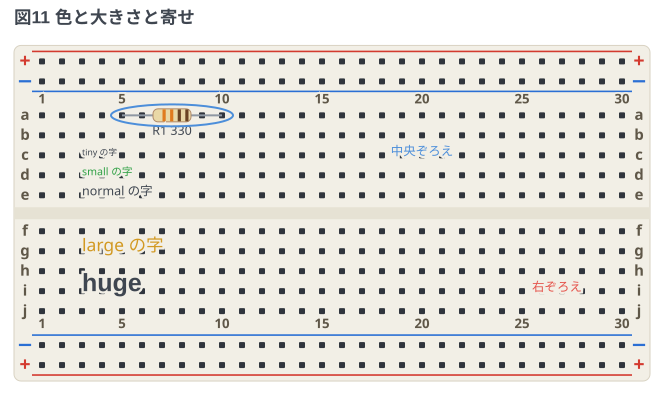

## 種類の略記

よく書く種類には短い綴りがある。**読んだ直後に正式名へ畳む**ので、
図・部品リスト・ネットリスト・エラーには正式名だけが出る。
`R1: r a5 a10 10k` と `R1: resistor a5 a10 10k` は同じ図になる。

| 略記 | 正式名 | 略記 | 正式名 |
| --- | --- | --- | --- |
| `r` | `resistor` | `ldr` | `photoresistor` |
| `c` | `capacitor` | `ntc` | `thermistor-ntc` |
| `l` | `inductor` | `ptc` | `thermistor-ptc` |
| `d` | `diode` | `xtal` | `crystal` |
| `ec` / `ecap` | `capacitor/electrolytic` | `scr` | `thyristor` |
| `pot` | `potentiometer` | `btn` / `pushbutton` | `button` |

- **`ec` は姿まで含む**唯一の略記。電解コンデンサは種類ではなく `capacitor` の
  姿なので、1 語が「種類 + 姿」に開く。`ec/tantalum` のように姿を重ねて書くと、
  どちらを採るかが決まらないので行番号つきで報告する。
- `pushbutton` は v0.2.0 で正式名として公開した綴り。正式名は
  回路図フェンス (circuit-fence) と揃えて `button` にしたが、
  **一度公開した名前は書いた図を壊さない**ので略記として残してある。
- グラウンドや電源の略記は無い。板の上ではレール (`+t5` `-b20`) がその役をしていて、
  挿す部品としては存在しないため。

```breadboard
title: 図12 略記で書いても図は同じ
parts:
  R1: r a5 a10 10k
  C1: ec a14(+) a17(-) 100u
  D1: d a21(A) a24(K) 1N4148
  SW1: btn @ e27
```

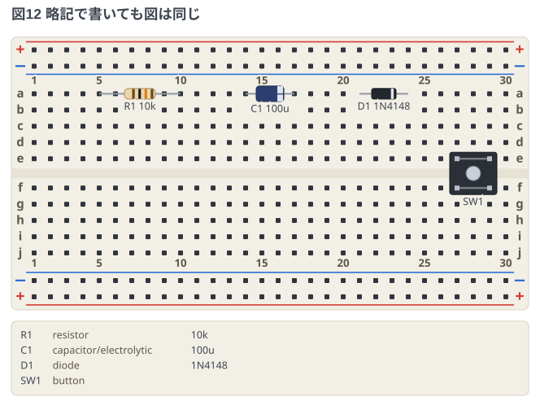

## 極性と向き

**極性・向きのある 2 端子は、先に書いた穴が + 側 (アノード)。**
これがフェンス全体にかかる 1 つの規則で、ピン名を書かなかったときの向きを決める。

```breadboard
title: 図13 極性は先に書いた穴が + 側
parts:
  D1: diode a3 a6 1N4148          # a3 がアノード、a6 がカソード
  C1: capacitor/electrolytic a9 a12 100u   # a9 が +
  D2: led a15 a18 red             # a15 がアノード
  C2: capacitor/tantalum a21 a24 10u       # a21 が + (印はプラス側)
```

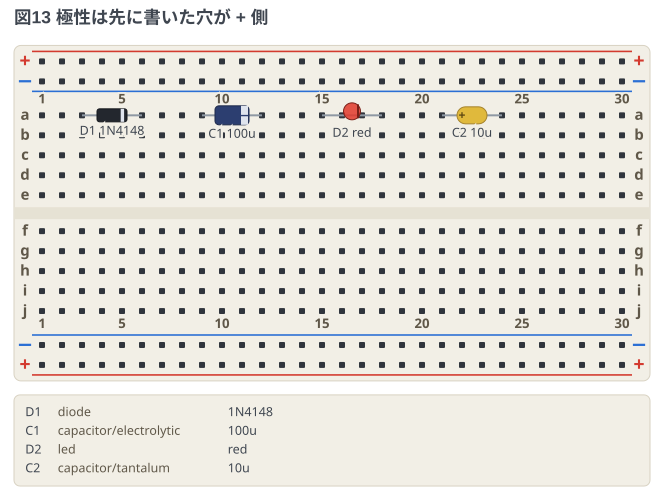

- ピン名 (`(A)` `(K)` `(+)` `(-)`) を書けば、そちらが優先される。
  **2 本足なので片方だけ書けば反対側は決まる**。
- 迷うところや、あとで読み返す図では書いておくとよい。図と食い違ったときに
  ネットリストの `D1.A` で突き合わせられる。
- **印が付く側は部品によって違う**。電解コンデンサの帯はマイナス側、
  タンタルの印はプラス側、ダイオードの帯はカソード側。どれも
  「先に書いた穴が + 側」から向きが決まり、そのうえで各部品の流儀で印が付く。
- `diac` のように向きの無い部品には印を描かない。
- `buzzer` は圧電式なら無極性なので、`(+)` を書いたときだけ印を出す。

## 部品の姿 (variant)

種類に `/` で続けて書くと、その部品を**実物のどのかたちで描くか**を選べる。
同じ `capacitor` でもセラミックと電解では板の上の姿が違い、図から実物を
探すときに効く。並べた図は [examples/05-capacitors.md](../examples/05-capacitors.md)。

```breadboard
title: 図14 コンデンサの 4 つの姿
parts:
  C1: capacitor/ceramic a5 a8 0.1u
  C2: capacitor/film a12 a15 0.47u
  C3: capacitor/electrolytic a19(+) a22(-) 100u
  C4: capacitor/tantalum a26(+) a29(-) 10u
```

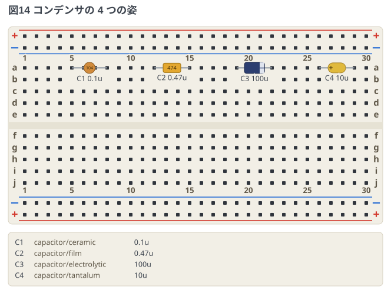

| 種類 | 選べる姿 | 描かれ方 |
| --- | --- | --- |
| `capacitor` | `ceramic` | 円板 |
| | `film` | 角い胴 (無極性の既定) |
| | `electrolytic` | 帯つきの缶。**マイナス側**に帯 |
| | `tantalum` | 黄色い粒。**プラス側**に印 |
| `led` | `3mm` / `5mm` | 玉の大きさ。既定は `5mm` |
| `transistor` | `to92` / `to220` | 丸い胴 (既定) / 放熱タブつきの角い胴 |
| `thyristor` | `to92` / `to220` | 同上 |
| `triac` | `to92` / `to220` | 同上 |

- **色は種類のもの、形が姿のもの**。図の中で「コンデンサだ」と分かるのは色で、
  「どのコンデンサか」は形で読ませる。
- 姿は図の下の部品リストにも `capacitor/ceramic` と種類ごと並ぶ。
  同じ `0.1u` でもどれを買うかはそこで決まるため。
- **電解の帯はマイナス側、タンタルの印はプラス側**で、同じコンデンサでも印の意味が逆。
  取り違えると壊れるので、形から先に見分けられるようにしてある。
- **無極性の姿に極性を書いたときは描かずに報告する** (そのまま組むと壊れるため)。
  向きを書かなかったときの決まりは [極性と向き](#極性と向き)。

| 書き方 | 結果 |
| --- | --- |
| `capacitor a5 a8` | 角い胴 (今までどおり) |
| `capacitor a5(+) a8` | 角い胴。**姿を書かないときは `(-)` の有無だけ**で選び分ける |
| `capacitor a5(+) a8(-)` | 電解の缶 (今までどおり) |
| `capacitor/electrolytic a5(+) a8(-)` | 電解の缶 |
| `capacitor/electrolytic a5(+) a8` | 電解の缶。2 本足なので、片方書けば反対側は決まる |
| `capacitor/electrolytic a5 a8` | 電解の缶。先に書いた `a5` が + 側 |
| `capacitor/ceramic a5(+) a8(-)` | エラー。無極性の部品に極性を書いている |

- 姿を書かなければ**今までどおりの図**になる。`/…` を足す前に描いた図の
  見え方は変わらない。
- 姿を選べない種類 (`resistor` など) に `/…` を書くとエラーにする。
  描き分けられない指定を黙って受け取ると、実物と違うかたちの図になるため。

- パッケージが変わっても**占める穴と足の名前は変わらない**。姿は板の上に載る
  かたちだけの話で、番地の書き方には影響しない。
- **パッケージの向き (TO-92 の平らな面、TO-220 のタブの向き) は図では主張しない。**
  足の並びは品種ごとに違うため、どの穴がどの足かはピン名で示す。

```breadboard
title: 図15 LED とトランジスタの姿
parts:
  D1: led/5mm a5(A) a7(K) red
  D2: led/3mm a11(A) a13(K) green
  Q1: transistor/to92 f5(B) f6(C) f7(E) 2SC1815
  Q2: transistor/to220 f14(B) f15(C) f16(E) 2SD880
```

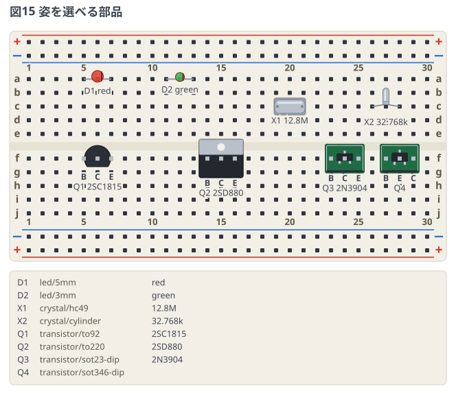

## スイッチと可変抵抗

並べた図は [examples/06-switches.md](../examples/06-switches.md)。

```breadboard
title: 図16 タクトスイッチ
parts:
  SW1: button @ e5                        # 溝をまたぐ 4 本足
  R1: resistor j5 j10 330
  D1: led i12(A) i14(K) red
wires:
  - +t5 -- a5 red
  - j10 -- i12 orange
  - i14 -- -b14 black
```

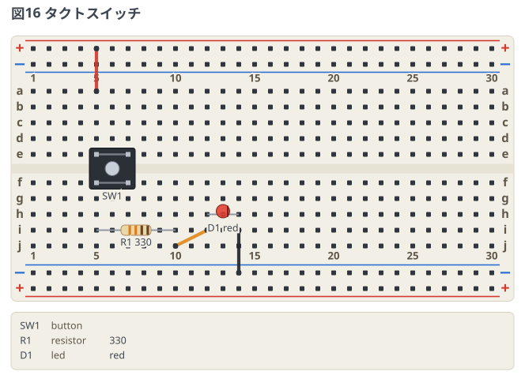

### 押しボタン (button)

6mm 角のタクトスイッチ。`@` にはピン `1a` の穴を書く。溝をまたぐので
**`e` 行か `f` 行**に置く。占めるのは `e5` `e7` `f5` `f7` の 4 つで、足の名前は
挿した側が `1a` `1b`、溝の向こう側が `2a` `2b`。

**同じ側の 2 本は、押していなくても中でつながっている。** これは図の中に細い線で描き、
ネットリストでも同じネットに入れる。実物では見えない結線だが、知らずに `e5` と `e7` を
回路の両端に使うと、押す前から短絡している (この図がいちばん防ぎたい間違い)。

```text
+t : SW1.1a, SW1.1b
N1 : SW1.2a, SW1.2b, R1.1
```

### 半固定抵抗とスライドスイッチ

どちらも 3 本足なので、`transistor` と同じく足の穴を並べて書く。名前を付けなければ
左から `1` `2` `3`。半固定抵抗のワイパは真ん中の足なので `e9(W)` のように書くと読みやすい。

**つまみの位置と、スイッチがどちらに倒れているかは図では示さない。**
状態で変わるものを描くと図が嘘になるので、そこは本文に書く
(`transistor` のパッケージの向きを描かないのと同じ理由)。

3 本足の部品は**溝寄りの行 (`e` / `f`) に挿す**と、足の名前が板の列番号とぶつからず、
配線も外側の空いた行から取れる。

```breadboard
title: 図17 半固定抵抗とスライドスイッチ
parts:
  SW2: slide-switch e3(1) e4(C) e5(2)
  VR1: potentiometer e8(1) e9(W) e10(3) 10k
  R1: resistor c13 c16 330
  D1: led c20(A) c22(K) green
wires:
  - +t3 -- a3 red
  - b4 -- b8 orange
  - b9 -- b13 yellow
  - b16 -- b20 green
  - b22 -- -t22 black
```

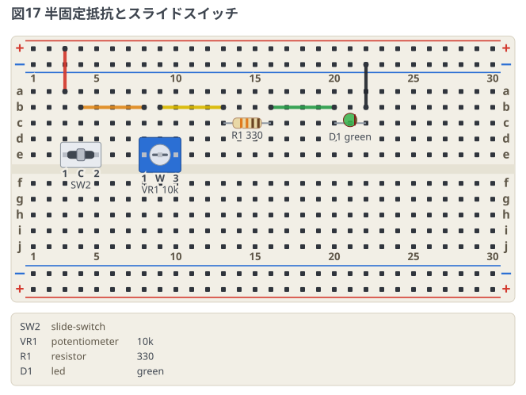

## 1 列ヘッダ (sipN)

ピンが 1 列に並んだ部品。ヘッダ 1 列のモジュール (OLED、測距センサ、無線モジュール)
を、専用の種類を増やさずにこれで描く。`@` にはピン 1 の穴を書き、そこから右へ N 本並ぶ。

足に名前を付けるときはマップ形式で `pins:` を書く。**書いた名前がそのまま図に出て、
`M1.SCL` として配線からも指せる**。書かなければ左から `1` `2` … になる。

```breadboard
title: 図18 1 列ヘッダのモジュール
parts:
  M1:
    type: sip4
    holes: [a20]
    pins: [GND, VCC, SCL, SDA]
    label: OLED
wires:
  - M1.GND -- -t20 black
  - M1.VCC -- +t21 red
```

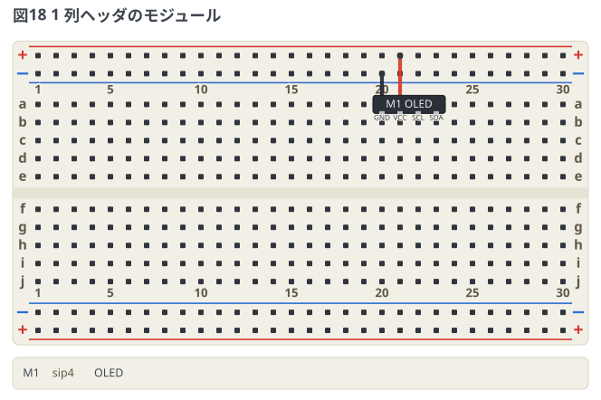

`pins:` の本数がヘッダの本数と違うときは、行番号つきのエラーにする。

## マイコンボード (Pico シリーズ)

`pico` / `pico-w` / `pico2` / `pico2-w` の 4 つ。**40 ピンの並びはシリーズで共通**なので、
書き方は種類名を替えるだけ。ソース: [examples/07-pico.md](../examples/07-pico.md)

```breadboard
title: 図19 Pico を挿す
board: full
parts:
  MCU: pico2 @ h5
  R1: resistor j26 j30 330
  D1: led i32(A) i34(K) red
wires:
  - b9 -- +t9 red         # 3V3 (36 番) は c 行の 9 列目に落ちる
  - j24 -- j26 orange     # GP15 の列から抵抗へ
  - j30 -- i32 orange
  - i34 -- -b34 black
```

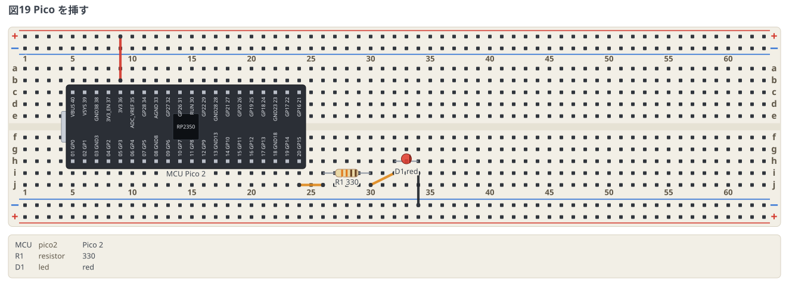

- `@` に書くのは**ピン 1 (GP0) の穴**だけ。基板の幅は 0.7 インチ (穴 7 つぶん) なので、
  ピンの 2 列は上下ブロックの**同じ位置の行** (`a`↔`f`、`b`↔`g`、`c`↔`h`、`d`↔`i`、
  `e`↔`j`) にちょうど落ちる。長さは 20 列ぶん。
- `h` 行に置くと **USB が左を向いた、実物のピンアウト図と同じ向き**になる
  (下の列が左から GP0, GP1, GND, …、上の列が左から VBUS, VSYS, GND, …)。
  上下を入れ替えたいときは `c` 行に置く。USB は必ずピン 1 の側の端に描く。
- **基板の下の穴は基板自身が使っている。** 配線は同じ列の空いている穴
  (`h` 行のピンなら `i` `j` 行、`c` 行のピンなら `a` `b` 行) に挿す。
  `MCU.GP15` のようにピン名でも書けるが、その線は基板の下から出るので、
  どの穴に挿すかを図で示したいときは穴番地で書く。
- 使っていないピンも 1 本ずつネットリストに出る (穴の導通をそのまま出しているため)。
- 電源は **VSYS (39 番) に入れて、3V3 (36 番) から出す**。外部電源を入れるときは
  USB と同時につながっても壊れないようショットキーダイオードを 1 本はさむ。
  詳しくは [examples/07-pico.md](../examples/07-pico.md) の「電源」。

### ピン名

図に印字されている名前がそのままピン名になる。

| 種類 | 名前 |
| --- | --- |
| GPIO | `GP0`〜`GP22`、`GP26`〜`GP28` |
| GND | `GND3` `GND8` `GND13` `GND18` `GND23` `GND28` `GND38` と `AGND` (33 番) |
| 電源 | `3V3` (36 番) / `3V3_EN` / `VSYS` / `VBUS` |
| その他 | `RUN` / `ADC_VREF` |

GND は 7 本あって名前が重なるので、**ピン番号を付けて区別する** (`GND3` は 3 番の GND)。
33 番だけは実物の印字どおり `AGND`。`MCU.GND` のように書くと、
候補を添えた行番号つきのエラーになる。

## ボード外の機器 (device)

測定器・電池・スピーカーなど、板に挿さないものは `device` として板の上下の帯に置く。
マップ形式で書き、`pins:` に並べた名前が箱の下に出て `AD2.W1` として配線から指せる。

```breadboard
title: 図20 ボード外の機器をつなぐ
parts:
  AD2:
    type: device
    at: top
    label: Analog Discovery 2
    pins: [W1, GND]
  BAT:
    type: device
    at: bottom
    label: 電池 3V
    pins: ["+", "-"]
  R1: resistor a5 a10 330
  D1: led b14(A) b15(K) red
wires:
  - AD2.W1 -- a5 yellow
  - AD2.GND -- -t5 black
  - a10 -- b14 orange
  - BAT.+ -- +b15 red
  - BAT.- -- -b15 black
```

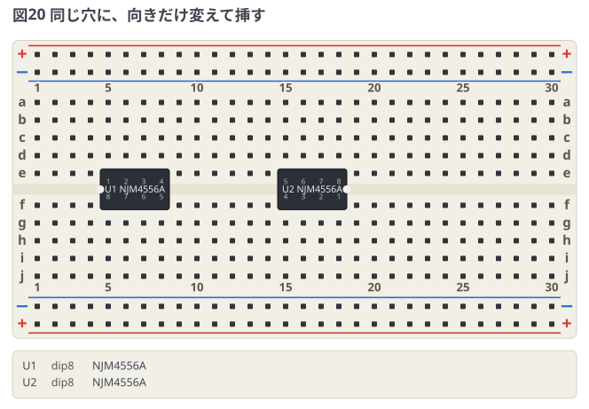

- `at:` は**上下どちらの帯に置くか**だけ。左右の位置は、つながる穴の平均から自動で決まる。
  省略すると `top`。
- 箱に出るのは **`label` (書かなければ ID)** だけ。`value` は図のどこにも出ないので、
  書くとお知らせに出して図からは落とす。
- ピン名に `+` `-` を使うときは YAML の都合で `"+"` のように囲む。

## 実例集

回路ごとの図と解説は [examples/](../examples/) にある。
**どのフェンスにも、そのフェンスを描いた図が付いている**ので、
GitHub でもそのまま読める。

| ファイル | 内容 |
| --- | --- |
| [01-led.md](../examples/01-led.md) | 抵抗と LED だけの最小例 |
| [02-themes.md](../examples/02-themes.md) | 同じ回路を 5 つのテーマで描き比べる |
| [03-board-variants.md](../examples/03-board-variants.md) | ボードの印字を手元の実物に寄せる |
| [04-parts-list.md](../examples/04-parts-list.md) | 図の下の部品リストと、その消し方 |
| [05-capacitors.md](../examples/05-capacitors.md) | 部品の姿を選ぶ |
| [06-switches.md](../examples/06-switches.md) | タクトスイッチ・半固定抵抗・スライドスイッチ |
| [07-pico.md](../examples/07-pico.md) | Raspberry Pi Pico に LED とボタンをつなぐ |
| [08-emitter-follower.md](../examples/08-emitter-follower.md) | 2SC1815 のエミッタフォロワ |
| [09-am-radio.md](../examples/09-am-radio.md) | 1 石中波ラジオ (高周波増幅 + 検波) |
| [10-bh-ad2.md](../examples/10-bh-ad2.md) | B-H カーブ測定回路 (オペアンプ・測定器) |
| [11-sensors.md](../examples/11-sensors.md) | CdS・サーミスタ、ダイオードの仲間 |
| [12-notes.md](../examples/12-notes.md) | 図の題と注釈 |
| [13-points.md](../examples/13-points.md) | 番地に名前を付ける、配線をつないで書く |

読めなくしてある例は [examples/errors/](../examples/errors/)。

## エラーとお知らせの出方

読めなかった行は握りつぶさず、**行番号・行の中身・読めなかった綴りの下の印**を添えて出す。
わざと壊した例は [examples/errors/](../examples/errors/)。

```text
breadboard: 2 行目: 知らない部品の種類です: resistr (resistor のことですか?)
      R1: resistr a5 a10 10k
          ^^^^^^^
```

- 頭の `breadboard:` は**どの道具が言っているか**の名札。図は他人のノートに
  埋め込まれるので、名札が無いと直す場所を探せない。
  プレビューの帯でも CLI の標準エラーでも同じ文面にしてある。
- 綴りが行の中に 2 つあるときは印を付けない。どちらでもない場所を指すより、
  指さないほうがまだ正しい。
- 制御文字・双方向制御・幅ゼロの文字は**1 文字を 1 文字に**置き換えて見せる。
  詰めたり伸ばしたりすると、下に付ける印の桁が本文とずれる。
- 書き間違いには編集距離で候補を添える (`resistr` → `resistor のことですか?`)。

### 出る場所

**図の SVG には何も書き込まない。** 書き出した SVG を GitHub や別のノートに
貼ったときに、報告まで付いてくると図として使えないため。

| どこ | どう出るか |
| --- | --- |
| VS Code のプレビュー | 図の下に HTML の帯 (`.breadboard-errors`)。図が 1 枚も組めなければ、図の代わりにカード (`.breadboard-error-card`) |
| CLI | 標準エラーに同じ文面。読めなかった行が 1 つでもあれば終了コードは 1 |
| コアを直に呼ぶとき | `renderBreadboard()` が `errors` / `notices` / `errorHtml` を返す。図が組めなければ `svg` は空文字列 |

### エラーとお知らせ

**読めなかった行 (エラー)** と、**読めてはいるが思ったとおりには出ないところ
(お知らせ)** を分ける。

```text
breadboard: 5 行目: 部品 BAT: 機器 (device) に value は使いません。箱に出す名前は label に書きます
breadboard: 3 行目: style の text-size は 6〜24 です (24 にしました)
```

どちらもお知らせで、**図は描けたうえで出る**。読めた部分 (部品・ピン・配線) は
そのまま描き、使われなかった指定だけを落として理由を言う。

`style: debug: off` で伏せられるのは**お知らせだけ**。
読めなかった行は伏せられない (黙って消えるほうが困る)。
CLI はプレビューの見え方の指定に従わないので、どちらも必ず出す。

## 配線のよけ方

配線は**部品の本体とラベルをよけて通る**。横レーンを選ぶときにそこを避け、
レーンへ出入りする縦の道に部品が立っていれば、穴から少し出て横に振り、
空いた列を登る。**登るのは穴の列と列の間**で、列の真上は走らない
(通り道の穴に挿さっているように見えてしまうため)。寄り道は板の中だけを使い、
同じレーンの別の配線とは別の列を登る。

**どこも塞がっていれば今までどおり突き抜ける。** 逃げ場の無い盤面で無理に曲げるより、
部品を配線の上に描いて読ませるほうが読める。避けようがないもの
(自分が挿さっている部品の胴の中から出る配線) もこちらに落ちる。

同じレーンを通る配線どうしは、**来た側から順にスロットを使う**。レーンより上の穴だけを
結ぶ配線は上側へ、下だけなら下側へ伸ばす。こうすると縦の道が反対側の横の道まで
届かないので、反対側から来た配線どうしは交差しない — ただし**自分の側が埋まれば
反対側にも出る**ので、レーンに入る本数しだいでは交差する。
重ねて 1 本に見せるより、交差させて 2 本と分かるほうを採っている。

## まだ無いもの

今後入れる予定のもの。

- 部品の追加 (7 セグ LED、ロータリーエンコーダ、Pico 以外のマイコンボードなど)
- 姿の追加 (`capacitor/mica`、`resistor` のワット数、`dipN` のソケットの有無など)
- 同じレーンを同じ側から通る配線どうしの交差。x が食い違って重なっている
  (入れ子ではなく交差している) ぶんは、スロットの上下では消せない。消すには
  片方を遠いレーンへ追い出すことになり、配線が伸びて図が読みにくくなる

部品の見た目は**すべて自前の簡略描画**で、外部の素材は使っていない
(マイコンボードまで自前で足りたので、素材の取り込みは当面やらない)。
