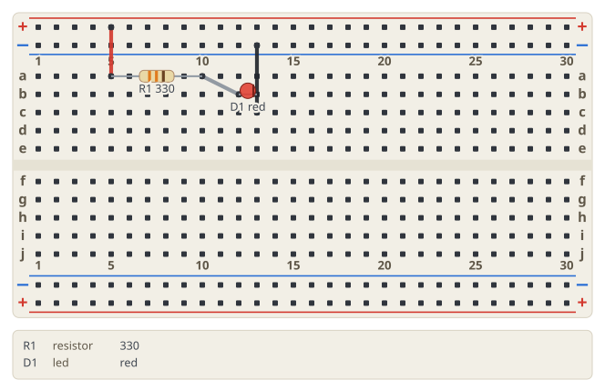
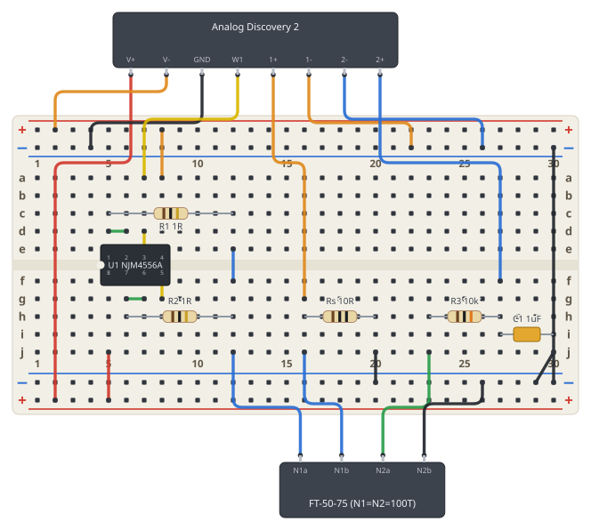
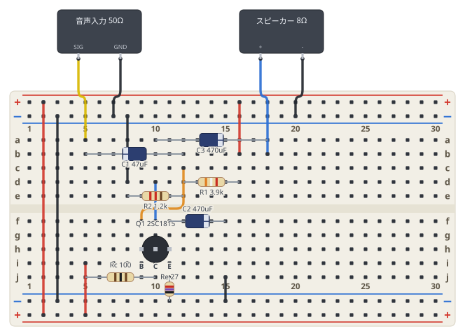

# フェンス構文と出力例

実装済みの文法と、その出力。
図の生成は [src/core/](../src/core/) の純関数 `renderBreadboard(source)` が担当する。

```bash
npm run examples   # examples/*.md → examples/out/*.svg (+ ネットリストを標準出力へ)
```

Markdown には次のように書く。VS Code のプレビュー (`Ctrl+Shift+V`) で図になる。

````markdown
```breadboard
board: half
parts:
  R1: resistor a5 a10 330
wires:
  - +t5 -- a5 red
```
````

## 文法

| 要素 | 書き方 | 例 |
| --- | --- | --- |
| ボード | `board: half` (30 列) / `full` (63 列)。省略時は half | `board: half` |
| 穴番地 | 行 `a`〜`e` (上ブロック) / `f`〜`j` (下ブロック) + 列番号 | `a5`, `j30` |
| レール番地 | `+`/`-` + `t`/`b` (上/下) + 列番号 | `+t5`, `-b20` |
| 2 端子部品 | `ID: 種類 穴 穴 値` | `R1: resistor a5 a10 10k` |
| 極性つき部品 | 穴にピン名を付ける | `D1: led b12(A) b13(K) red` |
| 3 端子部品 | 足の数だけ穴を書く | `Q1: transistor h9(B) h10(C) h11(E) 2SC1815` |
| DIP 部品 | `ID: dipN @ 穴 ラベル` | `U1: dip8 @ e5 NJM4556A` |
| ボード外の機器 | マップ形式で `type: device` + `at:` + `pins:` | 下の例 2 |
| 配線 | `- 端点 -- 端点 [色]` | `- a10 -- b12 red` |
| ピン参照 | `部品ID.ピン名` を端点に書ける | `U1.7`, `AD2.V+` |
| コメント | 行内の `#` 以降 | `# 電源まわり` |

- 部品の種類: `resistor` / `capacitor` / `led` / `transistor` / `dipN` / `device`。
- 配線の色: red, black, white, gray, orange, yellow, green, blue, purple, brown, pink。
  知らない色名は図に書き込まず、行番号つきのエラーにする。
- コンデンサに `(+)` `(-)` を付けると電解コンデンサとして描き、マイナス側に帯を出す。
- `transistor` は TO-92 の丸い本体で描く。**パッケージの平らな面の向きは図では示さない**
  (足の並びは品種ごとに違うため)。どの穴がどの足かはピン名で示す。
- DIP はピン 1 の穴だけを書く。`e` 行に置けばピン 1〜N/2 が e 行を左から右へ、
  残りが f 行を右から左へ並ぶ (`f` 行に置けば上下反転)。ピン 1 と ピン N は
  実物と同じく溝をはさんで隣り合う。
- 抵抗の値 (`10k` `4k7` `1R` `2.2M`) はカラーコードの帯として描かれる。

## 出力例 1: LED と抵抗

ソース: [examples/led.md](../examples/led.md)



穴の導通から導いたネットリスト:

```text
+t : R1.1
N1 : R1.2, D1.A
-t : D1.K
```

## 出力例 2: B-H 測定回路

B-H カーブ測定回路 (NJM4556A のフォロワ 2 回路を 1Ω 2 本で並列合流 +
電流センス + RC 積分器)。DIP 配置・ボード外の機器・ピン参照・レール電源を全部使う。
ソース: [examples/bh-ad2.md](../examples/bh-ad2.md)



ネットリスト (意図した回路と一致することを確認済み):

```text
N1    : U1.1, U1.2, R1.1        # OUT1 → IN1- (フォロワ帰還)
N2    : U1.3, U1.5, AD2.W1      # W1 → IN1+ / IN2+
+t    : U1.4, AD2.V-            # -5V
N3    : U1.6, U1.7, R2.1        # OUT2 → IN2-
+b    : U1.8, AD2.V+            # +5V
N4    : R1.2, R2.2, T1.N1a      # 1Ω 2 本の合流点 → 1 次巻線
N5    : Rs.1, AD2.1+, T1.N1b    # 電流センス上端 = CH1+
-t/-b : Rs.2, C1.2, AD2.GND, AD2.1-, AD2.2-, T1.N2b   # GND
N6    : R3.1, T1.N2a            # 2 次巻線 → 積分 R
N7    : R3.2, C1.1, AD2.2+      # 積分 C 上端 = CH2+
```

ネットは**配線だけがつなぐ** (部品はネットとネットの間の枝) という SPICE と同じ規約で、
穴の縦列とレールの導通から機械的に導出している。意図した回路との突き合わせに使える。

## 出力例 3: エミッタ接地アンプ

2SC1815 1 石、電源 5V、入力 50Ω、出力 8Ω スピーカーの音声アンプ。
トランジスタと電解コンデンサ、部品を縦にレールへ挿す書き方 (`Re: resistor j11 -b11 27`) の例。
ソースと回路の解説: [examples/common-emitter.md](../examples/common-emitter.md)



```text
N1    : Q1.B, R1.1, R2.1, C1.+     # ベース (分圧バイアス + 入力結合)
N2    : Q1.C, Rc.1, C3.+           # コレクタ (負荷抵抗 + 出力結合)
N3    : Q1.E, Re.1, C2.+           # エミッタ (帰還抵抗 + バイパス)
+t/+b : Rc.2, R1.2                 # +5V
-t/-b : Re.2, C2.-, R2.2, IN.GND, SPK.-
N4    : C1.-, IN.SIG               # 入力
N5    : C3.-, SPK.+                # 出力
```

## エラーの出方

読めなかった行は握りつぶさず、図の下に行番号つきの帯で出す。
図そのものが組み立てられなかったときは、エラーだけを並べたカードを返す。

```text
4 行目: 配線の端点 U9.1: そんな部品はありません
7 行目: a99 はボードの外です (1〜30 列)
```

## まだ無いもの

今後入れる予定のもの。

- 迂回ヒント `[v-20]` (今は「縦に出て、穴の無い横レーンを通り、縦に入る」自動ルートのみ)
- スイッチ・可変抵抗など部品の追加、wokwi-elements からの見た目の取り込み
- フェンス内 YAML のシンタックスハイライト (TextMate injection)
- 配線が部品の上を通るときの避け方 (今は部品を配線の上に描いて読めるようにしている)
