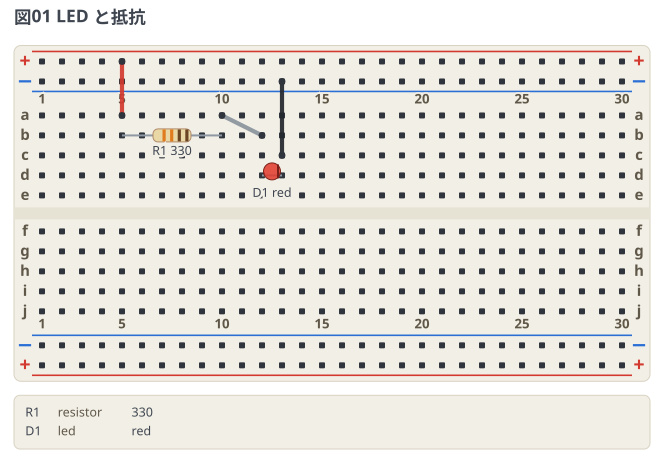

# LED と抵抗

いちばん小さな例。電源レールから抵抗を通して LED を光らせる。

```breadboard
title: 図01 LED と抵抗
board: half
parts:
  R1: resistor a5 a10 330
  D1: led b12(A) b13(K) red
wires:
  - +t5 -- a5 red
  - a10 -- b12
  - c13 -- -t13 black
notes:
  - source blue
```



読み方:

- `a5` `b12` は穴番地 (行 a〜j + 列番号)。`+t5` `-t13` は上側の電源レール。
- `b12(A)` の `(A)` はピン名。LED はアノードとカソードを区別する。
- 同じ列の a〜e (と f〜j) は内部でつながっているので、`a10 -- b12` の 1 本で
  抵抗の右足と LED のアノードがつながる。
