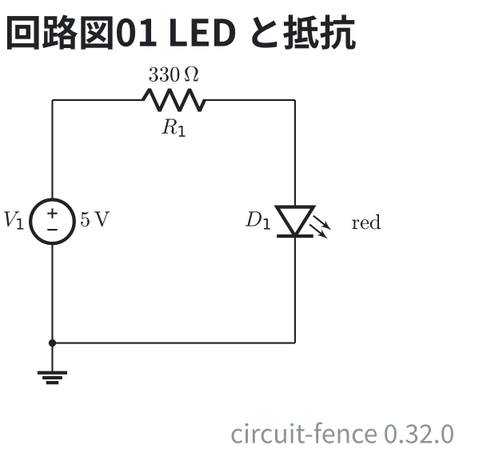
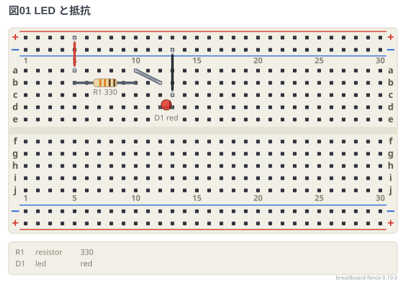

# LED と抵抗

いちばん小さな例。電源レールから抵抗を通して LED を光らせる。
電源は 5 V (USB 充電器など) で、ブレッドボードの外の機器として描く。330 Ω なら LED に約 9 mA 流れる。
**同じ回路を circuit / perfboard でも描いてある** (どれも「図01 LED と抵抗」)。

```circuit
title: 回路図01 LED と抵抗
parts:
  V1: vsource a1 c1 5
  R1: resistor a1 a3 330
  D1: led a3 c3 red
  G1: ground c1
wires:
  - c1 -- c3
```



```bread
title: 図01 LED と抵抗
board: half
parts:
  R1: resistor a5 a10 330
  D1: led b12(A) b13(K) red
  V1:
    type: device
    at: top
    label: 電源 5V
    pins: ["+", "-"]
wires:
  - V1.+ -- +t2 red
  - V1.- -- -t3 black
  - +t5 -- a5 red
  - a10 -- b12
  - c13 -- -t13 black
```



読み方:

- `a5` `b12` は穴番地 (行 a〜j + 列番号)。`+t5` `-t13` は上側の電源レール。
- `b12(A)` の `(A)` はピン名。LED はアノードとカソードを区別する。
- 同じ列の a〜e (と f〜j) は内部でつながっているので、`a10 -- b12` の 1 本で
  抵抗の右リードと LED のアノードがつながる。
