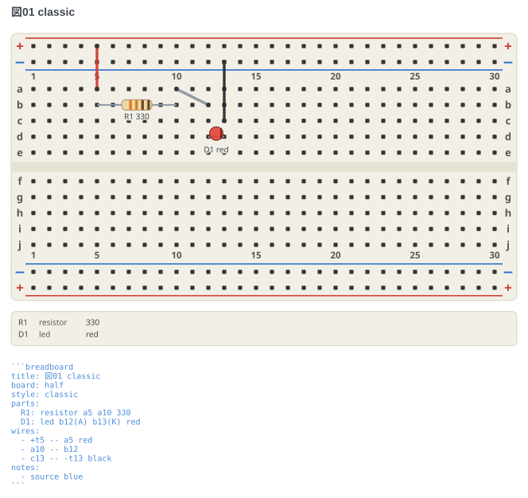
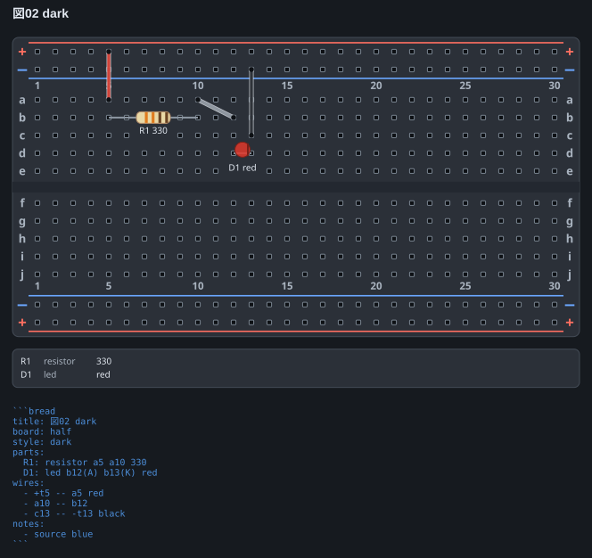
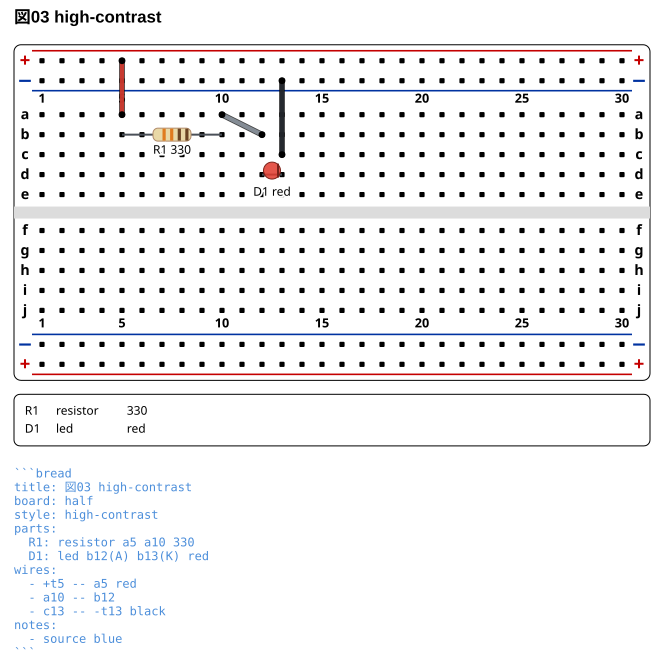
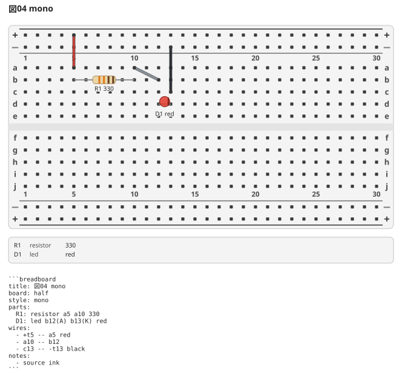
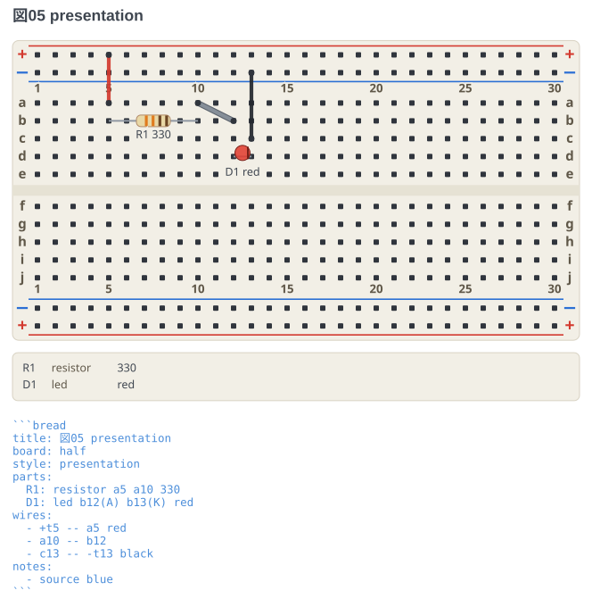
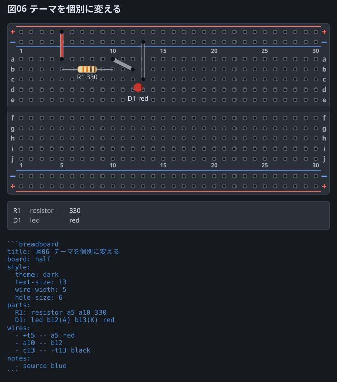

# テーマ

同じ回路 ([LED と抵抗](01-led.md)) を 5 つのテーマで描いたもの。
`style:` にテーマ名を書くだけで切り替わる。**省略したときは `presentation`**。

## classic

実物のブレッドボードに寄せた配色。字も線も小さめで、地は塗らないので
貼り先の背景がそのまま透ける。既定ではないので、使うときは名前で選ぶ。

```breadboard
title: 図01 classic
board: half
style: classic
parts:
  R1: resistor a5 a10 330
  D1: led b12(A) b13(K) red
wires:
  - +t5 -- a5 red
  - a10 -- b12
  - c13 -- -t13 black
```



## dark

暗い文書やスライドに貼るためのテーマ。板が暗いと穴が塗りでは読めなくなるので、
穴には明るい縁を付けている。配線は**色を変えず**に明るい縁取りを敷いて、
黒や紺の線が板に沈まないようにしている。

```breadboard
title: 図02 dark
board: half
style: dark
parts:
  R1: resistor a5 a10 330
  D1: led b12(A) b13(K) red
wires:
  - +t5 -- a5 red
  - a10 -- b12
  - c13 -- -t13 black
```



## high-contrast

プロジェクタの投影や、コピーを重ねたときの劣化に耐えるテーマ。
輪郭を黒で締め、字も配線も太くする。配線には黒い縁取りを敷くので、
白や黄色の線も白い板の上で追える。

```breadboard
title: 図03 high-contrast
board: half
style: high-contrast
parts:
  R1: resistor a5 a10 330
  D1: led b12(A) b13(K) red
wires:
  - +t5 -- a5 red
  - a10 -- b12
  - c13 -- -t13 black
```



## mono

白黒印刷向け。板と印字をグレーに落とす。
**配線の色と抵抗のカラーコードはそのまま残す** — あれは実物の色そのもので、
グレーにすると「何色の線を挿すか」「何オームか」が読めなくなるため。

```breadboard
title: 図04 mono
board: half
style: mono
parts:
  R1: resistor a5 a10 330
  D1: led b12(A) b13(K) red
wires:
  - +t5 -- a5 red
  - a10 -- b12
  - c13 -- -t13 black
```



## presentation

**既定のテーマ。`style:` を書かなければこれになる。**
板と部品の色は classic のまま、字と線と穴だけを大きくする。
スライドに貼る図や、記事に載せるスクリーンショット向け。
classic と違って**地は白で塗る** — 暗いスライドに貼ったときに余白だけ透けないようにするため。

```breadboard
title: 図05 presentation
board: half
style: presentation
parts:
  R1: resistor a5 a10 330
  D1: led b12(A) b13(K) red
wires:
  - +t5 -- a5 red
  - a10 -- b12
  - c13 -- -t13 black
```



## 個別に変える

テーマを土台にして、気になるところだけ上書きできる。

```breadboard
title: 図06 テーマを個別に変える
board: half
style:
  theme: dark
  text-size: 13
  wire-width: 5
  hole-size: 6
parts:
  R1: resistor a5 a10 330
  D1: led b12(A) b13(K) red
wires:
  - +t5 -- a5 red
  - a10 -- b12
  - c13 -- -t13 black
```


