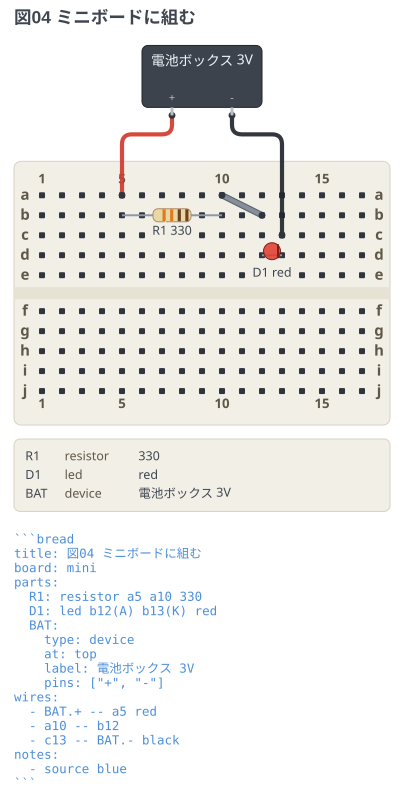
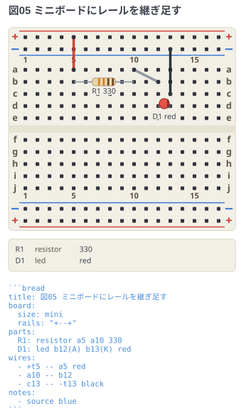
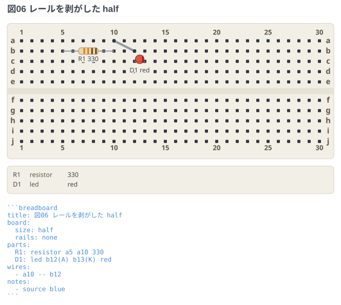

# ボードの印字

実物のブレッドボードの印字はメーカーごとに割れている。レールの並び、行ラベルの大小、
列番号の間引き。`board:` をマップで書くと、手元のボードに図の印字を寄せられる。
**番地系はどの印字でも共通**なので、どれで描いても回路は同じに読める。

サイズ (`mini` / `half` / `full`) と**レールの有無は直交**していて、
`rails:` でどの組み合わせにもできる。

## 既定 (+--+ / 小文字 / 5 毎)

`board: half` のスカラー形と同じ。最も普及した印字 (Fritzing もこれ)。

```breadboard
title: 図01 既定の印字
board: half
parts:
  R1: resistor a5 a10 330
  D1: led b12(A) b13(K) red
wires:
  - +t5 -- a5 red
  - a10 -- b12
  - c13 -- -t13 black
notes:
  - source blue
```


## レールの並びを +-+- に

下側のペアが上側と同順 (+ が内側) のボード。同じ回路を下側のレールで組んだ例。
`+b` は「下側の + レール」という極性ベースの番地なので、
**並びを変えても配線の書き方は変わらない**。挿す行が図の中で入れ替わるだけ。

```breadboard
title: 図02 レールの並びを +-+- に
board:
  rails: "+-+-"
parts:
  R1: resistor f5 f10 330
  D1: led g12(A) g13(K) red
wires:
  - +b5 -- j5 red
  - f10 -- g12
  - i13 -- -b13 black
notes:
  - source blue
```


## 大文字ラベルと全列番号

行ラベルが A〜J で、列番号が全列に印字されたボード。
`letters: upper` のときは番地も `A5` と大文字で書ける (`a5` と同じ意味)。

```breadboard
title: 図03 大文字ラベルと全列番号
board:
  letters: upper
  numbers: all
parts:
  R1: resistor A5 A10 330
  D1: led B12(A) B13(K) red
wires:
  - +t5 -- A5 red
  - A10 -- B12
  - C13 -- -t13 black
notes:
  - source blue
```


## ミニボード (17 列、レール無し)

170 穴のミニ。実物にレールが無いので、`board: mini` の既定もレール無しになる。
電源は穴のブロックまで直接引く。**レール番地 (`+t5`) は使えない** — 挿す先が無いので、
書くと行番号つきのエラーになる。

```breadboard
title: 図04 ミニボードに組む
board: mini
parts:
  R1: resistor a5 a10 330
  D1: led b12(A) b13(K) red
  BAT:
    type: device
    at: top
    label: 電池ボックス 3V
    pins: ["+", "-"]
wires:
  - BAT.+ -- a5 red
  - a10 -- b12
  - c13 -- BAT.- black
notes:
  - source blue
```



## ミニボードにレールを継ぎ足す

実物のレールは板と一体ではなく、両面テープで貼られた独立ストリップ。
剥がすことも継ぎ足すこともできるので、`rails:` を書けば mini にも付けられる。
こうすると `+t5` が使えるようになる。

```breadboard
title: 図05 ミニボードにレールを継ぎ足す
board:
  size: mini
  rails: "+--+"
parts:
  R1: resistor a5 a10 330
  D1: led b12(A) b13(K) red
wires:
  - +t5 -- a5 red
  - a10 -- b12
  - c13 -- -t13 black
notes:
  - source blue
```



## レールを剥がした half

逆向きの組み合わせ。`rails: none` はどのサイズにも効く。

```breadboard
title: 図06 レールを剥がした half
board:
  size: half
  rails: none
parts:
  R1: resistor a5 a10 330
  D1: led b12(A) b13(K) red
wires:
  - a10 -- b12
notes:
  - source blue
```


