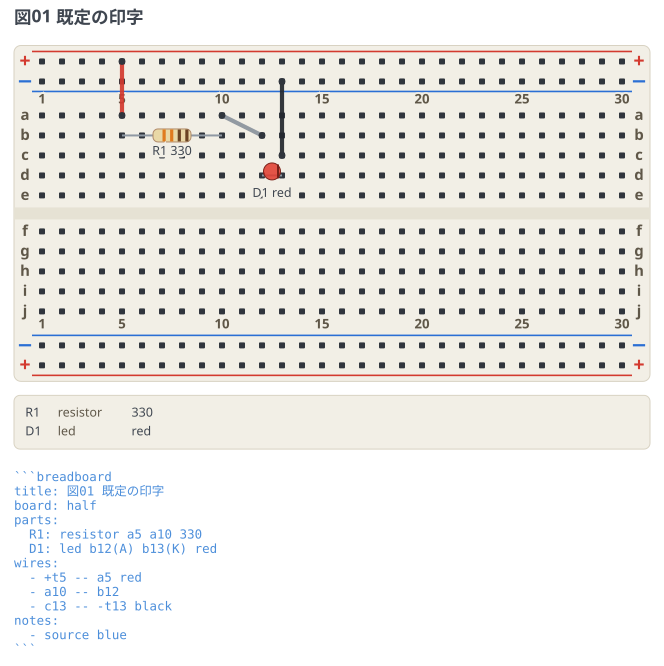
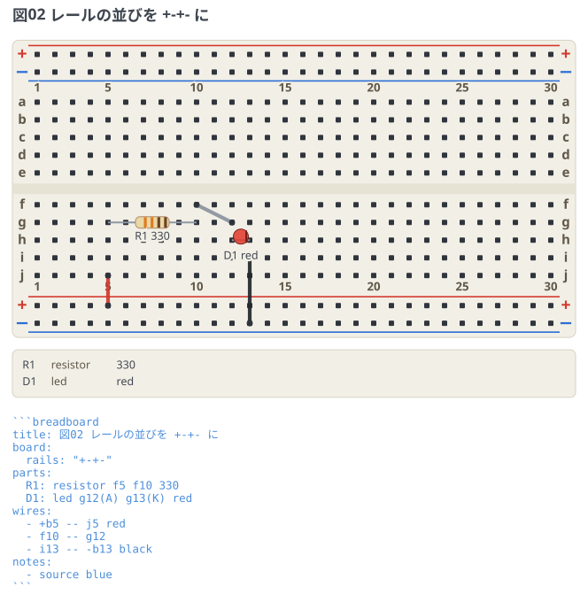
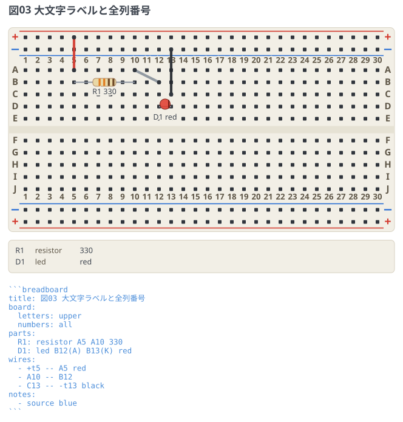

# ボードの印字

実物のブレッドボードの印字はメーカーごとに割れている。レールの並び、行ラベルの大小、
列番号の間引き。`board:` をマップで書くと、手元のボードに図の印字を寄せられる。
**番地系はどの印字でも共通**なので、どれで描いても回路は同じに読める。

## 既定 (+--+ / 小文字 / 5 毎)

`board: half` のスカラー形と同じ。最も普及した印字 (Fritzing もこれ)。

```breadboard
title: 図01 既定の印字
board: half
parts:
  R1: resistor a5 a10 330
  D1: led b12(A) b13(K) red
wires:
  - +t5 -- a5 red
  - a10 -- b12
  - c13 -- -t13 black
```



## レールの並びを +-+- に

下側のペアが上側と同順 (+ が内側) のボード。同じ回路を下側のレールで組んだ例。
`+b` は「下側の + レール」という極性ベースの番地なので、
**並びを変えても配線の書き方は変わらない**。挿す行が図の中で入れ替わるだけ。

```breadboard
title: 図02 レールの並びを +-+- に
board:
  rails: "+-+-"
parts:
  R1: resistor f5 f10 330
  D1: led g12(A) g13(K) red
wires:
  - +b5 -- f5 red
  - f10 -- g12
  - i13 -- -b13 black
```



## 大文字ラベルと全列番号

行ラベルが A〜J で、列番号が全列に印字されたボード。
`letters: upper` のときは番地も `A5` と大文字で書ける (`a5` と同じ意味)。

```breadboard
title: 図03 大文字ラベルと全列番号
board:
  letters: upper
  numbers: all
parts:
  R1: resistor A5 A10 330
  D1: led B12(A) B13(K) red
wires:
  - +t5 -- A5 red
  - A10 -- B12
  - C13 -- -t13 black
```


