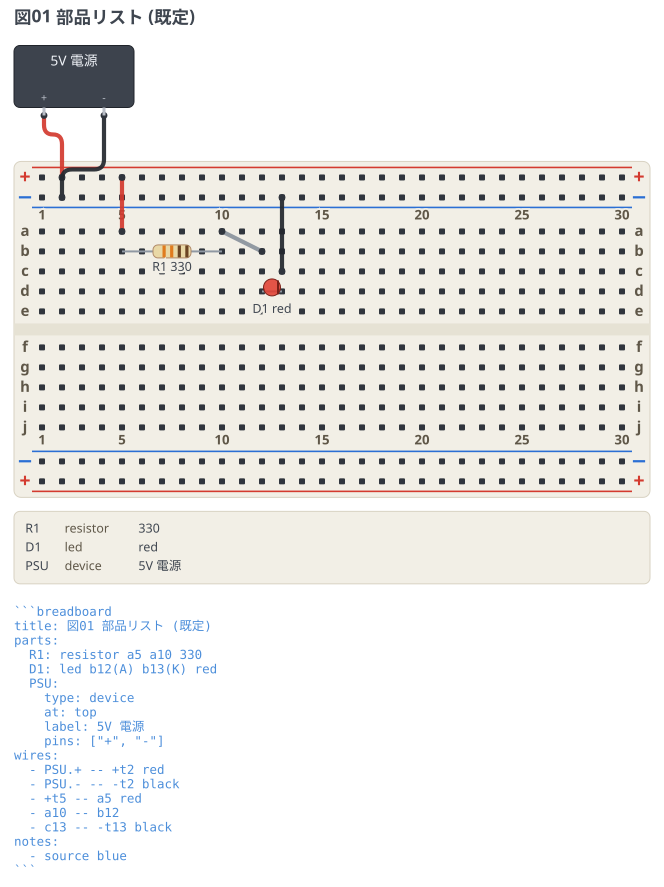
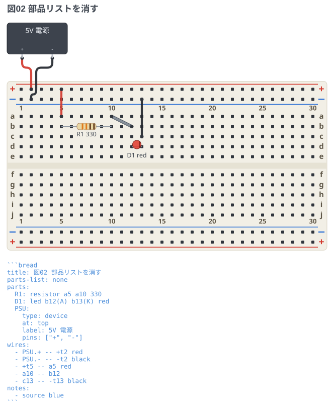

# 部品リスト

図の下に、書いた部品が ID・種類・値の順に 1 行ずつ並ぶ。
図だけを渡された人が、何を用意すればよいか図の外を見ずに分かるようにするため。

## 既定 (図の下に出る)

`parts-list:` を書かなければこうなる。値を書かなかった部品は 2 列だけになり、
`device` のように値の代わりにラベルを持つものはラベルが並ぶ。

```breadboard
title: 図01 部品リスト (既定)
parts:
  R1: resistor a5 a10 330
  D1: led b12(A) b13(K) red
  PSU:
    type: device
    at: top
    label: 5V 電源
    pins: ["+", "-"]
wires:
  - PSU.+ -- +t2 red
  - PSU.- -- -t2 black
  - +t5 -- a5 red
  - a10 -- b12
  - c13 -- -t13 black
```



## `parts-list: none` で消す

部品が自明なときや、リストを本文側に自分で書くときは消せる。
図の高さもリストのぶんだけ縮む。

```breadboard
title: 図02 部品リストを消す
parts-list: none
parts:
  R1: resistor a5 a10 330
  D1: led b12(A) b13(K) red
  PSU:
    type: device
    at: top
    label: 5V 電源
    pins: ["+", "-"]
wires:
  - PSU.+ -- +t2 red
  - PSU.- -- -t2 black
  - +t5 -- a5 red
  - a10 -- b12
  - c13 -- -t13 black
```


