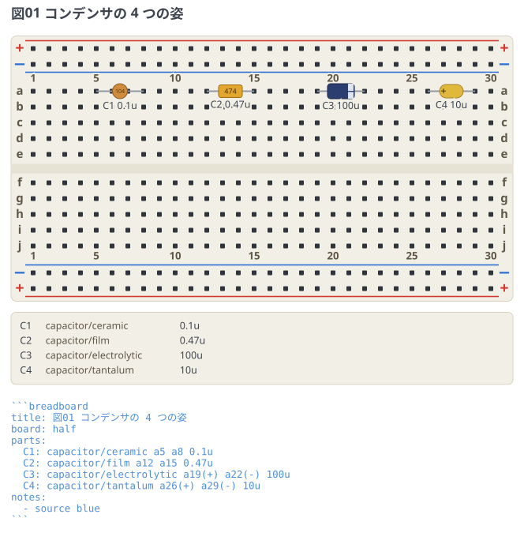
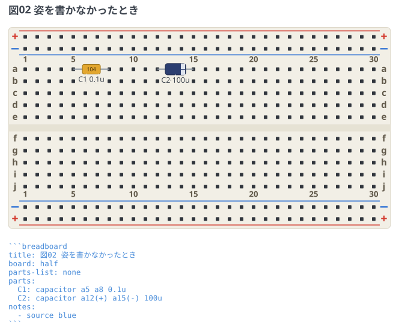
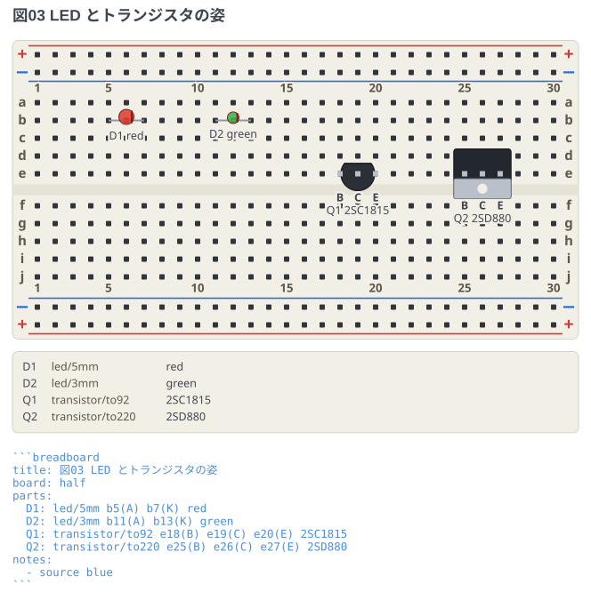
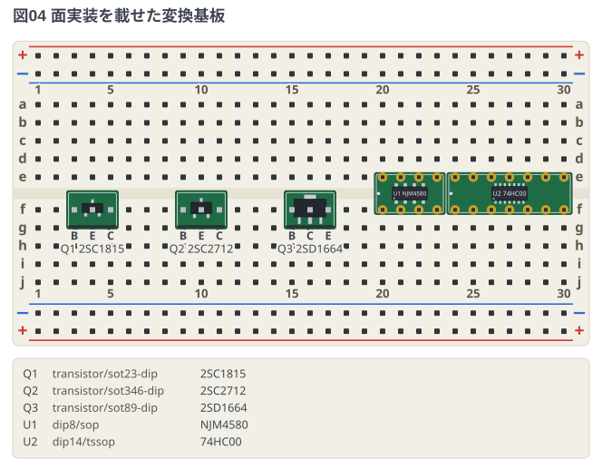

# コンデンサの姿

同じ `capacitor` でも、実物はセラミック・フィルム・電解で姿が違う。
種類に続けて `capacitor/ceramic` のように書くと、その姿で描かれる。

## 4 種類を並べる

```breadboard
title: 図01 コンデンサの 4 つの姿
board: half
parts:
  C1: capacitor/ceramic a5 a8 0.1u
  C2: capacitor/film a12 a15 0.47u
  C3: capacitor/electrolytic a19(+) a22(-) 100u
  C4: capacitor/tantalum a26(+) a29(-) 10u
notes:
  - source blue
```



- **セラミックは円板、フィルムは角い胴、電解は帯つきの缶、タンタルは黄色い粒**。
- **電解の帯はマイナス側、タンタルの印はプラス側**で、同じコンデンサでも印の意味が逆。
  取り違えると壊れるので、形から先に見分けられるようにしてある。
- 図の下の部品リストには `capacitor/ceramic` と種類ごと並ぶ。
  同じ `0.1u` でもどれを買うかはここで決まる。
- 電解とタンタルは向きがあるので、**極性を穴に書く**。2 本足なので
  `a19(+) a22(-)` でも `a19(+) a22` でもよく、片方書けば反対側は決まる。
  どちらも書かないと「向きが決まらない」と行番号つきで報告して描かない。
- セラミックとフィルムは無極性なので、逆に `(+)` `(-)` を書くとエラーになる。

## 書かなかったとき

`/…` を省くと、ピン名で選び分ける。今までどおりの書き方がそのまま通る。

```breadboard
title: 図02 姿を書かなかったとき
board: half
parts-list: none
parts:
  C1: capacitor a5 a8 0.1u
  C2: capacitor a12(+) a15(-) 100u
notes:
  - source blue
```



`(+)` `(-)` が無ければ角い胴 (フィルムと同じ姿)、あれば電解の缶になる。
セラミックの円板だけは省略形では出せないので、`capacitor/ceramic` と書く。

## LED とトランジスタ

コンデンサ以外でも、実物の大きさやパッケージが違うものは姿を選べる。

```breadboard
title: 図03 LED とトランジスタの姿
board: half
parts:
  D1: led/5mm b5(A) b7(K) red
  D2: led/3mm b11(A) b13(K) green
  Q1: transistor/to92 e18(B) e19(C) e20(E) 2SC1815
  Q2: transistor/to220 e25(B) e26(C) e27(E) 2SD880
notes:
  - source blue
```



- `led/5mm` が既定の砲弾型、`led/3mm` はひと回り小さい。挿す穴も足の名前も同じ。
- `transistor/to92` が既定の丸い胴、`transistor/to220` は放熱タブつきの角い胴。
- **どちらの姿でも、パッケージの向き (平らな面・タブの向き) は図では主張しない。**
  足の並びは品種ごとに違うので、どの穴がどの足かはピン名で示す。

## 面実装を載せた変換基板

面実装の部品は、変換基板に載せたまま挿す姿で書く (`-dip`)。載っている物は
実寸で描くので、S-Mini (`sot346-dip`) は SOT-23 (`sot23-dip`) より胴が広い。
SOP・TSSOP の IC を DIP 化した変換基板は `dipN/sop` `dipN/tssop` で、置き方は DIP と同じ。

```breadboard
title: 図04 面実装を載せた変換基板
board: half
parts:
  Q1: transistor/sot23-dip f3(B) f4(E) f5(C) 2SC1815
  Q2: transistor/sot346-dip f9(B) f10(E) f11(C) 2SC2712
  Q3: transistor/sot89-dip f15(B) f16(C) f17(E) 2SD1664
  U1: dip8/sop @ e20 NJM4580
  U2: dip14/tssop @ e24 74HC00
```



- 3 本足の変換基板は**穴を 3 つ書く** (ピンヘッダの足)。どの穴がどの足かは
  ピン名で示す — 足の並びは品種ごとに違う。
- `dip8/sop` の向きは、1 番側の端の白い点と IC の 1 番の窪みで示す。
- 直付けの姿 (`resistor/2012`) はユニバーサル基板のもので、ここでは書けない。
