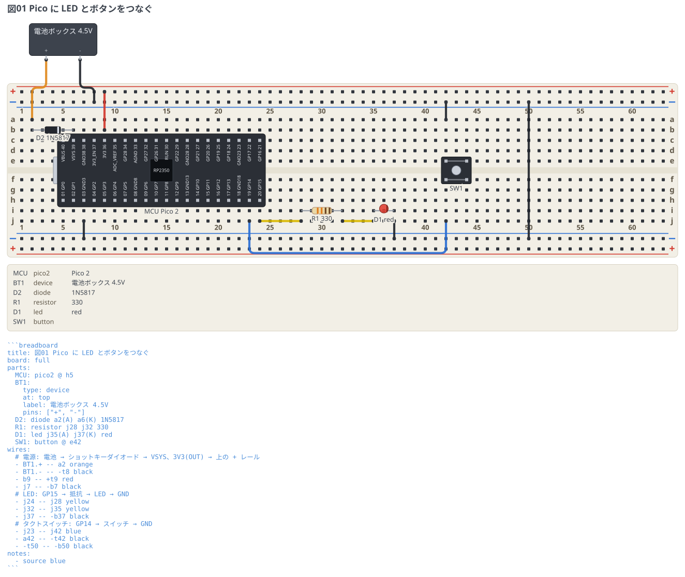

# Raspberry Pi Pico

Pico をブレッドボードにまたがせて、LED とタクトスイッチをつなぐ。
`pico` / `pico-w` / `pico2` / `pico2-w` はどれも同じ 40 ピンの並びなので、
書き方は種類名を替えるだけ。

```breadboard
title: 図01 Pico に LED とボタンをつなぐ
board: full
parts:
  MCU: pico2 @ h5
  BT1:
    type: device
    at: top
    label: 電池ボックス 4.5V
    pins: ["+", "-"]
  D2: diode a2(A) a6(K) 1N5817
  R1: resistor j28 j32 330
  D1: led j35(A) j37(K) red
  SW1: button @ e42
wires:
  # 電源: 電池 → ショットキーダイオード → VSYS、3V3(OUT) → 上の + レール
  - BT1.+ -- a2 orange
  - BT1.- -- -t8 black
  - b9 -- +t9 red
  - j7 -- -b7 black
  # LED: GP15 → 抵抗 → LED → GND
  - j24 -- j28 yellow
  - j32 -- j35 yellow
  - j37 -- -b37 black
  # タクトスイッチ: GP14 → スイッチ → GND
  - j23 -- j42 blue
  - a42 -- -t42 black
  - -t50 -- -b50 black
notes:
  - source blue
```



## 読み方

- `pico2 @ h5` はピン 1 (GP0) を挿す穴だけを書く。基板の幅は 0.7 インチ
  (穴 7 つぶん) なので、**ピンの 2 列は `h` 行と `c` 行**にちょうど落ちる。
  20 列ぶん占めるので、5 列目に置くと 24 列目まで使う。
- `h` 行に置くと **USB が左を向いた、実物のピンアウト図と同じ向き**になる
  (下の列が左から GP0, GP1, GND, …、上の列が左から VBUS, VSYS, GND, …)。
  `c` 行に置くと上下が入れ替わる。
- **基板の下の穴は基板自身が使っている。** 配線は同じ列の空いている穴に挿す。
  この図では下側 (`h` 行) のピンには `j` 行、上側 (`c` 行) のピンには `a` 行を使った。
  `j24` は GP15 (ピン 20)、`j23` は GP14 (ピン 19)、`j7` は GND (ピン 3)。
- 配線には `MCU.GP15` のようにピン名も書ける。ただし線が基板の下から出るので、
  どの穴に挿すかを図で示したいときは上のように穴番地で書く。

## 電源

図には**入れる電源**と**出す電源**の両方が出ている。

### 入れる: 電池 → VSYS

USB をつなげばそれで動くが、単体で動かすときは **VSYS (39 番) に 1.8〜5.5V を入れる**。
`c6` が VSYS の列なので、その列の空いている `a6` にダイオードのカソードを挿している。

**ショットキーダイオードを 1 本はさむ**のは、USB と外部電源が同時につながっても
壊れないようにするため (Pico の中で VBUS → VSYS にも同じ向きのダイオードが入っている)。
順方向の落ちるぶんだけ VSYS は電池より低くなるので、`1N5817` のような
低損失のものを使う。ダイオードなしで VSYS に直結してよいのは、
**USB を絶対に挿さないと決めているとき**だけ。

図では**電池の 4.5V を橙、3.3V を赤**にして色を分けてある。
どちらも電源だが電圧が違うので、同じ色で描くと + レールに 4.5V が
入っているように読めてしまう。

### 出す: 3V3(OUT) → + レール

`3V3` (36 番) はボードが作っている 3.3V の出口で、ブレッドボードに載せた
他の部品にも配れる (**合計 300mA まで**)。`c9` の列から `b9` を通して
上の + レールへ渡してある。この図では使う先がまだ無いが、
センサやモジュールを足すときはここから取る。

**入力ピンなので出してはいけないものがある。** `3V3_EN` (37 番) は
3.3V レギュレータを止めるための入力で、電源ではない。`ADC_VREF` (35 番) も
ADC の基準電圧の入力側なので、ここから電源を取らない。

### GND

GND はどのピンも同じところにつながっている。この図では `h7` (3 番) の列を
下の − レールへ落とし、上下の − レールを `-t50 -- -b50` で渡してある。
電池のマイナスもタクトスイッチの片側も、そこへ集めている
(渡す場所は空いている列ならどこでもよい。この図では 50 列目)。

## ピン名

図に印字されている名前がそのままピン名になる。GND は 7 本あって名前が重なるので、
**ピン番号を付けて `GND3` `GND8` `GND13` `GND18` `GND23` `GND28` `GND38`** と呼ぶ
(33 番は実物の印字どおり `AGND`)。電源は `3V3` `3V3_EN` `VSYS` `VBUS`、
ほかに `RUN` と `ADC_VREF`、GPIO は `GP0`〜`GP22` と `GP26`〜`GP28`。
