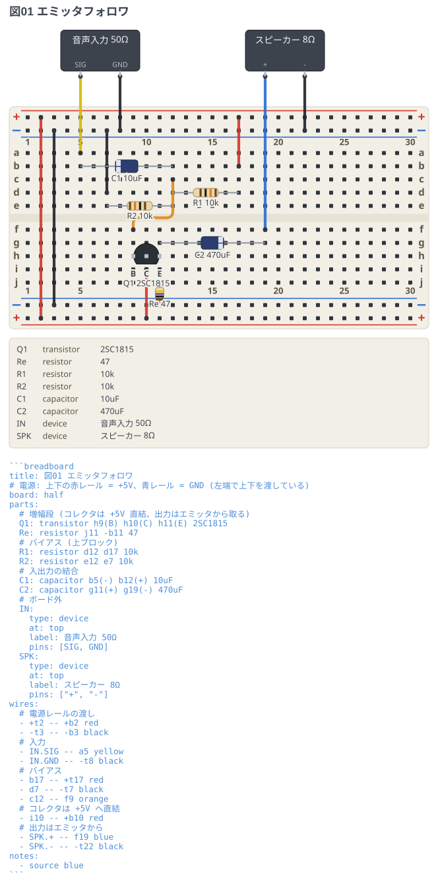

# エミッタフォロワ (2SC1815, 5V, スピーカー出力)

コレクタ接地、いわゆるエミッタフォロワ。電源 5V、入力は 50Ω の音声、
出力は 8Ω の小型スピーカー。**電圧は増やさず、電流だけを増やす**段の実験回路。

```breadboard
title: 図01 エミッタフォロワ
# 電源: 上下の赤レール = +5V、青レール = GND (左端で上下を渡している)
board: half
parts:
  # 増幅段 (コレクタは +5V 直結、出力はエミッタから取る)
  Q1: transistor h9(B) h10(C) h11(E) 2SC1815
  Re: resistor j11 -b11 47
  # バイアス (上ブロック)
  R1: resistor d12 d17 10k
  R2: resistor e12 e7 10k
  # 入出力の結合
  C1: capacitor b5(-) b12(+) 10uF
  C2: capacitor g11(+) g19(-) 470uF
  # ボード外
  IN:
    type: device
    at: top
    label: 音声入力 50Ω
    pins: [SIG, GND]
  SPK:
    type: device
    at: top
    label: スピーカー 8Ω
    pins: ["+", "-"]
wires:
  # 電源レールの渡し
  - +t2 -- +b2 red
  - -t3 -- -b3 black
  # 入力
  - IN.SIG -- a5 yellow
  - IN.GND -- -t8 black
  # バイアス
  - b17 -- +t17 red
  - d7 -- -t7 black
  - c12 -- f9 orange
  # コレクタは +5V へ直結
  - i10 -- +b10 red
  # 出力はエミッタから
  - SPK.+ -- f19 blue
  - SPK.- -- -t22 black
```



## 回路の読み方

信号は左から右へ流れる。`C1` で直流を切って `Q1` のベースに入れ、`R1` / `R2` の
分圧でベースを電源の真ん中あたりに持ち上げる。**コレクタは +5V に直結**していて
負荷抵抗が無いので、出力はエミッタから `C2` を通してスピーカーへ渡す。

エミッタの電圧はベースより約 0.6V 低いところに貼り付いたまま動く。
だから**波形は入力とそっくり同じ**で、反転もしないし大きくもならない。

- **バイアス**: 分圧の開放電圧は 5 × 10k/(10k+10k) = 2.5V。ただし等価内部抵抗が
  5kΩ あり、ベース電流 (約 0.13mA) がそこで 0.66V 落とすので、実際の Vb は
  **約 1.84V**。Ve ≈ 1.24V、Ie = 1.24V / 47Ω ≈ **26mA**。Vce ≈ 3.8V で
  コレクタ損失は約 100mW (2SC1815 の Pc 最大 400mW に対して余裕がある)。
- **hFE がばらついても動作点はあまり動かない**。`Re` が 100% の負帰還として
  効くため、hFE が 100〜300 に散っても Ie は 20〜30mA に収まる。
  エミッタ接地のように分圧の電流をベース電流の 10 倍に取る必要がない。
- **利得**: re = 26mV / 26mA ≈ 1.0Ω、交流負荷は Re∥8Ω ≈ 6.8Ω なので
  6.8/(6.8+1.0) ≈ **0.87 倍 (−1.2dB)**。1 倍を超えることはない。
- **インピーダンス変換がこの段の仕事**。入力は R1∥R2∥hfe×(re+6.8Ω) ≈ **1.2kΩ**、
  出力は re + 50Ω∥5kΩ/hfe ≈ **1.3Ω**。1.2kΩ で受けて 1.3Ω で送り出す、
  つまり**約 1000 分の 1 に下げて**次段へ渡している。

## 挿すときの注意

- **2SC1815 の足の並び**は品種ごとに違う。図はどの穴が B / C / E かだけを示している。
  2SC1815 は平らな面を見て左から **E・C・B** なので、図のとおり左から B・C・E に
  挿すには**平らな面を奥 (a 行側) に向ける**。
- **電解コンデンサ** (`C1` `C2`) は帯のある側がマイナス。図でも白い帯をマイナス側に
  描いている。`C1` はベース側 (約 1.8V)、`C2` はエミッタ側 (約 1.2V) がプラスで、
  どちらも**`Q1` を向いた側がプラス**になる。逆に挿すと壊れる。
- `Re` は j11 から下の青レール (GND) へ、縦に挿す。
- `Re` には常時 26mA が流れて約 32mW を食う。1/4W なら問題ないが、触ると温かい。

## 動かしてみると

- **音量は入力の振幅で決まる**。この段は電圧を増やさないので、2mW を絞り出すには
  入力に 0.2V ほどの振幅が要る。数十 mV のマイク出力をそのままつなぐと
  ほとんど聞こえない。前にエミッタ接地の電圧増幅段を置いて使う段だと考えるとよい。
- **出せる電力は静止電流で頭打ちになる**。クラス A なので 8Ω に流せるピークは
  静止電流の 26mA まで。交流負荷 6.8Ω に 26mA でピーク 0.18V、電力にして **約 2mW**。
  これ以上欲しいなら `Re` を下げて静止電流を増やすが、そのぶん `Q1` が熱くなる。
- **低音は `C2` で決まる**。470µF と (出力 1.3Ω + スピーカー 8Ω) の折れ点が
  約 36Hz。`C1` 側は 10µF と 1.2kΩ で約 13Hz なので、どちらも音声帯域は素通しする。
- 発振は起きにくいが、電源の引き回しが長いと 26mA の変動がレールに乗る。
  気になるなら `Q1` の近くで +5V と GND の間に 0.1µF を 1 つ入れる。
