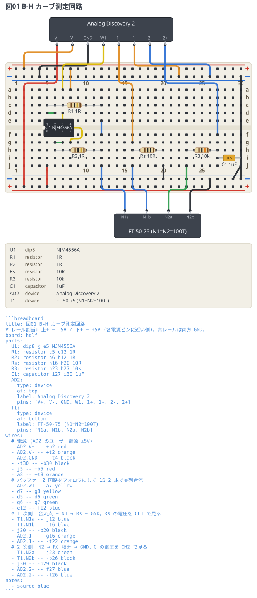

# B-H カーブ測定回路 (Analog Discovery 2)

磁気ヒステリシス (B-H カーブ) を測るための実験回路。
NJM4556A の 2 回路をボルテージフォロワにして 1Ω 2 本で並列合流し、
1 次側の電流を Rs で測り、2 次側を RC 積分器に通して XY 表示に食わせる。

DIP 部品・ボード外の機器・ピン参照・電源レールを全部使う、文法のストレステスト。

```breadboard
title: 図01 B-H カーブ測定回路
# レール割当: 上+ = +5V / 下+ = -5V (各電源ピンに近い側)。青レールは両方 GND。
board: half
parts:
  U1: dip8 @ f5 NJM4556A
  R1: resistor h5 h12 1R
  R2: resistor c6 c12 1R
  Rs: resistor c16 c20 10R
  R3: resistor c23 c27 10k
  C1: capacitor b27 b30 1uF
  AD2:
    type: device
    at: bottom
    label: Analog Discovery 2
    pins: [V+, V-, GND, W1, 1+, 1-, 2-, 2+]
  T1:
    type: device
    at: top
    label: FT-50-75 (N1=N2=100T)
    pins: [N1a, N1b, N2a, N2b]
wires:
  # 電源 (AD2 のユーザー電源 ±5V)
  - AD2.V+ -- +t2 red
  - AD2.V- -- +b2 orange
  - AD2.GND -- -b4 black
  - -b30 -- -t30 black
  - a5 -- +t5 red
  - j8 -- +b8 orange
  # バッファ: 2 回路をフォロワにして 1Ω 2 本で並列合流
  - AD2.W1 -- j7 yellow
  - g7 -- d8 yellow
  - g5 -- g6 green
  - d6 -- d7 green
  - f12 -- e12 blue
  # 1 次側: 合流点 → N1 → Rs → GND。Rs の電圧を CH1 で見る
  - T1.N1a -- a12 blue
  - T1.N1b -- a16 blue
  - a20 -- -t20 black
  - AD2.1+ -- d16 orange
  - AD2.1- -- -b22 orange
  # 2 次側: N2 → RC 積分 → GND。C の電圧を CH2 で見る
  - T1.N2a -- a23 green
  - T1.N2b -- -t26 black
  - a30 -- -t29 black
  - AD2.2+ -- e27 blue
  - AD2.2- -- -b26 blue
notes:
  - source blue
```



`breadboard-fence render examples --out examples/out` を実行すると、
図と一緒に**穴の導通から導いたネットリスト**が出る。
意図した回路と突き合わせて配線ミスを見つけるのに使える。
