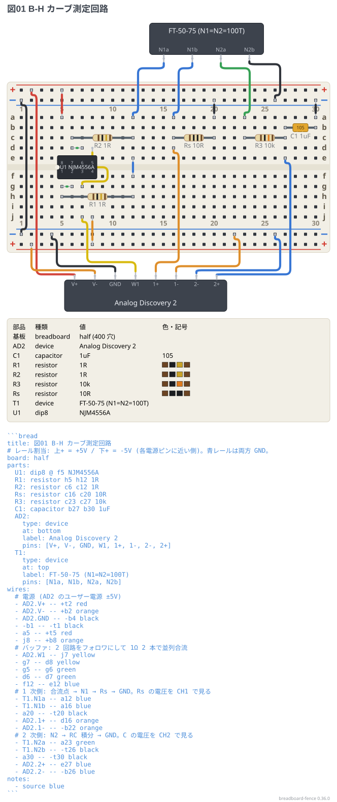

# B-H カーブ測定回路 (Analog Discovery 2)

磁気ヒステリシス (B-H カーブ) を測るための実験回路。
NJM4556A の 2 回路をボルテージフォロワにして 1Ω 2 本で並列合流し、
1 次側の電流を Rs で測り、2 次側を RC 積分器に通して XY 表示に食わせる。

DIP 部品・ボード外の機器・ピン参照・電源レールを全部使う、文法のストレステスト。

**先に回路図を見てから、ブレッドボードに落とす。** 回路図は測定器の機器 (波形発生器 W1 と電圧計 CH1・CH2) として描き、オペアンプ U1 の電源 (±5V) は省いてある。ブレッドボードの図では AD2 の V+ / V- をつないでいる。

```circuit
title: 回路図01 B-H カーブ測定回路
parts:
  WG: sine 1,2 1,5 l=$\mathrm{W1}$
  G1: ground 1,5
  U1A: opamp 4,2 +up NJM4556A
  U1B: opamp 4,7 +up NJM4556A
  R1: resistor 6,2 8,2 1
  R2: resistor 6,7 8,7 1
  T1: transformer 12,5
  Rs: resistor 10,7 10,10 10
  G2: ground 10,10
  M1: voltmeter 9,7 9,10 l=$\mathrm{CH1}$
  R3: resistor 15,5 17,5 10k
  C1: capacitor 17,6 17,8 1u
  G3: ground 17,8
  G4: ground 14,8
  M2: voltmeter 19,6 19,8 l=$\mathrm{CH2}$
wires:
  - 1,2 -- 2,2
  - 2,2 -- 2,7
  - 2,2 |- U1A.+
  - 2,7 |- U1B.+
  - 3,3 |- U1A.-
  - 3,3 -- 5,3
  - U1A.out -- 5,2
  - 5,3 -- 5,2
  - 5,2 -- 6,2
  - 3,8 |- U1B.-
  - 3,8 -- 5,8
  - U1B.out -- 5,7
  - 5,8 -- 5,7
  - 5,7 -- 6,7
  - 8,2 -- 8,5
  - 8,5 -- 8,7
  - 8,5 |- T1.A1
  - T1.A2 -| 10,7
  - 9,7 -- 10,7
  - 9,10 -- 10,10
  - T1.B1 -| 15,5
  - 17,5 -- 17,6
  - 17,6 -- 19,6
  - 17,8 -- 19,8
  - T1.B2 -| 14,8
```


```bread
title: 図01 B-H カーブ測定回路
# レール割当: 上+ = +5V / 下+ = -5V (各電源ピンに近い側)。青レールは両方 GND。
board: half
parts:
  U1: dip8 @ f5 NJM4556A
  R1: resistor h5 h12 1R
  R2: resistor c6 c12 1R
  Rs: resistor c16 c20 10R
  R3: resistor c23 c27 10k
  C1: capacitor b27 b30 1uF
  AD2:
    type: device
    at: bottom
    label: Analog Discovery 2
    pins: [V+, V-, GND, W1, 1+, 1-, 2-, 2+]
  T1:
    type: device
    at: top
    label: FT-50-75 (N1=N2=100T)
    pins: [N1a, N1b, N2a, N2b]
wires:
  # 電源 (AD2 のユーザー電源 ±5V)
  - AD2.V+ -- +t2 red
  - AD2.V- -- +b2 orange
  - AD2.GND -- -b4 black
  - -b1 -- -t1 black
  - a5 -- +t5 red
  - j8 -- +b8 orange
  # バッファ: 2 回路をフォロワにして 1Ω 2 本で並列合流
  - AD2.W1 -- j7 yellow
  - g7 -- d8 yellow
  - g5 -- g6 green
  - d6 -- d7 green
  - f12 -- e12 blue
  # 1 次側: 合流点 → N1 → Rs → GND。Rs の電圧を CH1 で見る
  - T1.N1a -- a12 blue
  - T1.N1b -- a16 blue
  - a20 -- -t20 black
  - AD2.1+ -- d16 orange
  - AD2.1- -- -b22 orange
  # 2 次側: N2 → RC 積分 → GND。C の電圧を CH2 で見る
  - T1.N2a -- a23 green
  - T1.N2b -- -t26 black
  - a30 -- -t30 black
  - AD2.2+ -- e27 blue
  - AD2.2- -- -b26 blue
notes:
  - source blue
```




`breadboard-fence render examples --out examples/out` を実行すると、
図と一緒に**穴の導通から導いたネットリスト**が出る。
意図した回路と突き合わせて配線ミスを見つけるのに使える。
