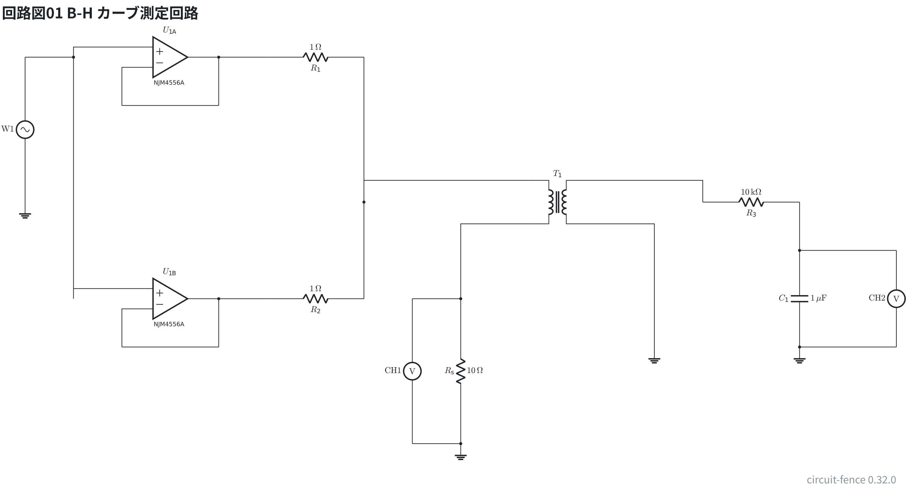
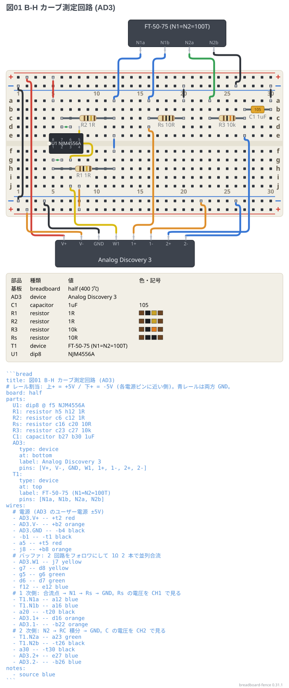

# B-H カーブ測定回路 (Analog Discovery 3)

磁気ヒステリシス (B-H カーブ) を測るための実験回路。
NJM4556A の 2 回路をボルテージフォロワにして 1Ω 2 本で並列合流し、
1 次側の電流を Rs で測り、2 次側を RC 積分器に通して XY 表示に食わせる。

DIP 部品・ボード外の機器・ピン参照・電源レールを全部使う、文法のストレステスト。

**先に回路図を見てから、ブレッドボードに落とす。** 回路図は測定器の機器 (波形発生器 W1 と電圧計 CH1・CH2) として描き、オペアンプ U1 の電源 (±5V) は省いてある。ブレッドボードの図では AD3 の V+ / V- をつないでいる。

```circuit
title: 回路図01 B-H カーブ測定回路
parts:
  WG: sine b1 e1 l=$\mathrm{W1}$
  G1: ground e1
  U1A: opamp b4 +up NJM4556A
  U1B: opamp g4 +up NJM4556A
  R1: resistor b6 b8 1
  R2: resistor g6 g8 1
  T1: transformer e12
  Rs: resistor g10 j10 10
  G2: ground j10
  M1: voltmeter g9 j9 l=$\mathrm{CH1}$
  R3: resistor e15 e17 10k
  C1: capacitor f17 h17 1u
  G3: ground h17
  G4: ground h14
  M2: voltmeter f19 h19 l=$\mathrm{CH2}$
wires:
  - b1 -- b2
  - b2 -- g2
  - b2 |- U1A.+
  - g2 |- U1B.+
  - c3 |- U1A.-
  - c3 -- c5
  - U1A.out -- b5
  - c5 -- b5
  - b5 -- b6
  - h3 |- U1B.-
  - h3 -- h5
  - U1B.out -- g5
  - h5 -- g5
  - g5 -- g6
  - b8 -- e8
  - e8 -- g8
  - e8 |- T1.A1
  - T1.A2 -| g10
  - g9 -- g10
  - j9 -- j10
  - T1.B1 -| e15
  - e17 -- f17
  - f17 -- f19
  - h17 -- h19
  - T1.B2 -| h14
```



```bread
title: 図01 B-H カーブ測定回路 (AD3)
# レール割当: 上+ = +5V / 下+ = -5V (各電源ピンに近い側)。青レールは両方 GND。
board: half
parts:
  U1: dip8 @ f5 NJM4556A
  R1: resistor h5 h12 1R
  R2: resistor c6 c12 1R
  Rs: resistor c16 c20 10R
  R3: resistor c23 c27 10k
  C1: capacitor b27 b30 1uF
  AD3:
    type: device
    at: bottom
    label: Analog Discovery 3
    pins: [V+, V-, GND, W1, 1+, 1-, 2+, 2-]
  T1:
    type: device
    at: top
    label: FT-50-75 (N1=N2=100T)
    pins: [N1a, N1b, N2a, N2b]
wires:
  # 電源 (AD3 のユーザー電源 ±5V)
  - AD3.V+ -- +t2 red
  - AD3.V- -- +b2 orange
  - AD3.GND -- -b4 black
  - -b1 -- -t1 black
  - a5 -- +t5 red
  - j8 -- +b8 orange
  # バッファ: 2 回路をフォロワにして 1Ω 2 本で並列合流
  - AD3.W1 -- j7 yellow
  - g7 -- d8 yellow
  - g5 -- g6 green
  - d6 -- d7 green
  - f12 -- e12 blue
  # 1 次側: 合流点 → N1 → Rs → GND。Rs の電圧を CH1 で見る
  - T1.N1a -- a12 blue
  - T1.N1b -- a16 blue
  - a20 -- -t20 black
  - AD3.1+ -- d16 orange
  - AD3.1- -- -b22 orange
  # 2 次側: N2 → RC 積分 → GND。C の電圧を CH2 で見る
  - T1.N2a -- a23 green
  - T1.N2b -- -t26 black
  - a30 -- -t30 black
  - AD3.2+ -- e27 blue
  - AD3.2- -- -b26 blue
notes:
  - source blue
```




`breadboard-fence render examples --out examples/out` を実行すると、
図と一緒に**穴の導通から導いたネットリスト**が出る。
意図した回路と突き合わせて配線ミスを見つけるのに使える。
