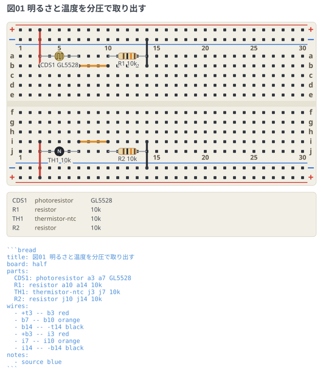
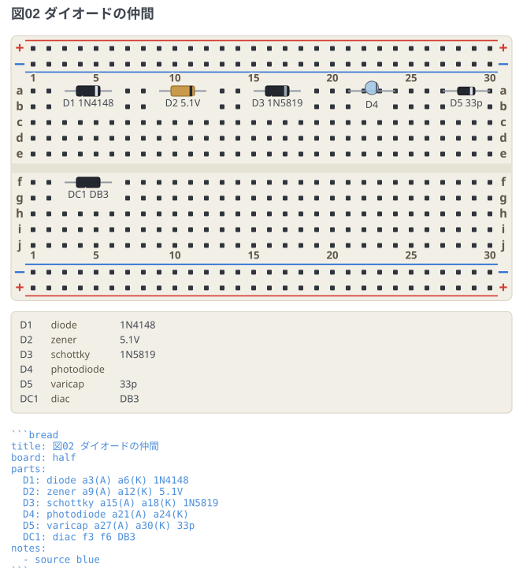
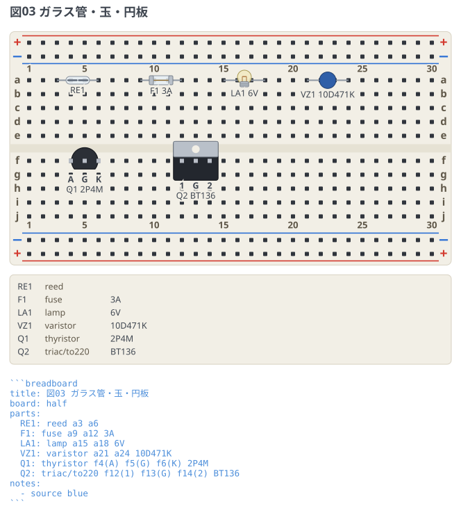

# センサーとダイオードの仲間

CdS セル・サーミスタ・ダイオードの仲間・ガラス封止の部品の書き方。
名前は回路図フェンス (circuit-fence) と揃えてあるので、
同じノートで両方を書くときに覚え直さなくてよい。

## 明るさと温度を分圧で取り出す

```breadboard
title: 図01 明るさと温度を分圧で取り出す
board: half
parts:
  CDS1: photoresistor a3 a7 GL5528
  R1: resistor a10 a14 10k
  TH1: thermistor-ntc j3 j7 10k
  R2: resistor j10 j14 10k
wires:
  - +t3 -- b3 red
  - b7 -- b10 orange
  - b14 -- -t14 black
  - +b3 -- i3 red
  - i7 -- i10 orange
  - i14 -- -b14 black
notes:
  - source blue
```



どちらも上を素子、下を固定抵抗にした分圧で、真ん中 (`b7` / `i7` の列) が出力。
CdS は明るいほど抵抗が下がり、NTC サーミスタは温かいほど下がる。

- `photoresistor` の受光面には蛇行した抵抗体を描く。CdS はこの模様で見分けられる。
- サーミスタは `thermistor` (無印) / `thermistor-ntc` (`N`) / `thermistor-ptc` (`P`)。
  **形は同じ黒い円板で、印だけが違う**。実物も形では見分けられないので、
  図でも印と部品リストの種類名に読ませる。

## ダイオードの仲間

```breadboard
title: 図02 ダイオードの仲間
board: half
parts:
  D1: diode a3(A) a6(K) 1N4148
  D2: zener a9(A) a12(K) 5.1V
  D3: schottky a15(A) a18(K) 1N5819
  D4: photodiode a21(A) a24(K)
  D5: varicap a27(A) a30(K) 33p
  DC1: diac f3 f6 DB3
notes:
  - source blue
```



**極性・向きのある 2 端子は、先に書いた穴が + 側 (アノード)。**
`(A)` `(K)` を書かなくてもこの規則で向きが決まる。書けば図と食い違わないことを
確かめられるので、迷うところでは書いておくとよい。

- カソード側に帯を描く。ツェナーはガラス封止なので胴が明るい。
- `photodiode` は砲弾型 (LED と同じ形) で、平らな面がカソード側。
- `diac` は対称な素子なので**帯を描かない**。向きが無いことが形で分かる。

## ガラス管・玉・円板

```breadboard
title: 図03 ガラス管・玉・円板
board: half
parts:
  RE1: reed a3 a6
  F1: fuse a9 a12 3A
  LA1: lamp a15 a18 6V
  VZ1: varistor a21 a24 10D471K
  Q1: thyristor f4(A) f5(G) f6(K) 2P4M
  Q2: triac/to220 f12(1) f13(G) f14(2) BT136
notes:
  - source blue
```



- `reed` の接点は**開いた状態**で描く。磁石を近づけたときだけ閉じるので、
  閉じた図にすると平常時と食い違う。
- `varistor` はサーミスタと同じ円板だが、一回り大きく青い樹脂で塗る。
- `thyristor` と `triac` は 3 本足で、`transistor` と同じ `to92` / `to220` の姿を選べる。
  足の名前は穴に書く (`f5(G)`)。書かなければ左から `1` `2` `3`。
