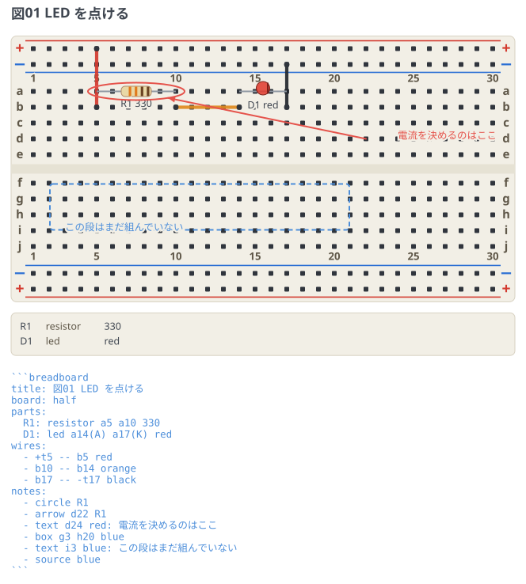
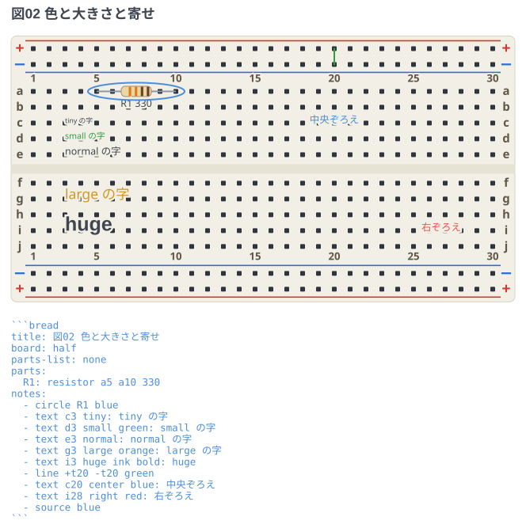
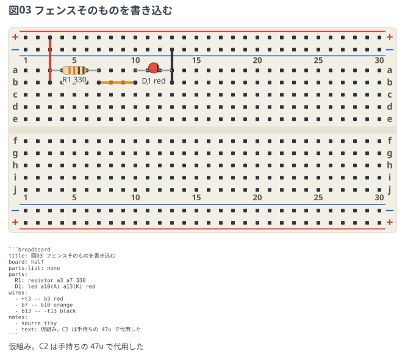

# 題と注釈

`title:` で図に題を付け、`notes:` で図の上に印と字を重ねる。
語は回路図フェンス (circuit-fence) と同じなので、覚え直さなくてよい。

## 印・枠・指し棒・字

```breadboard
title: 図01 LED を点ける
board: half
parts:
  R1: resistor a5 a10 330
  D1: led a14(A) a17(K) red
wires:
  - +t5 -- b5 red
  - b10 -- b14 orange
  - b17 -- -t17 black
notes:
  - circle R1
  - arrow d22 R1
  - text d24 red: 電流を決めるのはここ
  - box g3 h20 blue
  - text i3 blue: この段はまだ組んでいない
  - source blue
```



- `circle` は指し先を囲む。**部品を指すと部品を囲む楕円**、穴を指すと穴 1 つの丸。
- `arrow` と `line` は 2 点を結ぶ。部品を指した端は囲みの縁で止まり、
  **穴を指した端は穴そのものまで届く** (手前で止めるとどの穴か分からなくなるため)。
- `box` は 2 つの番地を対角にした枠。既定は破線で、`solid` と書くと実線になる。
- `text` は**字を `:` の後ろに書く**。ここだけ書き方が違うのは YAML の都合で、
  値の側に置けば引用が要るかどうかを YAML 自身に決めさせられる。

## 色・大きさ・寄せ

```breadboard
title: 図02 色と大きさと寄せ
board: half
parts-list: none
parts:
  R1: resistor a5 a10 330
notes:
  - circle R1 blue
  - text c3 tiny: tiny の字
  - text d3 small green: small の字
  - text e3 normal: normal の字
  - text g3 large orange: large の字
  - text i3 huge ink bold: huge
  - line +t20 -t20 green
  - text c20 center blue: 中央ぞろえ
  - text i28 right red: 右ぞろえ
  - source blue
```



- 色は `red` `blue` `green` `orange` `ink`。`ink` は図の文字色で、テーマに従う。
  **印・枠・指し棒の既定は `red`**、字の既定は図の文字色。
- 大きさは `tiny` `small` `normal` `large` `huge`。
  **図の字の大きさ (`style: text-size`) に対する倍率**なので、テーマを変えても釣り合いが崩れない。
- 寄せは `left` (既定) `center` `right`。番地が字のどこに来るかが変わる。
  **板の右端に置く字は `right` 寄せにする** (`left` のままだと右に幅が残らず、
  板の幅で `…` に切られる)。
- 語は**順不同**で、`bold` も足せる。同じ種類を 2 回書いたら
  黙って後勝ちにせず行番号つきで報告する。

## フェンスそのものを図に書き込む

```breadboard
title: 図03 フェンスそのものを書き込む
board: half
parts-list: none
parts:
  R1: resistor a3 a7 330
  D1: led a10(A) a13(K) red
wires:
  - +t3 -- b3 red
  - b7 -- b10 orange
  - b13 -- -t13 black
notes:
  - source tiny
  - text: 仮組み。C2 は手持ちの 47u で代用した
```



`source` はそのフェンスの中身を、囲みつきで書き出す。
図だけを渡された人がそのまま書き写せるのが値打ちなので、**行番号は添えない**。

**番地を書かないと、板の下の帯に置かれる**。`text` も同じで、
図の説明を 1 行添えるときはこれがいちばん短い。

- 板の番地はどれも実在の穴に縛られているので、**板の外を指す番地が存在しない**。
  写しや説明を板の上に重ねると穴と印字に重なるので、場所を書かないほうを既定にした。
- 帯は部品リストの後ろに、書いた順に積む。左端は板に揃い、`center` / `right` の
  寄せは板の幅に対して効く。
- 等幅で描き、字下げをそのまま残す。
- 行送りは `tight` / `loose` で変えられる (`source` にだけ書ける語)。
- **番地を書けば今までどおり板の上に重なる** (`- source j3 tiny`)。
  板のその場所の説明として使うときはこちら。板の下へはみ出すぶんは
  切らずに画布のほうを伸ばす。

## 注釈は回路の一員ではない

印と字は図の上に重ねるだけで、**板に挿すものではない**。
ネットにもネットリストにも部品リストにも数えない。
注釈を足しても、図から導いたネットリストは 1 行も変わらない。
