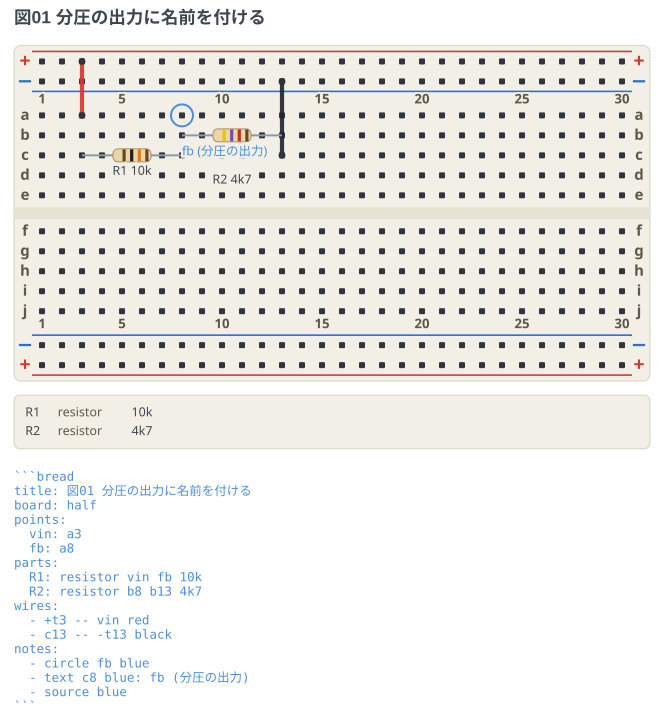
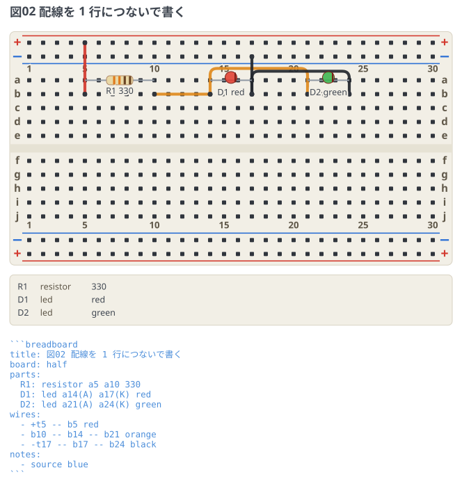
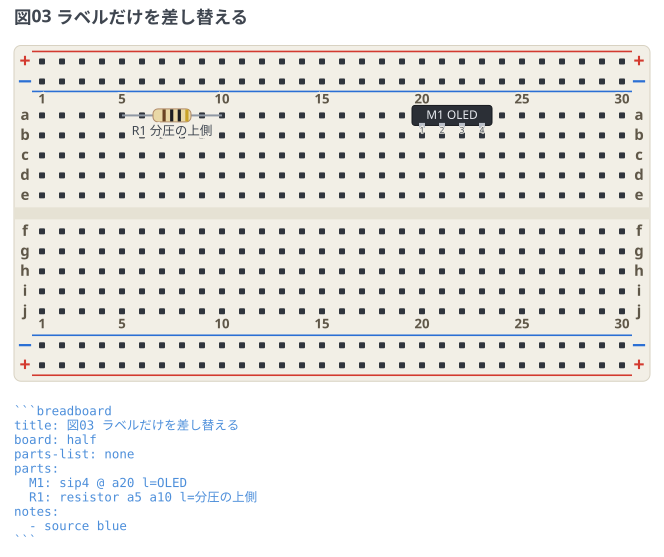

# 番地に名前を付ける

`points:` で穴番地に名前を付けると、節点を動かすときの編集が 1 箇所で済む。
あわせて、配線を 1 行につないで書く形と、ラベルだけを差し替える `l=` も示す。

## points で節点に名前を付ける

```breadboard
title: 図01 分圧の出力に名前を付ける
board: half
points:
  vin: a3
  fb: a8
parts:
  R1: resistor vin fb 10k
  R2: resistor b8 b13 4k7
wires:
  - +t3 -- vin red
  - c13 -- -t13 black
notes:
  - circle fb blue
  - text c8 blue: fb (分圧の出力)
```



ネットリストにも同じ名前が出るので、図を見ずに突き合わせられる。

```text
+t : R1.1
fb : R1.2, R2.1
-t : R2.2
```

- **番地が書ける場所すべて**で使える。部品の穴・配線の端点・注釈の指し先のどれでも同じ。
- `points:` はフェンスのどこに書いてもよい。部品より下に書いても解決する。
- 名前の字種は部品 ID と同じ (英数字と `_` `-`)。
  **番地の形 (`a5`) と、部品 ID との重複は使えない** —
  注釈の指し先が「部品 ID か番地」の両取りなので、3 つ目の名前空間を重ねると
  解決順の説明が要る。禁じれば説明ごと消える。
- ネット名の優先順は**レール > 点の名前 > `N` 連番**。
  レールの名前は極性そのものなので、点の名前より先に立てる。

## 配線を 1 行につないで書く

```breadboard
title: 図02 配線を 1 行につないで書く
board: half
parts:
  R1: resistor a5 a10 330
  D1: led a14(A) a17(K) red
  D2: led a21(A) a24(K) green
wires:
  - +t5 -- b5 red
  - b10 -- b14 -- b21 orange
  - -t17 -- b17 -- b24 black
```



`端点 -- 端点 -- 端点` と並べると、隣り合う端点ごとの区間に開かれる。
1 行が 1 本の信号の道として読め、行数も減る。

- 色は行全体で共有する。
- 行番号は書いた 1 行のまま。読めなかったときはその行を指す。
- **迂回ヒント (`[v-20]`) を書く行は端点を 2 つだけにする。**
  どの区間の道順か決まらないので、行番号つきで断る。

## ラベルだけを差し替える (`l=`)

```breadboard
title: 図03 ラベルだけを差し替える
board: half
parts-list: none
parts:
  M1: sip4 @ a20 l=OLED
  R1: resistor a5 a10 l=分圧の上側
```



`l=字` は図に出るラベルを差し替える (マップ形式の `label:` と同じ意味)。
**空白は含められない**ので、語をまたぐラベルはマップ形式で書く。
1 行の記法は空白で語を割っているので、ここだけ別の割り方をすると読み方が 2 つになる。
