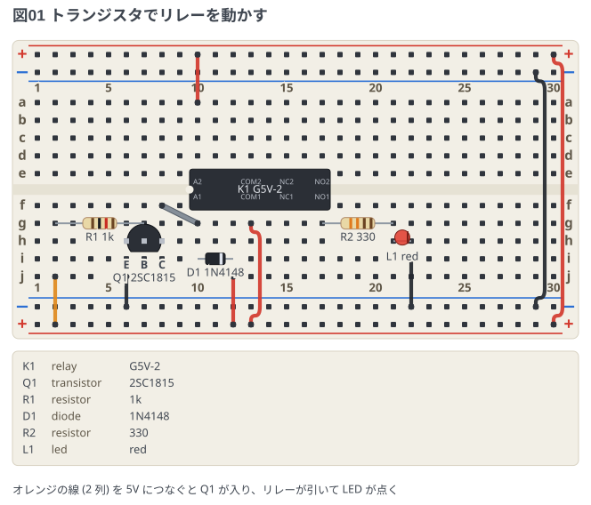
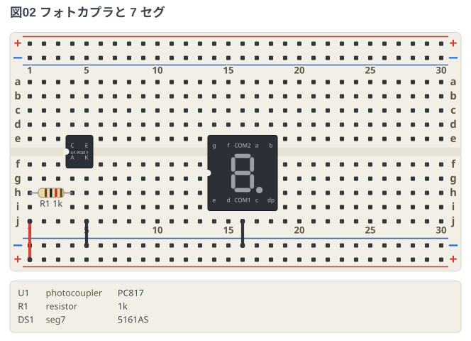

# 足に名前のある DIP 型

リレー・フォトカプラ・7 セグは、**DIP の足の位置のうち、足のある所に名前が付いた物**
として置く (`K1: relay @ f10`)。足の名前と並びは実物のデータシートどおりで、
配線やネットリストでは `K1.COM1` のように名前で呼ぶ。書き方の決まりは
[文法リファレンス](../docs/01-syntax.md) の「足に名前のある DIP 型」。

## リレー

G5V-2 (5V、2 回路) をトランジスタで動かす。コイルの両端 (`A1` と `A2`) に
**還流ダイオード** (D1) を逆向きに入れて、切った瞬間の逆起電力を逃がす。
接点は 1 回路目の共通 (`COM1`) を 5V に、a 接点 (`NO1`) を LED へ。

```breadboard
title: 図01 トランジスタでリレーを動かす
# 上下の赤いレール = +5V、青いレール = GND (右端で上下を渡している)
board: half
parts:
  K1: relay @ f10
  Q1: transistor h6(E) h7(B) h8(C) 2SC1815
  R1: resistor g2 g7 1k
  D1: diode i10(A) i12(K) 1N4148
  R2: resistor g17 g21 330
  L1: led h21(A) h22(K) red
wires:
  - +t10 -- a10 red
  - f8 -- g10
  - j6 -- -b6 black
  - j12 -- +b12 red
  - j2 -- +b2 orange
  - g13 -- +b13 red
  - i22 -- -b22 black
  - +t30 -- +b30 red
  - -t29 -- -b29 black
notes:
  - text: オレンジの線 (2 列) を 5V につなぐと Q1 が入り、リレーが引いて LED が点く
```



- リレーの 1 番ピン (`A1`) を下のブロックの f10 に置いた。切り欠きを左にした実物を
  上から見た並びと同じになる
- 使わない 2 回路目 (`COM2` `NC2` `NO2`) は空けたまま

## フォトカプラと 7 セグ

PC817 は DIP4 と同じ置き方で、LED 側 (`A` `K`) に電流を決める抵抗を入れる。
7 セグ (5161AS) は**列の間が 6 穴**なので、6 穴離れた行の組 (ここでは i↔e) に置く。
共通 (`COM1`) を GND へ。面には 8 の字を描く。

```breadboard
title: 図02 フォトカプラと 7 セグ
# 下の赤いレール = +5V、青いレール = GND
board: half
parts:
  U1: photocoupler @ f4
  R1: resistor h1 h4 1k
  DS1: seg7 @ i14
wires:
  - j1 -- +b1 red
  - j5 -- -b5 black
  - j16 -- -b16 black
```


