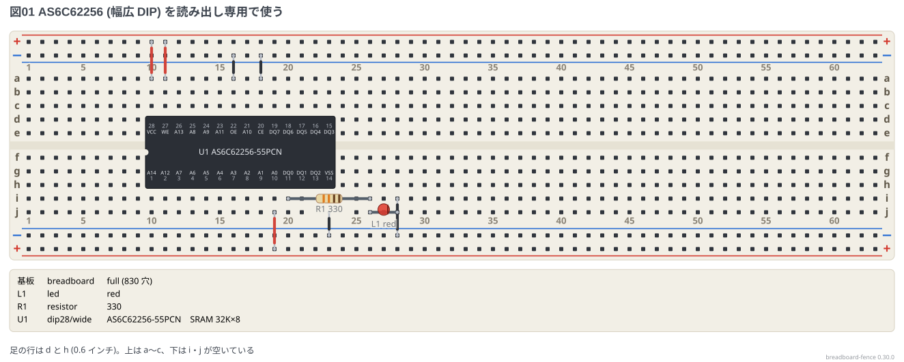

# 幅広 DIP (600 mil)

28 ピンの SRAM (AS6C62256-55PCN) や 40 ピンの CPU は、足の列の間が **0.6 インチ** の
幅広 DIP で、普通のブレッドボードの溝をまたいで挿す。0.3 インチの DIP (e 行と f 行) と
違って、足は **6 ピッチ離れた行の組** に入るので、種類に `/wide` を付けて置く
(`U1: dip28/wide @ d10`)。書き方の決まりは
[文法リファレンス](../docs/01-syntax.md) の「幅広 DIP」。

## SRAM を読み出し専用で使う

AS6C62256-55PCN (32K × 8 ビット) を、足の行 **d と h** に挿す。`@ d10` は胴の左端の列 (10 列) で、
1 番の `A14` が左下の h10、28 番の `VCC` が左上の d10 になる。

- `CE` と `OE` を GND につなぎ (常に選ばれて出力する)、`WE` を +5V につなぐと読み出し専用
- `A0` を +5V にして、番地 1 のデータの 1 ビット目 (`DQ0`) を、抵抗を通した LED に出す
- ほかの番地 (`A1`〜`A14`) は**浮かせない**。実際に使うときは GND か +5V につなぐ

```bread
title: 図01 AS6C62256 (幅広 DIP) を読み出し専用で使う
# 上のレール: 赤 = +5V、青 = GND。下のレールも同じ
board: full
parts:
  U1: dip28/wide @ d10 AS6C62256-55PCN
  R1: resistor i20 i26 330
  L1: led j26(A) j28(K) red
wires:
  - +t10 -- a10 red
  - +t11 -- a11 red
  - -t16 -- a16 black
  - -t18 -- a18 black
  - j23 -- -b23 black
  - j19 -- +b19 red
  - i28 -- -b28 black
notes:
  - text: 足の行は d と h (0.6 インチ)。上は a〜c、下は i・j が空いている
```



- 足の名前は表の `62256` から出る (`U1.OE` `U1.22` のどちらでも指せる)
- 胴の下 (e・f・g 行) には何も挿せない。d 行の足の上は a〜c、h 行の足の下は i・j が使える
- 足の行は b↔f・c↔g・d↔h・e↔i のどれでもよい。d↔h がおすすめ
