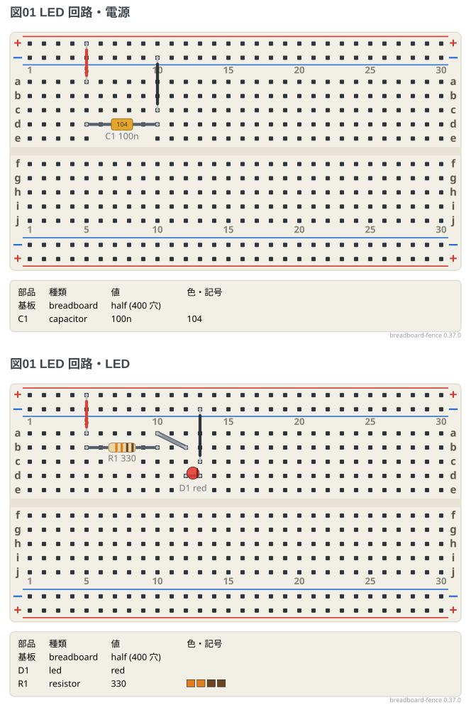

# 複数のブレッドボード (`sheets:`)

1 つのフェンスに**ブレッドボードを何枚でも**並べられる。回路が 1 枚に収まらないとき、
または段ごとに別のブレッドボードで組むとき (電源の段と LED の段、など) の書き方。

**枚ごとの書き方は 1 枚の図と同じ** (`board:` `points:` `parts:` `wires:` `notes:` `style:`)。
枚をまたぐ線は `links:` に**節点の名前** (`points:` に書いた名前) で書く。
線は図の脇を通して描き、基板を出た所に行き先の札 (`→ LED.+t`) を付ける。

```bread
title: 図01 LED 回路
board: half
sheets:
  - name: 電源
    parts:
      C1: capacitor a5 a10 100n
    wires:
      - +t5 -- a5 red
      - c10 -- -t10 black
  - name: LED
    parts:
      R1: resistor a5 a10 330
      D1: led b12(A) b13(K) red
    wires:
      - +t5 -- a5 red
      - a10 -- b12
      - c13 -- -t13 black
links:
  - 電源.+t LED.+t
  - 電源.-t LED.-t
```



- `name:` は枚の名前。**図の題にもなる** (`図01 LED 回路・電源 (1枚め)`)。題の末尾には必ず `(N枚め)` が付く。枚が `title:` を持てばそちらに付く
- 外側の `board:` `style:` は、枚が書かなかったときの既定。枚が自分で書けばそちらが勝つ
- `links:` は `枚の名前.節点の名前` を 2 つ以上並べる。ブレッドボードの電源レールは
  `+t` と `-t` の名前でネットリストに出るので、そのまま書ける。**ネットリストでは 1 つのネット**になる
- レールの線は**レールの左端の穴**から出る。色は + のレールは赤、- のレールは黒。ほかの線は末尾に色の名前を書ける
  (`- 電源.SIG LED.SIG yellow`)
- 1 つの図は 3 枚までを勧める (4 枚以上はお知らせが出る)
- 部品の名前 (`R1`) は図全体で 1 つ。枚をまたいで同じ名前を使うとエラーになる
