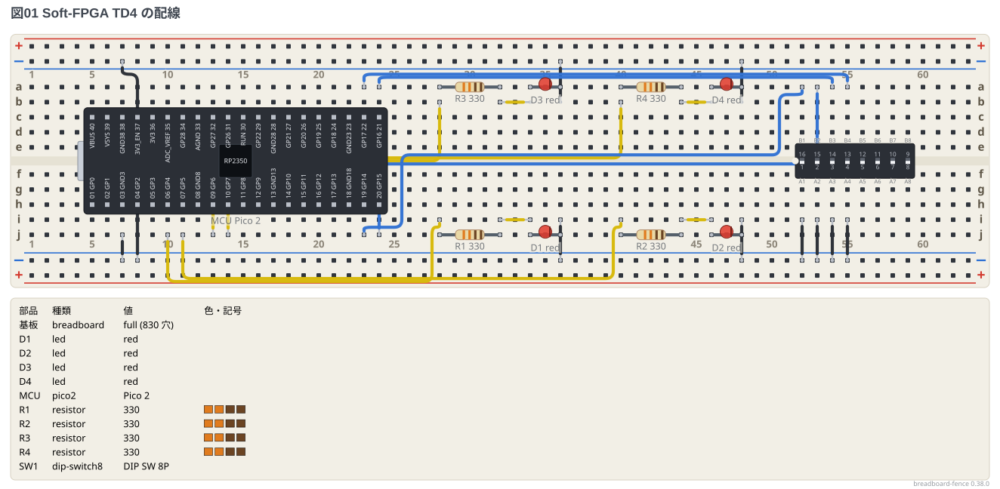

# Soft-FPGA TD4 (Pico 2 + DIP スイッチ + LED)

GitHub の [Soft-FPGA-TD4](https://github.com/tommie-jp/Soft-FPGA-TD4) (Verilog で書いた 4 ビット CPU
TD4 を Pico 2 の中で動かす) のブレッドボードを、このフェンスで描いたもの。
**入力は DIP スイッチ (8 連のうち 4 つ)、出力は LED 4 つ。** FPGA は要らない。

- IN_PORT: GP10〜GP13 ← DIP スイッチの 1〜4 番 (GP10 が最上位ビット)。反対のピンは GND。
  **プルアップ抵抗は要らない** (Pico 2 の内蔵プルアップを使う。スイッチを ON にするとピンは 0 で、
  `main.cpp` が反転して 1 と読む)
- OUT_PORT: GP2〜GP5 (GP2 が最上位ビット) → 330Ω → LED → GND

ピンの割り当ては Soft-FPGA-TD4 の `verilator-TD4/main.cpp` のとおり。

```bread
title: 図01 Soft-FPGA TD4 の配線
board: full
parts:
  MCU: pico2 @ g15
  # LED は左。抵抗は溝をまたいで縦に、LED は上の段。左端が最下位ビット
  R4: resistor g3 c3 330
  D4: led b3(A) b4(K) red
  R3: resistor g6 c6 330
  D3: led b6(A) b7(K) red
  R2: resistor g9 c9 330
  D2: led b9(A) b10(K) red
  R1: resistor g12 c12 330
  D1: led b12(A) b13(K) red
  # DIP スイッチは右。r180 で 1 番を右端に置き、使う 1〜4 番を Pico 2 の側に寄せる
  SW1: dip-switch8 @ e37 r180
wires:
  # 電源は USB から。GND をレールへ (上下のレールは 1 列でつなぐ)
  - j22 -- -b22 black
  - -t1 -- -b1 black
  # OUT_PORT: GP2 GP3 GP4 GP5 (GP2 が最上位ビット) → 抵抗 → LED → GND
  - h18 -- h12 yellow
  - i19 -- i9 yellow
  - j20 -- j6 yellow
  - j21 -- j3 yellow [v15]
  - a4 -- -t4 black
  - a7 -- -t7 black
  - a10 -- -t10 black
  - a13 -- -t13 black
  # IN_PORT: GP10 GP11 GP12 GP13 (GP10 が最上位ビット) ← DIP スイッチ 1〜4 番、反対のピンは GND
  - j28 -- j44 blue [v15]
  - j29 -- j43 blue
  - i30 -- i42 blue
  - h31 -- h41 blue
  - a41 -- -t41 black
  - a42 -- -t42 black
  - a43 -- -t43 black
  - a44 -- -t44 black
```



- `dip-switch8 @ e37 r180` は溝をまたぐ 16 ピンの DIP。`r180` で 1 番が右端 (列 44) に来るので、
  使う 1〜4 番が Pico 2 の側に寄る。**k 番のスイッチは同じ列の `e` と `f` の間の接点**
  (`A1`〜`A4` が `e44`〜`e41`、`B1`〜`B4` が `f44`〜`f41`)。使わない 5〜8 番 (列 40〜37) はそのまま空けておく
- 4 本の線は `h` `i` `j` の行に分け、一番外の 1 本だけ迂回ヒント `[v15]` で深く通す。
  こうすると線どうしが交差せず、レールにも乗らない
- 図の上でスイッチの ON / OFF は決まらない (接点は開いたまま。実物は ON の向きが品ごとに違う)
