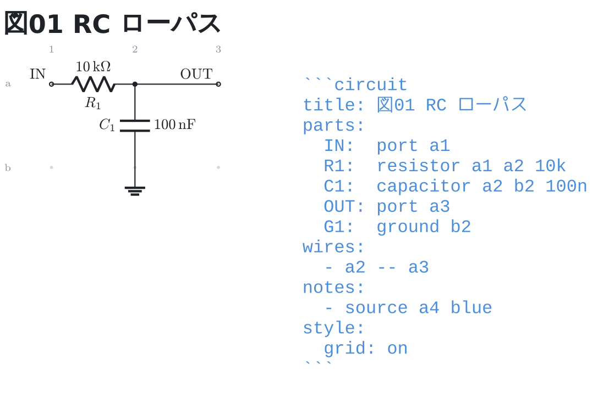
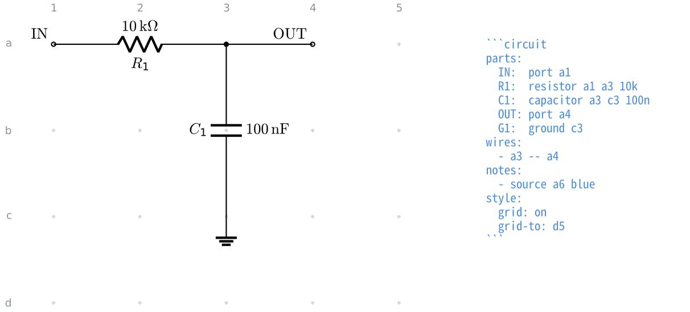
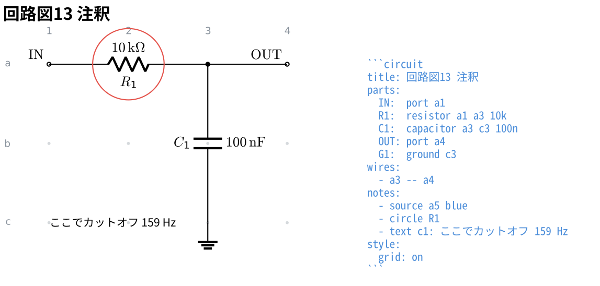
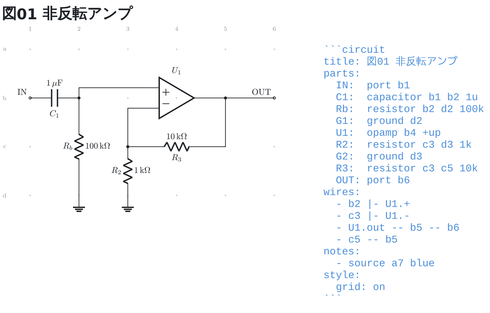

# Circuit Fence

Markdown の ` ```circuit ` フェンス (YAML) を回路図としてレンダリングする
VS Code 拡張機能。

```yaml
parts:
  IN:  port a1
  R1:  resistor a1 a3 10k
  C1:  capacitor a3 c3 100n
  OUT: port a4
  G1:  ground c3
wires:
  - a3 -- a4
```



座標計算も `\coordinate` も `\node[circ]` も書かない。
分岐の黒丸は自動で付く。

## なぜあるか

回路図をテキストで描く手段は枯れている (CircuiTikZ / Schemdraw / Lcapy)。
この拡張が張り合うのは 2 点だけ。

1. **位置を番地で直接書ける** — `R1: resistor a1 a3 10k` と書けば
   そこに置かれる。制約グラフもレイアウト用のダミーノードも要らない。
   図を直してもネットリストの節点名が動かない。
2. **間違いが行番号で返る** — 読めた部品は描き、読めなかった行は
   Markdown の行番号つきで図の下に出る。LLM に書かせて自己修正させるとき、
   ここが効く。

回路の解析 (伝達関数・過渡応答) が要るなら [Lcapy](https://lcapy.readthedocs.io/)
を使う。そこは張り合わない。

## 使い方

Markdown を開いてプレビュー (`Ctrl+Shift+V`) を出す。
書き方は [docs/syntax.md](docs/syntax.md)、
1 画面ぶんの早見表は [docs/cheatsheet.md](docs/cheatsheet.md)
(LLM に書かせるときはこの 1 枚を渡す)。

組んでいる間は `style: grid: on` にすると、部品を置ける位置が点で出る。
行は左に英字、列は上に数字で、ブレッドボードと同じ読み方。



色は既定でエディタに追従する (明るいテーマでも暗いテーマでも読める)。
`style: theme:` で `light` / `dark` / `mono` に決め打ちもできる。

`notes:` を書くと、図の上に印と字を重ねられる。部品を丸で囲む (`circle`)、
図の一角を枠で囲む (`box`)、指し棒を引く (`arrow`)、好きな番地に説明を書く
(`text`) の 4 つ。**注釈の字はプレビューでも日本語が出る**
(部品の値と違って、フェンスの TeX に字を渡していないため)。
字は大きさ (極小から極大まで 5 段)・寄せ・太字も選べる。

`- source 番地` は、**そのフェンスの中身をそのまま図に並べる**。プレビューでは
フェンスが図に差し替わって書いた YAML が見えなくなるので、図と並べて読める。



図は TeX (WASM) で描くので、LaTeX をインストールしなくてよい。
1 枚あたり 1 秒ほどかかり、描けるまで「図を描いています…」が出る。
描けた図は覚えておくので、2 度目からは待たない。

### コマンドラインから

```bash
node dist/cli.cjs render examples --out examples/out
```

1 枚につき `.tex` と `.svg` を書き出す。`.tex` は LaTeX にそのまま渡せる。
ネットリストは標準出力に出る。

図が要らないときは `check` で、読めなかった行とネットリストだけを出せる。
1 枚 1 秒の描画を待たないので、書きながら回すときと CI で使う。

```bash
node dist/cli.cjs check examples
```

日本語や単位が要る図は `--emit-tex` で、手元の xelatex 用の `.tex` を書き出す。

```bash
node dist/cli.cjs render notes.md --emit-tex --out tex
xelatex -output-directory tex tex/notes.tex
```

プレビューとの違いは 3 つだけ (日本語の値が通る・単位が siunitx で µF になる・
オペアンプが本物の記号になる)。番地も配線も同じなので、プレビューで位置を
確かめてから書き出せる。書き方は [docs/syntax.md](docs/syntax.md)。

処理系の版は `--version` で出せる。

```bash
node dist/cli.cjs --version
```

図に刻むなら `style: stamp: on` を書く。**字は書かない** — 番号は処理系が
埋めるので、更新すれば刻印も一緒に新しくなる。刻まない図にも、版は
`.svg` の根に `data-circuit-fence` として必ず入っている。

## 開発

```bash
npm install
npm run check      # 型チェック + テスト
npm run examples   # examples の図を作り直す (変えたら出力もコミットする)
./doBuild.sh       # .vsix を作って VS Code に入れ直す
```

設計上の約束と運用ルールは [CLAUDE.md](CLAUDE.md)。

## 状態

Phase 3。2 端子部品 40 種・1 端子の記号 4 種・多端子部品 29 種、
`--` / `-|` / `|-` の配線、足の参照 (`U1.out`)、分岐の黒丸、T 字の接続、
重なりの検出、`title:` (図の上の題)、`style:` (グリッド表示・テーマ・大きさ・版の刻印)、
`notes:` (印・枠・指し棒・字・フェンスの書き出し)、
`--emit-tex` での `.tex` 書き出しまで。


