# circuit フェンスの書き方

Markdown の ` ```circuit ` フェンスに YAML を書くと、Markdown プレビュー
(`Ctrl+Shift+V`) で回路図になる。

1 画面に収めた早見表は [02-cheatsheet.md](02-cheatsheet.md)
(LLM に書かせるときはこの 1 枚を渡す)。

各フェンスの直後には、そのフェンスを描いた図 ([out/](out/)) を貼ってある。
GitHub のようにフェンスが描画されない場所で、ソースと図を対で読むためのもの。
プレビューではフェンス自体が図になるので、同じ図が 2 回見える。
作り直しは `npm run docs`。

```circuit
title: 図01 circuit フェンスの書き方
parts:
  IN:  port 1,1
  R1:  resistor 1,1 2,1 10k
  C1:  capacitor 2,1 2,2 100n
  OUT: port 3,1
  G1:  ground 2,2
wires:
  - 2,1 -- 3,1
notes:
  - source 4,1 blue
style:
  grid: on
```

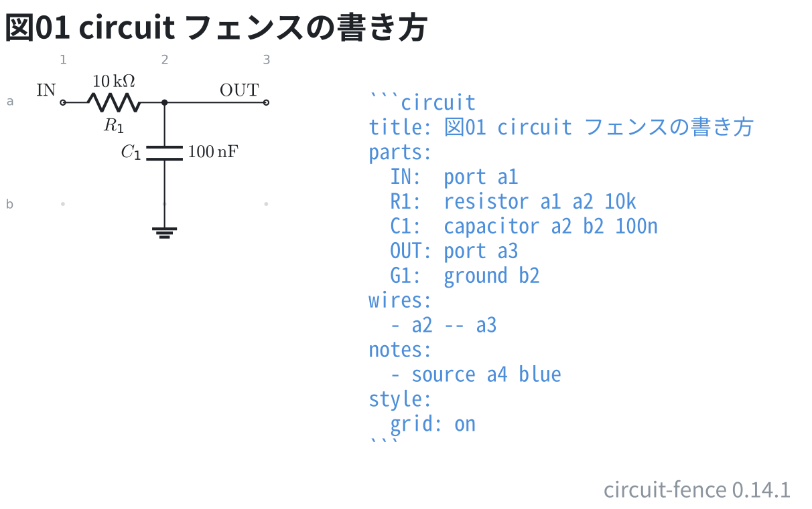

書けるのは `title:` と `points:` と `parts:` と `wires:` と `notes:` と `style:` の 6 つ。
ここに出てくる項目は 1 つずつ図にしてある ([../examples/README.md](../examples/README.md))。

## 番地

置く場所は**番地**で書く。座標も `\coordinate` も書かない。

- 番地は `x,y` = **列,行**。どちらも 1 始まりの数 (`1,1` が左上)
- 列は `1`〜`99` (左から右)、行は `1`〜`99` (上から下)
- **`,` の前後に空白を入れない** (部品の 1 行は空白で語を切るので、`1, 1` は 2 語に割れる)

グリッドの宣言は要らない。使った番地から図の大きさが決まる。
1 マスは 2cm 相当で、隣り合うマスの間に 2 端子部品が 1 個収まる。

番地は**数字で始まり `,` を含む**ので、部品 ID (`C1`)・ピン (`U1.5`)・値 (`4.7k`) と
字の形で分かれる。そのかわり、次の 2 つを守る。

- **値の欄に `,` を書かない。** `1,000` ではなく `1k` と書く (`,` を含む語は番地の形なので、断られる)
- **YAML のフロー形式 (`{ }` `[ ]`) では `,` が区切りになる。** 番地を書いた字は引用符で囲む
  (`parts: { R1: "resistor 1,1 3,1" }`、`wires: ["1,1 -- 3,1"]`)。囲み忘れると、
  割れた形を見つけて囲み方を返す。1 行ずつ書く形 (ブロック形式) なら囲まなくてよい

### 交点の間に置く

交点と交点の間に置きたいときは、**小数で書く**。小数は 2 桁 (1/100) まで。

```text
1.5,1     列が 1 と 2 の間 (行はずれ無し)
1,1.5     行が 1 と 2 の間 (列はずれ無し)
1.5,1.5   行も列も間
2,1.25    2,1 から行だけ 1/4 (0.25) 下
3,2.7     3,2 から行だけ 0.7 下
```

**同じ場所の綴りは 1 つ。** `2.50,1` や `02,1` は通さず、`2.5,1` と書くよう返す。
同じ場所の綴りが 2 つあると、ネットの名前も図どうしの突き合わせもその分だけ揺れる。

**旧い綴り (`a1` `a1f5`) は読まない。** 0.34.0 までは行を英字で書いていた。旧い綴りを書くと
`a1f5 は旧い綴りです。1.5,1.5 と書きます` と直した綴りを返す。まとめて書き直すには
`scripts/migrate-address.mjs` (または core の `migrateCircuitFences`) を使う。

グリッド (`grid: on`) の点は**交点の上にだけ**打つ。間に置いた部品は、
点と点の間に乗る。

間を使うのは、**後から割り込ませたいとき**が主。`1,1` `2,1` `3,1` と並べた図の
`1,1` と `2,1` の間に部品を足したくなっても、後ろを全部振り直さずに `1.5,1` で
割り込める。ただし**間隔が詰まると記号も詰まる** — 2 端子部品は 1 マス
(既定で 2cm) に 1 個収まる大きさなので、`1,1` と `1.5,1` の間に置いた部品は
半分の幅に押し込まれる。狭いと感じたら `style: pitch` でマスのほうを広げる。

## 番地に名前を付ける (`points:`)

`名前: 番地` を書くと、**番地を書ける場所ならどこでも**その名前で書ける。
書かなくてもよい (番地をそのまま書けば今までどおり)。

```circuit
title: 図02 番地に名前を付ける
points:
  vin: 1,1
  fb:  2,2
parts:
  IN: port vin
  R1: resistor vin 2,1
  C1: capacitor 2,1 fb
  G1: ground fb
notes:
  - source 3,1 blue
style:
  grid: on
```

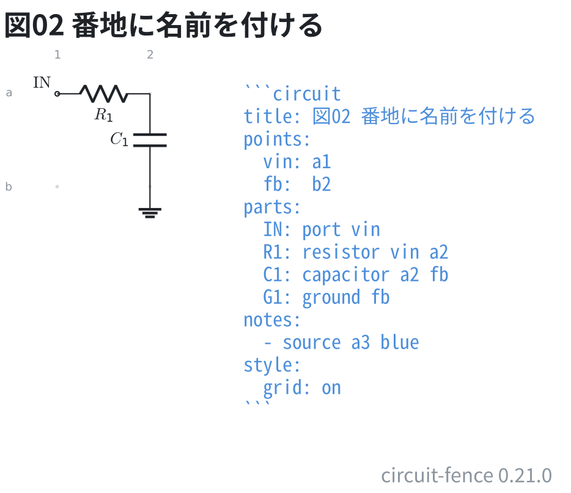

同じ節点を何か所からも指すとき、**動かすときに直すのは `points:` の 1 行だけ**
になる。番地を何か所にも書いていると、1 か所だけ直し忘れても図は描けてしまい、
つながり方が変わったことに気づけない。

`points:` は `parts:` より下に書いてもよい (YAML のマップに順はない)。

### 名前の決まり

- 使える字は部品 ID と同じ (英数字と `_` `-`)
- **番地の形は使えない** (`"1,1": 5,3`)。どちらの意味で書いたのかを読む順で
  決めることになり、書いた人には見えない。`A1` `P1` `C1` は番地ではないので使える
- **部品 ID と同じ名前も使えない**。注釈の指し先は部品 ID でも番地でも
  書けるので、同じ名前があるとどちらを指したのか決められない

知らない名前を書いたときは、その名前を使った行を行番号つきで返す。

### ネットリストに出る名前

名前の乗った節点は、ネットリストにその名前で出る。
ポートやグラウンドが乗っているネットは**そちらが勝つ** — 図に見えている
名前のほうが、図と突き合わせるときに探しやすい。

順は グラウンド (`GND`) → ポート・電源レール → `points:` の名前 → `N1` から連番。

**箱のピンは、図に刷ってある名前で出る** (`U1.GP0` `J1.VBUS` `M1.ECHO`。名前を
刷らない DIP・ピンヘッダ・SMA は番号で `U1.5` `J1.2`)。書き手が番号で指しても
名前で出るので、図と突き合わせられる。トランジスタ (`Q1.B`) やオペアンプ
(`U1.out`) のように箱でない記号のピンは、書いたピンの名前のまま出る。

## 部品 (`parts:`)

`ID: 種類 番地 …` の 1 行で書く。ID は図に出るラベルであり、
ネットリストで端子を指す名前でもある。

**名前は全部の種類で図に出る。** 2 端子は記号の下、多端子は**ピンの無い辺**
(トランジスタなら右、ゲートや IC なら上) に添える。出ないのは 2 つだけで、
どちらも回路図の決まりごと — 素の線 (`short`) は名札を掛ける記号が無く、
グラウンド (`ground`) には番号を振らない。

ピンの数で 3 通りに分かれる。**1 端子 → 2 端子 → 多端子**の順に並べてあり、
表の**部品番号は 112 種類の通し番号** (1 端子が 01〜04、2 端子が 05〜48、
多端子が 49〜100。あとから足した部品は 101 から順に振り、可変コンデンサが 108、アンテナが 109、イヤホンが 110、`ic` が 111、デュアルゲート MOSFET が 112)。番号は表と図を突き合わせるためのもので、
**フェンスには書かない** (書くのは種類の名前)。

### 1 端子の記号 — `ID: 種類 番地`

| 部品番号 | 種類 | 部品名 | 例 |
| --- | --- | --- | --- |
| 01 | `port` | 端子 (白丸 + 名前) | `IN: port 1,1` |
| 02 | `ground` | グラウンド | `G1: ground 3,3` |
| 03 | `vcc` | 電源レール (上向きの矢印 + 名前) | `VCC: vcc 1,1` |
| 04 | `vee` | 電源レール (下向きの矢印 + 名前) | `VEE: vee 4,3` |
| 109 | `antenna` | アンテナ | `ANT: antenna 1,1` |

`port` と `antenna`、`vcc` / `vee` は **ID がそのまま図に出て、乗っているネットの名前にもなる**
(`ground` は名前を出さず、ネットは `GND` になる)。

**`ground` だけは向きも書ける** (`G1: ground 3,3 r90`)。横から来た線に付けるときに
倒す。ほかの 4 つは上下がその記号の意味なので書けない
([回す・裏返す](#回す裏返す--r90-r180-r270-mirror))。

**この 4 つだけは同じ名前を何度でも書ける。** `VCC` を何か所にも描くのは回路図の
書き方そのもので、**同じ名前どうしは離して描いても同じ節点**として数える。
ほかの部品の ID は配線から指すための名前なので、重なると指せなくなる
(`R1` を 2 つ書けば今までどおり「二重に定義されています」と言う)。

```yaml
parts:
  VCC: vcc 1,1     # 図には VCC が 2 つ出て、
  VCC: vcc 1,5     # ネットは 1 つ (VCC)
  R1:  resistor 1,1 3,1
  R2:  resistor 1,5 3,5
```

**名前が違えば結ばない。** `5V` と `3V3` を書き分けたなら別のネットのままで、
つなぐなら配線を引く。グラウンドだけは名前を出さないので、**種類が同じなら**
離して描いても 1 つの節点として数える。

**電源レールには電圧を書ける** (`VCC: vcc 1,1 5V`)。図には ID の代わりに符号付きの電圧
(`vcc` は `+5V`、`vee` は `−5V`) が出て、**ネットの名前は ID のまま** (`VCC`)。
電圧は単位の `V` まで書く (`5V` `3.3V`。素の `5` は断る)。書けるのは `vcc` と `vee` だけ。

```yaml
parts:
  VCC: vcc 1,1 5V  # 図には +5V、ネットは VCC
  VEE: vee 1,5 5V  # 図には −5V、ネットは VEE
```

```circuit
title: 図03 1 端子の記号
parts:
  IN:  port 3,2
  G1:  ground 6,2
  VCC: vcc 9,2
  VEE: vee 12,2
notes:
  - line 1.5,1.1 13.5,1.1 ink
  - line 1.5,3.1 13.5,3.1 ink
  - line 1.5,1.1 1.5,3.1 ink
  - line 4.5,1.1 4.5,3.1 ink
  - line 7.5,1.1 7.5,3.1 ink
  - line 10.5,1.1 10.5,3.1 ink
  - line 13.5,1.1 13.5,3.1 ink
  - text 3,1.4 blue center: 01 端子
  - text 3,2.7 blue center: "IN: port b3"
  - text 6,1.4 blue center: 02 グラウンド
  - text 6,2.7 blue center: "G1: ground b6"
  - text 9,1.4 blue center: 03 電源レール (+)
  - text 9,2.7 blue center: "VCC: vcc b9"
  - text 12,1.4 blue center: 04 電源レール (-)
  - text 12,2.7 blue center: "VEE: vee b12"
style:
  grid: off
```

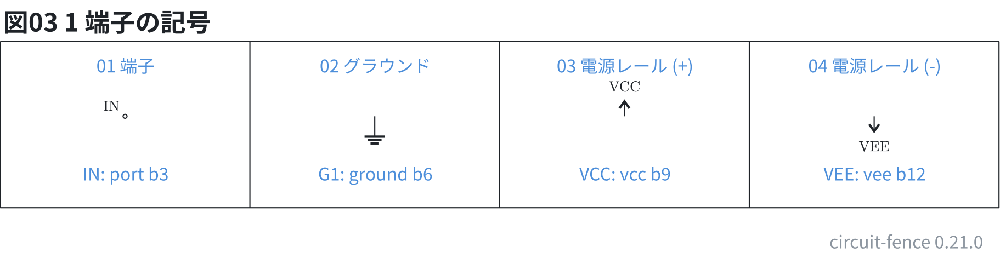

### 2 端子部品 — `ID: 種類 番地 番地 [値] [l=字] [i=字] [v=字]`

| 部品番号 | 種類 | 部品名 | 値の単位 | 例 |
| --- | --- | --- | --- | --- |
| 05 | `resistor` | 抵抗 | Ω | `R1: resistor 1,1 3,1 10k` |
| 06 | `resistor-var` | 可変抵抗 (2 端子) | Ω | `R2: resistor-var 1,1 3,1 10k` |
| 07 | `potentiometer` | ポテンショメータ (3 端子) | Ω | `P1: potentiometer 1,2 5,2 10k` |
| 08 | `capacitor` | コンデンサ | F | `C1: capacitor 3,1 3,3 100n` |
| 09 | `ecap` | 電解コンデンサ | F | `C2: ecap 5,1 5,3 100u` |
| 10 | `varicap` | バリキャップ | F | `D4: varicap 5,1 7,1 33p` |
| 11 | `inductor` | コイル | H | `L1: inductor 5,1 7,1 10m` |
| 12 | `photoresistor` | CdS セル | Ω | `R3: photoresistor 13,1 15,1` |
| 13 | `thermistor` | サーミスタ | Ω | `R4: thermistor 1,3 3,3 10k` |
| 14 | `thermistor-ntc` | NTC サーミスタ | Ω | `R5: thermistor-ntc 5,3 7,3 10k` |
| 15 | `thermistor-ptc` | PTC サーミスタ | Ω | `R6: thermistor-ptc 9,3 11,3` |
| 16 | `varistor` | バリスタ | (型番) | `R7: varistor 13,3 15,3 470V` |
| 17 | `crystal` | 水晶振動子 | Hz | `X1: crystal 9,1 11,1 16M` |
| 18 | `diode` | ダイオード | (型番) | `D1: diode 1,3 3,3 1N4148` |
| 19 | `led` | LED | (型番) | `D2: led 5,3 7,3` |
| 20 | `zener` | ツェナー | (型番) | `D3: zener 9,3 11,3 5V1` |
| 21 | `schottky` | ショットキー | (型番) | `D5: schottky 1,5 3,5 1N5819` |
| 22 | `photodiode` | フォトダイオード | (型番) | `D6: photodiode 5,5 7,5` |
| 23 | `diac` | ダイアック | (型番) | `D7: diac 9,5 11,5` |
| 24 | `thyristor` | サイリスタ (SCR) | (型番) | `T1: thyristor 1,4 5,4` |
| 25 | `triac` | トライアック | (型番) | `T2: triac 1,6 5,6` |
| 26 | `vsource` | 直流電源 | V | `V1: vsource 1,5 3,5 5` |
| 27 | `sine` | 交流電源 (正弦波) | V | `V2: sine 5,5 7,5 1` |
| 28 | `square` | 方形波電源 | V | `V3: square 13,5 15,5 5` |
| 29 | `triangle` | 三角波電源 | V | `V4: triangle 1,7 3,7 1` |
| 30 | `isource` | 定電流源 | A | `I1: isource 9,5 11,5 20m` |
| 31 | `battery` | 電池 | V | `B1: battery 1,7 3,7 9` |
| 32 | `solar` | 太陽電池 | V | `PV1: solar 5,7 7,7 0.6` |
| 33 | `switch` | スイッチ (a 接点) | (なし) | `S1: switch 5,7 7,7` |
| 34 | `switch-nc` | スイッチ (b 接点) | (なし) | `S2: switch-nc 9,7 11,7` |
| 35 | `button` | 押しボタン (a 接点) | (なし) | `S3: button 13,7 15,7` |
| 36 | `button-nc` | 押しボタン (b 接点) | (なし) | `S4: button-nc 1,9 3,9` |
| 37 | `reed` | リードスイッチ | (なし) | `S5: reed 5,9 7,9` |
| 38 | `fuse` | ヒューズ | (定格) | `F1: fuse 9,7 11,7 3A` |
| 39 | `lamp` | ランプ | (なし) | `P1: lamp 1,9 3,9` |
| 40 | `speaker` | スピーカー | (なし) | `LS1: speaker 9,9 11,9` |
| 41 | `mic` | マイク | (なし) | `MK1: mic 13,9 15,9` |
| 42 | `ammeter` | 電流計 | (なし) | `A1: ammeter 1,11 3,11` |
| 43 | `voltmeter` | 電圧計 | (なし) | `V5: voltmeter 5,11 7,11` |
| 44 | `ohmmeter` | 抵抗計 | (なし) | `M1: ohmmeter 9,11 11,11` |
| 45 | `wattmeter` | 電力計 | (なし) | `W1: wattmeter 13,11 15,11` |
| 46 | `galvanometer` | 検流計 | (なし) | `G1: galvanometer 1,13 3,13` |
| 47 | `detector` | 検出器 (交流ブリッジ) | (なし) | `D8: detector 5,13 7,13` |
| 48 | `short` | 素の線 (記号なし) | (なし) | `SH1: short 1,1 3,1 i=I` |
| 101 | `motor` | モータ | (なし) | `M1: motor 1,1 3,1` |
| 107 | `tline` | 伝送線路 | 特性インピーダンス (Ω) | `TL1: tline 1,1 5,1 50` |
| 108 | `capacitor-var` | 可変コンデンサ (バリコン) | F | `VC1: capacitor-var 3,1 3,3` |
| 110 | `earphone` | イヤホン (クリスタルイヤホン) | (なし) | `EAR: earphone 9,1 9,3 l=$\mathrm{EAR}$` |
| 114 | `ferrite-bead` | フェライトビーズ | (型番) | `FB1: ferrite-bead 1,1 3,1 BL02RN2` |

```circuit
title: 図04 2 端子部品
parts:
  R1:  resistor 2,2 4,2 10k
  R2:  resistor-var 5,2 7,2 10k
  P2:  potentiometer 8,2 10,2 10k
  C1:  capacitor 11,2 13,2 100n
  C2:  ecap 2,4 4,4 100u
  D4:  varicap 5,4 7,4 33p
  L1:  inductor 8,4 10,4 10m
  R3:  photoresistor 11,4 13,4
  R4:  thermistor 2,6 4,6 10k
  R5:  thermistor-ntc 5,6 7,6 10k
  R6:  thermistor-ptc 8,6 10,6
  R7:  varistor 11,6 13,6 470V
  X1:  crystal 2,8 4,8 16M
  D1:  diode 5,8 7,8 1N4148
  D2:  led 8,8 10,8
  D3:  zener 11,8 13,8 5V1
  D5:  schottky 2,10 4,10 1N5819
  D6:  photodiode 5,10 7,10
  D7:  diac 8,10 10,10
  T1:  thyristor 11,10 13,10
  T2:  triac 2,12 4,12
  V1:  vsource 5,12 7,12 5
  V2:  sine 8,12 10,12 1
  V3:  square 11,12 13,12 5
  V4:  triangle 2,14 4,14 1
  I1:  isource 5,14 7,14 20m
  B1:  battery 8,14 10,14 9
  PV1: solar 11,14 13,14 0.6
  S1:  switch 2,16 4,16
  S2:  switch-nc 5,16 7,16
  S3:  button 8,16 10,16
  S4:  button-nc 11,16 13,16
  S5:  reed 2,18 4,18
  F1:  fuse 5,18 7,18 3A
  P1:  lamp 8,18 10,18
  LS1: speaker 11,18 13,18
  MK1: mic 2,20 4,20
  A1:  ammeter 5,20 7,20
  V5:  voltmeter 8,20 10,20
  M1:  ohmmeter 11,20 13,20
  W1:  wattmeter 2,22 4,22
  G1:  galvanometer 5,22 7,22
  D8:  detector 8,22 10,22
notes:
  - line 1.5,1.1 13.5,1.1 ink
  - line 1.5,3.1 13.5,3.1 ink
  - line 1.5,5.1 13.5,5.1 ink
  - line 1.5,7.1 13.5,7.1 ink
  - line 1.5,9.1 13.5,9.1 ink
  - line 1.5,11.1 13.5,11.1 ink
  - line 1.5,13.1 13.5,13.1 ink
  - line 1.5,15.1 13.5,15.1 ink
  - line 1.5,17.1 13.5,17.1 ink
  - line 1.5,19.1 13.5,19.1 ink
  - line 1.5,21.1 13.5,21.1 ink
  - line 1.5,23.1 13.5,23.1 ink
  - line 1.5,1.1 1.5,23.1 ink
  - line 4.5,1.1 4.5,23.1 ink
  - line 7.5,1.1 7.5,23.1 ink
  - line 10.5,1.1 10.5,23.1 ink
  - line 13.5,1.1 13.5,23.1 ink
  - text 3,1.4 blue center: 05 抵抗
  - text 3,2.7 blue center: "R1: resistor b2 b4 10k"
  - text 6,1.4 blue center: 06 可変抵抗
  - text 6,2.7 blue center: "R2: resistor-var b5 b7 10k"
  - text 9,1.4 blue center: 07 ポテンショメータ
  - text 9,2.7 blue center: "P2: potentiometer b8 b10 10k"
  - text 12,1.4 blue center: 08 コンデンサ
  - text 12,2.7 blue center: "C1: capacitor b11 b13 100n"
  - text 3,3.4 blue center: 09 電解コンデンサ
  - text 3,4.7 blue center: "C2: ecap d2 d4 100u"
  - text 6,3.4 blue center: 10 バリキャップ
  - text 6,4.7 blue center: "D4: varicap d5 d7 33p"
  - text 9,3.4 blue center: 11 コイル
  - text 9,4.7 blue center: "L1: inductor d8 d10 10m"
  - text 12,3.4 blue center: 12 CdS セル
  - text 12,4.7 blue center: "R3: photoresistor d11 d13"
  - text 3,5.4 blue center: 13 サーミスタ
  - text 3,6.7 blue center: "R4: thermistor f2 f4 10k"
  - text 6,5.4 blue center: 14 NTC サーミスタ
  - text 6,6.7 blue center: "R5: thermistor-ntc f5 f7 10k"
  - text 9,5.4 blue center: 15 PTC サーミスタ
  - text 9,6.7 blue center: "R6: thermistor-ptc f8 f10"
  - text 12,5.4 blue center: 16 バリスタ
  - text 12,6.7 blue center: "R7: varistor f11 f13 470V"
  - text 3,7.4 blue center: 17 水晶振動子
  - text 3,8.7 blue center: "X1: crystal h2 h4 16M"
  - text 6,7.4 blue center: 18 ダイオード
  - text 6,8.7 blue center: "D1: diode h5 h7 1N4148"
  - text 9,7.4 blue center: 19 LED
  - text 9,8.7 blue center: "D2: led h8 h10"
  - text 12,7.4 blue center: 20 ツェナー
  - text 12,8.7 blue center: "D3: zener h11 h13 5V1"
  - text 3,9.4 blue center: 21 ショットキー
  - text 3,10.7 blue center: "D5: schottky j2 j4 1N5819"
  - text 6,9.4 blue center: 22 フォトダイオード
  - text 6,10.7 blue center: "D6: photodiode j5 j7"
  - text 9,9.4 blue center: 23 ダイアック
  - text 9,10.7 blue center: "D7: diac j8 j10"
  - text 12,9.4 blue center: 24 サイリスタ
  - text 12,10.7 blue center: "T1: thyristor j11 j13"
  - text 3,11.4 blue center: 25 トライアック
  - text 3,12.7 blue center: "T2: triac l2 l4"
  - text 6,11.4 blue center: 26 直流電源
  - text 6,12.7 blue center: "V1: vsource l5 l7 5"
  - text 9,11.4 blue center: 27 交流電源
  - text 9,12.7 blue center: "V2: sine l8 l10 1"
  - text 12,11.4 blue center: 28 方形波電源
  - text 12,12.7 blue center: "V3: square l11 l13 5"
  - text 3,13.4 blue center: 29 三角波電源
  - text 3,14.7 blue center: "V4: triangle n2 n4 1"
  - text 6,13.4 blue center: 30 定電流源
  - text 6,14.7 blue center: "I1: isource n5 n7 20m"
  - text 9,13.4 blue center: 31 電池
  - text 9,14.7 blue center: "B1: battery n8 n10 9"
  - text 12,13.4 blue center: 32 太陽電池
  - text 12,14.7 blue center: "PV1: solar n11 n13 0.6"
  - text 3,15.4 blue center: 33 スイッチ
  - text 3,16.7 blue center: "S1: switch p2 p4"
  - text 6,15.4 blue center: 34 b 接点スイッチ
  - text 6,16.7 blue center: "S2: switch-nc p5 p7"
  - text 9,15.4 blue center: 35 押しボタン
  - text 9,16.7 blue center: "S3: button p8 p10"
  - text 12,15.4 blue center: 36 b 接点ボタン
  - text 12,16.7 blue center: "S4: button-nc p11 p13"
  - text 3,17.4 blue center: 37 リードスイッチ
  - text 3,18.7 blue center: "S5: reed r2 r4"
  - text 6,17.4 blue center: 38 ヒューズ
  - text 6,18.7 blue center: "F1: fuse r5 r7 3A"
  - text 9,17.4 blue center: 39 ランプ
  - text 9,18.7 blue center: "P1: lamp r8 r10"
  - text 12,17.4 blue center: 40 スピーカー
  - text 12,18.7 blue center: "LS1: speaker r11 r13"
  - text 3,19.4 blue center: 41 マイク
  - text 3,20.7 blue center: "MK1: mic t2 t4"
  - text 6,19.4 blue center: 42 電流計
  - text 6,20.7 blue center: "A1: ammeter t5 t7"
  - text 9,19.4 blue center: 43 電圧計
  - text 9,20.7 blue center: "V5: voltmeter t8 t10"
  - text 12,19.4 blue center: 44 抵抗計
  - text 12,20.7 blue center: "M1: ohmmeter t11 t13"
  - text 3,21.4 blue center: 45 電力計
  - text 3,22.7 blue center: "W1: wattmeter v2 v4"
  - text 6,21.4 blue center: 46 検流計
  - text 6,22.7 blue center: "G1: galvanometer v5 v7"
  - text 9,21.4 blue center: 47 検出器
  - text 9,22.7 blue center: "D8: detector v8 v10"
style:
  grid: off
```

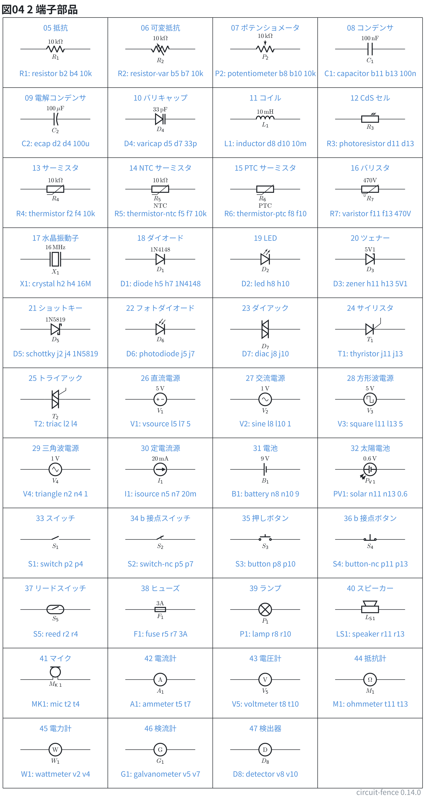

記号の上が部品番号と部品名、下が**その記号を出すために書いた 1 行そのもの**
([注釈](#注釈-notes) で重ねてある)。番号は上の表と同じ順で、
表と図を突き合わせるためのもの (フェンスには書かない)。

### 向きのある部品は、先に書いた番地が + 側

極性や向きのある 2 端子部品は、**先に書いた番地が + 側 (アノード)**。
覚えることはこれ 1 つで、記号ごとの例外はない。

| 種類 | 先に書いた番地が |
| --- | --- |
| `ecap` | + 側 (記号の平らな基板のほう) |
| `vsource` / `battery` / `solar` | + 側 |
| `diode` / `led` / `zener` / `schottky` / `photodiode` / `varicap` | アノード (三角形の底のほう) |
| `thyristor` | アノード |
| `isource` | 電流の**出どころ** (矢はここから後に書いた番地へ向く) |

`C2: ecap 5,1 5,3` なら 5,1 が +、`D1: diode 1,3 3,3` なら 1,3 がアノード。
逆に付けたいときは番地を入れ替えて書く。

`diac` と `triac` は向きのない部品なので、どちらに書いても同じ図になる。
交流電源 (`sine` / `square` / `triangle`) も同じ。

太陽電池 (`solar`) だけは circuitikz が電池と逆向きに描くので、
**こちらで向きを揃えている** (フェンスでも書き出す `.tex` でも + は先の番地)。

circuitikz の記号をそのまま使わず、**回路図の慣習の形に寄せている**ものが 4 つある。

- **丸い電源** (`vsource` / `sine` / `square` / `triangle`) — circuitikz は
  丸の中身を**縦置き前提で 90 度回して**描くので、横に引くと − が縦棒になり、
  波形も縦に寝る。丸だけの記号にして、+ と − や波形は自分で描いている。
  **波形は図に対していつも水平**なので、縦にも斜めにも置ける
- **計器 6 つ** (`ammeter` / `voltmeter` / `ohmmeter` / `wattmeter` / `galvanometer` / `detector`) — **丸に字だけ**で描く。
  circuitikz の電流計・電圧計は丸に指針の矢が入り、抵抗計は Ω が太字の数式で
  フォントが無くて**プロセスごと落ちる**。矢の無い記号に字を渡して 6 つ揃えた
- **伝送線路** (`tline`) — 円筒の記号 (circuitikz の `TL`)。値は特性インピーダンスで、
  抵抗と同じく Ω を補う。マイクロストリップや同軸を 1 本の線路として描く
  (copper フェンスの例の等価回路)。ブレッドボードとユニバーサル基板には無い — 線路は銅の形で、部品ではない
- **モータ** (`motor`) — 計器と同じ**丸に M**。circuitikz 1.0 のモータの記号
  (`elmech`) は書いても素の線しか描かないので使わない。図は下の図04 に無い
  (あとから足した)。[例の図](../examples/02-parts.md#モータ) を見る
- **可変抵抗** (`resistor-var`)・**可変コンデンサ** (`capacitor-var`) — 矢は
  **どう置いても右上を向く**。circuitikz は矢を記号と一緒に回すので、置いた向き
  (左右・上下。斜めは近いほう) ごとに返している。返し方はプレビューと書き出しで
  違うが、出る図は同じ。可変コンデンサはポリバリコン・トリマの記号で、
  バリキャップ (`varicap`、可変容量ダイオード) とは別物。図は下の図04 に無い
  (あとから足した)。[例の図](../examples/02-parts.md#可変コンデンサ) を見る
- **NTC / PTC サーミスタ** — 記号の中の θ が小さすぎて字形が無く `#` で出る。
  素のサーミスタの記号にして、**区別は ID の下に字で書く**

`transformer` は**鉄芯つき**の記号で描く (circuitikz の既定は空芯)。
ピンの指し方は変わらない。

### 2 端子でもピンを持つもの

ポテンショメータのワイパーと、サイリスタ・トライアックのゲートは、
**両端を番地で置いたうえで 3 本目を名前で指す**。書き方は 2 端子部品のままで、
ピンだけ `P1.w` `T1.g` のように呼ぶ。

| 種類 | ピン |
| --- | --- |
| `potentiometer` | `w` (`wiper`) |
| `thyristor` / `triac` | `g` (`gate`) |

```circuit
title: 図05 3 本目の足を持つ 2 端子部品
parts:
  P1: potentiometer 2,3 4,3 10k
  T1: thyristor 5,3 7,3
  T2: triac 8,3 10,3
wires:
  - P1.w -- 3,2
  - T1.g |- 6,2
  - T2.g |- 9,2
notes:
  - line 1.5,1.1 10.5,1.1 ink
  - line 1.5,5.1 10.5,5.1 ink
  - line 1.5,1.1 1.5,5.1 ink
  - line 4.5,1.1 4.5,5.1 ink
  - line 7.5,1.1 7.5,5.1 ink
  - line 10.5,1.1 10.5,5.1 ink
  - text 3,1.4 blue center: 07 ポテンショメータ
  - text 3,4.7 blue center: "P1: potentiometer c2 c4 10k"
  - text 6,1.4 blue center: 24 サイリスタ
  - text 6,4.7 blue center: "T1: thyristor c5 c7"
  - text 9,1.4 blue center: 25 トライアック
  - text 9,4.7 blue center: "T2: triac c8 c10"
style:
  grid: off
```

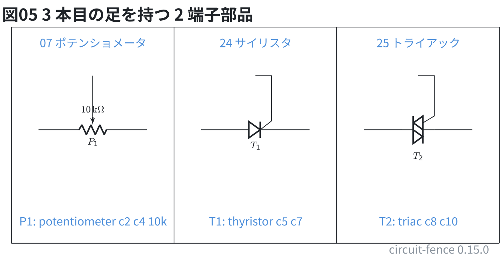

ワイパーは記号の**真上**に出るので、そのまま `--` で上の番地へ引ける。
ゲートは横にずれた位置にあるので、ほかのピンと同じく `|-` で直角に入れる。

### 多端子部品 — `ID: 種類 番地 [向き] [型番]`

1 つの番地に記号を置き、ピンは名前で指す (`Q1.B` `U1.out`)。

| 部品番号 | 種類 | 部品名 | ピンの名前 |
| --- | --- | --- | --- |
| 49 | `npn` | バイポーラトランジスタ (NPN) | `B` `C` `E` (`base` `collector` `emitter`) |
| 50 | `pnp` | バイポーラトランジスタ (PNP) | `B` `C` `E` |
| 51 | `nigbt` | IGBT (N チャネル) | `G` `C` `E` (制御端子はゲート) |
| 52 | `pigbt` | IGBT (P チャネル) | `G` `C` `E` |
| 53 | `nmos` | MOSFET (N・簡易記号) | `G` `D` `S` (`gate` `drain` `source`) |
| 54 | `pmos` | MOSFET (P・簡易記号) | `G` `D` `S` |
| 55 | `njfet` | 接合型 FET (N) | `G` `D` `S` |
| 56 | `pjfet` | 接合型 FET (P) | `G` `D` `S` |
| 57 | `nmos-e` | MOSFET (N・エンハンスメント型) | `G` `D` `S` |
| 58 | `pmos-e` | MOSFET (P・エンハンスメント型) | `G` `D` `S` |
| 59 | `nmos-d` | MOSFET (N・デプレッション型) | `G` `D` `S` |
| 60 | `pmos-d` | MOSFET (P・デプレッション型) | `G` `D` `S` |
| 61 | `opamp` | オペアンプ | `+` `-` `out` |
| 62 | `transformer` | トランス | `A1` `A2` (1 次) / `B1` `B2` (2 次) |
| 63 | `and` | AND ゲート | `a` `b` (`1` `2`) / `out` |
| 64 | `or` | OR ゲート | `a` `b` / `out` |
| 65 | `nand` | NAND ゲート | `a` `b` / `out` |
| 66 | `nor` | NOR ゲート | `a` `b` / `out` |
| 67 | `xor` | XOR ゲート | `a` `b` / `out` |
| 68 | `xnor` | XNOR ゲート | `a` `b` / `out` |
| 69 | `not` | NOT ゲート | `in` / `out` |
| 70 | `buffer` | バッファ | `in` / `out` |
| 71 | `spdt` | 切り替えスイッチ | `in` (`c`) / `1` `2` |
| 72 | `slide-switch` | スライドスイッチ | 同上 (記号も同じ) |
| 73 | `dip4` | DIP の IC (4 ピン) | `1` 〜 `4` |
| 74 | `dip6` | DIP の IC (6 ピン) | `1` 〜 `6` |
| 75 | `dip8` | DIP の IC (8 ピン) | `1` 〜 `8` |
| 76 | `dip14` | DIP の IC (14 ピン) | `1` 〜 `14` |
| 77 | `dip16` | DIP の IC (16 ピン) | `1` 〜 `16` |
| 78 | `dip18` | DIP の IC (18 ピン) | `1` 〜 `18` |
| 79 | `dip20` | DIP の IC (20 ピン) | `1` 〜 `20` |
| 80 | `dip24` | DIP の IC (24 ピン) | `1` 〜 `24` |
| 81 | `dip28` | DIP の IC (28 ピン) | `1` 〜 `28` |
| 82 | `dip40` | DIP の IC (40 ピン) | `1` 〜 `40` |
| 83 | `buzzer` | ブザー | (2 端子) |
| 84 | `sma` | SMA コネクタ | `1` (`core`) / `2` (`gnd`) |
| 85 | `regulator` | 三端子レギュレータ | `in` (`1`) / `gnd` (`2`) / `out` (`3`) |
| 86 | `sip2` | ピンヘッダ (2 ピン) | `1` 〜 `2` |
| 87 | `sip3` | ピンヘッダ (3 ピン) | `1` 〜 `3` |
| 88 | `sip4` | ピンヘッダ (4 ピン) | `1` 〜 `4` |
| 89 | `sip5` | ピンヘッダ (5 ピン) | `1` 〜 `5` |
| 90 | `sip6` | ピンヘッダ (6 ピン) | `1` 〜 `6` |
| 91 | `sip8` | ピンヘッダ (8 ピン) | `1` 〜 `8` |
| 92 | `sip10` | ピンヘッダ (10 ピン) | `1` 〜 `10` |
| 93 | `sip20` | ピンヘッダ (20 ピン) | `1` 〜 `20` |
| 94 | `sip40` | ピンヘッダ (40 ピン) | `1` 〜 `40` |
| 95 | `usb-a` | USB Type-A コネクタ | `VBUS` `GND` `D+` `D-` (`1` 〜 `4`) |
| 96 | `usb-c` | USB Type-C コネクタ | `VBUS` `GND` `D+` `D-` `CC1` `CC2` (`1` 〜 `6`) |
| 97 | `pico` | Pico | `GP0` 〜 `VBUS` (実物の印字) |
| 98 | `pico-w` | Pico W | 同上 |
| 99 | `pico2` | Pico 2 | 同上 |
| 100 | `pico2-w` | Pico 2 W | 同上 |
| 117 | `tang-nano-9k` | Tang Nano 9K | `IO38` 〜 `IO63` と `3V3` `GND` `5V` (Sipeed のピン配置図の FPGA のピン番号に `IO`。`IO79`〜`IO86` は 1.8 V) |
| 102 | `relay` | リレー | `A1` `A2` / `COM1` `NC1` `NO1` / `COM2` `NC2` `NO2` (DIP の番号でも可) |
| 103 | `photocoupler` | フォトカプラ | `A` `K` / `C` `E` (`1` 〜 `4`) |
| 118 | `photocoupler6` | フォトカプラ | 4N35 (DIP6)。`A` `K` / `C` `E` (DIP の番号は `1` `2` / `5` `4`。NC (3) とベース (6) は描かない) |
| 104 | `seg7` | 7 セグメント LED | `a` 〜 `g` `dp` `COM1` `COM2` (`1` 〜 `10`) |
| 105 | `phototransistor` | フォトトランジスタ | `C` / `E` (B は無い) |
| 106 | `ic3` | 3 ピンの IC | `1` (左) / `2` (下) / `3` (右)。マップ形式の `pins:` で名前を付けられる |
| 111 | `ic` | IC (ピンを働きで並べた箱) | 型番の印字の名前 (`TRIG` `THRES` …) か番号 (`1` 〜 本数)。`dipNN` と同じ |
| 112 | `nmos-dg` | デュアルゲート MOSFET (N) | `G1` `G2` `D` `S` (`gate1` `gate2` `drain` `source` でも。`G` だけは断る) |
| 113 | `ceramic-filter` | セラミックフィルタ | `IN` (左) / `GND` (下) / `OUT` (右)。番号の `1` `2` `3` でも。略記 `cfilter` |
| 115 | `dip-switch4` | DIP スイッチ | `A1` 〜 `A4` / `B1` 〜 `B4` (`1` 〜 `8` でも可) |
| 116 | `dip-switch8` | DIP スイッチ | `A1` 〜 `A8` / `B1` 〜 `B8` (`1` 〜 `16` でも可) |

FET は**ピンの名前がどれも同じ**なので、記号だけ後から差し替えられる。
`nmos` / `pmos` はチャネルを 1 本で描いた簡易記号で、記事でよく使うのは
こちら。書き分けたいときだけ `-e` (エンハンスメント型。チャネルが切れる) と
`-d` (デプレッション型。チャネルがつながる) を使う。

どの FET にも矢が入るので、n 形か p 形かは矢の向きで読める。ただし
**矢の意味は 2 通りあり、n 形でも向きが揃わない**。接合型のゲートの矢と
`-e` / `-d` の基板の矢は **pn 接合の向き** (P から N へ) なので n が内を向き、
簡易記号 `nmos` / `pmos` のソースの矢は**電流の向き** (バイポーラのエミッタと
同じ読み方) なので n が外を向く。簡易記号は p にゲートの丸も付く。

```circuit
title: 図06 FET の記号
parts:
  J1: njfet 3,3
  J2: pjfet 6,3
  M1: nmos-e 9,3
  M2: pmos-e 3,7
  M3: nmos-d 6,7
  M4: pmos-d 9,7
wires:
  - 3,2 -| J1.D
  - 3,4 -| J1.S
  - 2,3 -| J1.G
  - 6,2 -| J2.D
  - 6,4 -| J2.S
  - 5,3 -| J2.G
  - 9,2 -| M1.D
  - 9,4 -| M1.S
  - 8,3 -| M1.G
  - 3,6 -| M2.D
  - 3,8 -| M2.S
  - 2,7 -| M2.G
  - 6,6 -| M3.D
  - 6,8 -| M3.S
  - 5,7 -| M3.G
  - 9,6 -| M4.D
  - 9,8 -| M4.S
  - 8,7 -| M4.G
notes:
  - line 1.5,1.1 10.5,1.1 ink
  - line 1.5,5.1 10.5,5.1 ink
  - line 1.5,9.1 10.5,9.1 ink
  - line 1.5,1.1 1.5,9.1 ink
  - line 4.5,1.1 4.5,9.1 ink
  - line 7.5,1.1 7.5,9.1 ink
  - line 10.5,1.1 10.5,9.1 ink
  - text 3,1.4 blue center: 55 接合型 FET (N)
  - text 3,4.7 blue center: "J1: njfet c3"
  - text 6,1.4 blue center: 56 接合型 FET (P)
  - text 6,4.7 blue center: "J2: pjfet c6"
  - text 9,1.4 blue center: 57 MOSFET (N・E 型)
  - text 9,4.7 blue center: "M1: nmos-e c9"
  - text 3,5.4 blue center: 58 MOSFET (P・E 型)
  - text 3,8.7 blue center: "M2: pmos-e g3"
  - text 6,5.4 blue center: 59 MOSFET (N・D 型)
  - text 6,8.7 blue center: "M3: nmos-d g6"
  - text 9,5.4 blue center: 60 MOSFET (P・D 型)
  - text 9,8.7 blue center: "M4: pmos-d g9"
style:
  grid: off
```

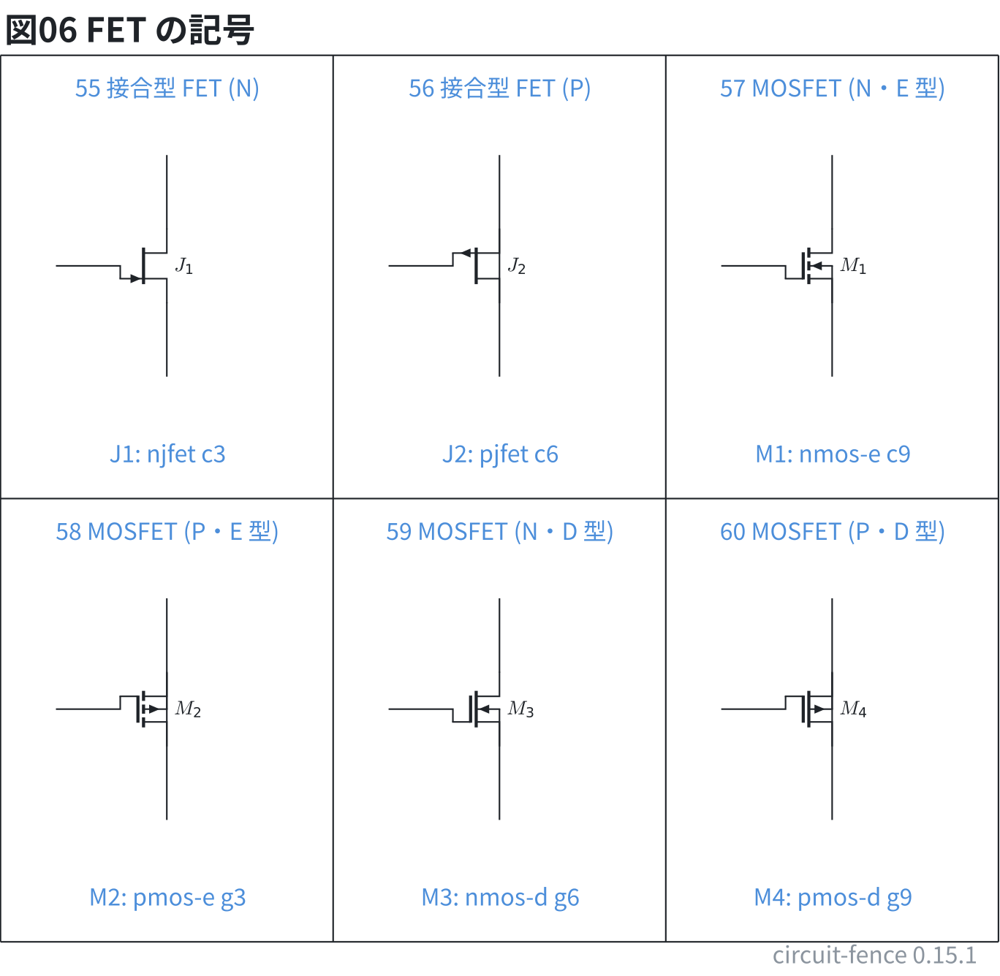

ロジックゲートの入力は `a` `b` でも番号 (`1` `2`) でも呼べる。
`not` と `buffer` は入力が 1 本なので `in`。

```circuit
title: 図07 ロジックゲートの記号
parts:
  U1: and 3,2 7408
  U2: or 6,2 7432
  U3: nand 9,2 7400
  U4: nor 12,2 7402
  U5: xor 3,4 7486
  U6: xnor 6,4 74266
  U7: not 9,4 7404
  U8: buffer 12,4 7407
notes:
  - line 1.5,1.1 13.5,1.1 ink
  - line 1.5,3.1 13.5,3.1 ink
  - line 1.5,5.1 13.5,5.1 ink
  - line 1.5,1.1 1.5,5.1 ink
  - line 4.5,1.1 4.5,5.1 ink
  - line 7.5,1.1 7.5,5.1 ink
  - line 10.5,1.1 10.5,5.1 ink
  - line 13.5,1.1 13.5,5.1 ink
  - text 3,1.4 blue center: 63 AND
  - text 3,2.7 blue center: "U1: and b3 7408"
  - text 6,1.4 blue center: 64 OR
  - text 6,2.7 blue center: "U2: or b6 7432"
  - text 9,1.4 blue center: 65 NAND
  - text 9,2.7 blue center: "U3: nand b9 7400"
  - text 12,1.4 blue center: 66 NOR
  - text 12,2.7 blue center: "U4: nor b12 7402"
  - text 3,3.4 blue center: 67 XOR
  - text 3,4.7 blue center: "U5: xor d3 7486"
  - text 6,3.4 blue center: 68 XNOR
  - text 6,4.7 blue center: "U6: xnor d6 74266"
  - text 9,3.4 blue center: 69 NOT
  - text 9,4.7 blue center: "U7: not d9 7404"
  - text 12,3.4 blue center: 70 バッファ
  - text 12,4.7 blue center: "U8: buffer d12 7407"
style:
  grid: off
```

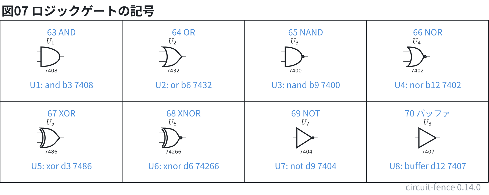

**IC の 1 回路を記号 1 つで描くときは、ピンの番号を添えられる** (`U1A: nand 3,3 74HC00`)。
**ID の末尾の大文字が IC の何番目の回路か** (`U1A` は 1 つ目、`U1B` は 2 つ目 …)。型番が
ピンの名前の表にあれば、記号のピンに **IC のピンの番号**が小さく添わる (`U1A` の入力が 1・2、出力が 3。
`U1B` は 4・5 → 6)。番号は表の印字 (`1A` `1B` `1Y`) から導くので、表に足せば使える型番が増える。
図の例は [examples/11-logic.md](../examples/11-logic.md) の図04。

- 番号が出るのは、型番が**ゲートの表** (74HC00・02・04・08・10・11・14・20・27・30・32・86・125・126・132 と、CD4000 系の 4001・4011・4069・4070・4071・4081・40106) にあり、
  ID が「数字 + 大文字 1 字」で終わるとき。型番が無い・表に無い・ID に回路の字が無いときは、今までどおり番号は出ない
- 回路の字が IC の回路の数を超えるとき (`U1E` の 74HC00 は A〜D まで)、記号の入力の数が回路と合わないとき
  (3 入力の 74HC10 を `nand` で描く) は、番号を添えずにお知らせを出す
- 向きを回しても、左右のピンの番号は線の上、上下のピンの番号は線の脇に出る
- `check` のネットリストの名前は変わらない (ピンは `U1A.in 1` のまま)。番号は図の飾り

DIP の IC は**ピンの本数が種類の名前に入っている** (`dip4` から `dip40` まで)。
**数は実体配線図のフェンス (breadboard / perfboard) と同じ表**にしてある —
同じ回路を回路図でも実体配線図でも書けるように。

**ブザーとイヤホンはスピーカーの記号で描いている。** circuitikz 1.0 にブザーの記号
(`buzzer` / `bell` / `piezo` / `sounder`) もイヤホンの記号も無いことを実機で確かめた。
2 端子の記号を自分で宣言する道は 1.0 では通らないので、同じ音を出す仲間の
記号を借りている。イヤホンの ID `EAR` は先頭 1 文字が本体・残りが添字の決まりで
E の添字 AR に組まれるので、`l=$\mathrm{EAR}$` で字を差し替える。

**SMA コネクタの記号は宣言している。** 丸の中に中心導体、外周が外皮という
慣習どおりの形。ピンは **1 が中心導体 (左)、2 が外皮 (下)** で、実体配線図の
2 つと同じ決め方 (実物の外皮は 4 ピンだが、図とネットリストで意味を持つのは
中心と外皮の 2 つだけ)。**外皮の丸は中心導体が入る側を開けてある** —
閉じた丸にすると中心導体の線が縁を横切り、外皮 (アース) と中心が繋がって
見えるため。

三端子レギュレータ (`regulator`) とピンヘッダ (`sipN`) の記号も、
circuitikz に無いので**この拡張が宣言している**。レギュレータのピンは
名前でも番号でも書ける (`U1.in` も `U1.1` も同じ。実体配線図が番号で
書くため)。

ピンヘッダ (`sipN`) は**数は実体配線図の 2 つと同じ表**。回路図では箱の片側に
ピンが並ぶ形で、circuitikz に無いので**この拡張が記号を宣言している**
(ピンの数ごとに 1 つ、図に出てくるぶんだけ)。

**USB コネクタ (`usb-a` / `usb-c`) の記号も宣言している。** 箱の右にピンが並び、
左に**正面から見た差し込み口**を描く — Type-C は長丸、Type-A は角で、口の形で
種類が分かる。ピンの名前と順は**実体配線図の 2 つと同じ表**で、名前でも番号でも
書ける (`J1.VBUS` も `J1.1` も同じ。大文字でも小文字でもよい)。ピンは表の全部
(Type-A は 4 本、Type-C は 6 本) を出すが、**使わないピンは ERC が言わない** —
電源だけの回路で `D+` `D-` を毎回叱られないように。**オス・メスは描き分けない**
(ピンの意味は同じ。実体配線図では姿 `/male` `/female` で描き分ける)。
区別したいときは型番の欄に書く (`J1: usb-c 2,2 plug`)。

マイコンボード (`pico` / `pico-w` / `pico2` / `pico2-w`) と FPGA ボード (`tang-nano-9k`、48 本) も同じ表から出す。
**ピンは実物の印字で呼ぶ** (`U1.GP0`) — 40 本を番号で呼ぶと、手元のピンアウト図と
突き合わせられないため。箱の中には**名前とヘッダの番号を並べて**書く
(`01 GP0`、`02 GP1`)。番号は 2 桁に揃えて**常に箱の外側の端**に置くので、
左の列は番号が先、右の列は名前が先になる (`VBUS 40`)。

**リレー (`relay`)・フォトカプラ (`photocoupler`)・7 セグメント LED (`seg7`) は
ピンの名前と番号が実体配線図の 2 つと同じ表**から出る。名前でも番号でも書け
(`K1.COM1` も `K1.4` も同じ)、ネットリストには名前で出る。番号は実物のピンの番号
(リレーは G5V-2、フォトカプラは PC817 と 4N35 (`photocoupler6`)、7 セグは 5161AS)。リレーとフォトカプラは
circuitikz 1.0 に記号が無いので**この拡張が宣言している** — リレーは左にコイル、
右に c 接点 2 つ (電流が流れていない形)、フォトカプラは枠の中に LED と
フォトトランジスタ。7 セグはピンの名前を刷った箱 (機器と同じ形)。
**リレーと 7 セグの使わないピンは ERC が言わない** (リレーは 2 回路のうち 1 つしか
使わないのが普通)。
**DIP スイッチ (`dip-switch4` / `dip-switch8`) は開閉スイッチを連の数だけ縦に並べた箱**で、
左の辺に `A1`〜、右の辺に `B1`〜 を上から並べる。k 番のスイッチは `Ak` と `Bk` の間の開いた接点で、
ピンどうしは部品の中でつながない (使わないスイッチのピンは ERC が言わない)。図は [../examples/17-named-chips.md](../examples/17-named-chips.md)。

**フォトトランジスタ (`phototransistor`) は `C` と `E` の 2 ピン**。砲弾型の実物に
合わせてベースの線を消し、光の矢を左から入れる (circuitikz 1.0 の `npn` に
`photo` と `nobase`)。名札は矢の出る辺を避ける。図は
[../examples/03-multi-terminal.md](../examples/03-multi-terminal.md) の図07。

**回しても反転しても名前は読める向きのまま。** 上下の辺に来たピンは縦に書く
(横のままだと隣の名前と重なる)。DIP と違って反転も書ける — ピンの名前は図に
差し込むので、鏡文字にならない。
**型番がピンの名前の表にあれば、ピンに名前が出る** (`U1: dip8 6,4 NE555`)。名前はデータシートの
印字 (`TRIG` `THRES` `DISCH` `CONT`) で、箱の中に**名前と番号を並べて**書く — 番号は
マイコンボードと同じく常に箱の外側の端 (`1 GND`、`VCC 8`。14 ピン以上は `01 Q5` と 2 桁)。
ピンは**名前でも番号でも**指せ (`U1.TRIG` も `U1.2` も同じ。大文字小文字は問わない)、
ネットリストには名前で出る。表にある型番は [02-cheatsheet.md](02-cheatsheet.md) の「ピンの名前」の節。
型番は完全一致で引く (`TL071` と `TL072` は並びが違うので、接尾辞を削って探さない)。
**表に無い型番・ピンの本数が合わない型番は、今までどおり番号だけ**で描き、お知らせで言う
(表に無い IC のピンに名前を出すなら `device` で `pins:` を書く)。型番を書かなければ何も言わない。
2 本以上に同じ名前が刷られたピン (TL071 の `NC`) は、名前では指せない (番号で指す)。

**回路図ではピンを働きで並べた箱 `ic` も使える** (`U1: ic 10,7 TLC555`)。`dip8` と同じ IC を、
ピンの実物の順ではなく**働きで 4 辺に振って**描く — 正の電源は上、GND は下、入力・制御は左、
出力は右、結ぶことの多いピンは隣どうし (KiCad の部品記号の規約 KLC S4.2 と同じ置き方)。
DIP の姿だと 555 の 2 と 6、4 と 8 を結ぶ線が箱の外を大回りして交差するが、`ic` なら箱の横で済む。

- **デュアルゲート MOSFET `nmos-dg`** (`Q1: nmos-dg 5,4 3SK291`) は箱ではなく**記号**で描く — 丸の中にチャネルの棒 1 本と
  ゲートの基板 2 枚、基板の矢はチャネルへ向く (N チャネル)。circuitikz 1.0 に無いので自前で宣言した形。
  ピンは `G1` (信号、左下) `G2` (バイアス・AGC、左上) `D` (上) `S` (下)。`gate1` `gate2` `drain` `source` でも書ける。
  `G` だけでは G1 か G2 か分からないので断る。**D と S は番地の列に乗る**ので `--` でまっすぐ引ける。
  ゲートは番地の行から上下に 0.3 cm ずれているので、`-|` / `|-` で引く (`4,5 -| Q1.G1`)。
  どちらのゲートかは形では読めないので、図には `G1` `G2` の名前が出る。型番は記号の下。向きはほかの FET と同じく書ける。
  基板では専用の種類を持たず、変換基板に載せた形を `dip4` (2 列) か `sip4` (1 列) に型番 `3SK291` を添えて書く (ピンは `G1` `G2` `D` `S`)
- **セラミックフィルタ `ceramic-filter`** (`CF1: ceramic-filter 6,5 SFU455B`、略記 `cfilter`) は三端子レギュレータと同じ箱で描く。
  ピンは `IN` (左) `GND` (下) `OUT` (右)。信号が左から右へ流れ、アースが下へ落ちる。型番は箱の外の上に出る。
  基板では専用の種類を持たず、`sip3` に型番 `SFU455B` を添えて書く (橙の胴で描かれ、ピンは `IN` `GND` `OUT`)
- **型番が要る** (`ic` の場合)。並びを持つ型番は `NE555` `TLC555` `CD4511B` `74HC163` (同期カウンタ) `74HC154` (4 → 16 デコーダ) `62256` (SRAM 32K×8)、
  74HC シリーズの `74HC161` `74HC595` `74HC164` `74HC165` `74HC194` `74HC138` `74HC139` `74HC157` `74HC153` `74HC151`
  `74HC573` `74HC574` `74HC273` `74HC245` `74HC283` `74HC85` `74HC393` `74HC4040` `74HC4060` `74HC74` `74HC174` `74HC193` `74HC4051` `74HC4052`、
  CMOS 4000 系の `CD4040B` (12 段リプルカウンタ) `CD4013B` (D フリップフロップ ×2)、
  アナログの `SA612` (ミキサ + 発振器) `LM386` (オーディオ パワー アンプ)
  (別の綴り `NE555P` `SN74HC163N` `AS6C62256` `NE602` `LM386N-1` なども)。
  ほかの型番や型番無しは断る (`dipNN` で書く)
- ピンの指し方・ネットリストの名前は名前付きの `dipNN` と同じ (`U1.TRIG` = `U1.2`)。
  箱には**名前と実物の番号**を刷る — 並びが実物と違うので、番号が組むときの手がかりになる
- 555 の並び: 上に `VCC`(8)・`RESET`(4)、左に `DISCH`(7)・`THRES`(6)・`TRIG`(2)、右に `OUT`(3)、
  下に `GND`(1)・`CONT`(5)
- 74HC163 の並び: 上に `VCC`・`CLR`・`LOAD`、左に `A`〜`D`・`ENP`・`ENT`・`CLK`、右に `QA`〜`QD`・`RCO`、下に `GND`。
  74HC154 は左に `A0`〜`A3`、右に `Y0`〜`Y15`、下に `GND`・`E1`・`E2`。
  62256 は左に `A0`〜`A14`、右に `DQ0`〜`DQ7`、下に `VSS`・`CE`・`OE`・`WE`。上は `VCC`
- 74HC シリーズも同じ考え方: **データ・クロックは左、出力は右に同じ順 (線が交差しない)、電源は上、GND は下**。
  普段 VCC に結ぶピン (`CLR` `SRCLR` `PRE` など) は電源の隣 (上)、普段 GND に結ぶピン (`OE` `G` `CLR` が H で動く品など) は GND の隣 (下)。
  `74HC573` は左に `1D`〜`8D`・`LE`、右に `1Q`〜`8Q`、下に `GND`・`OE`。`74HC595` は左に `SER`・`SRCLK`・`RCLK`、右に `QA`〜`QH`・`QH'`
- CMOS 4000 系は電源が `VDD` (上)・`VSS` (下)。`CD4040B` は左に `CLOCK`(10)・`R`(11)、右に `Q1`〜`Q12` (下の桁から)。
  `CD4013B` は左に回路ごとに `D`・`CLOCK`・`SET`・`RESET` (`D1`(5) `CLOCK1`(3) `SET1`(6) `RESET1`(4) `D2`(9) `CLOCK2`(11) `SET2`(8) `RESET2`(10))、
  右に `Q1`(1)・`/Q1`(2)・`Q2`(13)・`/Q2`(12)。SET・RESET は H で効くので、使わなければ `VSS` に結ぶ
- `74HC4052` は `74HC4051` と同じ考え方: 左にチャネル `A0`〜`A3`・`B0`〜`B3`、右に共通 `AN`(13)・`BN`(3)、
  上に `VCC`、下に `GND`・`VEE`・`E`・`S0`・`S1`。**信号が共通からチャネルへ流れる回路 (Tayloe 検波器) でも
  共通は右のまま** — `ic` は反転を書けないので、共通の線を箱の右から回す
- `SA612` の並び: 左に RF の入力 `IN_A`(1)・`IN_B`(2) と局部発振 `OSC_B`(6)・`OSC_E`(7) (RF も外の LO も左から入る)、
  右にミキサの出力 `OUT_A`(4)・`OUT_B`(5)、上に `VCC`(8)、下に `GND`(3)
- `LM386` の並び: 上に `VS`(6)・`GAIN1`(1)・`GAIN8`(8) (利得の C を隣どうしの 2 本の間に付ける)、
  左に `+INPUT`(3)・`-INPUT`(2)、右に `VOUT`(5)、下に `GND`(4)・`BYPASS`(7) (C で GND へ)
- **ピンは箱の中心から半マス刻み** (`pitch` の半分。狭すぎれば 1 マス、広すぎれば 1/4 マス)。
  辺のピンが奇数本なら中心に揃い、偶数本なら 1 本目が中心で残りは右 (下) へ並ぶ。箱の中心を
  番地に置けばピンは半マスの番地に乗るので、`-|` / `|-` で引いた線がまっすぐ届く
- 向きは書けない (並びそのものが向き)。名札 `U1` は箱の左上の角の上
- 基板 (breadboard / perfboard) には無い。基板の上の IC は実物の並びの `dipNN` で書く

```yaml
parts:
  U1: ic 10,7 TLC555
wires:
  - U1.VDD |- 10,3       # 上の足は |- で上へ
  - U1.DISCH -| 6,6.5    # 左右の足は -| で横へ
  - U1.GND |- 10,10.5    # 下の足は |- で下へ
```

型番の無い DIP (と表に無い型番) のピンは番号で指し (`U1.1`)、型番は**箱の下**に出る (名前 `U1` は上)。
立てた箱はピンの番号が左右の縁から中へ並び、真ん中に型番の入る幅が無いため。
寝かせた箱 (`r90` / `r270`) は長い辺が横になって番号の列の間が空くので、
型番は箱の**中**に入る。
ピンへの配線は [../examples/11-logic.md](../examples/11-logic.md) で見せている。

```circuit
title: 図08 DIP の IC の記号
parts:
  U1: dip8 3,6
  U2: dip14 6,6
  U3: dip16 9,6
  U4: dip20 12,6
  U5: dip28 15,6
  U6: dip40 18,6
notes:
  - line 1.5,1.1 19.5,1.1 ink
  - line 1.5,11.1 19.5,11.1 ink
  - line 1.5,1.1 1.5,11.1 ink
  - line 4.5,1.1 4.5,11.1 ink
  - line 7.5,1.1 7.5,11.1 ink
  - line 10.5,1.1 10.5,11.1 ink
  - line 13.5,1.1 13.5,11.1 ink
  - line 16.5,1.1 16.5,11.1 ink
  - line 19.5,1.1 19.5,11.1 ink
  - text 3,1.4 blue center: 72 DIP (8 ピン)
  - text 3,10.7 blue center: "U1: dip8 f3"
  - text 6,1.4 blue center: 73 DIP (14 ピン)
  - text 6,10.7 blue center: "U2: dip14 f6"
  - text 9,1.4 blue center: 74 DIP (16 ピン)
  - text 9,10.7 blue center: "U3: dip16 f9"
  - text 12,1.4 blue center: 75 DIP (20 ピン)
  - text 12,10.7 blue center: "U4: dip20 f12"
  - text 15,1.4 blue center: 76 DIP (28 ピン)
  - text 15,10.7 blue center: "U5: dip28 f15"
  - text 18,1.4 blue center: 77 DIP (40 ピン)
  - text 18,10.7 blue center: "U6: dip40 f18"
style:
  grid: off
  pitch: 1.2
```

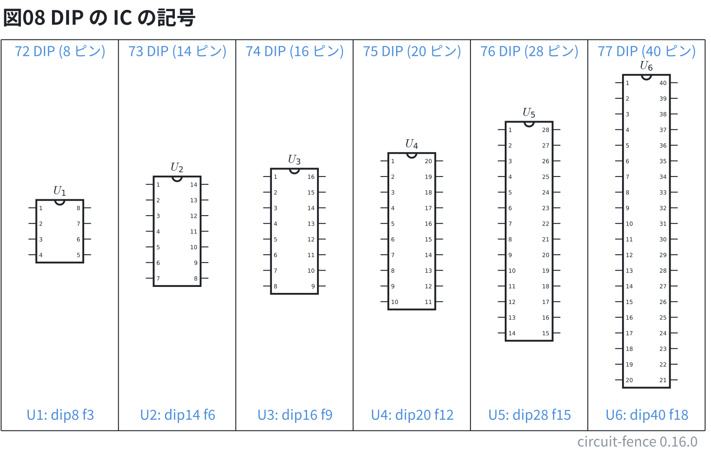

向きは 3 つの語で書く。**回転** (`r90` / `r180` / `r270`)、**左右反転**
(`mirror`)、**オペアンプの ± の上下** (`+up` / `+down`)。番地と型番の間に、
順を問わず並べられる。まず ± の上下から — `+up` にすると帰還を下に回せるので
線が交差しにくい。

```circuit
title: 図09 オペアンプの向き
parts:
  IN:  port 1,2
  Rb:  resistor 3,2 3,5 100k
  G1:  ground 3,5
  U1:  opamp 5,3 +up
  R2:  resistor 4,4 4,5 1k
  G2:  ground 4,5
  R3:  resistor 4,4 7,4 10k
  OUT: port 9,3
wires:
  - 1,2 -- 3,2 |- U1.+
  - 4,4 |- U1.-
  - U1.out -- 7,3 -- 9,3
  - 7,4 -- 7,3
notes:
  - source 10,1 blue
style:
  grid: on
```

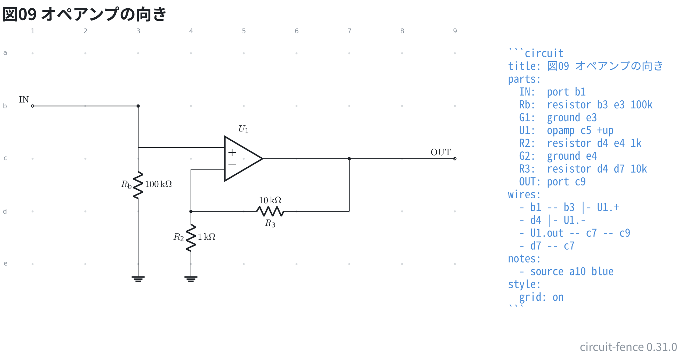

**ピンへは `-|` か `|-` で引く**。ピンは記号ごとに決まった位置にあって格子の上に
無いので、`--` (まっすぐ) で番地とつなぐと**斜めの線になる**。`|-` なら先に縦、
それから横に入るので、回路図らしく直角に入る。

`--` で斜めに入る書き方をしたときは、図はそのまま描いたうえで
**行番号つきでお知らせが出る**。記号の中心線に出るピン (トランジスタの C・E、
オペアンプの `out` など) へ、その軸に揃った番地から引くときは何も言わない
(`U1.out -- 7,3` はまっすぐ引ける)。

帰還の節点は記号の真下ではなく**少し横にずらす** (上の例で `5,4` ではなく `4,4`)。
真下に置くと、ピンへ向かう線が記号の体を突き抜けて見える。

**ピンへ引いた線の途中には当てられない**。線がどこを通るかがこちら側では
分からず、T 字かどうかを決められないため。上の例のように、当てたい番地 (`7,3`)
を通る配線に分けて書く。当てて書くと、その旨を行番号つきで伝える。

### 基板の外の機器・モジュール — マップ形式 (`type: device`)

超音波センサーや充電モジュール、Analog Discovery のような**ピンに名前のある箱**は、
1 行ではなく**マップ形式**で書く。実体配線図の 2 つ (breadboard / perfboard) と
同じ書き方で、ピンの名前は書き手が並べる。

```yaml
parts:
  M1:
    type: device
    at: 2,3
    label: HC-SR04
    pins: [VCC, TRIG, ECHO, GND]
    turn: mirror
wires:
  - M1.ECHO -| 6,3
```

| 鍵 | 中身 |
| --- | --- |
| `type` | `device`。**マップ形式で書けるのは機器と 3 ピンの IC (`ic3`) だけ**で、ほかの部品は 1 行で書く |
| `at` | 箱の置き場。番地か `points:` の名前 |
| `pins` | ピンの名前の並び (2〜40 本)。書いた順に**箱の上から**並ぶ。英数字と `_ + -` の 32 文字まで。数字だけの名前は番号と紛れるので書けない |
| `label` | 箱の中に書く名前 (任意、24 文字まで) |
| `turn` | 向き。1 行形式と同じ語 (`r90` `r180` `r270` `mirror`)。既定はピンが左、`mirror` で右 |

- ピンは**名前でも番号でも**指せる (`M1.ECHO` = `M1.3`)。名前は大文字小文字を問わない
- 箱の幅は、ピンの名前と `label` の長さから決まる
- **使わないピンは ERC が言わない** (モジュールのピンは差し出しているだけで、使うのは一部)
- `M1: device 2,3` の 1 行では書けない (そう書くとマップ形式を案内する)
- 図は [例の図06](../examples/03-multi-terminal.md#機器モジュール-device)

**3 ピンの IC (`ic3`) も同じ形で書ける。** ホール素子・LM35・メロディ IC のように
ピンの名前が品ごとに違う TO-92 の IC を 1 つで受ける。箱は三端子レギュレータと同じで、
`pins` は**ちょうど 3 本** (1 = 左、2 = 下、3 = 右の順)。1 行 (`U2: ic3 10,3 UM66T`)
で書くとピンは番号 (`U2.1` 〜 `U2.3`) になる。使わないピンは ERC が言う
(3 本とも使うのが普通のため)。図は [例の図08](../examples/03-multi-terminal.md)。

```yaml
parts:
  U1:
    type: ic3
    at: 4,3
    label: LM35
    pins: [+Vs, Vout, GND]
```

### 回す・裏返す — `r90` `r180` `r270` `mirror`

記号は**時計回り**に回せる。`r90` が 90 度、`r180` が 180 度、`r270` が 270 度。
`r0` は書かない (向きを書かないのと同じ)。`mirror` は**左右反転**で、上下反転の
語は無く、`mirror` と `r180` を並べて書く。

```yaml
parts:
  Q1: npn 1,1 r90           # 時計回りに 90 度
  Q2: npn 4,1 mirror        # 左右反転
  Q3: npn 7,1 r180 mirror   # 上下反転
  U1: opamp 1,3 r90 +up     # ± の上下とも併記できる
  G1: ground 1,5 r90        # グラウンドも回せる
```

**回転・`mirror`・± は、それぞれ 1 行に 1 つまで**。`r90 r180` のように同じ種類を
2 つ書くと行番号つきで断る (どちらのつもりかは綴りから決められない)。
並べる順は問わない。型番と並べても取り違えない — 向きは決まった語なので、
語のほうを先に見分けてから残りを型番として読む。

**ピンは記号と一緒に回る。** 名前で指した配線 (`Q1.B`) は書き換えなくてよく、
**まっすぐ引ける向きも一緒に回る**。立っている `npn` のベースは横の中心線に
出るが、`r90` にすると縦の中心線に出るので、上のお知らせも回った辺で見る。

書ける範囲は種類で違う。書けない語を書くと、行番号つきで断る。

| 種類 | 回転 | 反転 | 断る理由 |
| --- | --- | --- | --- |
| 多端子 (既定) | ○ | ○ | |
| `dip4`〜`dip40` | ○ | ✗ | 反転するとピン番号も型番も**鏡文字**になる |
| `ic` | ✗ | ✗ | ピンの並び (電源が上・入力が左) そのものが向き |
| マイコンボード | ○ | ○ | ピンの名前は図に**差し込む**ので裏返らない |
| `transformer` | ✗ | ○ | 回すと巻線と鉄心がばらけて、図として読めない |
| `ground` | ○ | ✗ | 左右対称なので、反転しても図が変わらない |
| `port` / `antenna` / `vcc` / `vee` | ✗ | ✗ | 上下がその記号の意味そのもの (`port` の白丸には向きが無い) |
| 2 端子 | ✗ | ✗ | **番地の順が向き** |

**効かない語は通さない**という決め方をしている。`ground` に `mirror` と書けて
図が 1 ドットも変わらないなら、書き手は効いたと思い込む。

2 端子部品が向きの語を持たないのは、**番地の順そのものが向き**だから。
回すのは後の番地を動かすこと、裏返すのは 2 つを入れ替えることで書ける
([向きのある部品は、先に書いた番地が + 側](#向きのある部品は先に書いた番地が--側))。

見本は [../examples/16-orientation.md](../examples/16-orientation.md)。

### 略記

よく書く種類には短い名前がある。正式名と**同じ意味**で、
`R1: r 1,1 3,1 10k` は `R1: resistor 1,1 3,1 10k` と 1 文字も違わない図になる。
図・ネットリスト・エラーに出るのは**正式名のほう**。

| 略記 | 種類 | 略記 | 種類 |
| --- | --- | --- | --- |
| `r` | `resistor` | `ec` | `ecap` |
| `c` | `capacitor` | `pot` | `potentiometer` |
| `l` | `inductor` | `ldr` | `photoresistor` |
| `d` | `diode` | `ntc` | `thermistor-ntc` |
| `i` | `isource` | `ptc` | `thermistor-ptc` |
| `v` | `vsource` | `xtal` | `crystal` |
| `cfilter` | `ceramic-filter` | | |
| `dc` | `vsource` | `scr` | `thyristor` |
| `ac` | `sine` | `bat` | `battery` |
| `gnd` | `ground` | `sw` | `switch` |
| `op` | `opamp` | `btn` | `button` |

**全部の種類にはない**。SPICE の素子文字 (`r` `c` `l` `d` `i` `v`) と、
回路図で通っている略語だけにしてある。`and` や `dip8` のように元から短いもの、
`q` (npn か pnp か決まらない) のように**指すものが 1 つに決まらないもの**は
略記を持たない。

```circuit
title: 図10 略記で書いた図
parts:
  V1: dc 1,2 1,4 9
  S1: sw 1,2 2,2
  R1: r 2,2 3,2 10k
  C1: c 3,2 3,4 100n
  G1: gnd 3,4
wires:
  - 1,4 -- 3,4
notes:
  - source 5,1 blue
style:
  grid: on
```

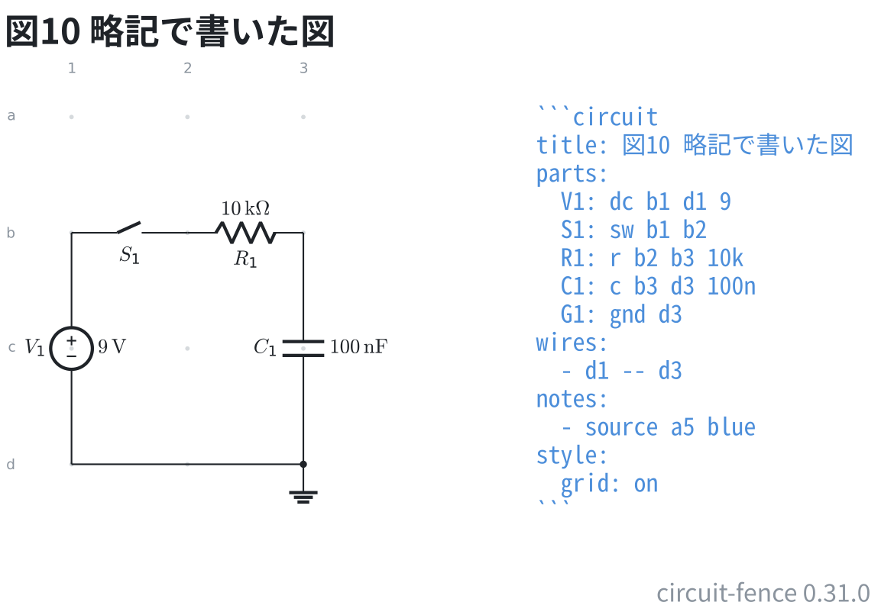

書いたのは略記だが、図に出るのも**ネットリストに出るのも正式名**。
`V1: dc 1,2 1,4 9` は `V1: vsource 1,2 1,4 9` と 1 バイトも違わない図になる。

### ID の出方

先頭 1 文字が本体、残りが添字になる (回路図の慣習どおり)。
`R1` は R の添字 1、`Rload` は R の添字 load、`R` はそのまま。

```circuit
title: 図11 ID の出方
parts:
  R1:    resistor 1,1 2,1
  Rload: resistor 4,1 5,1
  R:     resistor 7,1 8,1
  Vcc2:  vsource 1,3 2,3
notes:
  - text 1.5,1.7 blue center: "R1: resistor a1 a2"
  - text 4.5,1.7 blue center: "Rload: resistor a4 a5"
  - text 7.5,1.7 blue center: "R: resistor a7 a8"
  - text 1.5,3.7 blue center: "Vcc2: vsource c1 c2"
  - source 10,1 blue
style:
  grid: on
```

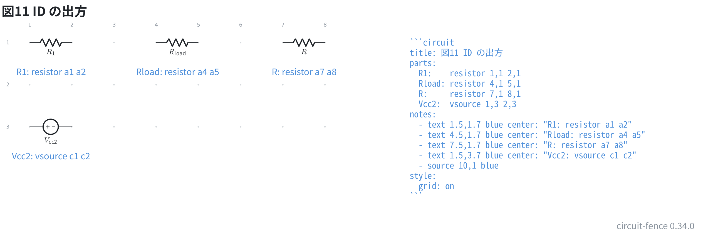

添字は**先頭以外の全部**なので、`Vcc2` は V の添字 cc2 になる。
2 字を本体にしたい (添字にしたくない) ときは
[ラベル](#ラベルを-id-と別に書く--l字)を書く。

### ラベルを ID と別に書く — `l=字`

`l=字` を書くと、**図に出る字だけ**を差し替えられる。
配線から指す名前もネットリストの名前も ID のままなので、
図の見た目と回路の構造が混ざらない。

`$…$` で囲むと**数式の部分集合**が使える。教科書と同じ綴りで書ける。

```circuit
title: 図12 ラベルを ID と別に書く
parts:
  E:   sine 1,1 2,1
  SW:  switch 4,1 5,1
  Z:   resistor 7,1 8,1
  R:   resistor 10,1 11,1
  E1:  sine 1,3 2,3 l=$\dot{E}$
  SW1: switch 4,3 5,3 l=$\mathrm{SW}$
  Z1:  resistor 7,3 8,3 l=$\dot{Z}_L$
  R1:  resistor 10,3 11,3 l=RL
notes:
  - text 1,1.7 blue left: ラベル無し (ID がそのまま出る)
  - text 1,3.7 blue left: ラベル有り (図に出る字だけが変わる)
  - source 13,1 blue
style:
  grid: on
```

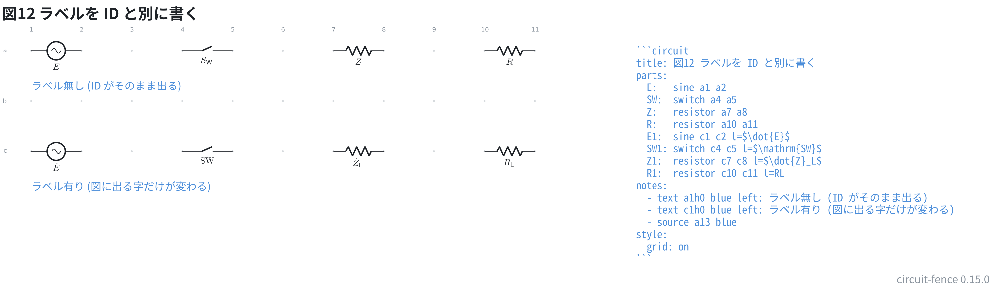

上の段がラベル無し、下の段が同じ部品にラベルを書いたもの。
**図に出る字だけ**が変わり、配線から指す名前もネットリストの名前も ID のまま
(下の段の ID は `E1` `SW1` `Z1` `R1`)。

`SW` の対比が分かりやすい。ラベルを書かないと ID の規則どおり
**S の添字 W** になるが、`l=$\mathrm{SW}$` と書けば 2 字が本体のまま立体で出る。

読めるのは次だけ。空白は書けない (部品の 1 行は空白で区切って読むため)。

| 書ける形 | 何 |
| --- | --- |
| 英数字 | そのまま |
| `\dot{…}` | 点 (フェーザ) |
| `\mathrm{…}` | 立体 |
| `_` | 添字。1 文字か `{…}` のまとまり |

**書いた TeX がそのまま図に渡るわけではない**。読み直してこちらが組み直すので、
知らない命令は書ける形を添えて行番号つきで返る。生で渡さないのは、フォントの
無い数式が例外ではなく**プロセスごと落ちる**ため — 落ちると行番号を返せない。

`l=` は `i=` `v=` と同じ読み方をする。**書き方は 1 つで、置き場所が 3 つ**。

`$…$` を書いたフェンスも、そのまま図に書き出せる (`- source`)。
TeX が自分の記法として読む字 (`\` `$` `{` `}` `^`) は**通すのではなく
綴り直して**書き出すので、書き手の字から命令が組み上がることはない。

### 値の出方

種類から単位を補う。抵抗の `10k` は 10 kΩ、コイルの `10m` は 10 mH。
単位まで書いてもよく、同じ値に読む (`47pF` は `47p` と同じ 47 pF、`16MHz` は `16M`)。
数字と SI 接頭辞 (`k` `M` `G` `m` `u` `n` `p`) の組でないときは、
書いたとおりに出る (`1N4148` や `3A` はそのまま。単位を勝手に足さない)。

**数には単位を要る。** 素の数 (接頭辞も単位も無い `47`) を受けるのは、単位が 1 つに
決まる種類だけ — 抵抗の仲間 (`resistor` `potentiometer` `thermistor` `tline` など、Ω) と
電圧源 (`vsource` `battery` `sine` `square` `triangle` `solar`、V)。
コンデンサ (`capacitor` `ecap` `varicap`)・コイル (`inductor`)・水晶 (`crystal`)・
電流源 (`isource`) の素の数は断る — `capacitor 1,1 3,1 47` は 47 pF のつもりでも 47 F と
読めてしまう (ブレッドボードとユニバーサル基板は以前 pF で読んでいた)。`47p` `100n` `10u`、`100u` `10m`、
`16M`、`1m` のように接頭辞を付ける (1 F なら `1F`)。
**SI の接頭辞は小文字の `k`**。`100K` は断る (読めずに字のまま図に出ていた)。
断った値は落とし、部品は値の無いまま描く。

ID は記号の下 (縦置きなら左)、値は反対側に出る。
LED とフォトダイオード (`led` / `photodiode`) は値の側に光の矢が出るので、
値は**矢の先より外**に置く (どの向きに置いても矢に重ならない)。

値に使えるのは英数字と `. + - / ( ) _ %` だけ。
`,` と `=` は circuitikz がオプションの区切りとして読んでしまうので使えない
(小数点は `.` で書く)。日本語は**フェンスの TeX にフォントが無い**ので描けない。

### 電流の矢と電圧の符号 — `i=字` `v=字`

2 端子部品の行に続けて書くと、電流の矢と電圧の符号が付く。
教科書の回路図は、記号よりも「どこを流れる電流を i と呼ぶか」
「どちらを + と数えるか」を図で決める。

```circuit
title: 図13 電流の矢と電圧の符号
parts:
  E: battery 1,2 1,4
  S: switch 1,2 2,2
  R: resistor 2,2 3,2 i=i
  C: capacitor 3,2 3,4 v=vC
wires:
  - 1,4 -- 3,4
notes:
  - source 5,1 blue
style:
  grid: on
```

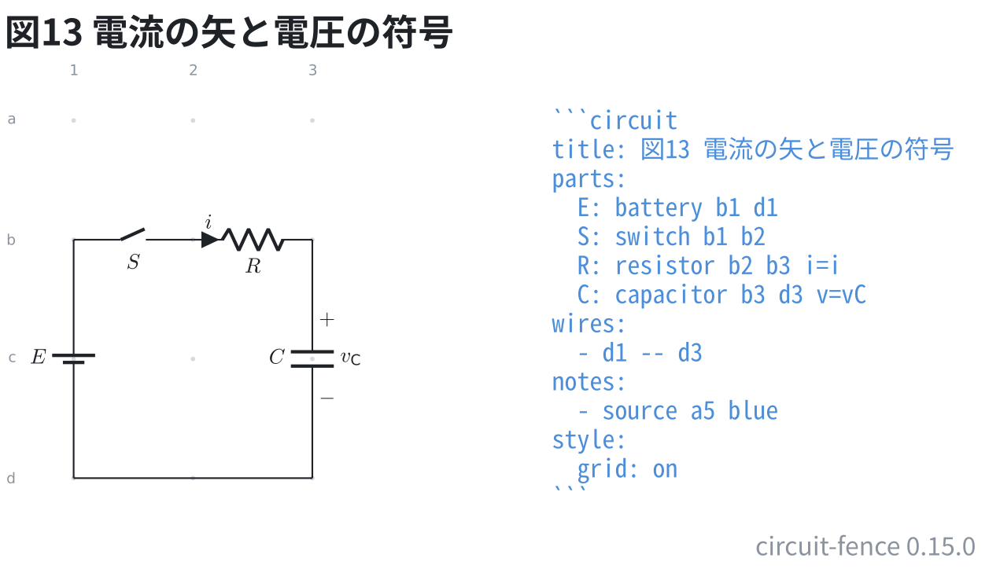

**向きは先に書いた番地が基準**で、
[向きのある部品](#向きのある部品は先に書いた番地が--側)と同じ規則。
電流は先に書いた番地から後に書いた番地へ流れる向き、
電圧は先に書いた番地が + になる。逆にしたいときは番地を入れ替える。

電圧の描き方は記号の流儀 ([`style: standard:`](#見た目の設定-style)) で変わる。
`american` は + と − の字、`european` は − 側を指す弧の矢 (ドイツ式)、
`jis` は **+ 側を指すまっすぐな矢** (電験三種の問題用紙と同じ)。どれでも + 側は
先に書いた番地で、変わるのは描き方だけ。電源の電圧の矢は、記号から離して描く。

ただし**極性のある部品は番地の順が極性で決まる**ので、入れ替えると記号まで
裏返る。矢だけを返したいときは `i<=` `v<=` と書く (ツェナーの逆電流など)。
向きのない部品では番地の入れ替えを使う — 同じことの綴りを 2 通りにしない。

字は ID と同じ組み方で、先頭 1 文字が本体・残りが添字になる
(`i=i1` は i の添字 1、`v=vC` は v の添字 C)。使える字と長さの上限も値と同じ。

書く順は決まっていない (`R1: resistor 1,1 3,1 10k i=i1` でも
`R1: resistor 1,1 3,1 i=i1 10k` でもよい)。

| 組み合わせ | 書けるか |
| --- | --- |
| 値 + `i=` | 書ける (図の別の場所に出る) |
| 値 + `v=` | **書けない** — 同じ側に出て重なる |
| `i=` + `v=` | **書けない** — 同じ側に出て重なる |

書けない組み合わせは重ねて描かず、行番号つきで返す。

## 配線 (`wires:`)

`- 端点 -- 端点` を並べる。端点は番地か、多端子部品のピン (`U1.out`)。
1 行に 3 つ以上つないでも書ける ([下記](#1-行につないで書く))。
演算子は TikZ と同じ 3 つ。

| 演算子 | 引き方 |
| --- | --- |
| `--` | 2 点の間をまっすぐ (斜めもそのまま) |
| `-\|` | 先に横、それから縦 |
| `\|-` | 先に縦、それから横 |

```circuit
title: 図14 配線でつなぐ
parts:
  R1: resistor 1,1 3,1
  R2: resistor 5,1 7,1
wires:
  - 3,1 -- 5,1
notes:
  - source 8,1 blue
style:
  grid: on
```

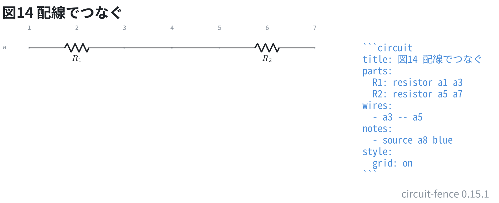

### 1 行につないで書く

端点は 3 つ以上並べてよい。演算子は区間ごとに選べる。

```yaml
wires:
  - 1,2 -- 3,2 |- U1.+
  - U1.out -- 7,3 -- 9,3
```

1 行が**1 本の信号経路**として読める。上の 1 行目は `1,2 -- 3,2` と
`3,2 |- U1.+` の 2 区間に開かれる。開いてから先は 1 行ずつ書いたときと
同じものが流れるので、**分岐の黒丸もネットリストも変わらない**。

読めなかったときに返るのは書いた 1 行なので、どの区間が悪くてもその行に付く。

## 斜めに置く

部品も配線も**斜めに置いてよい**。行も列も揃っていない 2 点の間に、
そのまま引く。

```circuit
title: 図15 斜めに置く
parts:
  IN:  port 1,1
  R1:  resistor 1,1 3,2
  R2:  resistor 3,2 5,1
  OUT: port 5,1
wires:
  - 1,1 -- 5,1
notes:
  - source 6,1 blue
style:
  grid: on
```

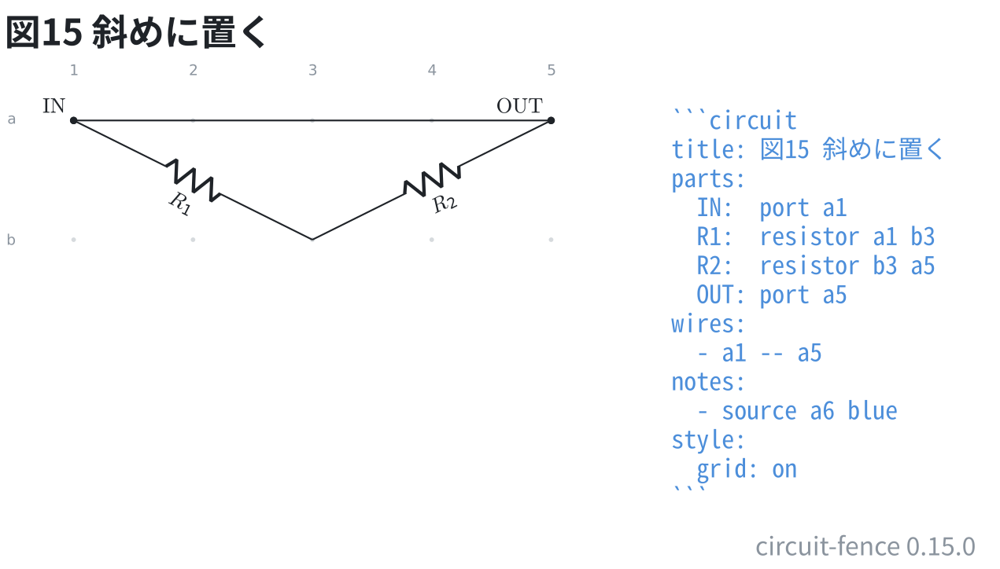

通らないのは両端が同じ番地のときだけ (向きも長さも決まらないため)。

## 注釈 (`notes:`)

図の上に印と字を重ねる。**回路の一員ではない**ので、ネットリストにも
分岐の黒丸にも数えない (図から消しても回路は変わらない)。

書けるのは 6 種類。

| 種類 | 書き方 | 何が出るか |
| --- | --- | --- |
| 印 | `- circle 指し先 [色]` | 部品や交点を囲む丸 |
| 枠 | `- box 番地 番地 [色] [solid]` | 図の一角を囲む枠 (既定は破線) |
| 指し棒 | `- arrow 起点 終点 [色]` | 起点から終点への矢印 |
| 直線 | `- line 起点 終点 [色]` | 矢の付かない線 (罫線・区切り) |
| 字 | `- text 番地 [色や大きさ・向き]: 文字` | 図に重ねる字 |
| 書き出し | `- source 番地 [色や大きさ]` | フェンスの中身そのもの |

```circuit
title: 図16 注釈
parts:
  IN:  port 1,1
  R1:  resistor 1,1 2,1 10k
  C1:  capacitor 2,1 2,2 100n
  OUT: port 3,1
  G1:  ground 2,2
wires:
  - 2,1 -- 3,1
notes:
  - source 4,1 blue
  - circle R1
  - text 1,3: ここでカットオフ 159 Hz
style:
  grid: on
```

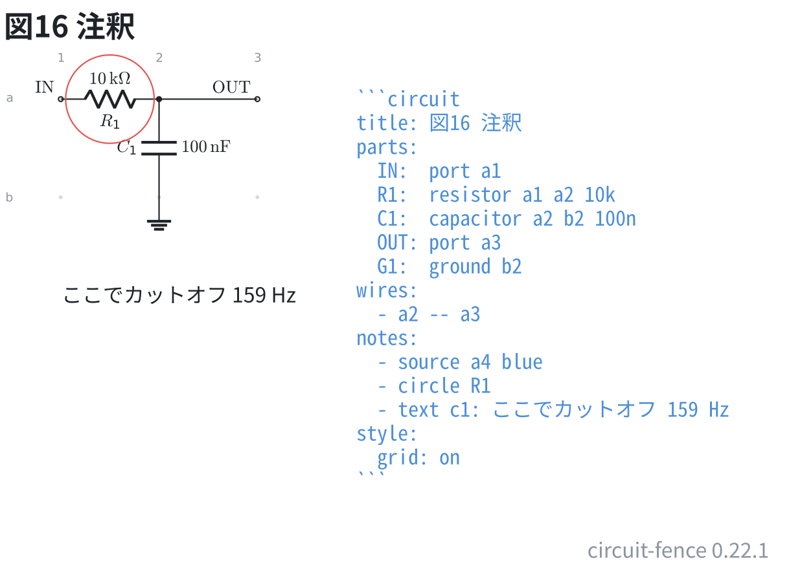

### 印 — `- circle 指し先 [色]`

指し先は**部品 ID か番地**。部品を指すと記号の真ん中に、番地を指すと
その交点に丸が出る。丸の大きさは決め打ちで、番地の間隔を変えても変わらない
(記号そのものの大きさに合わせてある)。

部品 ID を先に探し、無ければ名前 (`points:`)、番地の順に読む。番地は数字で始まり
`,` を含むので、部品 ID と取り違えることはない。

```circuit
title: 図17 印
parts:
  R1: resistor 1,1 2,1 10k
  C1: capacitor 4,1 4,2 100n
notes:
  - circle R1
  - circle C1 blue
  - circle 1,2 green
  - text 1,3 green center: circle b1 green
  - source 6,1 blue
style:
  grid: on
  grid-to: 5,3
```

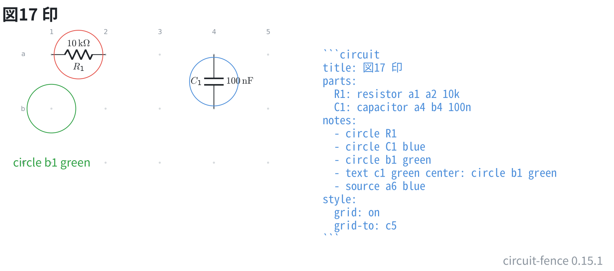

`circle R1` は部品を指すので記号の真ん中に、`circle 1,2` は番地を指すので
その交点に出る。**何も置いていない番地でも指せる** (図の上の場所なので)。

### 枠 — `- box 番地 番地 [色] [solid]`

2 つの番地を対角にした枠を引く。「この一角がフィルタ部」のように、
図の一角をまとめて囲むためのもの。角の番地の外側に余白を取るので、
縁に置いた記号やそのラベルは枠に噛まない。

線は既定で破線 (回路の線と見分けるため)。表の罫線のように**枠そのものを
見せたいとき**は `solid` を書くと実線になる。色と順不同で、`- box 1,1 3,3 ink solid`
とも `- box 1,1 3,3 solid ink` とも書ける。`solid` は枠にだけ書ける語で、
印や指し棒に書いたら、書ける場所を添えて行番号つきで返る。

角に書けるのは**番地だけ**。部品 ID は書けない (2 端子部品は番地の間隔とは
別の長さで描かれるので、記号がどこまで広がっているかを枠の側では決められない)。
同じ番地を 2 回書くと、その 1 マスだけを囲む。

```circuit
title: 図18 枠
parts:
  IN:  port 1,1
  R1:  resistor 1,1 2,1 10k
  C1:  capacitor 2,1 2,2 100n
  OUT: port 3,1
  G1:  ground 2,2
wires:
  - 2,1 -- 3,1
notes:
  - box 1,1 3,3 blue
  - text 2,4 blue center: box a1 c3 blue
  - source 5,1 blue
style:
  grid: on
  grid-to: 4,3
```

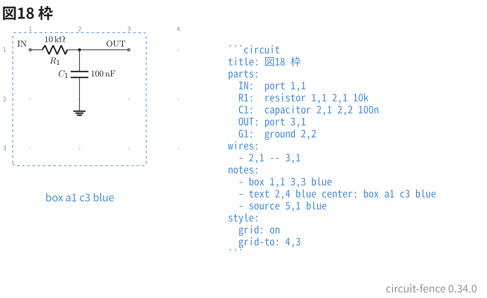

### 指し棒 — `- arrow 起点 終点 [色]`

起点から終点へ矢印を引く。両端とも、印と同じく**部品 ID か番地**。

部品を指した端は、印 (`circle`) と同じ丸の縁で止まる。真ん中まで伸ばすと
先端が記号の下に隠れて、何を指しているのか分からなくなるため。
番地を指した端はその交点まで伸びる。

起点と終点が同じところだと向きが決まらないので、行番号つきで返る。

```circuit
title: 図19 指し棒
parts:
  R1: resistor 1,1 2,1 10k
  C1: capacitor 4,1 4,2 100n
notes:
  - arrow 1,2 R1
  - text 1,2 red center: R1のコメント
  - arrow 4,3 C1 blue
  - text 4,3 blue center: C1へ
  - source 6,1 blue
style:
  grid: on
  grid-to: 5,3
```

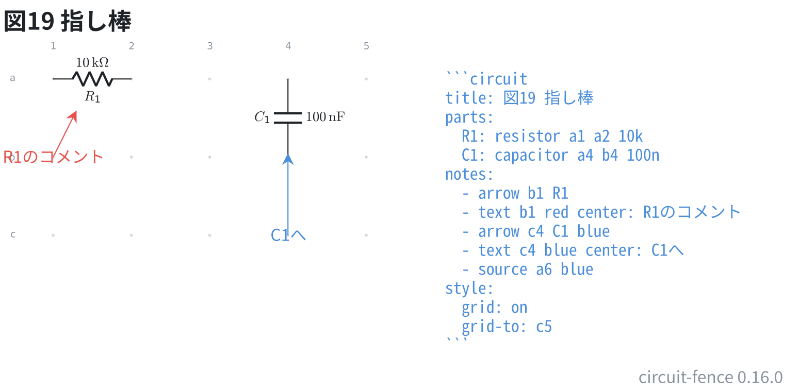

部品を指した端は記号の縁で止まり、番地を指した端はその交点まで伸びる。

### 直線 — `- line 起点 終点 [色]`

指し棒と同じ書き方で、**先端の矢が付かない**。表の罫線や区切りのように、
向きを持たない線を引くためのもの。両端の決まりも指し棒と同じで、
部品を指した端は記号の縁で止まり、番地を指した端はその交点まで伸びる。

```circuit
title: 図20 直線
parts:
  R1: resistor 2,2 4,2 10k
  R2: resistor 2,4 4,4 4.7k
notes:
  - line 1,1 5,1 ink
  - line 1,3 5,3 ink
  - line 1,5 5,5 ink
  - text 1,1.5 blue left: 罫線で仕切る
  - source 7,1 blue
style:
  grid: on
```

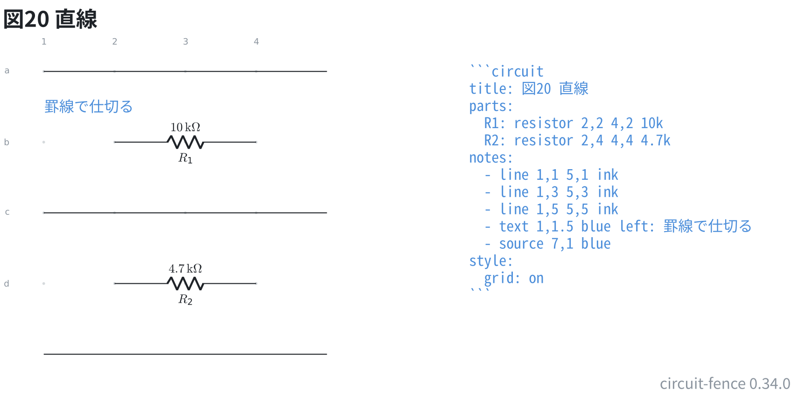

枠 (`box`) は角の番地の外へ余白を取るので、隣り合う枠は近づけると重なる。
**線には余白が無い**ので、細かく仕切りたいときはこちらを使う。

### 字 — `- text 番地 [色や大きさ・向き]: 文字`

番地が字の**左端**になる (寄せを書けば真ん中や右端にできる)。
指せるのは番地だけ (部品 ID は書けない)。

字は YAML の値として書く。`:` を含むときは `"…"` で囲む。
囲まないと YAML がマップとして読んでしまうので、そのときは
行番号つきで「`:` を含む文字は `"…"` で囲みます」と返る。

**注釈の字はプレビューでも日本語が出る**。部品の値と違って、フェンスの TeX には
字を渡さず、描き上がった図に差し込んでいるため。書き出す `.tex` のほうは
TeX に組ませるので、どちらでも同じ字が出る。

書ける字は英数字と `. + - / ( ) _ % :` と日本語、それに `µ` `Ω` `°`。
`\` `$` `,` `=` は値と同じく書けない (**注釈から任意の TeX を作らせない**ため)。
部品の 1 行をそのまま書き写せるように、`:` だけは値と違って通す。

### 字の見た目 — 大きさ・寄せ・太字・向き

番地のあとに言葉を並べると、字の見た目が変わる。`text` と `source` で
同じ言葉が使え、**どの順に書いてもよい**
(`- text 1,2 bold blue huge: …` も `- text 1,2 huge bold blue: …` も同じ)。

**向き**は `r90` / `r180` / `r270` (**時計回り**)。`text` にだけ書ける —
書き出し (`source`) は何行もあるので、回すと図の外の帯に収まらない。
**回るのは指し先のまわり**で、字の真ん中ではない。
語彙は 3 つのフェンスで揃えてあるが、**`mirror` はここでは書けない** —
breadboard と perfboard は字を指し先の上に置くので反対側へ逃がせるが、
circuit は**指し先そのもの**に置くので移す側が無い。

| 種類 | 書ける言葉 | 書かなかったとき |
| --- | --- | --- |
| 色 | `red` / `blue` / `green` / `orange` | 図のほかの文字と同じ色 |
| 大きさ | `tiny` / `small` / `normal` / `large` / `huge` | `normal` |
| 寄せ | `left` / `center` / `right` | `left` |
| 太字 | `bold` | 太字にしない |

行送りを選ぶ `tight` / `loose` だけは書き出し (`source`) にしか書けない。
1 行しかない `text` に書いても効かないので、書いたら行番号つきで返る。

```circuit
title: 図21 字の大きさ
parts:
  R1: resistor 1,1 2,1 10k
notes:
  - text 1,2 tiny: tiny (極小)
  - text 1,3 small: small (小)
  - text 1,4: 書かなければ普通
  - text 1,5 large: large (大)
  - text 1,6 huge: huge (極大)
  - source 3,1 blue
style:
  grid: on
  grid-to: 2,6
```

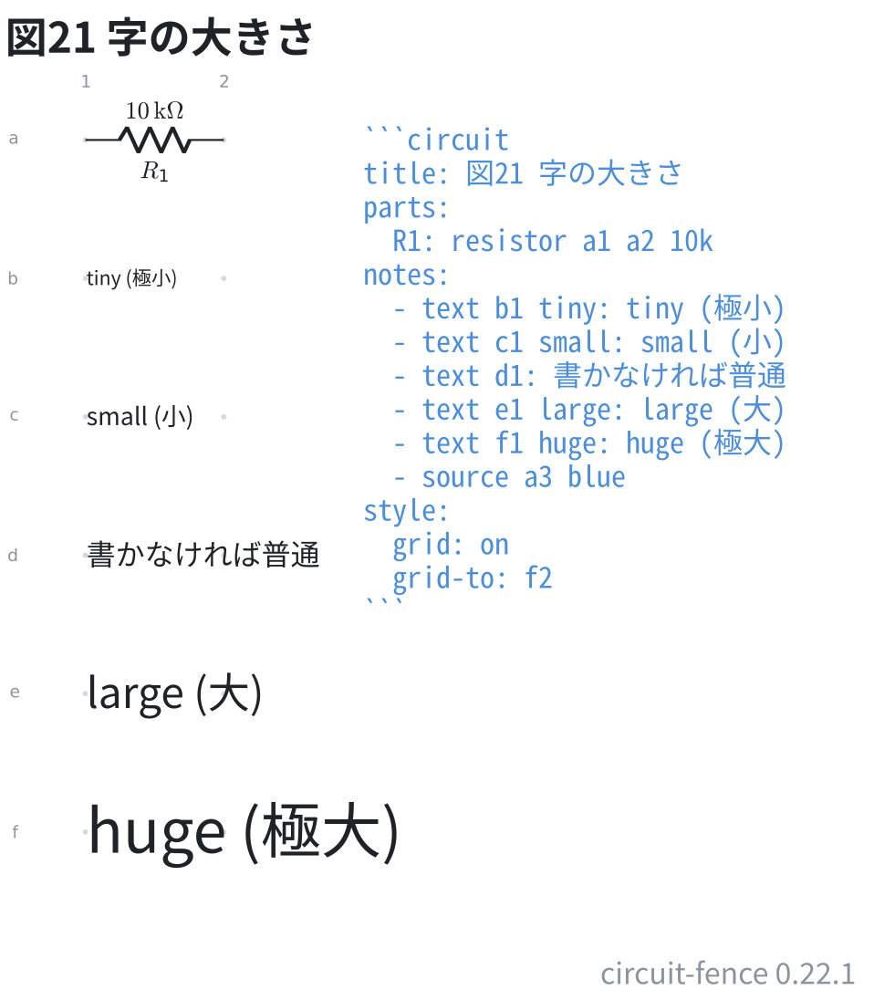

大きさは pt では書けない。色と同じで、**実機に通した指定だけ**を名前で引く
(プレビューの TeX はフォントが無いと例外ではなくプロセスごと落ちるので、
図に入る指定は必ず確かめたものにしてある)。

寄せは、番地を字の左端・真ん中・右端のどこにするかを決める。
**回した字は、伸びる向きも一緒に回る** — `r90` は下へ、`r270` は上へ伸びる。

```circuit
title: 図22 寄せ・太字・向き
parts:
  R1: resistor 1,1 2,1 10k
notes:
  - circle 2,2
  - text 2,2 left: left (番地が左端)
  - circle 2,3
  - text 2,3 center: center (番地が真ん中)
  - circle 2,4
  - text 2,4 right: right (番地が右端)
  - text 2,5 bold: bold で太字になる
  - text 4,1 r90: r90 で縦
  - text 5,5 r270: r270 で逆さ
  - source 7,1 blue
style:
  grid: on
  grid-to: 3,5
```

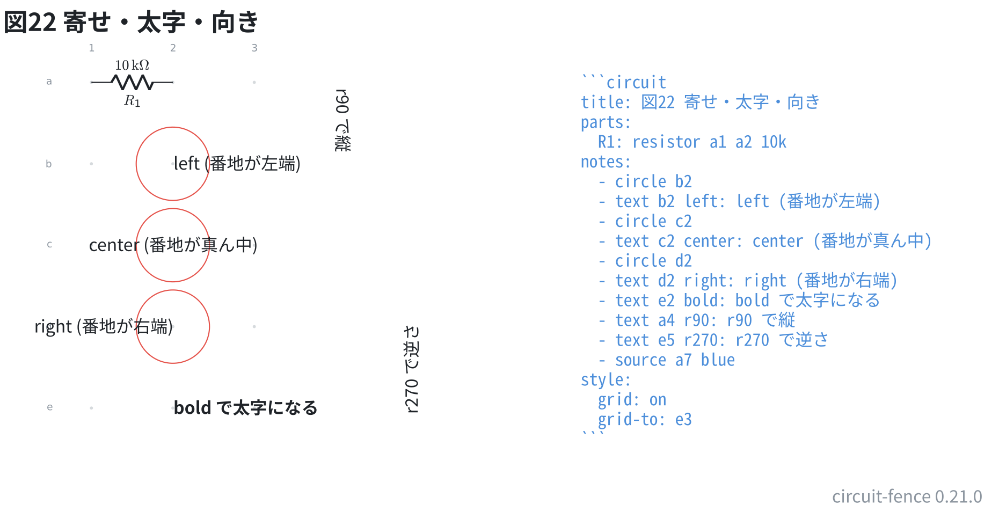

同じ種類の言葉を 2 回書くと、後に書いたほうが黙って勝つのではなく
行番号つきで返る。知らない言葉も、書ける言葉を添えて返る。

### 書き出し — `- source 番地 [色や大きさ]`

そのフェンスの中身を、**書いたとおりの姿で図に並べる**。囲みの ``` も付く。

プレビューではフェンスが図に差し替わるので、書いた YAML は読み手に見えない。
図の横に置いておくと、図と書き方を並べて読める。この文法リファレンスの
回路図はすべてこれで書き出してある。

中身は書き写すのではなく**フェンス自身から作る**ので、図を直すと書き出しも動く。
行送りは番地の刻みではなく字の高さで決まるので、行数が増えても図ほどは伸びない。
何行も続けて並ぶものなので、送りは字の注釈より詰めてまとまりとして読める形にしてある。

#### 行送り — `tight` / `loose`

| 語 | 行送り | 使いどころ |
| --- | --- | --- |
| `tight` | 字の高さちょうど | 長いフェンスを図の高さに収める |
| 書かない | その中間 (既定) | ふつうはこれ |
| `loose` | 字の注釈と同じ | 1 行ずつ指しながら説明する |

```circuit
title: 図23 行送り
parts:
  R1: resistor 1,1 2,1 10k
notes:
  - text 3,1 blue bold: tight
  - source 3,2 tight
  - text 10,1 blue bold: loose
  - source 10,2 loose
style:
  pitch: 1
```

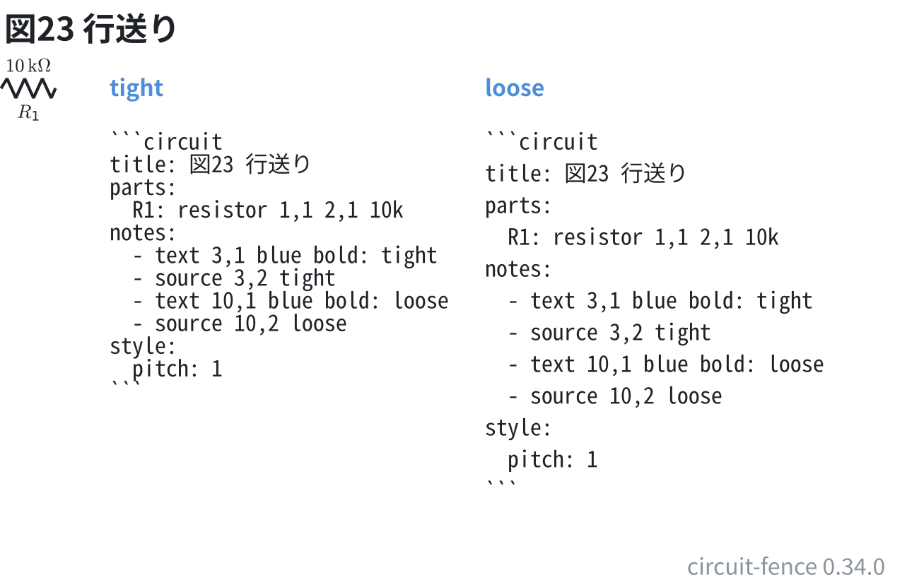

`tight` でも**字の高さは下回らない**。それより詰めると、上の行の下がりと
下の行の上がりが噛む。pt では書けないのは大きさと同じ理由で、
図に入る値を実機で確かめたものに限るため。

**行番号は添えない**。書き写せる形であることが値打ちなので、書いていない字を
混ぜない。帯が指す行は、書き出しの ``` から数えれば見つかる。
字の見た目の言葉も同じように書ける (長いフェンスは `tiny` で組むと収まる)。

書き出せるのは、YAML とフェンスの記法に出てくる字まで。TeX が自分の記法として
読む字 (`\` `$` `{` `}` `^`) がフェンスにあると、書き出しだけ描かずに
**その字のある行**を返す。

### 色

| 色 | 値 |
| --- | --- |
| `red` | `#e5534b` |
| `blue` | `#4c8eda` |
| `green` | `#2ea043` |
| `orange` | `#d29922` |
| `ink` | 図の線と同じ色 (テーマで変わる) |

パレットの 4 色はテーマを変えても変わらない (明暗どちらでも読める明度を
選んである)。`ink` だけは**図の線と同じ色**になり、テーマに合わせて変わる。
注釈で図の一部を描きたいとき — たとえば部品に付かない電流の矢を
指し棒で描くとき — に使う。

```circuit
title: 図24 注釈の色
parts:
  R1: resistor 1,1 3,1
  R2: resistor 4,1 6,1
  R3: resistor 1,3 3,3
  R4: resistor 4,3 6,3
notes:
  - circle R1 red
  - circle R2 blue
  - circle R3 green
  - circle R4 orange
  - text 2,1.7 red center: red
  - text 5,1.7 blue center: blue
  - text 1,2 blue: "R1: resistor a1 a3"
  - text 4,2 blue: "R2: resistor a4 a6"
  - text 2,3.7 green center: green
  - text 5,3.7 orange center: orange
  - text 1,4 blue: "R3: resistor c1 c3"
  - text 4,4 blue: "R4: resistor c4 c6"
style:
  grid: on
```

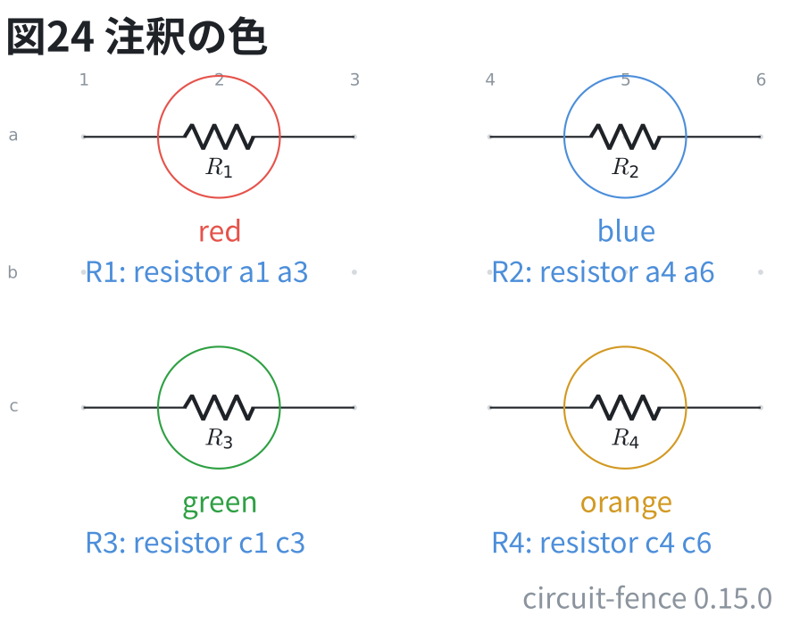

書けるのはこの 4 つだけ。明るいテーマでも暗いテーマでも読める値を選んであり、
テーマを変えても注釈の色は変わらない (地の色だけが変わる)。

印・枠・指し棒は色を書かなければ赤、字は書かなければ図のほかの文字と同じ色になる。

## 自動でやること

- **分岐の黒丸**: 端が 3 つ以上集まる交点に自動で打つ。
  2 つは通過か曲がりなので打たない。端が別の線の途中に乗った T 字にも打つ。
- **重なりの検出**: 同じ場所に 2 つ置いたら行番号つきで返す。
  どちらが間違いかは書いた人にしか分からないので、図には両方とも描く。
- **ネットリスト**: 図の下に畳んで出る。ポートが乗っているネットは
  ポート名、グラウンドが乗っていれば `GND`、どちらも無ければ `N1` から順に。
  グラウンドは離して描いても同じ節点として数える。

## 読めなかったとき

読めた部品は描き、読めなかった行は図の下に**行番号つき**で出る。
行番号は Markdown の行なので、そのまま直しに行ける。

```text
circuit: 7 行目: 種類 resistr は知りません (resistor のことですか?)
circuit: 9 行目: 0,26 は番地の形ではありません (番地は 1,1 から 99,99 まで。x が列、y が行)
```

頭の `circuit:` は、どのフェンスが言っているかの名札。プレビューの帯でも
CLI の標準エラーでも同じ形で出る。

**読めた部品が 1 つでもあれば図は出る。** YAML が転んだ行があっても、その行だけが
図から抜けて帯に出る。図が消えると、エディタで記号を置くことも動かすことも
できなくなるため。部品が 1 つも読めなかったときだけ、理由だけのカードが出る。

### 読めているが、思ったとおりには出ないもの

読めなかったわけではないので図は描ける。ただ、書いた人の思ったとおりには
出ないことがある。こういうものは**お知らせ**として、同じ帯に行番号つきで出る
(CLI では `お知らせ:` の名札が付く)。図は書いたとおりのまま描く。

- `--` でピンへ引いて**斜めに入る**とき
- 注釈の指し先が**部品 ID にも番地にも読める**とき
- ピンへ引いた線の途中に別の端が乗って見えるとき

見本は [../examples/errors/05-hints.md](../examples/errors/05-hints.md)。

#### お知らせを伏せる — `style: debug: off`

承知のうえで書いている図では、お知らせが毎回出るのが邪魔になる。
`style:` に `debug: off` と書くと、その図のお知らせだけが出なくなる。

```yaml
style:
  debug: off
```

- **伏せられるのはお知らせだけ**。読めなかった行は `off` でも必ず出る
  (伏せられると、直せるはずの間違いに気づけなくなる)
- **`check` は `off` でも言う**。文法を調べに行くために回すものなので、
  黙らせる指定より「見つけたことは言う」を優先する。伏せた図の見落としは
  ここで拾える
- 数えること自体はやめていない。処理系を組み込んで使う側 (`debug` は
  コンパイル結果に入っている) は、伏せた図のお知らせも受け取れる

## 題 (`title:`)

図の上に 1 行の題を載せる。書かなくてもよい。

```yaml
title: 図01 circuit フェンスの書き方
```

**題だけは `notes:` の字では置けない**。番地は `1,1` が最上段で、その上が無いため。
置き場所は図がどこまで広がったかから決まるので、ラベルも注釈も刻印も入れた
**図の左上**に載る。

大きさと太さは選べない (`large` の太字で固定)。1 枚に 1 つしか無いものなので、
選べるようにしても覚えることが増えるだけになる。色も選べず、図のほかの文字と
同じ色で出る。

書ける字は注釈の字と同じ。英数字と `. + - / ( ) _ % :` と日本語、
それに `µ` `Ω` `°`。`\` `$` `,` `=` は書けない。`:` が書けるので、
`title: "図02 R1: resistor の書き方"` のように部品の 1 行も題にできる
(YAML がマップとして読まないよう `"…"` で囲む)。

長さは 60 文字まで。折り返しは用意していないので、これを超える題は
図の幅をそれだけで決めてしまう。

## 見た目の設定 (`style:`)

テーマだけ選ぶなら 1 行で書ける。

```yaml
style: dark
```

細かく指定するときはマップで書く。

```yaml
style:
  theme: dark
  grid: on
  grid-to: 12,5
  width: 640
```

| 項目 | 書き方 | 既定 |
| --- | --- | --- |
| `theme` | `auto` / `light` / `dark` / `mono` | `auto` |
| `ink-color` | 線と文字の色 (`#rgb` か `#rrggbb`) | テーマの色 |
| `paper-color` | 端子の白丸など、地の色で塗るところ | テーマの色 |
| `grid-color` | グリッドの色 (点はこの色を薄めて描く) | テーマの色 |
| `grid` | `on` / `off` [大きさ] [色] | `off` |
| `grid-to` | グリッドを伸ばす先の番地 (`12,5`) | 使っている範囲 |
| `pitch` | 1 マスの大きさ (cm、0.5〜5) | `2` |
| `standard` | `american` / `european` / `jis` | `american` |
| `wire-width` | 線の太さ (pt、0.2〜4) | `0.8` |
| `width` | 出力の横ドット数 (120〜4000) | 読み手の字に合わせる |
| `stamp` | `on` / `off` (版を図の隅に刻む) | `on` |
| `check` | `on` / `off` (図の中身の検査を掛ける) | `on` |
| `debug` | `on` / `off` (お知らせを出す) | `on` |

`standard` は記号の流儀。`american` は抵抗がギザギザでコイルが巻線、`european`
(IEC 60617) は抵抗が箱でコイルが黒く塗った箱、論理ゲートも IEC の箱。`jis` は
**現行の JIS C 0617** (IEC 60617 準拠) で、抵抗が箱、**コイルが半円の連なり**、
電流は `european` と同じ矢、**電圧は + 側を指すまっすぐな矢** (`european` の弧は
− 側を指す)、論理ゲートは `american` と同じ MIL 記号 — 電験三種の問題用紙の図がこの形。「JIS の抵抗はギザギザ」は旧 JIS の記憶で、
JIS は 2 つある。

| 規格 | 抵抗 | コイル | 状態 | 近い流儀 |
| --- | --- | --- | --- | --- |
| 旧 JIS C 0301 | ギザギザ | 巻線 (ループ) | 1999 年に廃止 | `american` |
| 新 JIS C 0617 (IEC 60617 準拠) | 長方形 (箱) | 半円の連なり | 1997・1999 年に制定、現行 | `jis` |

`jis` が指すのは現行の C 0617 だけ。旧 JIS の流儀は無い (廃止された規格で、
試験にも現行の教科書にも出ない。見た目は `american` とほぼ同じ)。

線を太くすると、**グラウンドの記号は自動で広がる**。3 本の横棒の間隔は
記号の側で決まっているのに、棒の太さは線に付いてくるので、そのままだと
棒の間の白が先に無くなって 1 つの塊に見える。棒の間に白が残る大きさまで
広げている (細い線のときは記号の既定のまま)。

色は `#rgb` か `#rrggbb` だけを受ける。名前 (`red` など) は通さない
(検証済みの値しか図に入れないため)。名前で選びたいときはテーマを使う。

**色は `"…"` で囲む**。YAML は `#` から先をコメントとして落とすので、
`ink-color: #333` と書くと値が空のまま届く。囲み忘れたときは、
その旨を行番号つきで返す。

```yaml
style:
  ink-color: "#333"
```

### 図の大きさ — 既定は読み手の字に合わせる

`width` を書かなかった図は、**プレビューでは読み手の地の文に合わせて出る**。
注釈の `normal` がちょうど地の文と同じ大きさになる倍率で、
`markdown.preview.fontSize` を変えても拡大しても付いてくる。

合わせる先を表示に置いてあるのは、TeX の側では合わせようがないため。
図はドットで外寸が書かれた SVG で出てくるので、そのまま貼ると注釈の字が
周りの文章と噛み合わない (`normal` は 12pt = 16 ドットで動かないのに、
プレビューの地の文は既定 14 ドットで読み手が変えられる)。TeX の指定を
いくつにしても、読み手が字の大きさを変えれば同じだけずれる。

`width` を書いた図は、書いたとおりのドット数のまま。パネルより広い図は
どちらもパネルの幅まで縮む (縦横比はそのまま)。CLI が書き出す SVG は
**素の大きさのまま**で、貼り先の字の大きさをこちらから決めない。

### テーマ

- `auto` — **既定**。エディタの文字色をそのまま使うので、明るいテーマでも
  暗いテーマでも読める。1 枚描いた図をどちらでも使い回す (描き直さない)。
- `light` / `dark` — 明暗を決め打ちする。ノートの見た目を固定したいとき。
- `mono` — 黒一色。資料に貼るときや印刷するとき。**注釈の色も潰れる** —
  「黒一色」と言っている以上、注釈だけ色が残ると説明が嘘になるため。
  色を使いたい図では `mono` を選ばない。

### グリッド

`grid: on` にすると、部品を置ける位置が点で出る。行の番号は左に、列の番号は上に出て、
番地 `x,y` (列,行) と同じ数で読める。

**点は薄く、行と列の番号は濃く**出る。点は位置の目安でしかないが、
番号は読んで番地を数えるものなので、濃さを分けてある
(色は 1 つで、点だけを薄めて描いている)。

```circuit
title: 図25 グリッド
parts:
  IN:  port 1,1
  R1:  resistor 1,1 2,1 10k
  C1:  capacitor 2,1 2,2 100n
  OUT: port 3,1
  G1:  ground 2,2
wires:
  - 2,1 -- 3,1
notes:
  - source 4,1 blue
style:
  grid: on
  grid-to: 4,3
```

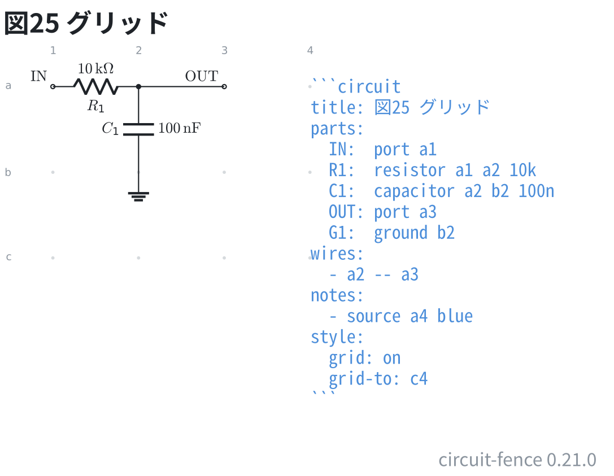

`grid-to` を書くと、使っていない範囲までグリッドが伸びる。
部品を動かす先が見えるので、番地を書き換えながら組むときに使う。

#### 行と列の番号の大きさ・色

`on` のあとに**大きさと色**を書ける (`grid: on large red`)。
語は注釈と同じ並びで、**順不同**。書かなければ既定のまま。

| 語 | 使える値 |
| --- | --- |
| 大きさ | `tiny` / `small` / `normal` / `large` / `huge` |
| 色 | `red` / `blue` / `green` / `orange` / `ink` |

変わるのは**字だけ**で、点は `grid-color` のまま。図を大きく貼るときや、
番地を読みながら説明するときに字を大きくする。

```circuit
title: 図26 グリッドの字の大きさと色
parts:
  R1: resistor 1,1 3,1 10k
  C1: capacitor 3,1 3,3 100n
notes:
  - source 5,1 blue
style:
  grid: on large red
```

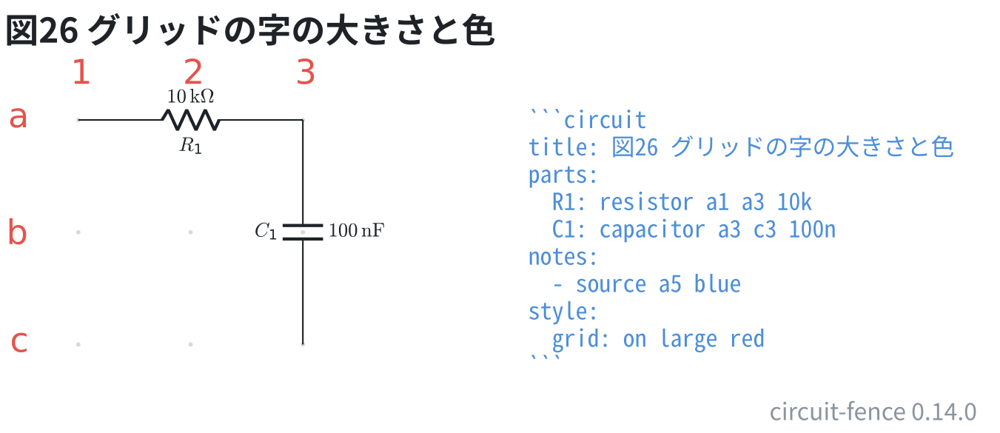

資料に貼る図では `grid: off` に戻してもよい。この文法リファレンスの図は、
どの番地に何を置いたかを数えられるように付けたままにしてある。

## バージョン

**番号は 1 つだけ**。構文にも処理系にも同じ番号が付く。
`circuit-fence 0.6.0` が組んだ図なら、その図の構文も 0.5.0 のもの。

構文に別の番号を振っていないのは、振ると変更のたびに「構文が上がるのか
処理系だけか」を決める手間が増えるのに、それで良くなるのは
「新しい構文を古い処理系で開いた」ときの文面だけだから。いまは知らない項目も
知らない語も[行番号つきで返る](#読めなかったとき)ので、そこは足りている。
構文が変わったことは semver の minor と
[CHANGELOG](../CHANGELOG.md) が表す。

### 図に刻む (`stamp:`)

何も書かなくても、その図を組んだ処理系の版が右下に出る。
消すときは `stamp: off` を書く。

```circuit
title: 図27 版の刻印
parts:
  IN:  port 1,1
  R1:  resistor 1,1 2,1 10k
  C1:  capacitor 2,1 2,2 100n
  OUT: port 3,1
  G1:  ground 2,2
wires:
  - 2,1 -- 3,1
notes:
  - source 4,1 blue
style:
  grid: on
```

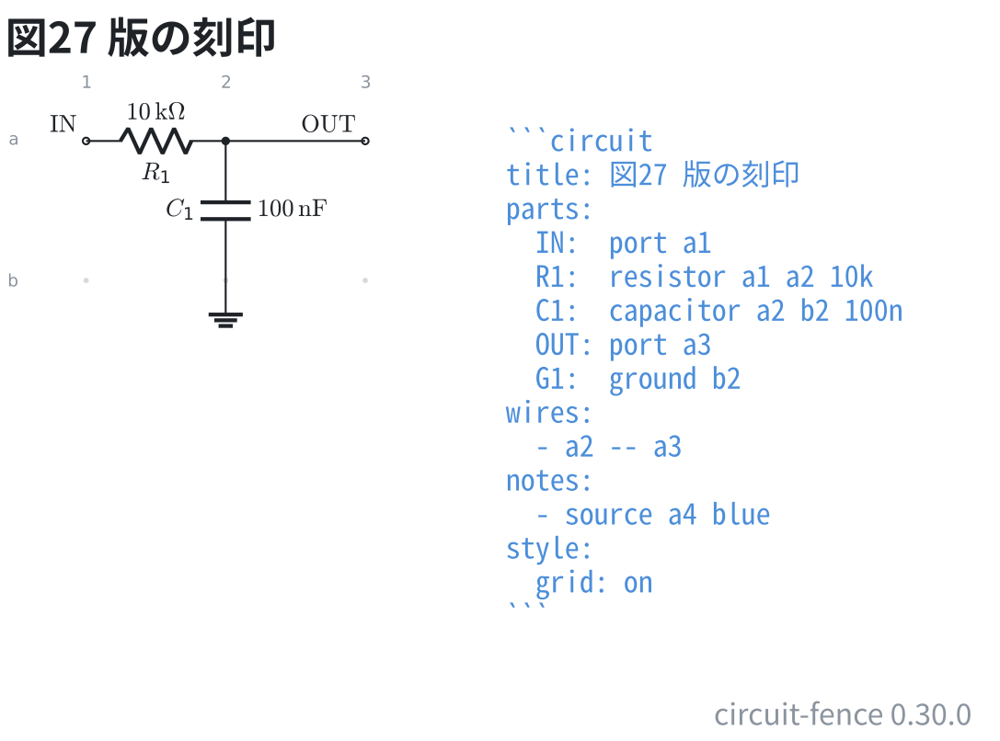

置き場所は番地からではなく、**図がどこまで広がったか**から決まる。
上の図で刻印が書き出しの右下に付いているのは、書き出しがそこまで
張り出しているため。

**字は書かない**。書けるのは出す/出さない (`stamp: on` / `off`) だけで、番号は処理系が埋める。
手で書けるようにすると、拡張機能を更新した瞬間にその字が嘘になる
(表示が無いことより、古い番号が出ているほうが害が大きい)。

刻印はグリッドと同じ色で、回路より薄く出る。`grid-color` で色が変わる。

### 図に残る (`data-circuit-fence`)

刻まない図にも、版は書き出した `.svg` の根に必ず入っている。

```text
<svg data-circuit-fence="0.8.0" ...>
```

図の見た目は変わらない。資料に貼った `.svg` を後から見て、どの版で描いたかを
確かめるためのもの。プレビューの図も同じ属性を持っている。

### 処理系に訊く (`--version`)

```bash
circuit-fence --version
```

## 書き出す (CLI)

```bash
circuit-fence render <ファイルかディレクトリ...> [--out <出力先>] [--emit-tex | --embed-fonts]
circuit-fence check  <ファイルかディレクトリ...>
circuit-fence --version
```

`.md` からは ` ```circuit ` フェンスを取り出し、`.yaml` はそのまま 1 枚として扱う。
1 枚につき `.tex` と `.svg` が出る。見出しとネットリストは標準出力に、読めなかった行と
お知らせはプレビューと同じ文面で標準エラーに出る (ブレッドボードとユニバーサル基板のフェンスと同じ分け方。
`2>/dev/null` でネットリストだけを取れる)。

### `check` — 図を描かずに確かめる

何も書き出さず、読めなかった行とネットリストと **ERC** を出す。
図を描かないので WASM の TeX を回さず、`examples` 全部でも 0.1 秒で終わる。
書きながら回すときと、CI で文法だけを見るときのための道。

```bash
circuit-fence check notes.md
```

見出しは読めたときだけ「読めました」、読めなかった行があれば「N 件読めませんでした」。
読めなかった行が 1 つでもあれば 0 以外で終わる。**ERC は終了コードを変えない**
— 図は書かれたとおりに描けているので、直すかどうかは書いた人が決める。

#### ERC — 組んでも動かない図の指摘

読めなかったわけでも描けなかったわけでもないが、**そのとおりに組むと
動かない**ところを言う。4 つを見る。

| 見るもの | 例 |
| --- | --- |
| どこにもつながっていない端 | 片方だけつないだ抵抗、宙に浮いたグラウンド |
| どの配線も指していないピン | トランジスタの C と E を書き忘れた |
| 両端が同じネットに来ている部品 | 抵抗を入れたつもりが線で跨いでいた |
| 部品のピンを 1 つもつないでいない配線 | 引きかけて忘れた線 |

**プレビューには出ない。確かめたいときだけ出る。** 記号を 1 つ見せる図や
書き方の例は端が開いているのが当たり前で、描くたびに叱ると帯を読まなくなる
(KiCad の ERC と同じ立て付け)。`style: check: off` を書いた図では走らない。

出るのは 2 か所。

| どこ | どう出るか |
| --- | --- |
| `circuit-fence check` | 読めなかった行と同じ標準エラーへ、`お知らせ:` の名札つきで |
| **editor の帯の「検査 N」の釦** | 件数はいつも出ていて、押すと帯に広がる。もう一度押すと畳む |

釦は**押した人の手元だけの状態**で、フェンスには書かない (開き直すと畳んだ
状態に戻る)。件数はいつも数えているので、**押す前に見るものがあるかが分かる**。

出ないものが 3 つある。どれも「正しい図が毎回叱られる」のを避けるため:

- **配線が 1 本も無い図**。記号を並べた表であって回路ではない
- **交点まで線を引いて終えた端**。線が引いてあるのは「ここまでは意図した」印
- **`points:` で名前を付けた節点**と `port` / `antenna` / `vcc` / `vee`。
  どれも「ここから外へ出入りする」という意思表示

### `--embed-fonts` — プレビューの外でも字を化けさせない

書き出す `.svg` に、図が使っている TeX のフォント (`cmr10` `cmmi10` など) を埋め込む。

```bash
circuit-fence render notes.md --embed-fonts --out out
```

TeX が描いた字は、SVG の中で Unicode ではなく**フォントの中の番号**のまま入っている
(`Ω` は `¬`、`µ` は `¹`、数式の小数点は `:`)。プレビューはそのフォントを読み込んでいるので
正しく出るが、書き出した `.svg` をブラウザや GitHub で開くと化ける。普通のフォントを
入れても直らない (要るのは同じ番号の並びを持つ、このフォントそのもの)。

埋め込むのは図が使っているフォントだけで、1 枚が 150 KB ほど大きくなる。
**既定では埋め込まない**。`notes:` と題の字は Unicode なので、埋め込まなくても化けない。
`--emit-tex` とは一緒に使えない (図を描かないので、埋め込む先が無い)。

### `--emit-tex` — 手元の LaTeX で組む

図を描かず、**xelatex に渡す `.tex` だけ**を書き出す。
プレビュー用の `.tex` と同じ名前なので、`--out` を分けて書き出す。

```bash
circuit-fence render notes.md --emit-tex --out tex
xelatex -output-directory tex tex/notes.tex
```

書き出したほうはフォントもパッケージも積めるので、**フェンスとは 3 つだけ違う**。

| | プレビュー (フェンス) | `--emit-tex` |
| --- | --- | --- |
| 日本語の値 | 描けない (行番号つきで返る) | 描ける |
| 単位 | `100 µF` (µ は数式の斜体) | `100 µF` (siunitx。µ は立体) |
| オペアンプ | 三角形 + 手描きの ± | 本物の `op amp` |

番地も配線も黒丸も同じなので、**プレビューで位置を確かめてから書き出せる**。
違いをこの 3 つに絞ってあるのは、確かめた図と書き出した図を食い違わせないため。

可変抵抗・可変コンデンサの矢のように、circuitikz の版で向きが違う記号には
**的ごとに違う指定を足している**。TeX の綴りは違うが**出る図は同じ**なので、この表には入らない。

`notes:` の字はこの表に入らない。フェンスでは TeX に渡さず描き上がった図へ
差し込み、書き出すほうは TeX に組ませるので、**どちらでも同じ日本語が出る**。

日本語のフォントは `\newfontfamily` の 1 行にある (既定は `Noto Sans CJK JP`)。
手元に無ければその 1 行を書き換える。値が全部 ASCII のときはその行を書かない。

値に書ける字は、`--emit-tex` では日本語と `µ` `Ω` `°` が増えるだけ。
`\` `$` `,` `=` などはどちらの向けでも書けない
(**値から任意の TeX を作らせない**ため)。

プレビュー用と書き出し用の `.tex` は同じ名前になるので、片方の上に
もう片方を書こうとしたら、書かずに知らせて止まる (`--out` を分ける)。
