# circuit フェンスの書き方

Markdown の ` ```circuit ` フェンスに YAML を書くと、Markdown プレビュー
(`Ctrl+Shift+V`) で回路図になる。

```circuit
parts:
  IN:  port a1
  R1:  resistor a1 a3 10k
  C1:  capacitor a3 c3 100n
  OUT: port a4
  G1:  ground c3
wires:
  - a3 -- a4
notes:
  - source a6 blue
style:
  grid: on
```

書けるのは `parts:` と `wires:` と `notes:` と `style:` の 4 つ。
ここに出てくる項目は 1 つずつ図にしてある ([../examples/README.md](../examples/README.md))。

## 番地

置く場所は**番地**で書く。座標も `\coordinate` も書かない。

- 行は英字 `a`〜`z` (上から下)
- 列は数字 `1`〜`99` (左から右)
- `a1` が左上。大文字で書いてもよい (`A1` は `a1` と同じ)

グリッドの宣言は要らない。使った番地から図の大きさが決まる。
1 マスは 2cm 相当で、隣り合うマスの間に 2 端子部品が 1 個収まる。

## 部品 (`parts:`)

`ID: 種類 番地 …` の 1 行で書く。ID は図に出るラベルであり、
ネットリストで端子を指す名前でもある。

### 2 端子部品 — `ID: 種類 番地 番地 [値]`

| 種類 | 何 | 値の単位 | 例 |
| --- | --- | --- | --- |
| `resistor` | 抵抗 | Ω | `R1: resistor a1 a3 10k` |
| `resistor-var` | 可変抵抗 (2 端子) | Ω | `R2: resistor-var a1 a3 10k` |
| `potentiometer` | ポテンショメータ (3 端子) | Ω | `P1: potentiometer b1 b5 10k` |
| `capacitor` | コンデンサ | F | `C1: capacitor a3 c3 100n` |
| `ecap` | 電解コンデンサ | F | `C2: ecap a5 c5 100u` |
| `varicap` | バリキャップ | F | `D4: varicap a5 a7 33p` |
| `inductor` | コイル | H | `L1: inductor a5 a7 10m` |
| `photoresistor` | CdS セル | Ω | `R3: photoresistor a13 a15` |
| `thermistor` | サーミスタ | Ω | `R4: thermistor c1 c3 10k` |
| `thermistor-ntc` | NTC サーミスタ | Ω | `R5: thermistor-ntc c5 c7 10k` |
| `thermistor-ptc` | PTC サーミスタ | Ω | `R6: thermistor-ptc c9 c11` |
| `varistor` | バリスタ | (型番) | `R7: varistor c13 c15 470V` |
| `crystal` | 水晶振動子 | Hz | `X1: crystal a9 a11 16M` |
| `diode` | ダイオード | (型番) | `D1: diode c1 c3 1N4148` |
| `led` | LED | (型番) | `D2: led c5 c7` |
| `zener` | ツェナー | (型番) | `D3: zener c9 c11 5V1` |
| `schottky` | ショットキー | (型番) | `D5: schottky e1 e3 1N5819` |
| `photodiode` | フォトダイオード | (型番) | `D6: photodiode e5 e7` |
| `diac` | ダイアック | (型番) | `D7: diac e9 e11` |
| `thyristor` | サイリスタ (SCR) | (型番) | `T1: thyristor d1 d5` |
| `triac` | トライアック | (型番) | `T2: triac f1 f5` |
| `vsource` | 直流電源 | V | `V1: vsource e1 e3 5` |
| `sine` | 交流電源 (正弦波) | V | `V2: sine e5 e7 1` |
| `square` | 方形波電源 | V | `V3: square e13 e15 5` |
| `triangle` | 三角波電源 | V | `V4: triangle g1 g3 1` |
| `isource` | 定電流源 | A | `I1: isource e9 e11 20m` |
| `battery` | 電池 | V | `B1: battery g1 g3 9` |
| `solar` | 太陽電池 | V | `PV1: solar g5 g7 0.6` |
| `switch` | スイッチ (a 接点) | (なし) | `S1: switch g5 g7` |
| `switch-nc` | スイッチ (b 接点) | (なし) | `S2: switch-nc g9 g11` |
| `button` | 押しボタン (a 接点) | (なし) | `S3: button g13 g15` |
| `button-nc` | 押しボタン (b 接点) | (なし) | `S4: button-nc i1 i3` |
| `reed` | リードスイッチ | (なし) | `S5: reed i5 i7` |
| `fuse` | ヒューズ | (定格) | `F1: fuse g9 g11 3A` |
| `lamp` | ランプ | (なし) | `P1: lamp i1 i3` |
| `speaker` | スピーカー | (なし) | `LS1: speaker i9 i11` |
| `mic` | マイク | (なし) | `MK1: mic i13 i15` |
| `ammeter` | 電流計 | (なし) | `A1: ammeter k1 k3` |
| `voltmeter` | 電圧計 | (なし) | `V5: voltmeter k5 k7` |
| `ohmmeter` | 抵抗計 | (なし) | `M1: ohmmeter k9 k11` |

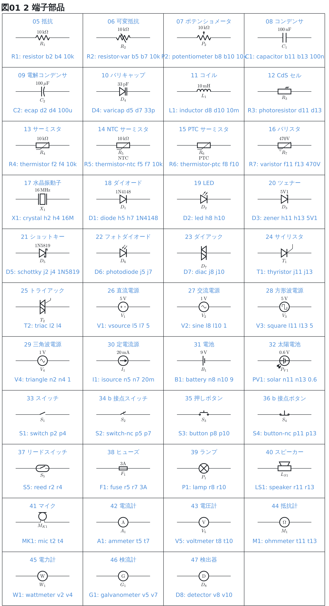

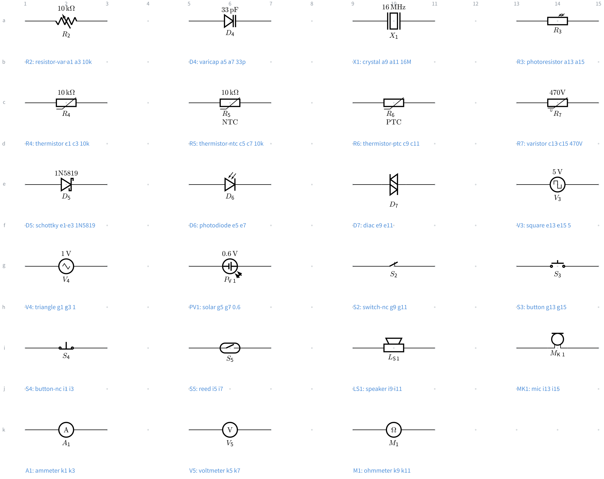

記号の下の青い行は、その記号を出すために書いた 1 行そのもの
([注釈](#注釈-notes) で重ねてある)。

`ecap` は**先に書いた番地が + 側**になる (記号の平らな板のほう)。
`C2: ecap a5 c5` なら a5 が +。`vsource` と `battery` も同じで、
`V1: vsource e1 e3` なら e1 が + 側。

circuitikz の記号をそのまま使わず、**回路図の慣習の形に寄せている**ものが 4 つある。

- **丸い電源** (`vsource` / `sine` / `square` / `triangle`) — circuitikz は
  丸の中身を**縦置き前提で 90 度回して**描くので、横に引くと − が縦棒になり、
  波形も縦に寝る。丸だけの記号にして、+ と − や波形は自分で描いている。
  **波形は図に対していつも水平**なので、縦にも斜めにも置ける
- **計器 3 つ** (`ammeter` / `voltmeter` / `ohmmeter`) — **丸に字だけ**で描く。
  circuitikz の電流計・電圧計は丸に指針の矢が入り、抵抗計は Ω が太字の数式で
  フォントが無くて**プロセスごと落ちる**。矢の無い記号に字を渡して 3 つ揃えた
- **可変抵抗** (`resistor-var`) — 矢は右上を向く。プレビューの circuitikz だけ
  矢先が左下を向くので、そちらでだけ上下を返している (出る図は書き出しと同じ)
- **NTC / PTC サーミスタ** — 記号の中の θ が小さすぎて字形が無く `#` で出る。
  素のサーミスタの記号にして、**区別は ID の下に字で書く**

`transformer` は**鉄芯つき**の記号で描く (circuitikz の既定は空芯)。
足の指し方は変わらない。

### 多端子部品 — `ID: 種類 番地 [向き] [型番]`

1 つの番地に記号を置き、足は名前で指す (`Q1.B` `U1.out`)。

| 種類 | 何 | 足の名前 |
| --- | --- | --- |
| `npn` / `pnp` | バイポーラトランジスタ | `B` `C` `E` (`base` `collector` `emitter`) |
| `nigbt` / `pigbt` | IGBT | `G` `C` `E` (制御端子はゲート) |
| `nmos` / `pmos` | MOSFET (簡易記号) | `G` `D` `S` (`gate` `drain` `source`) |
| `njfet` / `pjfet` | 接合型 FET (JFET) | 同上 |
| `nmos-e` / `pmos-e` | MOSFET (エンハンスメント型) | 同上 |
| `nmos-d` / `pmos-d` | MOSFET (デプレッション型) | 同上 |
| `opamp` | オペアンプ | `+` `-` `out` |
| `transformer` | トランス | `A1` `A2` (1 次) / `B1` `B2` (2 次) |
| `and` / `or` / `nand` / `nor` / `xor` / `xnor` | ロジックゲート (2 入力) | `a` `b` (`1` `2`) / `out` |
| `not` / `buffer` | ロジックゲート (1 入力) | `in` / `out` |
| `spdt` | 切り替えスイッチ | `in` (`c`) / `1` `2` |
| `dip8` `dip14` `dip16` `dip20` `dip28` `dip40` | DIP の IC | `1` 〜 足の本数 |

FET は**足の名前がどれも同じ**なので、記号だけ後から差し替えられる。
`nmos` / `pmos` はチャネルを 1 本で描いた簡易記号で、記事でよく使うのは
こちら。書き分けたいときだけ `-e` (エンハンスメント型。チャネルが切れる) と
`-d` (デプレッション型。チャネルがつながる) を使う。

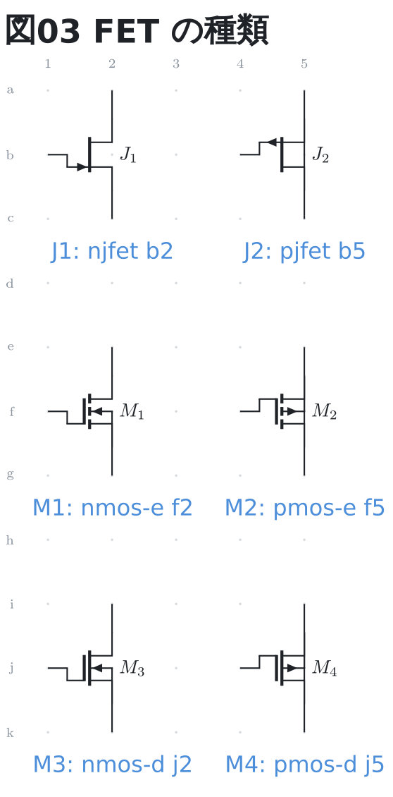

ロジックゲートの入力は `a` `b` でも番号 (`1` `2`) でも呼べる。
`not` と `buffer` は入力が 1 本なので `in`。

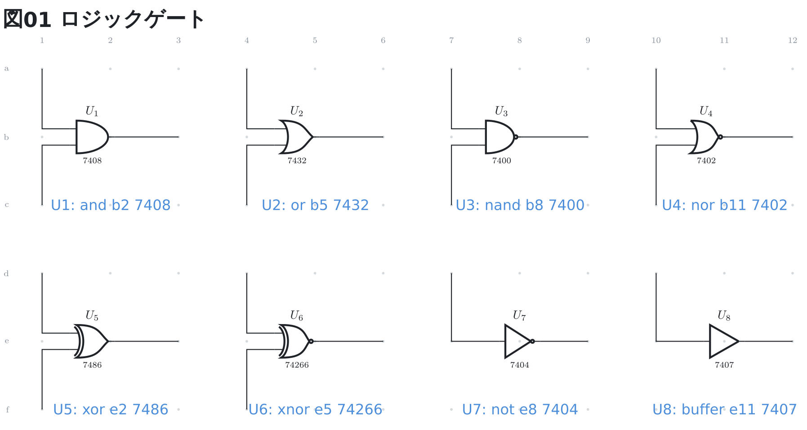

DIP の IC は**足の本数が種類の名前に入っている** (`dip8` から `dip40` まで)。
足は番号で指し (`U1.1`)、型番は記号の**中**に出る。

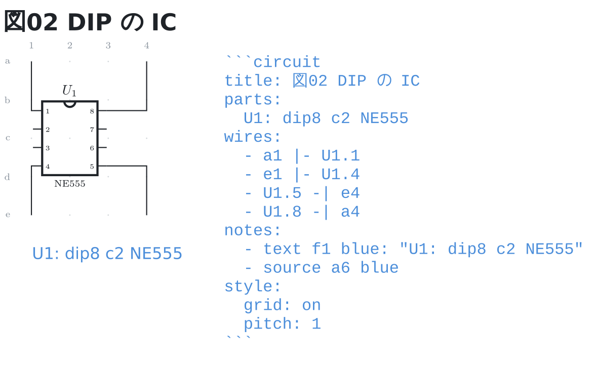

向きは今のところオペアンプの `+up` / `+down` だけ (± の上下)。
`+up` にすると帰還を下に回せるので線が交差しにくい。

```circuit
parts:
  IN:  port b1
  Rb:  resistor b3 e3 100k
  G1:  ground e3
  U1:  opamp c5 +up
  R2:  resistor d4 e4 1k
  G2:  ground e4
  R3:  resistor d4 d7 10k
  OUT: port c9
wires:
  - b1 -- b3
  - b3 |- U1.+
  - d4 |- U1.-
  - U1.out -- c7
  - c7 -- c9
  - d7 -- c7
notes:
  - source a11 blue
style:
  grid: on
```

**足へは `-|` か `|-` で引く**。足は記号ごとに決まった位置にあって格子の上に
無いので、`--` (まっすぐ) で番地とつなぐと**斜めの線になる**。`|-` なら先に縦、
それから横に入るので、回路図らしく直角に入る。

帰還の節点は記号の真下ではなく**少し横にずらす** (上の例で `d5` ではなく `d4`)。
真下に置くと、足へ向かう線が記号の体を突き抜けて見える。

**足へ引いた線の途中には当てられない**。線がどこを通るかがこちら側では
分からず、T 字かどうかを決められないため。上の例のように、当てたい番地 (`c7`)
を通る配線に分けて書く。当てて書くと、その旨を行番号つきで伝える。

### 2 端子でも足を持つもの

ポテンショメータのワイパーと、サイリスタ・トライアックのゲートは、
**両端を番地で置いたうえで 3 本目を名前で指す**。書き方は 2 端子部品のままで、
足だけ `P1.w` `T1.g` のように呼ぶ。

| 種類 | 足 |
| --- | --- |
| `potentiometer` | `w` (`wiper`) |
| `thyristor` / `triac` | `g` (`gate`) |

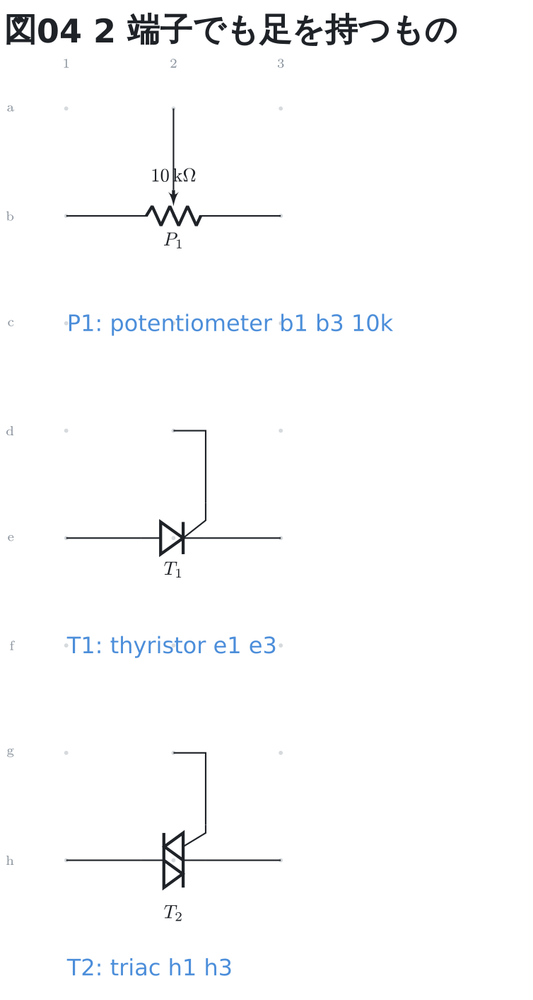

ワイパーは記号の**真上**に出るので、そのまま `--` で上の番地へ引ける。
ゲートは横にずれた位置にあるので、ほかの足と同じく `|-` で直角に入れる。

### 1 端子の記号 — `ID: 種類 番地`

| 種類 | 何 | 例 |
| --- | --- | --- |
| `port` | 端子 (白丸 + 名前) | `IN: port a1` |
| `ground` | グラウンド | `G1: ground c3` |
| `vcc` | 電源レール (上向きの矢印 + 名前) | `VCC: vcc a1` |
| `vee` | 電源レール (下向きの矢印 + 名前) | `VEE: vee c4` |

`port` と `vcc` / `vee` は **ID がそのまま図に出て、乗っているネットの名前にもなる**
(`ground` は名前を出さず、ネットは `GND` になる)。

グラウンドは離して描いても同じ節点として数えるが、**電源レールはそうしない**
(`5V` と `3V3` を同じネットにしてしまうため)。つなぐなら配線を引く。

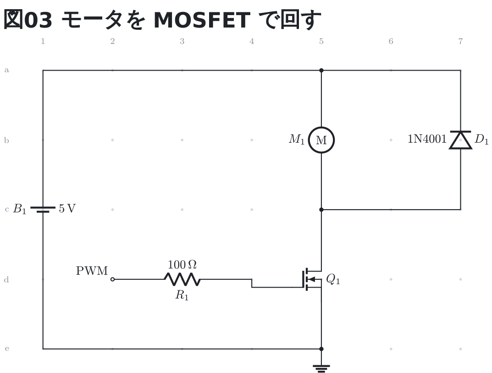

### 略記

よく書く種類には短い名前がある。正式名と**同じ意味**で、
`R1: r a1 a3 10k` は `R1: resistor a1 a3 10k` と 1 文字も違わない図になる。
図・ネットリスト・エラーに出るのは**正式名のほう**。

| 略記 | 種類 | 略記 | 種類 |
| --- | --- | --- | --- |
| `r` | `resistor` | `ec` | `ecap` |
| `c` | `capacitor` | `pot` | `potentiometer` |
| `l` | `inductor` | `ldr` | `photoresistor` |
| `d` | `diode` | `ntc` | `thermistor-ntc` |
| `i` | `isource` | `ptc` | `thermistor-ptc` |
| `v` | `vsource` | `xtal` | `crystal` |
| `dc` | `vsource` | `scr` | `thyristor` |
| `ac` | `sine` | `bat` | `battery` |
| `gnd` | `ground` | `sw` | `switch` |
| `op` | `opamp` | `btn` | `button` |

**全部の種類にはない**。SPICE の素子文字 (`r` `c` `l` `d` `i` `v`) と、
回路図で通っている略語だけにしてある。`and` や `dip8` のように元から短いもの、
`q` (npn か pnp か決まらない) のように**指すものが 1 つに決まらないもの**は
略記を持たない。

### ID の出方

先頭 1 文字が本体、残りが添字になる (回路図の慣習どおり)。
`R1` は R の添字 1、`Rload` は R の添字 load、`R` はそのまま。

### 値の出方

種類から単位を補う。抵抗の `10k` は 10 kΩ、コイルの `10m` は 10 mH。
数字と SI 接頭辞 (`k` `M` `G` `m` `u` `n` `p`) の組でないときは、
書いたとおりに出る (`1N4148` や `3A` はそのまま。単位を勝手に足さない)。

ID は記号の下 (縦置きなら左)、値は反対側に出る。

値に使えるのは英数字と `. + - / ( ) _ %` だけ。
`,` と `=` は circuitikz がオプションの区切りとして読んでしまうので使えない
(小数点は `.` で書く)。日本語は**フェンスの TeX にフォントが無い**ので描けない。

## 配線 (`wires:`)

`- 端点 -- 端点` を並べる。端点は番地か、多端子部品の足 (`U1.out`)。
演算子は TikZ と同じ 3 つ。

| 演算子 | 引き方 |
| --- | --- |
| `--` | 2 点の間をまっすぐ (斜めもそのまま) |
| `-\|` | 先に横、それから縦 |
| `\|-` | 先に縦、それから横 |

```circuit
parts:
  R1: resistor a1 a3
  R2: resistor a5 a7
wires:
  - a3 -- a5
notes:
  - source a9 blue
style:
  grid: on
```

## 斜めに置く

部品も配線も**斜めに置いてよい**。行も列も揃っていない 2 点の間に、
そのまま引く。

```circuit
parts:
  R1: resistor a1 c4
  R2: resistor c4 a7
wires:
  - a1 -- a7
notes:
  - source a9 blue
style:
  grid: on
```

通らないのは両端が同じ番地のときだけ (向きも長さも決まらないため)。

## 注釈 (`notes:`)

図の上に印と字を重ねる。**回路の一員ではない**ので、ネットリストにも
分岐の黒丸にも数えない (図から消しても回路は変わらない)。

書けるのは 5 種類。

| 種類 | 書き方 | 何が出るか |
| --- | --- | --- |
| 印 | `- circle 指し先 [色]` | 部品や交点を囲む丸 |
| 枠 | `- box 番地 番地 [色]` | 図の一角を囲む破線の枠 |
| 指し棒 | `- arrow 起点 終点 [色]` | 起点から終点への矢印 |
| 字 | `- text 番地 [色や大きさ]: 文字` | 図に重ねる字 |
| 書き出し | `- source 番地 [色や大きさ]` | フェンスの中身そのもの |

```circuit
parts:
  IN:  port a1
  R1:  resistor a1 a3 10k
  C1:  capacitor a3 c3 100n
  OUT: port a4
  G1:  ground c3
wires:
  - a3 -- a4
notes:
  - source a6 blue
  - circle R1
  - text e1: ここでカットオフ 159 Hz
style:
  grid: on
```


### 印 — `- circle 指し先 [色]`

指し先は**部品 ID か番地**。部品を指すと記号の真ん中に、番地を指すと
その交点に丸が出る。丸の大きさは決め打ちで、番地の間隔を変えても変わらない
(記号そのものの大きさに合わせてある)。

部品 ID を先に探し、無ければ番地として読む。番地は大小どちらでも書けるので、
`C1` という部品がある図では番地 c1 を指せない (部品のほうが勝つ)。

### 枠 — `- box 番地 番地 [色]`

2 つの番地を対角にした枠を破線で引く。「この一角がフィルタ部」のように、
図の一角をまとめて囲むためのもの。角の番地の外側に余白を取るので、
縁に置いた記号やそのラベルは枠に噛まない。

角に書けるのは**番地だけ**。部品 ID は書けない (2 端子部品は番地の間隔とは
別の長さで描かれるので、記号がどこまで広がっているかを枠の側では決められない)。
同じ番地を 2 回書くと、その 1 マスだけを囲む。

### 指し棒 — `- arrow 起点 終点 [色]`

起点から終点へ矢印を引く。両端とも、印と同じく**部品 ID か番地**。

部品を指した端は、印 (`circle`) と同じ丸の縁で止まる。真ん中まで伸ばすと
先端が記号の下に隠れて、何を指しているのか分からなくなるため。
番地を指した端はその交点まで伸びる。

起点と終点が同じところだと向きが決まらないので、行番号つきで返る。

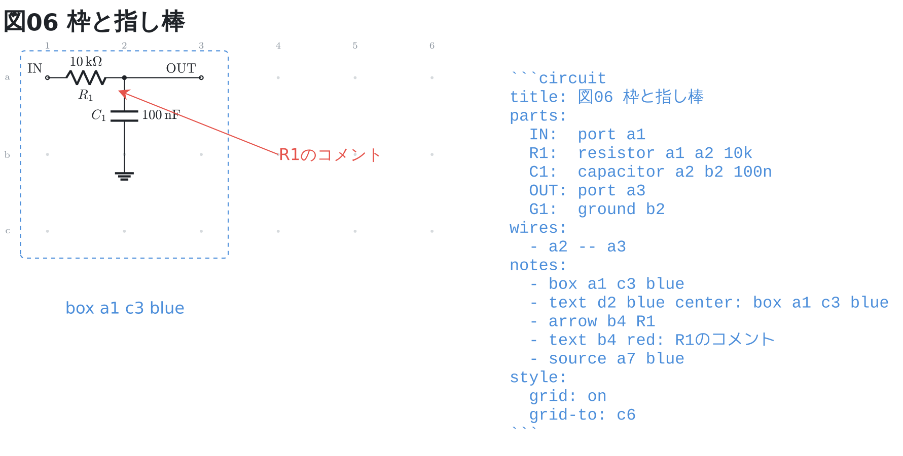

### 字 — `- text 番地 [色や大きさ]: 文字`

番地が字の**左端**になる (寄せを書けば真ん中や右端にできる)。
指せるのは番地だけ (部品 ID は書けない)。

字は YAML の値として書く。`:` を含むときは `"…"` で囲む。
囲まないと YAML がマップとして読んでしまうので、そのときは
行番号つきで「`:` を含む文字は `"…"` で囲みます」と返る。

**注釈の字はプレビューでも日本語が出る**。部品の値と違って、フェンスの TeX には
字を渡さず、描き上がった図に差し込んでいるため。書き出す `.tex` のほうは
TeX に組ませるので、どちらでも同じ字が出る。

書ける字は英数字と `. + - / ( ) _ % :` と日本語、それに `µ` `Ω` `°`。
`\` `$` `,` `=` は値と同じく書けない (**注釈から任意の TeX を作らせない**ため)。
部品の 1 行をそのまま書き写せるように、`:` だけは値と違って通す。

### 字の見た目 — 大きさ・寄せ・太字

番地のあとに言葉を並べると、字の見た目が変わる。`text` と `source` で
同じ言葉が使え、**どの順に書いてもよい**
(`- text b1 bold blue huge: …` も `- text b1 huge bold blue: …` も同じ)。

| 種類 | 書ける言葉 | 書かなかったとき |
| --- | --- | --- |
| 色 | `red` / `blue` / `green` / `orange` | 図のほかの文字と同じ色 |
| 大きさ | `tiny` / `small` / `normal` / `large` / `huge` | `normal` |
| 寄せ | `left` / `center` / `right` | `left` |
| 太字 | `bold` | 太字にしない |

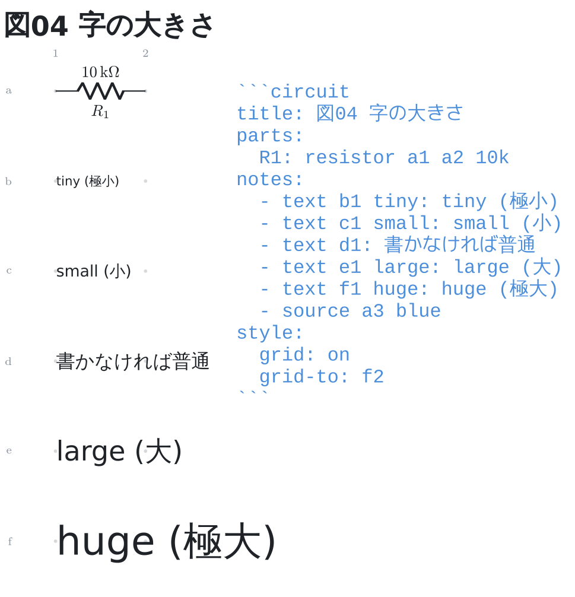

大きさは pt では書けない。色と同じで、**実機に通した指定だけ**を名前で引く
(プレビューの TeX はフォントが無いと例外ではなくプロセスごと落ちるので、
図に入る指定は必ず確かめたものにしてある)。

寄せは、番地を字の左端・真ん中・右端のどこにするかを決める。

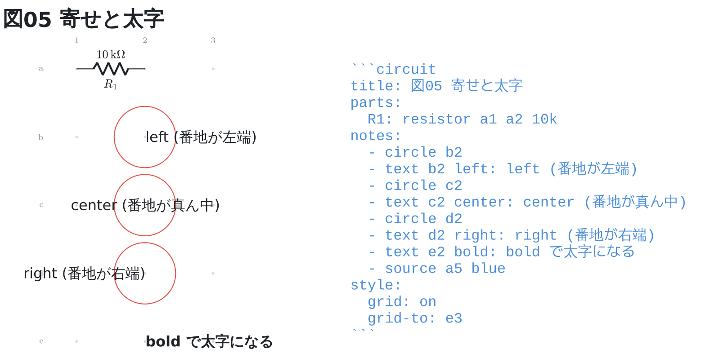

同じ種類の言葉を 2 回書くと、後に書いたほうが黙って勝つのではなく
行番号つきで返る。知らない言葉も、書ける言葉を添えて返る。

### 書き出し — `- source 番地 [色や大きさ]`

そのフェンスの中身を、**書いたとおりの姿で図に並べる**。囲みの ``` も付く。

プレビューではフェンスが図に差し替わるので、書いた YAML は読み手に見えない。
図の横に置いておくと、図と書き方を並べて読める。この文法リファレンスの
回路図はすべてこれで書き出してある。

中身は書き写すのではなく**フェンス自身から作る**ので、図を直すと書き出しも動く。
行送りは番地の刻みではなく字の高さで決まるので、行数が増えても図ほどは伸びない。

**行番号は添えない**。書き写せる形であることが値打ちなので、書いていない字を
混ぜない。帯が指す行は、書き出しの ``` から数えれば見つかる。
字の見た目の言葉も同じように書ける (長いフェンスは `tiny` で組むと収まる)。

書き出せるのは、YAML とフェンスの記法に出てくる字まで。TeX が自分の記法として
読む字 (`\` `$` `{` `}` `^`) がフェンスにあると、書き出しだけ描かずに
**その字のある行**を返す。

### 色

| 色 | 値 |
| --- | --- |
| `red` | `#e5534b` |
| `blue` | `#4c8eda` |
| `green` | `#2ea043` |
| `orange` | `#d29922` |

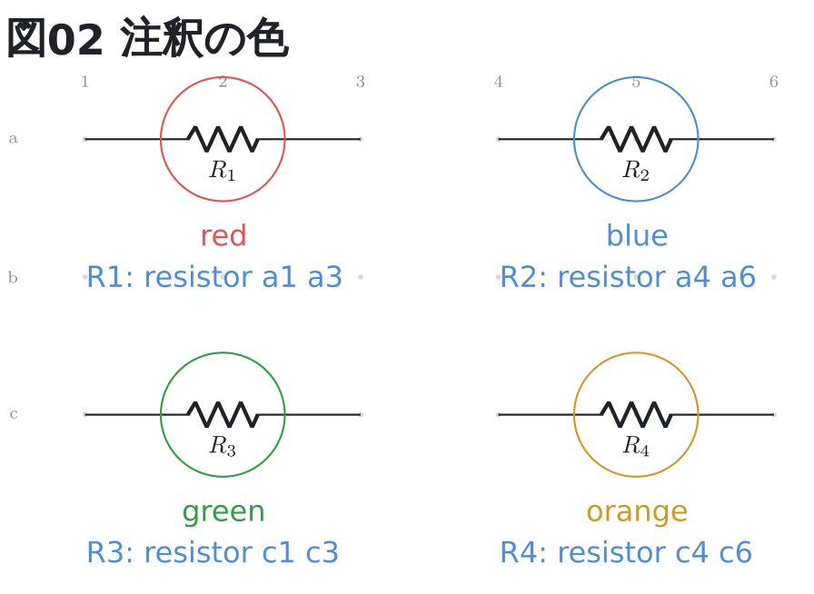

書けるのはこの 4 つだけ。明るいテーマでも暗いテーマでも読める値を選んであり、
テーマを変えても注釈の色は変わらない (地の色だけが変わる)。

印・枠・指し棒は色を書かなければ赤、字は書かなければ図のほかの文字と同じ色になる。

## 自動でやること

- **分岐の黒丸**: 端が 3 つ以上集まる交点に自動で打つ。
  2 つは通過か曲がりなので打たない。端が別の線の途中に乗った T 字にも打つ。
- **重なりの検出**: 同じ場所に 2 つ置いたら行番号つきで返す。
  どちらが間違いかは書いた人にしか分からないので、図には両方とも描く。
- **ネットリスト**: 図の下に畳んで出る。ポートが乗っているネットは
  ポート名、グラウンドが乗っていれば `GND`、どちらも無ければ `N1` から順に。
  グラウンドは離して描いても同じ節点として数える。

## 読めなかったとき

読めた部品は描き、読めなかった行は図の下に**行番号つき**で出る。
行番号は Markdown の行なので、そのまま直しに行ける。

```text
circuit: 7 行目: 種類 resistr は知りません (resistor のことですか?)
circuit: 9 行目: z0 は番地の形ではありません (行 a〜z + 列 1〜99)
```

頭の `circuit:` は、どのフェンスが言っているかの名札。プレビューの帯でも
CLI の標準エラーでも同じ形で出る。

図がまったく組めなかったときは、理由だけのカードが出る。

## 見た目の設定 (`style:`)

テーマだけ選ぶなら 1 行で書ける。

```yaml
style: dark
```

細かく指定するときはマップで書く。

```yaml
style:
  theme: dark
  grid: on
  grid-to: e12
  width: 640
```

| 項目 | 書き方 | 既定 |
| --- | --- | --- |
| `theme` | `auto` / `light` / `dark` / `mono` | `auto` |
| `ink-color` | 線と文字の色 (`#rgb` か `#rrggbb`) | テーマの色 |
| `paper-color` | 端子の白丸など、地の色で塗るところ | テーマの色 |
| `grid-color` | グリッドの色 (点はこの色を薄めて描く) | テーマの色 |
| `grid` | `on` / `off` | `off` |
| `grid-to` | グリッドを伸ばす先の番地 (`e12`) | 使っている範囲 |
| `pitch` | 1 マスの大きさ (cm、0.5〜5) | `2` |
| `standard` | `american` / `european` | `american` |
| `wire-width` | 線の太さ (pt、0.2〜4) | `0.8` |
| `width` | 出力の横ドット数 (120〜4000) | 図のままの大きさ |

色は `#rgb` か `#rrggbb` だけを受ける。名前 (`red` など) は通さない
(検証済みの値しか図に入れないため)。名前で選びたいときはテーマを使う。

### テーマ

- `auto` — **既定**。エディタの文字色をそのまま使うので、明るいテーマでも
  暗いテーマでも読める。1 枚描いた図をどちらでも使い回す (描き直さない)。
- `light` / `dark` — 明暗を決め打ちする。ノートの見た目を固定したいとき。
- `mono` — 黒一色。資料に貼るときや印刷するとき。

### グリッド

`grid: on` にすると、部品を置ける位置が点で出る。行は左に英字、列は上に数字で、
ブレッドボードと同じ読み方。

**点は薄く、行英字と列数字は濃く**出る。点は位置の目安でしかないが、
英字と数字は読んで番地を数えるものなので、濃さを分けてある
(色は 1 つで、点だけを薄めて描いている)。

```circuit
parts:
  IN:  port a1
  R1:  resistor a1 a3 10k
  C1:  capacitor a3 c3 100n
  OUT: port a4
  G1:  ground c3
wires:
  - a3 -- a4
notes:
  - source a6 blue
style:
  grid: on
  grid-to: d6
```

`grid-to` を書くと、使っていない範囲までグリッドが伸びる。
部品を動かす先が見えるので、番地を書き換えながら組むときに使う。

資料に貼る図では `grid: off` に戻してもよい。この文法リファレンスの図は、
どの番地に何を置いたかを数えられるように付けたままにしてある。

## 書き出す (CLI)

```bash
circuit-fence render <ファイルかディレクトリ...> [--out <出力先>] [--emit-tex]
```

`.md` からは ` ```circuit ` フェンスを取り出し、`.yaml` はそのまま 1 枚として扱う。
1 枚につき `.tex` と `.svg` が出る。ネットリストは標準出力に、読めなかった行は
プレビューと同じ文面で標準エラーに出る。

### `--emit-tex` — 手元の LaTeX で組む

図を描かず、**xelatex に渡す `.tex` だけ**を書き出す。
プレビュー用の `.tex` と同じ名前なので、`--out` を分けて書き出す。

```bash
circuit-fence render notes.md --emit-tex --out tex
xelatex -output-directory tex tex/notes.tex
```

書き出したほうはフォントもパッケージも積めるので、**フェンスとは 3 つだけ違う**。

| | プレビュー (フェンス) | `--emit-tex` |
| --- | --- | --- |
| 日本語の値 | 描けない (行番号つきで返る) | 描ける |
| 単位 | `100 uF` (字のまま) | `100 µF` (siunitx) |
| オペアンプ | 三角形 + 手描きの ± | 本物の `op amp` |

番地も配線も黒丸も同じなので、**プレビューで位置を確かめてから書き出せる**。
違いをこの 3 つに絞ってあるのは、確かめた図と書き出した図を食い違わせないため。

可変抵抗の矢のように、circuitikz の版で向きが違う記号には**片方にだけ指定を
足している**。TeX の綴りは違うが**出る図は同じ**なので、この表には入らない。

`notes:` の字はこの表に入らない。フェンスでは TeX に渡さず描き上がった図へ
差し込み、書き出すほうは TeX に組ませるので、**どちらでも同じ日本語が出る**。

日本語のフォントは `\newfontfamily` の 1 行にある (既定は `Noto Sans CJK JP`)。
手元に無ければその 1 行を書き換える。値が全部 ASCII のときはその行を書かない。

値に書ける字は、`--emit-tex` では日本語と `µ` `Ω` `°` が増えるだけ。
`\` `$` `,` `=` などはどちらの向けでも書けない
(**値から任意の TeX を作らせない**ため)。

プレビュー用と書き出し用の `.tex` は同じ名前になるので、片方の上に
もう片方を書こうとしたら、書かずに知らせて止まる (`--out` を分ける)。
