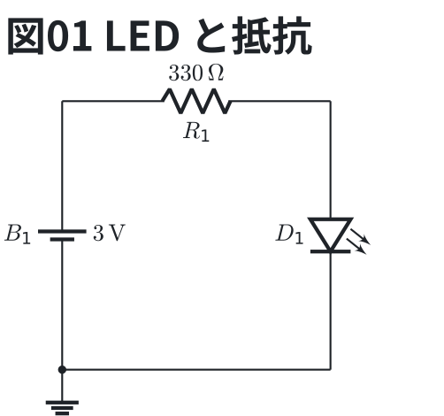

# LED と抵抗

いちばん小さな回路。電池から抵抗を通して LED を光らせる。
**同じ回路を breadboard / perfboard でも描いてある** (どれも「図01 LED と抵抗」)。

```circuit
title: 図01 LED と抵抗
parts:
  B1: battery a1 c1 3
  R1: resistor a1 a3 330
  D1: led a3 c3
  G1: ground c1
wires:
  - c1 -- c3
```



読み方:

- `a1` `c3` は番地。行が英字 (`a` から下へ)、列が数字 (`1` から右へ)。
- `a1` と `a3` は同じ行なので `R1` は横に寝る。`a1` と `c1` は同じ列なので
  `B1` は縦に立つ。座標も `\coordinate` も書かない。
- 部品の値 (`3` `330`) は単位を書かなくても、部品の種類から `V` と `Ω` が付く。

| ネット | つながっている端子 |
| --- | --- |
| N1 | B1.1, R1.1 |
| N2 | R1.2, D1.1 |
| GND | B1.2, D1.2, G1 |
