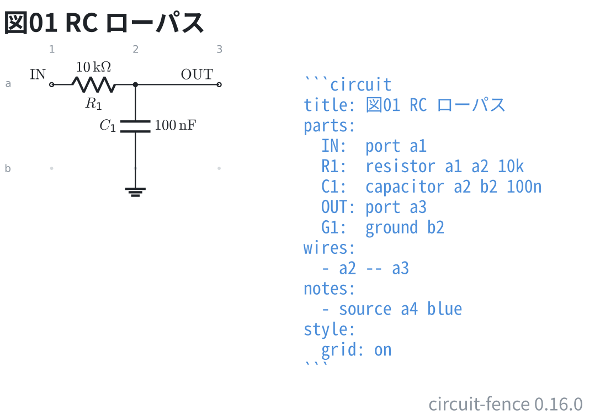

# RC ローパス

抵抗とコンデンサ 1 つずつの一次ローパスフィルタ。番地で置く場所を書くだけで、
座標も `\coordinate` も書かない。

```circuit
title: 図01 RC ローパス
parts:
  IN:  port 1,1
  R1:  resistor 1,1 2,1 10k
  C1:  capacitor 2,1 2,2 100n
  OUT: port 3,1
  G1:  ground 2,2
wires:
  - 2,1 -- 3,1
notes:
  - source 4,1 blue
style:
  grid: on
```



番地は `x,y` = 列,行。列は `1` から右へ、行は `1` から下へ。
`1,1` と `3,1` は同じ行なので、`R1` は横に寝る。`3,1` と `3,3` は同じ列なので
`C1` は縦に立つ。

ネットリストは図から機械的に導ける。`IN` と `OUT` はポートの名前がそのまま
ネットの名前になり、グラウンドは離して描いても同じ節点として数える。

| ネット | つながっている端子 |
| --- | --- |
| IN | IN, R1.1 |
| OUT | R1.2, C1.1, OUT |
| GND | C1.2, G1 |
