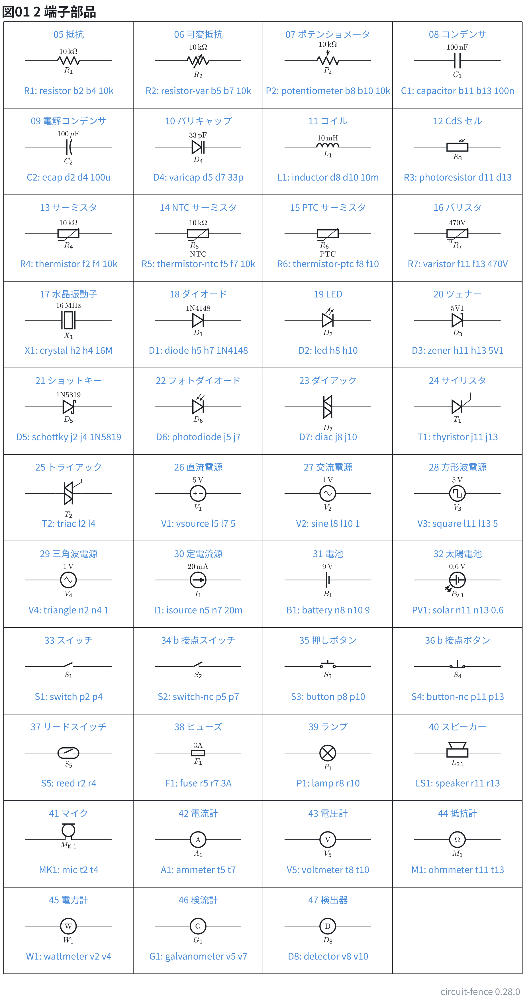
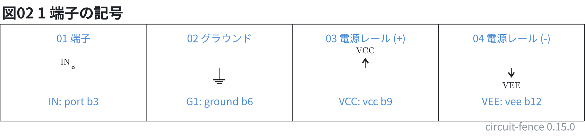
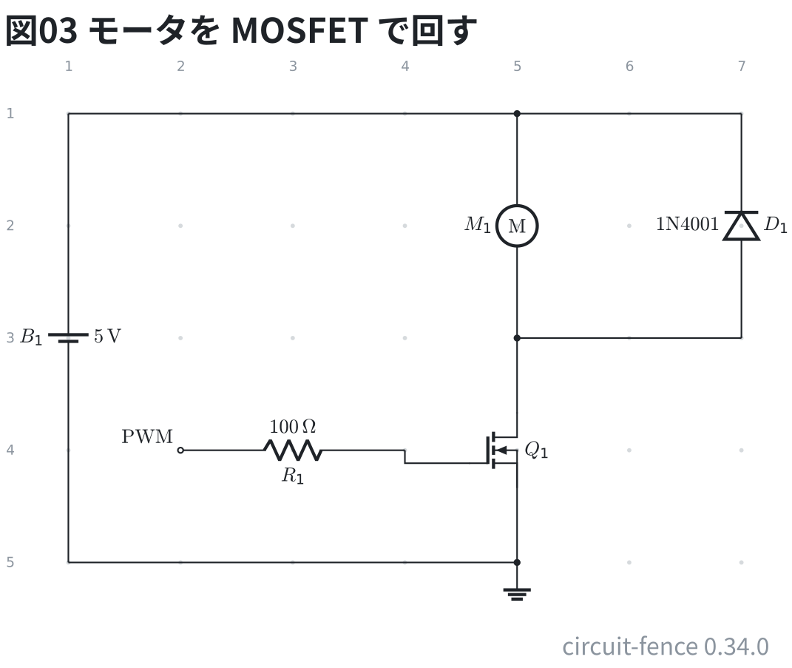
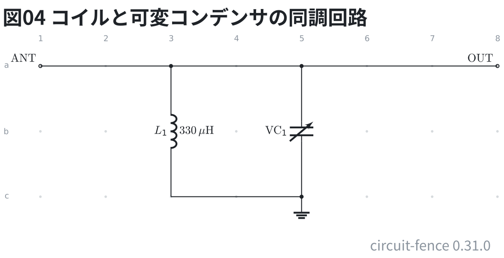
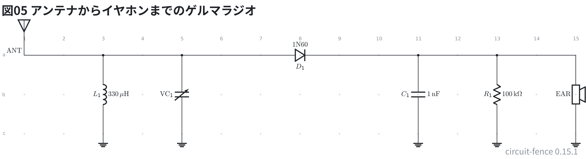
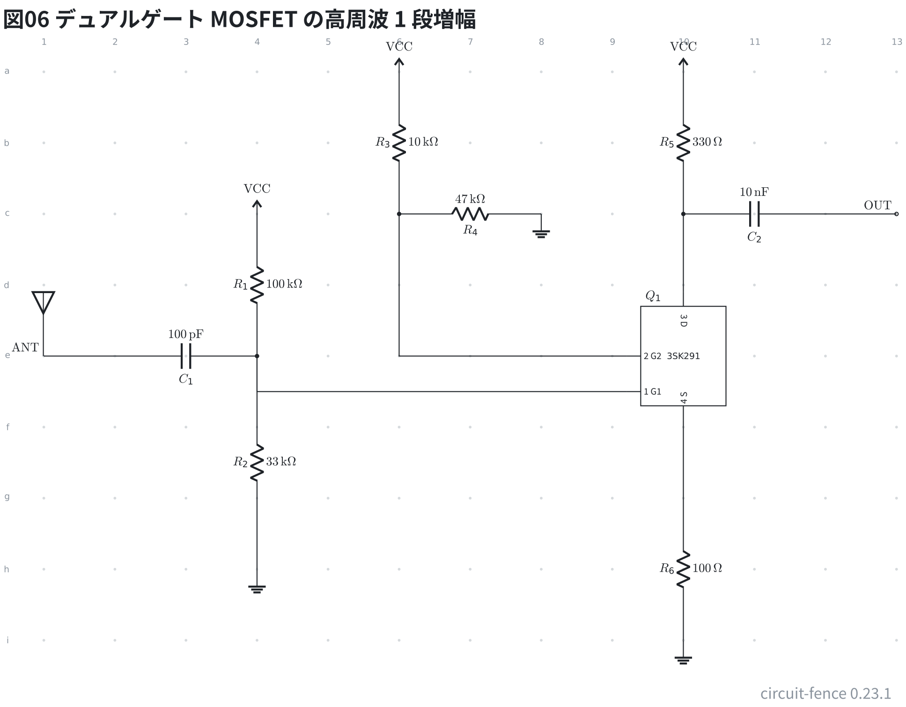
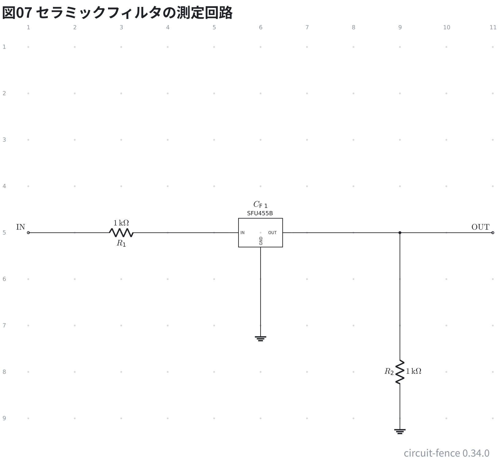

# 使える部品

2 端子部品は `ID: 種類 番地 番地 [値]` の 1 行で書く。

```circuit
title: 図01 2 端子部品
parts:
  R1:  resistor b2 b4 10k
  R2:  resistor-var b5 b7 10k
  P2:  potentiometer b8 b10 10k
  C1:  capacitor b11 b13 100n
  C2:  ecap d2 d4 100u
  D4:  varicap d5 d7 33p
  L1:  inductor d8 d10 10m
  R3:  photoresistor d11 d13
  R4:  thermistor f2 f4 10k
  R5:  thermistor-ntc f5 f7 10k
  R6:  thermistor-ptc f8 f10
  R7:  varistor f11 f13 470V
  X1:  crystal h2 h4 16M
  D1:  diode h5 h7 1N4148
  D2:  led h8 h10
  D3:  zener h11 h13 5V1
  D5:  schottky j2 j4 1N5819
  D6:  photodiode j5 j7
  D7:  diac j8 j10
  T1:  thyristor j11 j13
  T2:  triac l2 l4
  V1:  vsource l5 l7 5
  V2:  sine l8 l10 1
  V3:  square l11 l13 5
  V4:  triangle n2 n4 1
  I1:  isource n5 n7 20m
  B1:  battery n8 n10 9
  PV1: solar n11 n13 0.6
  S1:  switch p2 p4
  S2:  switch-nc p5 p7
  S3:  button p8 p10
  S4:  button-nc p11 p13
  S5:  reed r2 r4
  F1:  fuse r5 r7 3A
  P1:  lamp r8 r10
  LS1: speaker r11 r13
  MK1: mic t2 t4
  A1:  ammeter t5 t7
  V5:  voltmeter t8 t10
  M1:  ohmmeter t11 t13
  W1:  wattmeter v2 v4
  G1:  galvanometer v5 v7
  D8:  detector v8 v10
notes:
  - line a1b5 a13b5 ink
  - line c1b5 c13b5 ink
  - line e1b5 e13b5 ink
  - line g1b5 g13b5 ink
  - line i1b5 i13b5 ink
  - line k1b5 k13b5 ink
  - line m1b5 m13b5 ink
  - line o1b5 o13b5 ink
  - line q1b5 q13b5 ink
  - line s1b5 s13b5 ink
  - line u1b5 u13b5 ink
  - line w1b5 w13b5 ink
  - line a1b5 w1b5 ink
  - line a4b5 w4b5 ink
  - line a7b5 w7b5 ink
  - line a10b5 w10b5 ink
  - line a13b5 w13b5 ink
  - text a3e0 blue center: 05 抵抗
  - text b3h0 blue center: "R1: resistor b2 b4 10k"
  - text a6e0 blue center: 06 可変抵抗
  - text b6h0 blue center: "R2: resistor-var b5 b7 10k"
  - text a9e0 blue center: 07 ポテンショメータ
  - text b9h0 blue center: "P2: potentiometer b8 b10 10k"
  - text a12e0 blue center: 08 コンデンサ
  - text b12h0 blue center: "C1: capacitor b11 b13 100n"
  - text c3e0 blue center: 09 電解コンデンサ
  - text d3h0 blue center: "C2: ecap d2 d4 100u"
  - text c6e0 blue center: 10 バリキャップ
  - text d6h0 blue center: "D4: varicap d5 d7 33p"
  - text c9e0 blue center: 11 コイル
  - text d9h0 blue center: "L1: inductor d8 d10 10m"
  - text c12e0 blue center: 12 CdS セル
  - text d12h0 blue center: "R3: photoresistor d11 d13"
  - text e3e0 blue center: 13 サーミスタ
  - text f3h0 blue center: "R4: thermistor f2 f4 10k"
  - text e6e0 blue center: 14 NTC サーミスタ
  - text f6h0 blue center: "R5: thermistor-ntc f5 f7 10k"
  - text e9e0 blue center: 15 PTC サーミスタ
  - text f9h0 blue center: "R6: thermistor-ptc f8 f10"
  - text e12e0 blue center: 16 バリスタ
  - text f12h0 blue center: "R7: varistor f11 f13 470V"
  - text g3e0 blue center: 17 水晶振動子
  - text h3h0 blue center: "X1: crystal h2 h4 16M"
  - text g6e0 blue center: 18 ダイオード
  - text h6h0 blue center: "D1: diode h5 h7 1N4148"
  - text g9e0 blue center: 19 LED
  - text h9h0 blue center: "D2: led h8 h10"
  - text g12e0 blue center: 20 ツェナー
  - text h12h0 blue center: "D3: zener h11 h13 5V1"
  - text i3e0 blue center: 21 ショットキー
  - text j3h0 blue center: "D5: schottky j2 j4 1N5819"
  - text i6e0 blue center: 22 フォトダイオード
  - text j6h0 blue center: "D6: photodiode j5 j7"
  - text i9e0 blue center: 23 ダイアック
  - text j9h0 blue center: "D7: diac j8 j10"
  - text i12e0 blue center: 24 サイリスタ
  - text j12h0 blue center: "T1: thyristor j11 j13"
  - text k3e0 blue center: 25 トライアック
  - text l3h0 blue center: "T2: triac l2 l4"
  - text k6e0 blue center: 26 直流電源
  - text l6h0 blue center: "V1: vsource l5 l7 5"
  - text k9e0 blue center: 27 交流電源
  - text l9h0 blue center: "V2: sine l8 l10 1"
  - text k12e0 blue center: 28 方形波電源
  - text l12h0 blue center: "V3: square l11 l13 5"
  - text m3e0 blue center: 29 三角波電源
  - text n3h0 blue center: "V4: triangle n2 n4 1"
  - text m6e0 blue center: 30 定電流源
  - text n6h0 blue center: "I1: isource n5 n7 20m"
  - text m9e0 blue center: 31 電池
  - text n9h0 blue center: "B1: battery n8 n10 9"
  - text m12e0 blue center: 32 太陽電池
  - text n12h0 blue center: "PV1: solar n11 n13 0.6"
  - text o3e0 blue center: 33 スイッチ
  - text p3h0 blue center: "S1: switch p2 p4"
  - text o6e0 blue center: 34 b 接点スイッチ
  - text p6h0 blue center: "S2: switch-nc p5 p7"
  - text o9e0 blue center: 35 押しボタン
  - text p9h0 blue center: "S3: button p8 p10"
  - text o12e0 blue center: 36 b 接点ボタン
  - text p12h0 blue center: "S4: button-nc p11 p13"
  - text q3e0 blue center: 37 リードスイッチ
  - text r3h0 blue center: "S5: reed r2 r4"
  - text q6e0 blue center: 38 ヒューズ
  - text r6h0 blue center: "F1: fuse r5 r7 3A"
  - text q9e0 blue center: 39 ランプ
  - text r9h0 blue center: "P1: lamp r8 r10"
  - text q12e0 blue center: 40 スピーカー
  - text r12h0 blue center: "LS1: speaker r11 r13"
  - text s3e0 blue center: 41 マイク
  - text t3h0 blue center: "MK1: mic t2 t4"
  - text s6e0 blue center: 42 電流計
  - text t6h0 blue center: "A1: ammeter t5 t7"
  - text s9e0 blue center: 43 電圧計
  - text t9h0 blue center: "V5: voltmeter t8 t10"
  - text s12e0 blue center: 44 抵抗計
  - text t12h0 blue center: "M1: ohmmeter t11 t13"
  - text u3e0 blue center: 45 電力計
  - text v3h0 blue center: "W1: wattmeter v2 v4"
  - text u6e0 blue center: 46 検流計
  - text v6h0 blue center: "G1: galvanometer v5 v7"
  - text u9e0 blue center: 47 検出器
  - text v9h0 blue center: "D8: detector v8 v10"
style:
  grid: off
```



値は種類から単位を補う (抵抗の `10k` → 10 kΩ、コイルの `10m` → 10 mH)。
ダイオードやスイッチのように値が型番や定格のものは、書いたとおりに出る。

`ecap` (電解コンデンサ) は先に書いた番地が + 側になる。上の `C2` なら b9 が +
(記号の平らな基板のほう。丸い基板が - 側)。

`switch` / `button` は a 接点 (ふだん開いている)、`-nc` が付くほうは b 接点。
水晶の値は周波数なので、`16M` と書くと 16 MHz になる。

NTC と PTC のサーミスタは**同じ記号で描き、区別は ID の下に字で書く**。
circuitikz の NTC / PTC の記号は中に θ を持っていて、フェンスの TeX には
その大きさの字形が無く `#` で出るため (`op amp` の ± と同じ壊れ方)。

## 1 端子の記号

`port` (端子) と `ground` のほかに、電源レールの `vcc` / `vee` がある。
`ground` 以外は **ID がそのまま図に出て、乗っているネットの名前にもなる**。

```circuit
title: 図02 1 端子の記号
parts:
  IN:  port b3
  G1:  ground b6
  VCC: vcc b9
  VEE: vee b12
notes:
  - line a1b5 a13b5 ink
  - line c1b5 c13b5 ink
  - line a1b5 c1b5 ink
  - line a4b5 c4b5 ink
  - line a7b5 c7b5 ink
  - line a10b5 c10b5 ink
  - line a13b5 c13b5 ink
  - text a3e0 blue center: 01 端子
  - text b3h0 blue center: "IN: port b3"
  - text a6e0 blue center: 02 グラウンド
  - text b6h0 blue center: "G1: ground b6"
  - text a9e0 blue center: 03 電源レール (+)
  - text b9h0 blue center: "VCC: vcc b9"
  - text a12e0 blue center: 04 電源レール (-)
  - text b12h0 blue center: "VEE: vee b12"
style:
  grid: off
```



グラウンドは離して描いても同じ節点になるが、**電源レールはならない**
(5V と 3V3 を同じネットにしてしまうため)。つなぐなら配線を引く。

## モータ

`motor` は**丸に M** の 2 端子。計器と同じ「丸に字」の記号で描く (circuitikz 1.0 の
モータの記号は使えないため)。下は MOSFET でモータを回す回路で、モータの両端に
**還流ダイオード** (D1) を逆向きに入れて、切った瞬間の逆起電力を逃がす。

```circuit
title: 図03 モータを MOSFET で回す
parts:
  B1: battery a1 e1 5
  M1: motor a5 c5
  D1: diode c7 a7 1N4001
  Q1: nmos-e d5
  R1: resistor d2 d4 100
  PWM: port d2
  G1: ground e5
wires:
  - a1 -- a5 -- a7
  - c5 -- c7
  - c5 -- Q1.D
  - Q1.S -- e5
  - d4 |- Q1.G
  - e1 -- e5
style:
  grid: on
```



モータは基板 (breadboard / perfboard) に挿さず線でつなぐので、実体配線図では
`type: device` の機器として書く。

## 可変コンデンサ

`capacitor-var` は極板 2 枚を斜めの矢が貫く記号 (ポリバリコン・トリマ)。矢は
**どう置いても右上を向く**。下はラジオの入口の同調回路で、コイル (L1) と
可変コンデンサ (VC1) を並列にして、回した容量で受ける周波数を選ぶ。
バリキャップ (`varicap`) は可変容量ダイオードで、記号も物も別。

```circuit
title: 図04 コイルと可変コンデンサの同調回路
parts:
  ANT: port a1
  L1: inductor a3 c3 330u
  VC1: capacitor-var a5 c5 l=$\mathrm{VC}_1$
  OUT: port a8
  G1: ground c5
wires:
  - a1 -- a8
  - c3 -- c5
style:
  grid: on
```



値は書いていない。ポリバリコンの容量は 1 つの値ではなく可変の範囲
(20〜260 pF など) なので、本文や表に書く。ID の `VC1` は先頭 1 文字が本体・
残りが添字の決まりで V の添字 C1 に組まれ、電圧に見える。`l=` で字を差し替える。

可変コンデンサも基板に挿さず線でつなぐので、実体配線図では `type: device` の
機器として書く。

## アンテナとイヤホン

`antenna` は棒の上に逆三角の 1 端子の記号。`port` と同じく **ID が記号の横に出て、
乗っているネットの名前にもなる**。上に立つのが記号の意味なので、向きは書けない。
`earphone` はイヤホンで、circuitikz にイヤホンの記号が無いので、ブザーと同じく
スピーカーの記号を借りている。下はゲルマラジオで、アンテナで受けた電波を
L1 と VC1 の同調回路で選び、D1 で検波してイヤホンで聞く。

```circuit
title: 図05 アンテナからイヤホンまでのゲルマラジオ
parts:
  ANT: antenna a1
  L1: inductor a3 c3 330u
  VC1: capacitor-var a5 c5 l=$\mathrm{VC}_1$
  D1: diode a7 a9 1N60
  C1: capacitor a11 c11 1n
  R1: resistor a13 c13 100k
  EAR: earphone a15 c15 l=$\mathrm{EAR}$
  G1: ground c3
  G2: ground c5
  G3: ground c11
  G4: ground c13
  G5: ground c15
wires:
  - a1 -- a7
  - a9 -- a15
style:
  grid: on
```



イヤホンの ID `EAR` は、先頭 1 文字が本体・残りが添字の決まりで E の添字 AR に
組まれる。`l=` で字を差し替える。クリスタルイヤホンの容量 (約 15 nF) や
インピーダンスは値に書かず、本文や表に書く。

アンテナもイヤホンも基板に挿さず線でつなぐので、実体配線図では `type: device` の
機器として書く。

## デュアルゲート MOSFET

`nmos-dg` は 3SK291 のような**ゲートが 2 本ある FET** (N チャネル)。丸の中にチャネルの棒と
ゲートの基板 2 枚を描いた記号で、ピンは `G1` (信号を入れる。左下) `G2` (バイアスや AGC。左上)
`D` (上) `S` (下)。どちらのゲートかは形では読めないので、図に `G1` `G2` の名前が出る。
型番は記号の下。`G` だけでは G1 か G2 か分からないので、書くと断られる。D と S は番地の列に
乗るので `--` で、ゲートは行から少しずれているので `-|` で引く。
下は高周波の 1 段増幅の書き方の例で、アンテナの信号を C1 で G1 に入れ、G2 には R3・R4 で
分けた固定の電圧をかける。

```circuit
title: 図06 デュアルゲート MOSFET の高周波 1 段増幅
parts:
  ANT: antenna e1
  C1: capacitor e2 e4 100p
  R1: resistor c4 e4 100k
  R2: resistor e4 h4 33k
  R3: resistor a6 c6 10k
  R4: resistor c6 c8 47k
  Q1: nmos-dg e10 3SK291
  R5: resistor a10 c10 330
  R6: resistor g10 i10 100
  C2: capacitor c10 c12 10n
  OUT: port c13
  VCC: vcc c4
  VCC: vcc a6
  VCC: vcc a10
  GA: ground h4
  GB: ground c8
  GC: ground i10
wires:
  - e1 -- e2
  - e4 -| Q1.G1
  - Q1.G2 -| c6
  - c10 -- Q1.D
  - g10 -- Q1.S
  - c12 -- c13
style:
  grid: on
```



値はピンのつなぎ方を見せるための例で、動作点は確かめていない。G1 は 0 V ではほぼ流れないので、
実際には R1・R2 のような分圧で正のバイアスをかける。電源の `VCC` は同じ名前を何度書いても
同じ節点になる。実物は面実装なので、実体配線図では変換基板に載せた姿 (`dip4` / `sip4` に型番 `3SK291`) で描く。

## セラミックフィルタ

`ceramic-filter` (略記 `cfilter`) は 455 kHz の中間周波などに使う**セラミックフィルタ**。
三端子レギュレータと同じ箱で描き、ピンは `IN` (左) `GND` (下) `OUT` (右)。
信号が左から右へ流れ、アースが下へ落ちるので、フィルタを信号の線の途中に置ける。
下はフィルタの特性を測る回路で、前後の抵抗が計器とフィルタの入出力の間を合わせる。
基板に載せるときは `sip3` に型番 `SFU455B` を添える (橙の胴で描かれ、ピンは `IN` `GND` `OUT`)。

```circuit
title: 図07 セラミックフィルタの測定回路
parts:
  IN: port e1
  R1: resistor e2 e4 1k
  CF1: ceramic-filter e6 SFU455B
  R2: resistor g9 i9 1k
  OUT: port e11
  GA: ground g6
  GB: ground i9
wires:
  - e1 -- e2
  - e4 -- CF1.IN
  - CF1.GND -- g6
  - CF1.OUT -- e9
  - e9 -- g9
  - e9 -- e11
style:
  grid: on
```



抵抗の 1 kΩ は例の値で、実物の入出力インピーダンスに合わせて選ぶ (SFU455 の値は確かめていない)。
