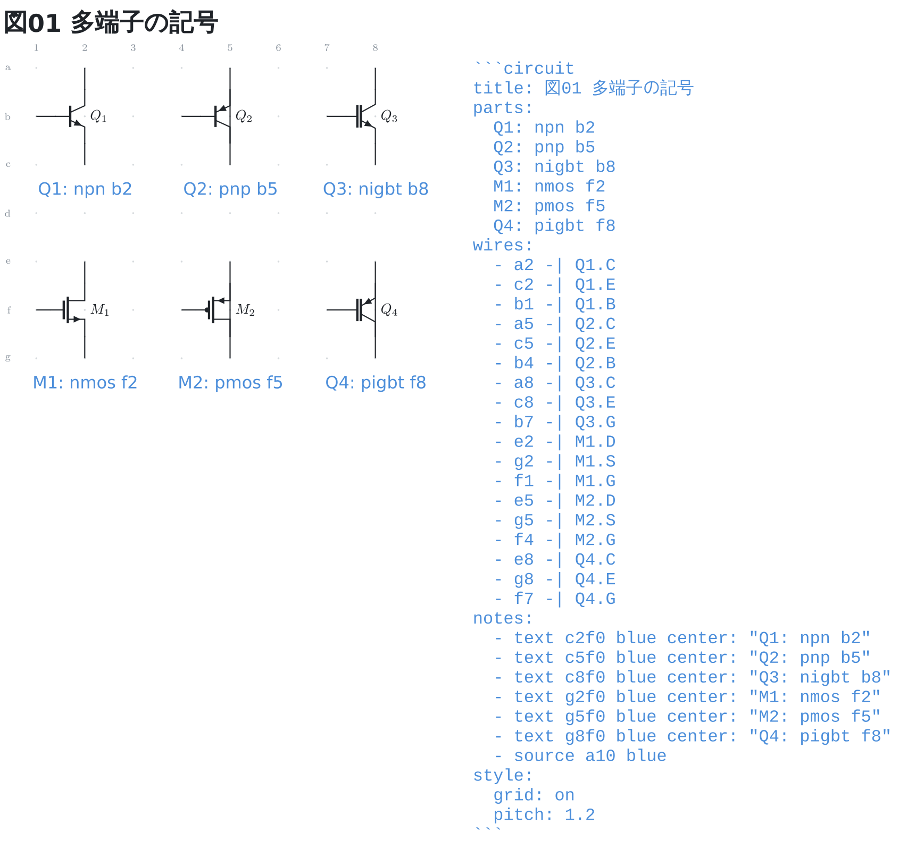
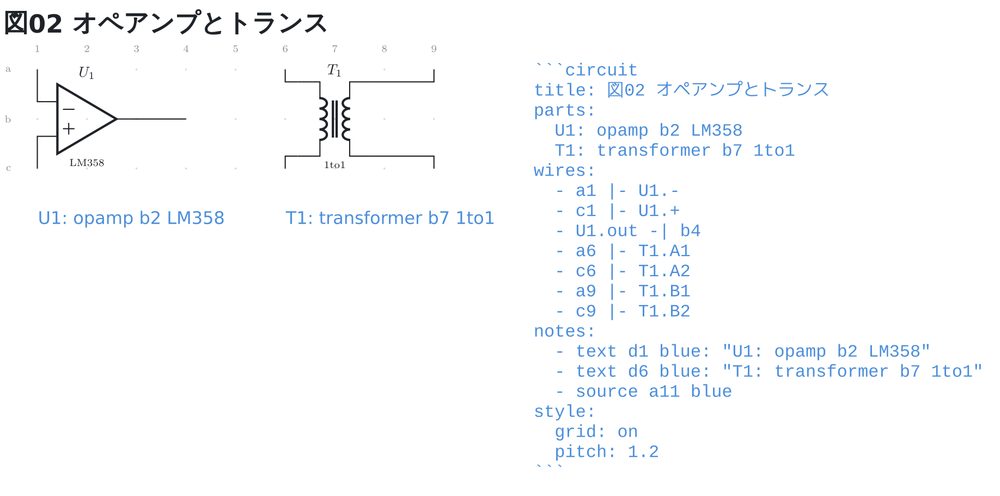
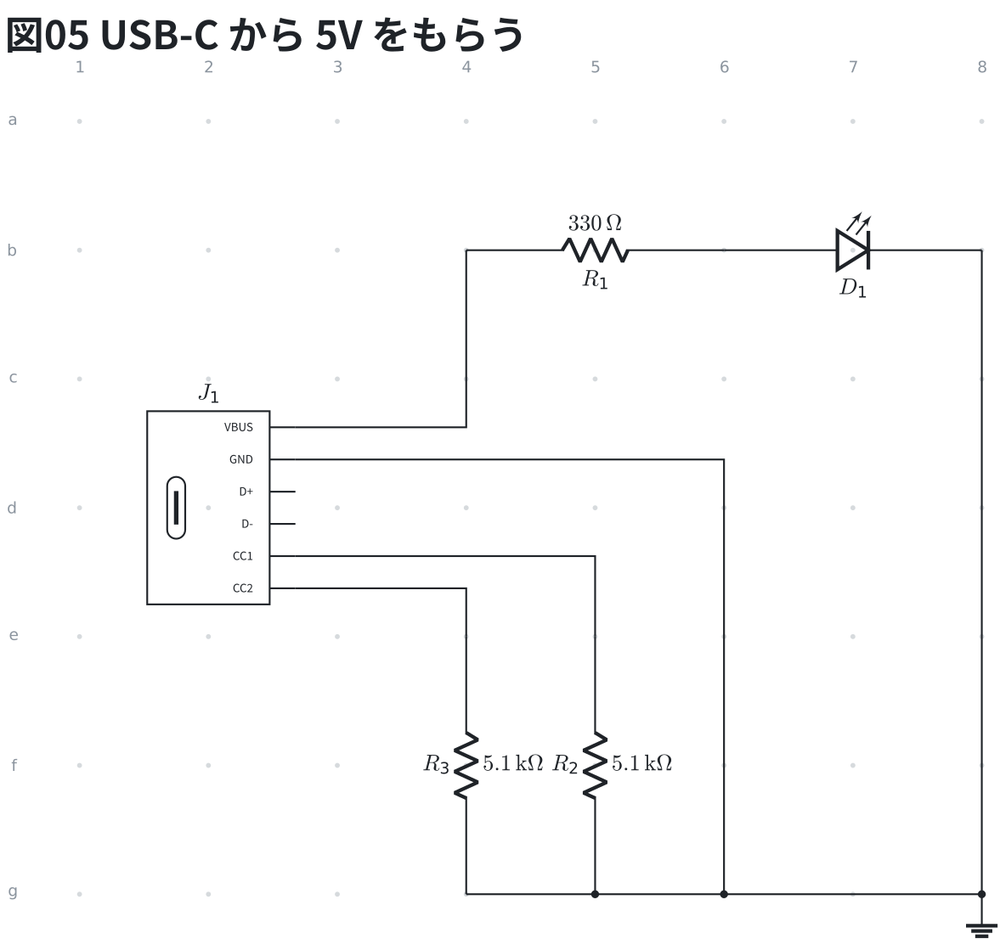
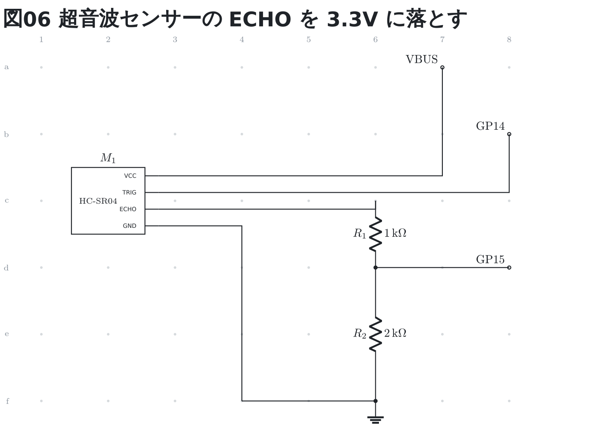
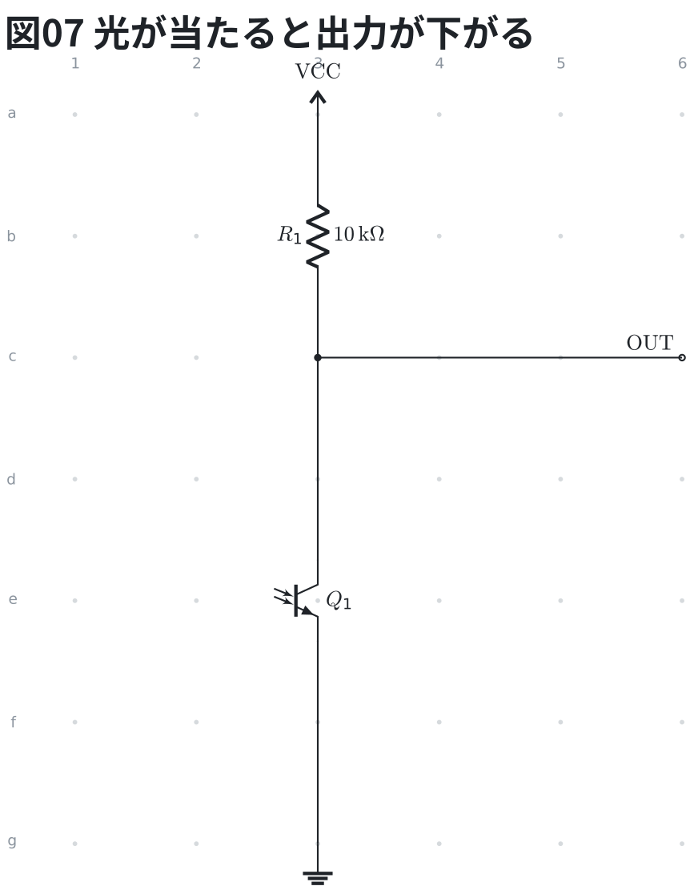

# 多端子の記号

トランジスタ・MOSFET・オペアンプ・トランスは **1 つの番地に置く**。
足は番地ではなく名前で指す (`Q1.B` `M1.gate` `U1.out` `T1.A1`)。

```circuit
title: 図01 多端子の記号
parts:
  Q1: npn b2
  Q2: pnp b5
  Q3: nigbt b8
  M1: nmos f2
  M2: pmos f5
  Q4: pigbt f8
wires:
  - a2 -| Q1.C
  - c2 -| Q1.E
  - b1 -| Q1.B
  - a5 -| Q2.C
  - c5 -| Q2.E
  - b4 -| Q2.B
  - a8 -| Q3.C
  - c8 -| Q3.E
  - b7 -| Q3.G
  - e2 -| M1.D
  - g2 -| M1.S
  - f1 -| M1.G
  - e5 -| M2.D
  - g5 -| M2.S
  - f4 -| M2.G
  - e8 -| Q4.C
  - g8 -| Q4.E
  - f7 -| Q4.G
notes:
  - text c2f0 blue center: "Q1: npn b2"
  - text c5f0 blue center: "Q2: pnp b5"
  - text c8f0 blue center: "Q3: nigbt b8"
  - text g2f0 blue center: "M1: nmos f2"
  - text g5f0 blue center: "M2: pmos f5"
  - text g8f0 blue center: "Q4: pigbt f8"
  - source a10 blue
style:
  grid: on
  pitch: 1.2
```



上の段がバイポーラと IGBT、下の段が MOSFET。**記号の下の青い行が、
その記号を出すために書いた 1 行**そのもの。
足の名前は回路図の慣習の 1 文字でも、綴りでも同じところを指す
(`Q1.B` と `Q1.base` は同じ足)。

| 種類 | 足 |
| --- | --- |
| `npn` / `pnp` | `B` `C` `E` (`base` `collector` `emitter`) |
| `nigbt` / `pigbt` | `G` `C` `E` (IGBT の制御端子はゲート) |
| `nmos` / `pmos` | `G` `D` `S` (`gate` `drain` `source`) |
| `njfet` / `pjfet` | 同上 |
| `nmos-e` / `pmos-e` / `nmos-d` / `pmos-d` | 同上 |
| `opamp` | `+` `-` `out` |
| `transformer` | `A1` `A2` (1 次) / `B1` `B2` (2 次) |

番地の後ろに型番を書くと、記号の下に出る。トランスは 1 次側が `A`、
2 次側が `B`。

```circuit
title: 図02 オペアンプとトランス
parts:
  U1: opamp b2 LM358
  T1: transformer b7 1to1
wires:
  - a1 |- U1.-
  - c1 |- U1.+
  - U1.out -| b4
  - a6 |- T1.A1
  - c6 |- T1.A2
  - a9 |- T1.B1
  - c9 |- T1.B2
notes:
  - text d1 blue: "U1: opamp b2 LM358"
  - text d6 blue: "T1: transformer b7 1to1"
  - source a11 blue
style:
  grid: on
  pitch: 1.2
```



**足へは `-|` か `|-` で引く**。足は記号ごとに決まった位置にあって格子の上に
無いので、`--` (まっすぐ) で番地とつなぐと斜めの線になる。

## FET の種類

`nmos` / `pmos` はチャネルを 1 本で描いた**簡易記号**。記事でよく使うのは
こちらだが、接合型 (JFET) と、エンハンスメント型 / デプレッション型を
書き分けたいときは次の名前で書く。**足の名前はどれも同じ**。

```circuit
title: 図03 FET の種類
parts:
  J1: njfet b2
  J2: pjfet b5
  M1: nmos-e f2
  M2: pmos-e f5
  M3: nmos-d j2
  M4: pmos-d j5
wires:
  - a2 -| J1.D
  - c2 -| J1.S
  - b1 -| J1.G
  - a5 -| J2.D
  - c5 -| J2.S
  - b4 -| J2.G
  - e2 -| M1.D
  - g2 -| M1.S
  - f1 -| M1.G
  - e5 -| M2.D
  - g5 -| M2.S
  - f4 -| M2.G
  - i2 -| M3.D
  - k2 -| M3.S
  - j1 -| M3.G
  - i5 -| M4.D
  - k5 -| M4.S
  - j4 -| M4.G
notes:
  - text c2f0 blue center: "J1: njfet b2"
  - text c5f0 blue center: "J2: pjfet b5"
  - text g2f0 blue center: "M1: nmos-e f2"
  - text g5f0 blue center: "M2: pmos-e f5"
  - text k2f0 blue center: "M3: nmos-d j2"
  - text k5f0 blue center: "M4: pmos-d j5"
style:
  grid: on
  pitch: 1.2
```


左が N チャネル、右が P チャネル。上から接合型 (`njfet` / `pjfet`)、
エンハンスメント型 (`nmos-e` / `pmos-e`)、デプレッション型
(`nmos-d` / `pmos-d`)。エンハンスメント型はチャネルが切れて、
デプレッション型はつながって描かれる。

## 2 端子でも足を持つもの

ポテンショメータのワイパーとサイリスタ・トライアックのゲートは、
**両端を番地で置いたうえで 3 本目を名前で指す**。書き方は 2 端子部品と同じで、
足だけ `P1.w` `T1.g` のように呼ぶ。

```circuit
title: 図04 2 端子でも足を持つもの
parts:
  P1: potentiometer b1 b3 10k
  T1: thyristor e1 e3
  T2: triac h1 h3
wires:
  - P1.w -- a2
  - T1.g |- d2
  - T2.g |- g2
notes:
  - text c1 blue: "P1: potentiometer b1 b3 10k"
  - text f1 blue: "T1: thyristor e1 e3"
  - text i1 blue: "T2: triac h1 h3"
style:
  grid: on
```


| 種類 | 足 |
| --- | --- |
| `potentiometer` | `w` (`wiper`) |
| `thyristor` / `triac` | `g` (`gate`) |

ワイパーは記号の**真上**に出るので、そのまま `--` で上の番地へ引ける。
ゲートは横にずれた位置にあるので、ほかの足と同じく `|-` で直角に入れる。

## USB コネクタ

`usb-a` / `usb-c` は**箱の右に足が並び、左に差し込み口の形**が出る
(Type-C は長丸、Type-A は角)。足は名前で指す (`J1.VBUS` `J1.CC1`)。
名前と順は実体配線図の 2 つと同じで、番号でも書ける (`J1.1`)。

Type-C の受け口から 5V をもらうには、**CC1 と CC2 を 5.1kΩ でグラウンドへ落とす**
(つないだ相手が「電流を受け取る機器」だと分かって、VBUS に電圧を出す)。
使わない `D+` `D-` は空けたままでよく、ERC も言わない。

```circuit
title: 図05 USB-C から 5V をもらう
parts:
  J1: usb-c d2
  R1: resistor b4 b6 330
  D1: led b6 b8
  R2: resistor e5 g5 5.1k
  R3: resistor e4 g4 5.1k
  G1: ground g8
wires:
  - J1.VBUS -| b4
  - b8 -- g8
  - J1.GND -| g6
  - J1.CC1 -| e5
  - J1.CC2 -| e4
  - g4 -- g8
style:
  grid: on
```



| 種類 | 足 |
| --- | --- |
| `usb-a` | `VBUS` `GND` `D+` `D-` (`1` 〜 `4`) |
| `usb-c` | `VBUS` `GND` `D+` `D-` `CC1` `CC2` (`1` 〜 `6`) |

## 機器・モジュール (`device`)

板の外の機器やモジュール (超音波センサー、充電モジュール、Analog Discovery など) は、
**`type: device` のマップ形式**で書く。実体配線図の 2 つ (breadboard / perfboard) と
同じ書き方なので、同じ回路を 3 つのフェンスで書くとき覚え直さなくてよい。
足の名前は `pins:` に書いた順に**箱の上から**並び、配線からは名前で指す (`M1.ECHO`)。

```circuit
title: 図06 超音波センサーの ECHO を 3.3V に落とす
parts:
  M1:
    type: device
    at: c2
    label: HC-SR04
    pins: [VCC, TRIG, ECHO, GND]
    turn: mirror
  VBUS: port a7
  GP14: port b8
  GP15: port d8
  R1: resistor c6 d6 1k
  R2: resistor d6 f6 2k
  G1: ground f6
wires:
  - M1.VCC -| a7
  - M1.TRIG -| b8
  - M1.ECHO -| c6
  - d6 -- d8
  - M1.GND -| f4 -- f6
style:
  grid: on
```



| 鍵 | 中身 |
| --- | --- |
| `type` | `device` (マップ形式で書けるのは機器だけ) |
| `at` | 箱の置き場。番地か `points:` の名前 |
| `pins` | 足の名前の並び (2〜40 本)。英数字と `_ + -`。数字だけの名前は番号 (`M1.2`) と紛れるので書けない |
| `label` | 箱の中に書く名前 (任意)。書かなければ箱には足の名前だけ |
| `turn` | 向き。1 行形式と同じ語 (`r90` `r180` `r270` `mirror`)。`mirror` で足が右へ |

- 足は**名前でも番号でも**指せる (`M1.ECHO` = `M1.3`)。名前は大文字小文字を問わない
- 箱の幅は足の名前と `label` の長さから決まる
- 使わない足は ERC が言わない (モジュールの足は差し出しているだけで、使うのは一部)
- ネットリストには**名前で**出る (`M1.ECHO`)。Pico や USB などの箱の足も、
  図に刷ってある名前で出る (`U1.GP0` `J1.VBUS`)

## フォトトランジスタ (`phototransistor`)

光を受けて電流を流すトランジスタ。**足は `C` と `E` の 2 本** — 砲弾型の実物は
2 本足で、記号もベースの線が無く、代わりに光の矢が左から入る。
実体配線図の 2 つでも同じ名前の 2 本足 (先に書いた穴が C) で書ける。

```circuit
title: 図07 光が当たると出力が下がる
parts:
  VCC: vcc a3
  R1:  resistor a3 c3 10k
  Q1:  phototransistor e3
  G1:  ground g3
  OUT: port c6
wires:
  - c3 -- Q1.C
  - Q1.E -- g3
  - c3 -- c6
style:
  grid: on
```



名札は足の無い辺に出るが、光の矢の出る辺 (左) は避ける。
