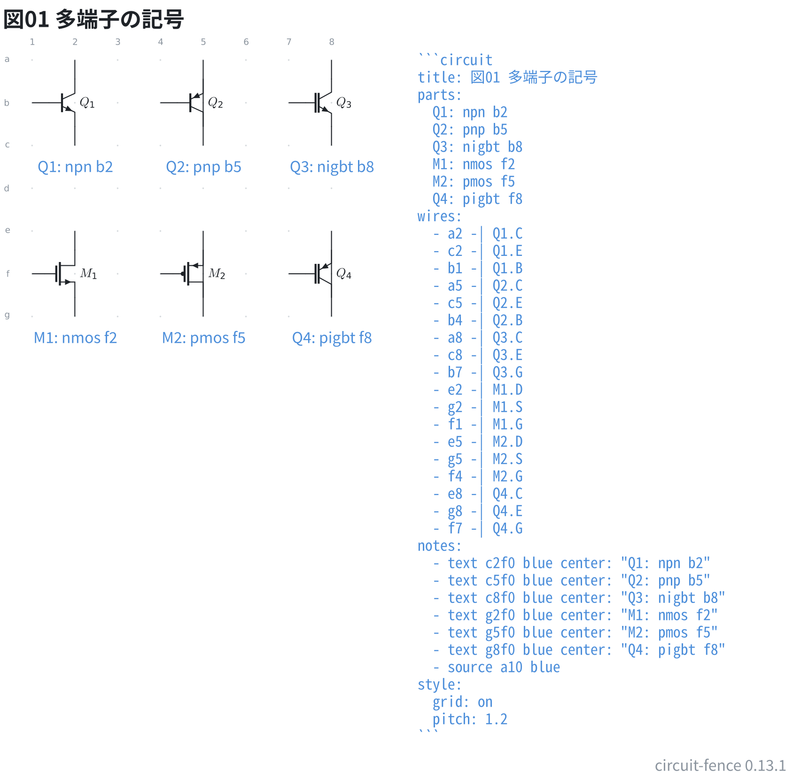
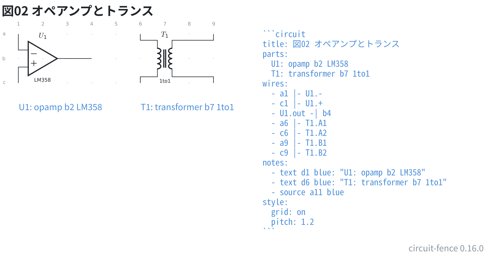
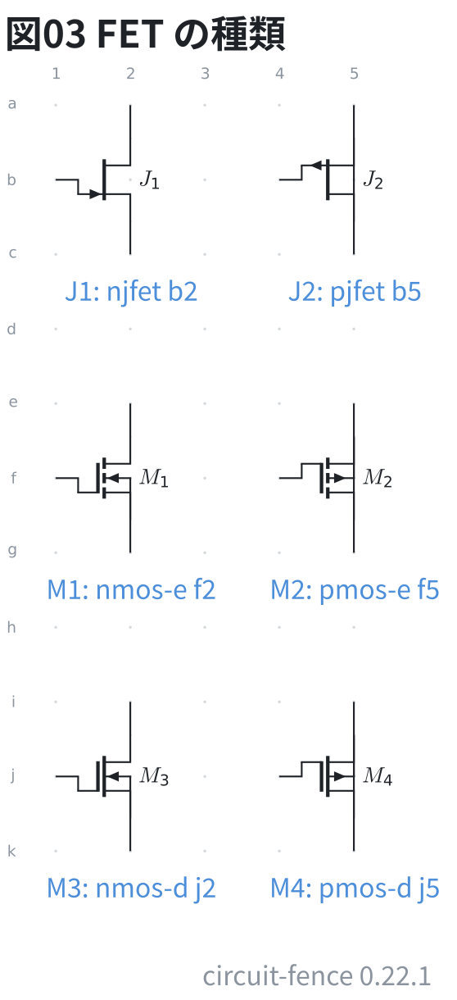
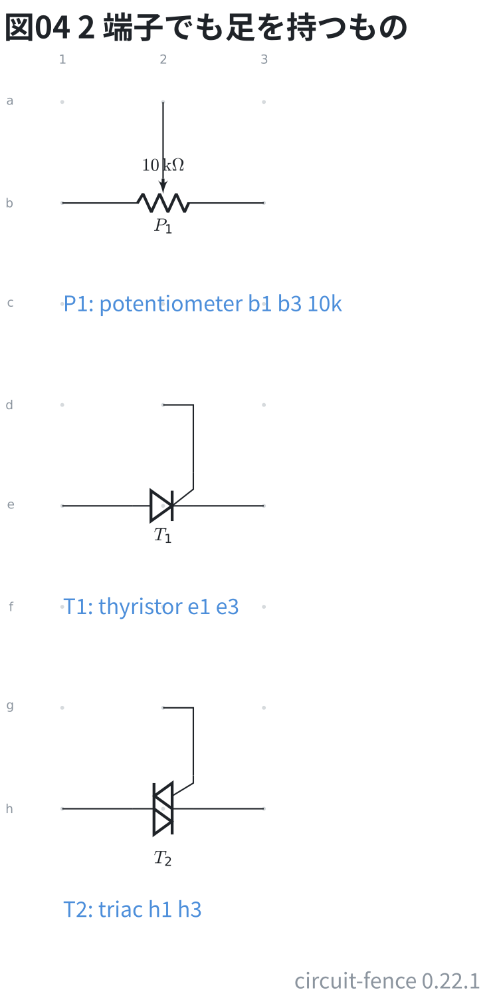
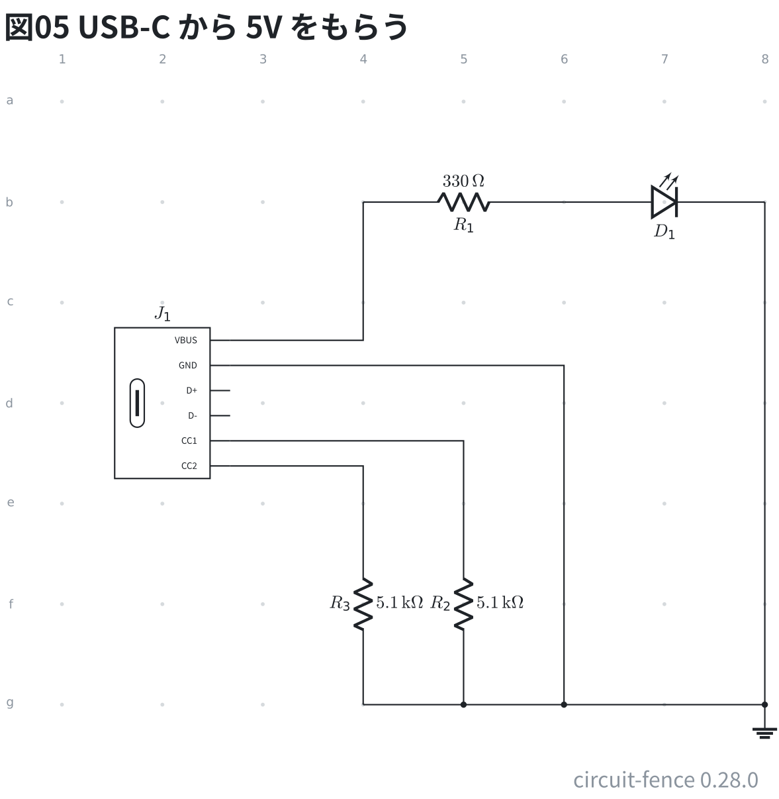
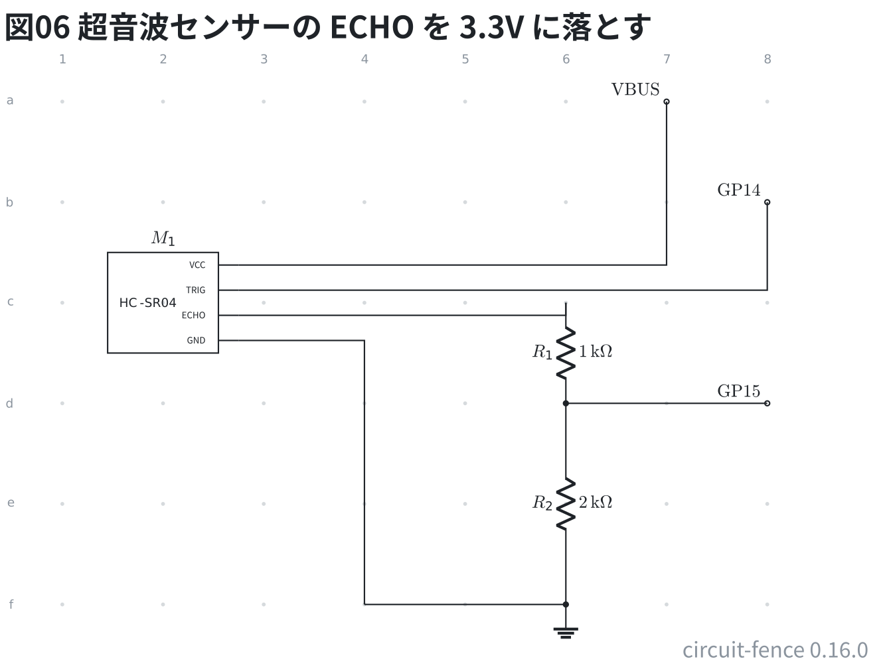
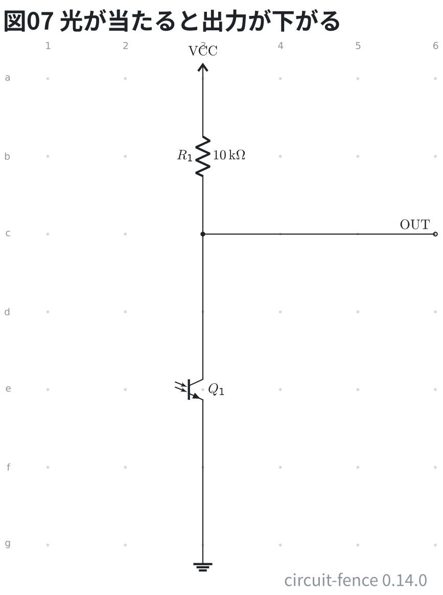
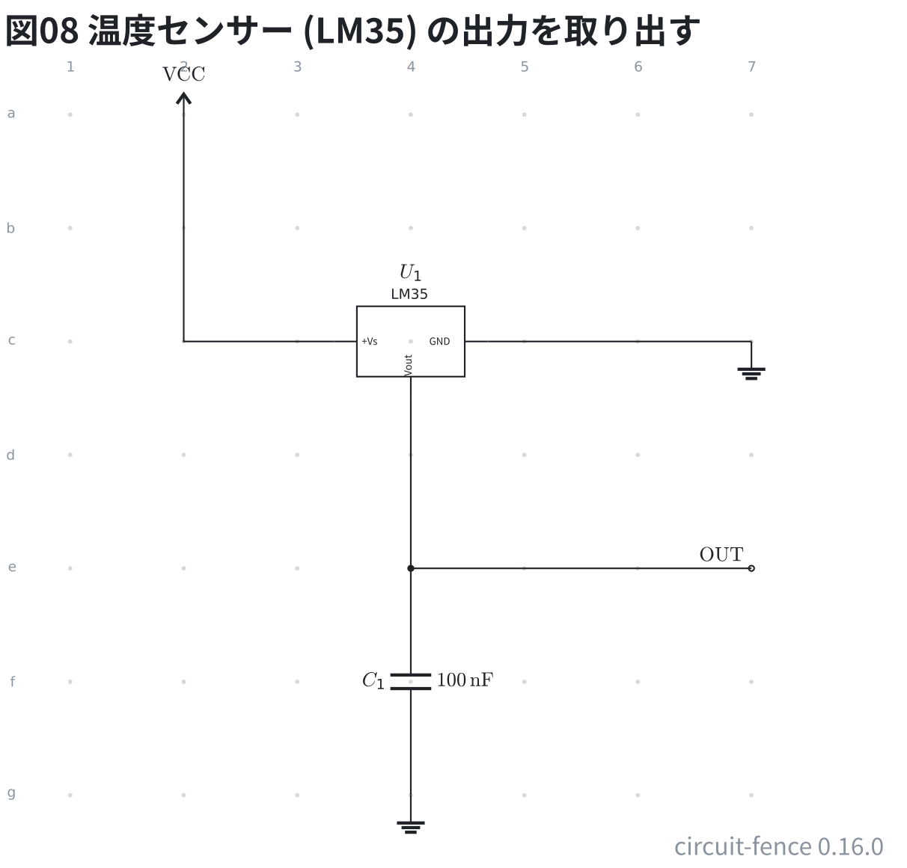

# 多端子の記号

トランジスタ・MOSFET・オペアンプ・トランスは **1 つの番地に置く**。
ピンは番地ではなく名前で指す (`Q1.B` `M1.gate` `U1.out` `T1.A1`)。

```circuit
title: 図01 多端子の記号
parts:
  Q1: npn 2,2
  Q2: pnp 5,2
  Q3: nigbt 8,2
  M1: nmos 2,6
  M2: pmos 5,6
  Q4: pigbt 8,6
wires:
  - 2,1 -| Q1.C
  - 2,3 -| Q1.E
  - 1,2 -| Q1.B
  - 5,1 -| Q2.C
  - 5,3 -| Q2.E
  - 4,2 -| Q2.B
  - 8,1 -| Q3.C
  - 8,3 -| Q3.E
  - 7,2 -| Q3.G
  - 2,5 -| M1.D
  - 2,7 -| M1.S
  - 1,6 -| M1.G
  - 5,5 -| M2.D
  - 5,7 -| M2.S
  - 4,6 -| M2.G
  - 8,5 -| Q4.C
  - 8,7 -| Q4.E
  - 7,6 -| Q4.G
notes:
  - text 2,3.5 blue center: "Q1: npn b2"
  - text 5,3.5 blue center: "Q2: pnp b5"
  - text 8,3.5 blue center: "Q3: nigbt b8"
  - text 2,7.5 blue center: "M1: nmos f2"
  - text 5,7.5 blue center: "M2: pmos f5"
  - text 8,7.5 blue center: "Q4: pigbt f8"
  - source 10,1 blue
style:
  grid: on
  pitch: 1.2
```



上の段がバイポーラと IGBT、下の段が MOSFET。**記号の下の青い行が、
その記号を出すために書いた 1 行**そのもの。
ピンの名前は回路図の慣習の 1 文字でも、綴りでも同じところを指す
(`Q1.B` と `Q1.base` は同じピン)。

| 種類 | ピン |
| --- | --- |
| `npn` / `pnp` | `B` `C` `E` (`base` `collector` `emitter`) |
| `nigbt` / `pigbt` | `G` `C` `E` (IGBT の制御端子はゲート) |
| `nmos` / `pmos` | `G` `D` `S` (`gate` `drain` `source`) |
| `njfet` / `pjfet` | 同上 |
| `nmos-e` / `pmos-e` / `nmos-d` / `pmos-d` | 同上 |
| `opamp` | `+` `-` `out` |
| `transformer` | `A1` `A2` (1 次) / `B1` `B2` (2 次) |

番地の後ろに型番を書くと、記号の下に出る。トランスは 1 次側が `A`、
2 次側が `B`。

```circuit
title: 図02 オペアンプとトランス
parts:
  U1: opamp 2,2 LM358
  T1: transformer 7,2 1to1
wires:
  - 1,1 |- U1.-
  - 1,3 |- U1.+
  - U1.out -| 4,2
  - 6,1 |- T1.A1
  - 6,3 |- T1.A2
  - 9,1 |- T1.B1
  - 9,3 |- T1.B2
notes:
  - text 1,4 blue: "U1: opamp b2 LM358"
  - text 6,4 blue: "T1: transformer b7 1to1"
  - source 11,1 blue
style:
  grid: on
  pitch: 1.2
```



**ピンへは `-|` か `|-` で引く**。ピンは記号ごとに決まった位置にあって格子の上に
無いので、`--` (まっすぐ) で番地とつなぐと斜めの線になる。

## FET の種類

`nmos` / `pmos` はチャネルを 1 本で描いた**簡易記号**。記事でよく使うのは
こちらだが、接合型 (JFET) と、エンハンスメント型 / デプレッション型を
書き分けたいときは次の名前で書く。**ピンの名前はどれも同じ**。

```circuit
title: 図03 FET の種類
parts:
  J1: njfet 2,2
  J2: pjfet 5,2
  M1: nmos-e 2,6
  M2: pmos-e 5,6
  M3: nmos-d 2,10
  M4: pmos-d 5,10
wires:
  - 2,1 -| J1.D
  - 2,3 -| J1.S
  - 1,2 -| J1.G
  - 5,1 -| J2.D
  - 5,3 -| J2.S
  - 4,2 -| J2.G
  - 2,5 -| M1.D
  - 2,7 -| M1.S
  - 1,6 -| M1.G
  - 5,5 -| M2.D
  - 5,7 -| M2.S
  - 4,6 -| M2.G
  - 2,9 -| M3.D
  - 2,11 -| M3.S
  - 1,10 -| M3.G
  - 5,9 -| M4.D
  - 5,11 -| M4.S
  - 4,10 -| M4.G
notes:
  - text 2,3.5 blue center: "J1: njfet b2"
  - text 5,3.5 blue center: "J2: pjfet b5"
  - text 2,7.5 blue center: "M1: nmos-e f2"
  - text 5,7.5 blue center: "M2: pmos-e f5"
  - text 2,11.5 blue center: "M3: nmos-d j2"
  - text 5,11.5 blue center: "M4: pmos-d j5"
style:
  grid: on
  pitch: 1.2
```



左が N チャネル、右が P チャネル。上から接合型 (`njfet` / `pjfet`)、
エンハンスメント型 (`nmos-e` / `pmos-e`)、デプレッション型
(`nmos-d` / `pmos-d`)。エンハンスメント型はチャネルが切れて、
デプレッション型はつながって描かれる。

## 2 端子でもピンを持つもの

ポテンショメータのワイパーとサイリスタ・トライアックのゲートは、
**両端を番地で置いたうえで 3 本目を名前で指す**。書き方は 2 端子部品と同じで、
ピンだけ `P1.w` `T1.g` のように呼ぶ。

```circuit
title: 図04 2 端子でも足を持つもの
parts:
  P1: potentiometer 1,2 3,2 10k
  T1: thyristor 1,5 3,5
  T2: triac 1,8 3,8
wires:
  - P1.w -- 2,1
  - T1.g |- 2,4
  - T2.g |- 2,7
notes:
  - text 1,3 blue: "P1: potentiometer b1 b3 10k"
  - text 1,6 blue: "T1: thyristor e1 e3"
  - text 1,9 blue: "T2: triac h1 h3"
style:
  grid: on
```



| 種類 | ピン |
| --- | --- |
| `potentiometer` | `w` (`wiper`) |
| `thyristor` / `triac` | `g` (`gate`) |

ワイパーは記号の**真上**に出るので、そのまま `--` で上の番地へ引ける。
ゲートは横にずれた位置にあるので、ほかのピンと同じく `|-` で直角に入れる。

## USB コネクタ

`usb-a` / `usb-c` は**箱の右にピンが並び、左に差し込み口の形**が出る
(Type-C は長丸、Type-A は角)。ピンは名前で指す (`J1.VBUS` `J1.CC1`)。
名前と順は実体配線図の 2 つと同じで、番号でも書ける (`J1.1`)。

Type-C の受け口から 5V をもらうには、**CC1 と CC2 を 5.1kΩ でグラウンドへ落とす**
(つないだ相手が「電流を受け取る機器」だと分かって、VBUS に電圧を出す)。
使わない `D+` `D-` は空けたままでよく、ERC も言わない。

```circuit
title: 図05 USB-C から 5V をもらう
parts:
  J1: usb-c 2,4
  R1: resistor 4,2 6,2 330
  D1: led 6,2 8,2
  R2: resistor 5,5 5,7 5.1k
  R3: resistor 4,5 4,7 5.1k
  G1: ground 8,7
wires:
  - J1.VBUS -| 4,2
  - 8,2 -- 8,7
  - J1.GND -| 6,7
  - J1.CC1 -| 5,5
  - J1.CC2 -| 4,5
  - 4,7 -- 8,7
style:
  grid: on
```



| 種類 | ピン |
| --- | --- |
| `usb-a` | `VBUS` `GND` `D+` `D-` (`1` 〜 `4`) |
| `usb-c` | `VBUS` `GND` `D+` `D-` `CC1` `CC2` (`1` 〜 `6`) |

## 機器・モジュール (`device`)

基板の外の機器やモジュール (超音波センサー、充電モジュール、Analog Discovery など) は、
**`type: device` のマップ形式**で書く。実体配線図の 2 つ (breadboard / perfboard) と
同じ書き方なので、同じ回路を 3 つのフェンスで書くとき覚え直さなくてよい。
ピンの名前は `pins:` に書いた順に**箱の上から**並び、配線からは名前で指す (`M1.ECHO`)。

```circuit
title: 図06 超音波センサーの ECHO を 3.3V に落とす
parts:
  M1:
    type: device
    at: 2,3
    label: HC-SR04
    pins: [VCC, TRIG, ECHO, GND]
    turn: mirror
  VBUS: port 7,1
  GP14: port 8,2
  GP15: port 8,4
  R1: resistor 6,3 6,4 1k
  R2: resistor 6,4 6,6 2k
  G1: ground 6,6
wires:
  - M1.VCC -| 7,1
  - M1.TRIG -| 8,2
  - M1.ECHO -| 6,3
  - 6,4 -- 8,4
  - M1.GND -| 4,6 -- 6,6
style:
  grid: on
```



| 鍵 | 中身 |
| --- | --- |
| `type` | `device` (マップ形式で書けるのは機器だけ) |
| `at` | 箱の置き場。番地か `points:` の名前 |
| `pins` | ピンの名前の並び (2〜40 本)。英数字と `_ + -`。数字だけの名前は番号 (`M1.2`) と紛れるので書けない |
| `label` | 箱の中に書く名前 (任意)。書かなければ箱にはピンの名前だけ |
| `turn` | 向き。1 行形式と同じ語 (`r90` `r180` `r270` `mirror`)。`mirror` でピンが右へ |

- ピンは**名前でも番号でも**指せる (`M1.ECHO` = `M1.3`)。名前は大文字小文字を問わない
- 箱の幅はピンの名前と `label` の長さから決まる
- 使わないピンは ERC が言わない (モジュールのピンは差し出しているだけで、使うのは一部)
- ネットリストには**名前で**出る (`M1.ECHO`)。Pico や USB などの箱のピンも、
  図に刷ってある名前で出る (`U1.GP0` `J1.VBUS`)

## フォトトランジスタ (`phototransistor`)

光を受けて電流を流すトランジスタ。**ピンは `C` と `E` の 2 本** — 砲弾型の実物は
2 ピンで、記号もベースの線が無く、代わりに光の矢が左から入る。
実体配線図の 2 つでも同じ名前の 2 ピン (先に書いた穴が C) で書ける。

```circuit
title: 図07 光が当たると出力が下がる
parts:
  VCC: vcc 3,1
  R1:  resistor 3,1 3,3 10k
  Q1:  phototransistor 3,5
  G1:  ground 3,7
  OUT: port 6,3
wires:
  - 3,3 -- Q1.C
  - Q1.E -- 3,7
  - 3,3 -- 6,3
style:
  grid: on
```



名札はピンの無い辺に出るが、光の矢の出る辺 (左) は避ける。

## 3 ピンの IC (`ic3`)

ホール素子・温度センサー・メロディ IC のように**ピンの名前が品ごとに違う
3 ピンの IC** は `ic3` で書く。箱は三端子レギュレータと同じ (1 = 左、2 = 下、
3 = 右)。ピンの名前は機器と同じマップ形式の `pins:` で与え、1 行で書くと番号になる。

```circuit
title: 図08 温度センサー (LM35) の出力を取り出す
parts:
  VCC: vcc 2,1
  U1:
    type: ic3
    at: 4,3
    label: LM35
    pins: [+Vs, Vout, GND]
  G1: ground 7,3
  OUT: port 7,5
  C1: capacitor 4,5 4,7 100n
  G2: ground 4,7
wires:
  - 2,1 |- U1.+Vs
  - U1.GND -| 7,3
  - U1.Vout -- 4,5 -- 7,5
style:
  grid: on
```



LM35 のピンは 1 = `+Vs`、2 = `Vout`、3 = `GND` なので、そのまま 1 = 左、2 = 下、
3 = 右に並ぶ。配線からもネットリストからも書いた名前で指せる (`U1.Vout`)。
