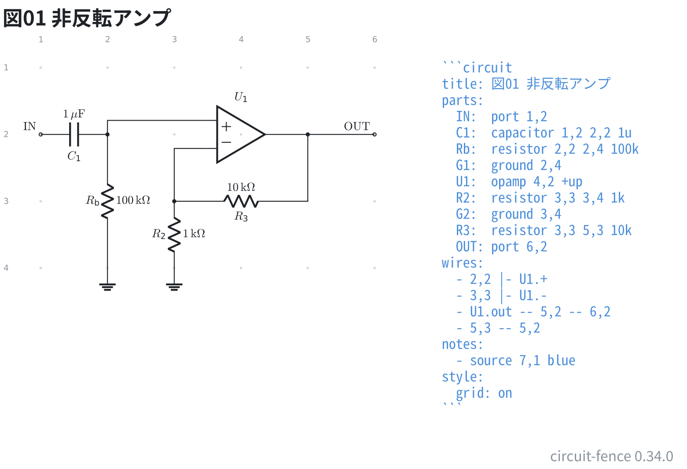

# 非反転アンプ

多端子部品は 1 つの番地に置き、ピンは `U1.out` `Q1.B` のように名前で指す。

```circuit
title: 図01 非反転アンプ
parts:
  IN:  port 1,2
  C1:  capacitor 1,2 2,2 1u
  Rb:  resistor 2,2 2,4 100k
  G1:  ground 2,4
  U1:  opamp 4,2 +up
  R2:  resistor 3,3 3,4 1k
  G2:  ground 3,4
  R3:  resistor 3,3 5,3 10k
  OUT: port 6,2
wires:
  - 2,2 |- U1.+
  - 3,3 |- U1.-
  - U1.out -- 5,2 -- 6,2
  - 5,3 -- 5,2
notes:
  - source 7,1 blue
style:
  grid: on
```



オペアンプは `+up` で + を上にしている。帰還を下に回せるので線が交差しない。

**ピンへは `-|` か `|-` で引く**。ピンは記号ごとに決まった位置にあって格子の上に
無いので、`--` (まっすぐ) で番地とつなぐと斜めの線になる。`|-` なら先に縦、
それから横に入るので、回路図らしく直角に入る。

帰還の節点は記号の真下ではなく**少し横にずらす** (`4,3` ではなく `3,3`)。
真下に置くと、ピンへ向かう線が記号の体を突き抜けて見える。

出口は `U1.out -- 5,2 -- 6,2` と 1 行につないである。5,2 は帰還を当てる節点で、
そこを通る経路として読める。2 行に分けて書いても同じ図になる。
