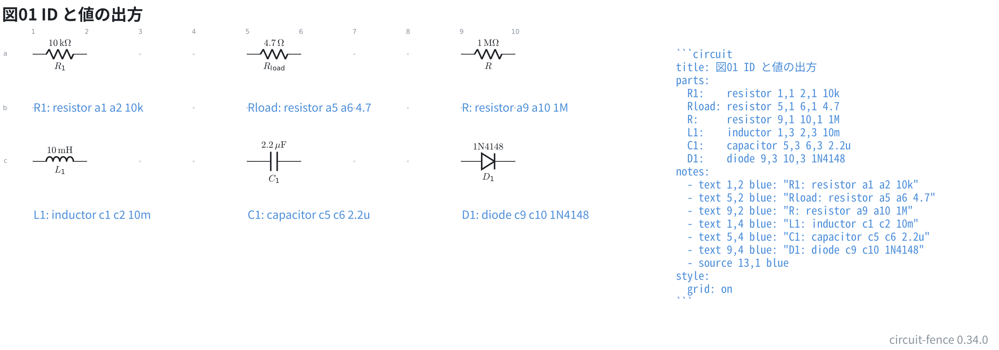
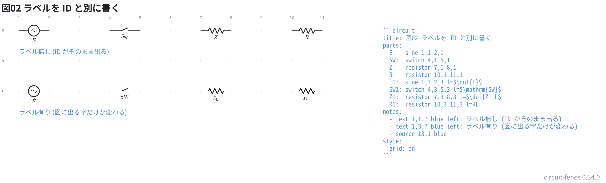

# ID と値とラベルの出方

ID は先頭 1 文字が本体、残りが添字になる (回路図の慣習どおり)。
`R1` は R の添字 1、`Rload` は R の添字 load、`R` はそのまま。

値は種類から単位を補う。数字と SI 接頭辞 (`k` `M` `G` `m` `u` `n` `p`) の
組でないときは、書いたとおりに出る。単位を勝手に足さない。

```circuit
title: 図01 ID と値の出方
parts:
  R1:    resistor 1,1 2,1 10k
  Rload: resistor 5,1 6,1 4.7
  R:     resistor 9,1 10,1 1M
  L1:    inductor 1,3 2,3 10m
  C1:    capacitor 5,3 6,3 2.2u
  D1:    diode 9,3 10,3 1N4148
notes:
  - text 1,2 blue: "R1: resistor a1 a2 10k"
  - text 5,2 blue: "Rload: resistor a5 a6 4.7"
  - text 9,2 blue: "R: resistor a9 a10 1M"
  - text 1,4 blue: "L1: inductor c1 c2 10m"
  - text 5,4 blue: "C1: capacitor c5 c6 2.2u"
  - text 9,4 blue: "D1: diode c9 c10 1N4148"
  - source 13,1 blue
style:
  grid: on
```



| 書いたもの | 図に出るもの |
| --- | --- |
| `R1: resistor … 10k` | R₁ / 10 kΩ |
| `Rload: resistor … 4.7` | R_load / 4.7 Ω |
| `R: resistor … 1M` | R / 1 MΩ |
| `L1: inductor … 10m` | L₁ / 10 mH |
| `C1: capacitor … 2.2u` | C₁ / 2.2 uF |
| `D1: diode … 1N4148` | D₁ / 1N4148 (そのまま) |

ID は記号の下 (縦置きなら左)、値は反対側に出る。

値に使えるのは英数字と `. + - / ( ) _ %` だけ。`,` と `=` は circuitikz が
オプションの区切りとして読んでしまうので使えない (小数点は `.` で書く)。
日本語は**フェンスの TeX にフォントが無い**ので描けない。

## ラベルを ID と別に書く

`l=字` を書くと、**図に出る字だけ**を差し替えられる。
配線から指す名前もネットリストの名前も ID のままなので、
図の見た目と回路の構造が混ざらない。

`$…$` で囲むと数式の部分集合が使える。フェーザの点 (`\dot{}`) や、
添字にしたくない 2 字の本体 (`\mathrm{}`) はこれで書く。

```circuit
title: 図02 ラベルを ID と別に書く
parts:
  E:   sine 1,1 2,1
  SW:  switch 4,1 5,1
  Z:   resistor 7,1 8,1
  R:   resistor 10,1 11,1
  E1:  sine 1,3 2,3 l=$\dot{E}$
  SW1: switch 4,3 5,3 l=$\mathrm{SW}$
  Z1:  resistor 7,3 8,3 l=$\dot{Z}_L$
  R1:  resistor 10,3 11,3 l=RL
notes:
  - text 1,1.7 blue left: ラベル無し (ID がそのまま出る)
  - text 1,3.7 blue left: ラベル有り (図に出る字だけが変わる)
  - source 13,1 blue
style:
  grid: on
```



上の段がラベル無し、下の段が同じ部品にラベルを書いたもの。

| 書いたもの | 図に出るもの |
| --- | --- |
| (ラベル無しの ID `SW`) | S_W (ID の規則どおり添字になる) |
| `l=$\dot{E}$` | Ė (フェーザの点) |
| `l=$\mathrm{SW}$` | SW (立体。添字にならない) |
| `l=$\dot{Z}_L$` | Ż_L (点と添字) |
| `l=RL` | R_L (囲まなければ ID と同じ組み方) |

**書いた TeX がそのまま図に渡るわけではない**。読み直してこちらが組み直すので、
知らない命令は行番号つきで返る (`\frac` など)。

`$…$` を書いたフェンスも、そのまま図に書き出せる (`- source`)。
TeX が自分の記法として読む字 (`\` `$` `{` `}` `^`) は通すのではなく
**綴り直して**書き出す。
