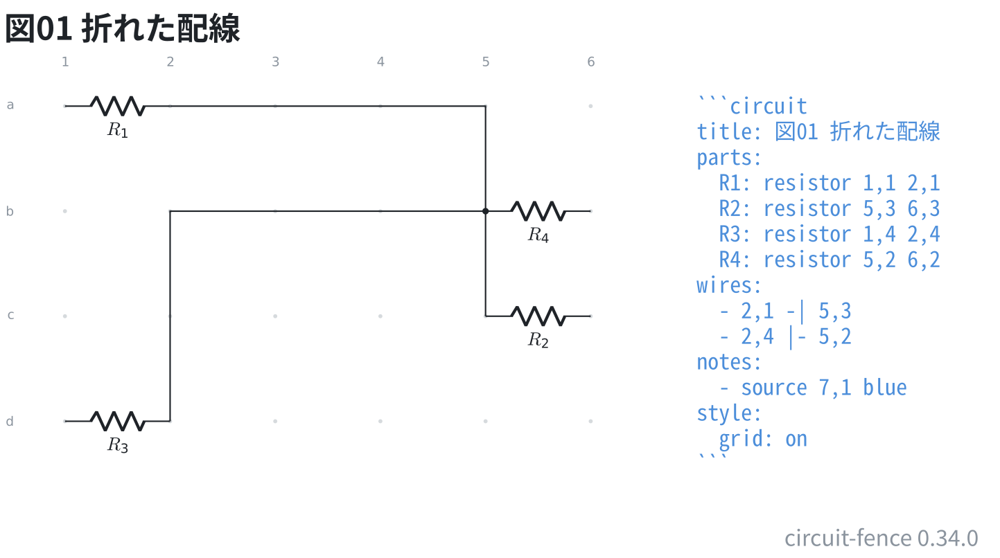
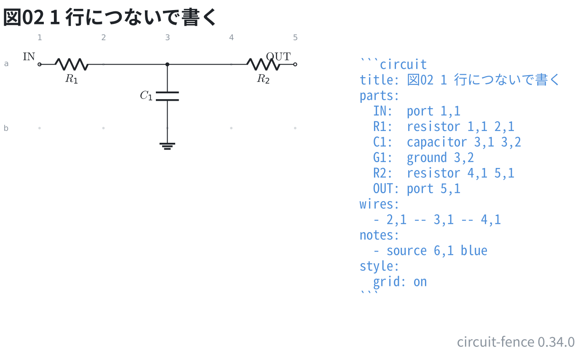

# 折れた配線

配線の演算子は TikZ と同じ 3 つ。`--` はまっすぐ、`-|` は先に横、
`|-` は先に縦に折れる。

```circuit
title: 図01 折れた配線
parts:
  R1: resistor 1,1 2,1
  R2: resistor 5,3 6,3
  R3: resistor 1,4 2,4
  R4: resistor 5,2 6,2
wires:
  - 2,1 -| 5,3
  - 2,4 |- 5,2
notes:
  - source 7,1 blue
style:
  grid: on
```



同じ 2 点を結んでも、`-|` と `|-` では通る道が違う。

この図では 2 本目 (`d2 |- b5`) の終点が 1 本目の縦の脚の**途中**に乗っている。
端が線の途中に乗ったところは T 字なので、つながっているものとして黒丸が付き、
ネットリストでも 1 つのネットにまとまる。ただ交差しているだけ (どちらの端でも
ない) のところには黒丸を打たない = つながらない。

## 1 行につないで書く

端点は 3 つ以上並べてよい。演算子は区間ごとに選べるので、
**1 行が 1 本の信号経路**として読める。

```circuit
title: 図02 1 行につないで書く
parts:
  IN:  port 1,1
  R1:  resistor 1,1 2,1
  C1:  capacitor 3,1 3,2
  G1:  ground 3,2
  R2:  resistor 4,1 5,1
  OUT: port 5,1
wires:
  - 2,1 -- 3,1 -- 4,1
notes:
  - source 6,1 blue
style:
  grid: on
```



この 1 行は `a2 -- a3` と `a3 -- a4` の 2 区間に開かれる。
区間に開いてから先は 1 行ずつ書いたときと同じものが流れるので、
**分岐の黒丸もネットリストも変わらない** (a3 に C1 が下りているので黒丸が付く)。

途中の番地は、この図のようにほかの部品が下りる**節点**でも、
ただの**曲がり角**でもよい。区間ごとに演算子を選べるので、
`b1 -- b3 |- U1.+` のように途中から折り方を変えられる。

読めなかったときに返る行は書いた 1 行のまま。どの区間が悪くてもその行に付く。
