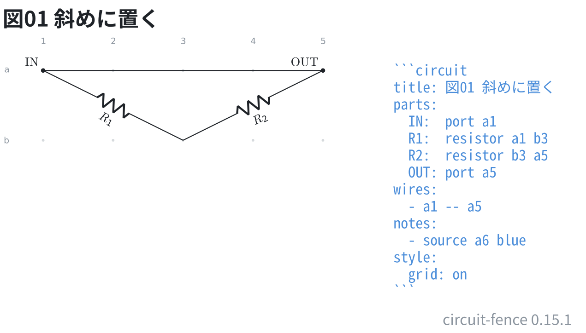

# 斜めに置く

部品も配線も**斜めに置いてよい**。行も列も揃っていない 2 点の間に、そのまま引く。

```circuit
title: 図01 斜めに置く
parts:
  IN:  port 1,1
  R1:  resistor 1,1 3,2
  R2:  resistor 3,2 5,1
  OUT: port 5,1
wires:
  - 1,1 -- 5,1
notes:
  - source 6,1 blue
style:
  grid: on
```



`R1` は `a1` から `b3` へ、`R2` は `b3` から `a5` へ斜めに寝る。
配線の `--` も 2 点の間をまっすぐ引くので、斜めのまま通る。

通らないのは両端が同じ番地のときだけ (向きも長さも決まらないため)。
そのときは行番号つきで返る。
