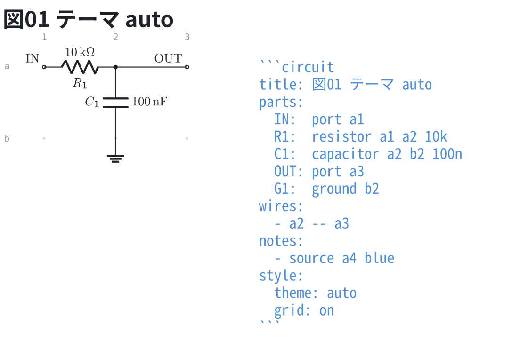
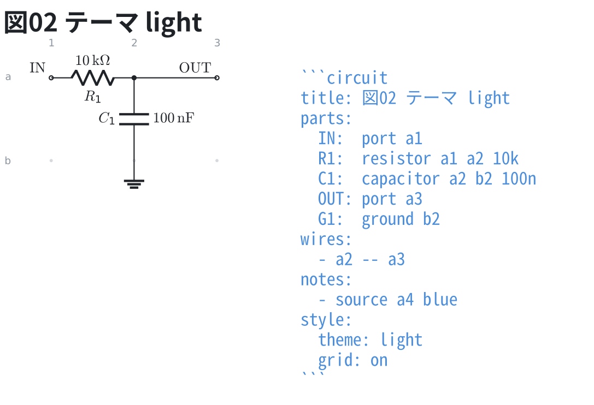
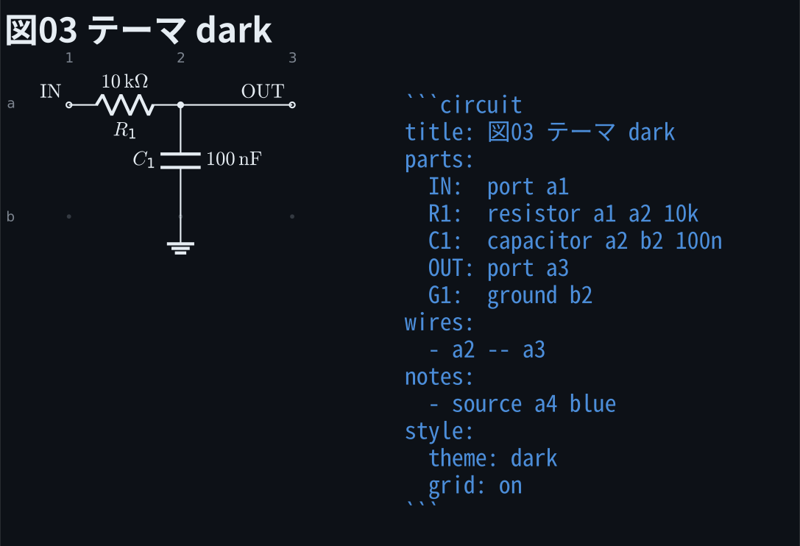
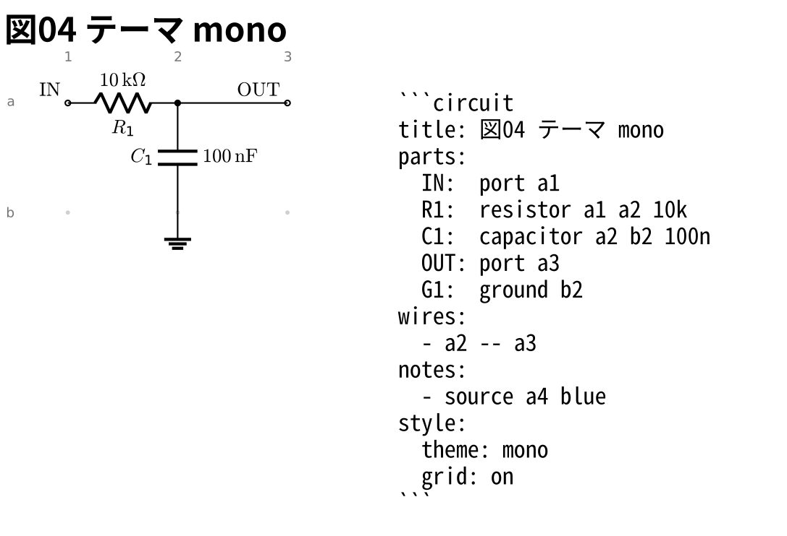

# テーマ

`style: theme` で明暗を選ぶ。**テーマを変えても図は描き直さない**
(描き上がった SVG の色を差し替えるだけ)。

`auto` が既定。エディタの文字色をそのまま使うので、明るいテーマでも
暗いテーマでも読める。1 枚描いた図をどちらでも使い回せる。

```circuit
title: 図01 テーマ auto
parts:
  IN:  port a1
  R1:  resistor a1 a2 10k
  C1:  capacitor a2 b2 100n
  OUT: port a3
  G1:  ground b2
wires:
  - a2 -- a3
notes:
  - source a4 blue
style:
  theme: auto
  grid: on
```



`light` / `dark` は明暗を決め打ちする。ノートの見た目を固定したいとき。

```circuit
title: 図02 テーマ light
parts:
  IN:  port a1
  R1:  resistor a1 a2 10k
  C1:  capacitor a2 b2 100n
  OUT: port a3
  G1:  ground b2
wires:
  - a2 -- a3
notes:
  - source a4 blue
style:
  theme: light
  grid: on
```



```circuit
title: 図03 テーマ dark
parts:
  IN:  port a1
  R1:  resistor a1 a2 10k
  C1:  capacitor a2 b2 100n
  OUT: port a3
  G1:  ground b2
wires:
  - a2 -- a3
notes:
  - source a4 blue
style:
  theme: dark
  grid: on
```



`mono` は黒一色。資料に貼るときや印刷するとき。

```circuit
title: 図04 テーマ mono
parts:
  IN:  port a1
  R1:  resistor a1 a2 10k
  C1:  capacitor a2 b2 100n
  OUT: port a3
  G1:  ground b2
wires:
  - a2 -- a3
notes:
  - source a4 blue
style:
  theme: mono
  grid: on
```



**`mono` は注釈の色も潰す**。この 4 枚はどれも `- source a4 blue` と書いて
あるが、`mono` だけ書き出しが黒で出る。「黒一色」と言っている以上、注釈だけ
色が残ると説明が嘘になるため。色を使いたい図では `mono` を選ばない。

テーマだけ選ぶなら `style: dark` の 1 行でよい。細かく指定するときは
マップで書く ([09-style.md](09-style.md))。
