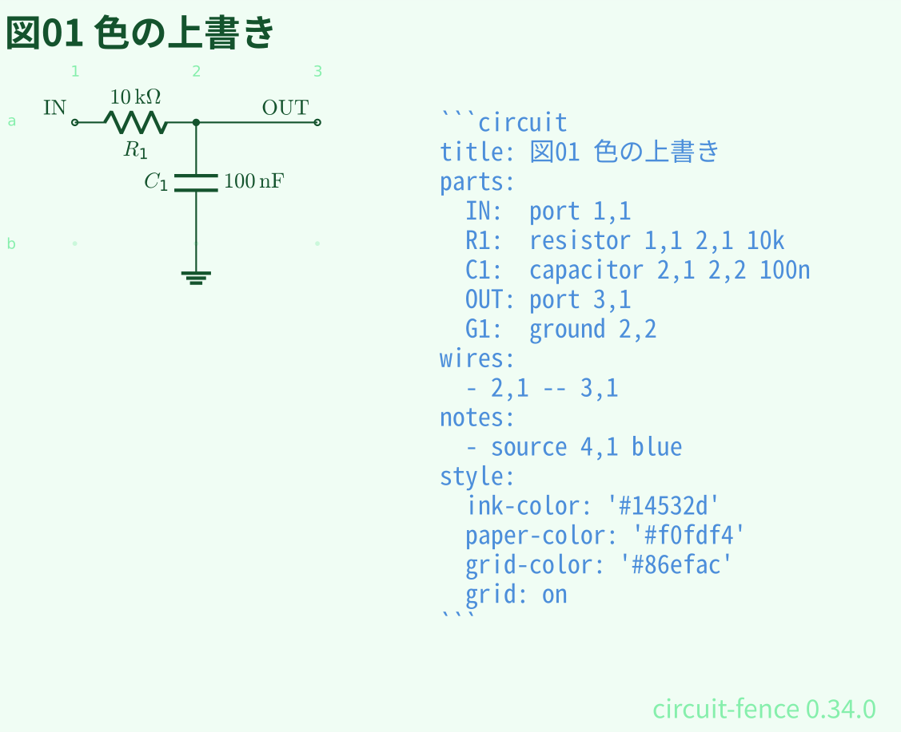
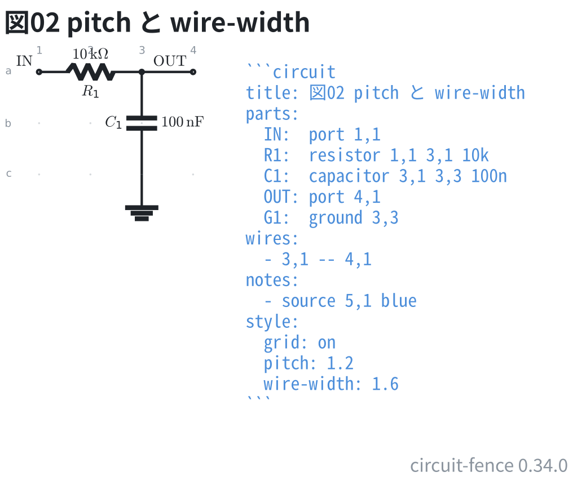
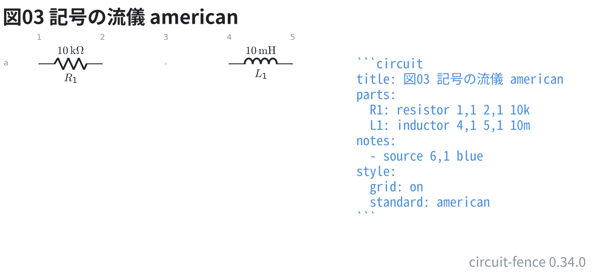
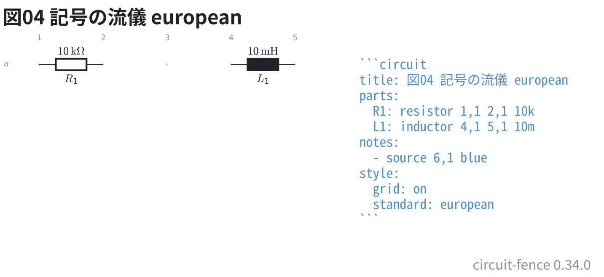
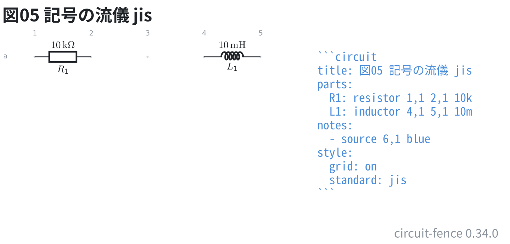
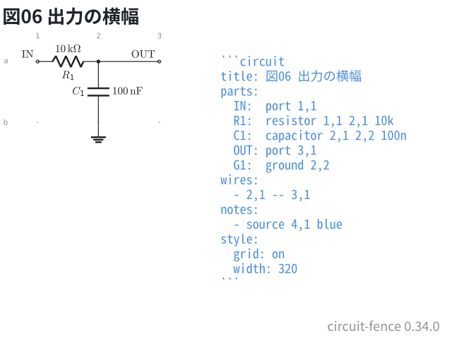
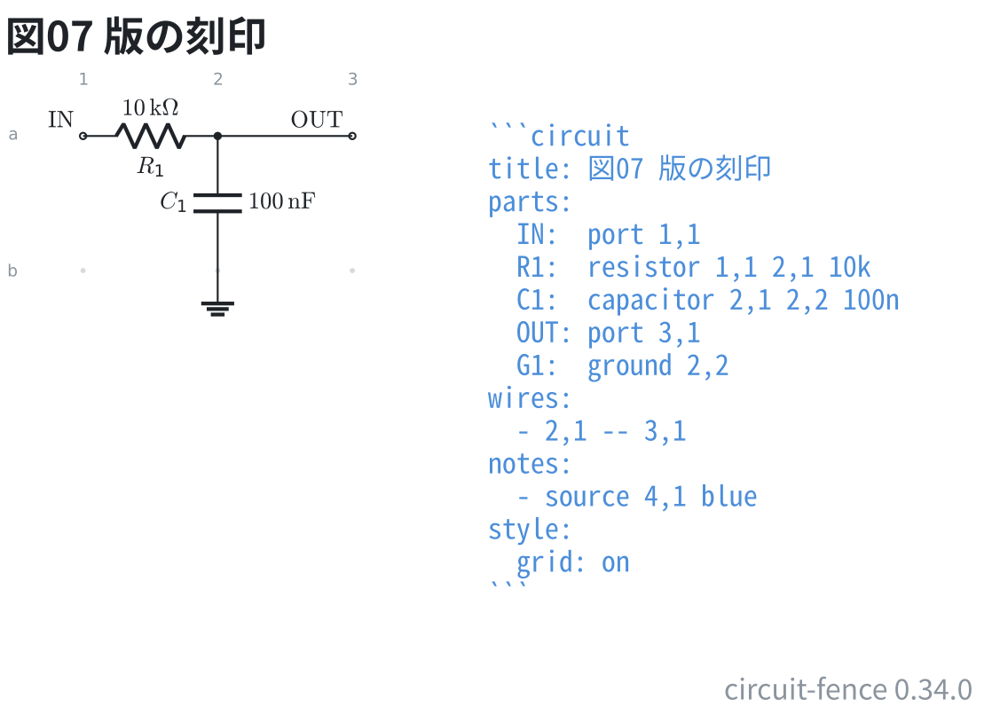

# 色と大きさ

テーマの色は 1 つずつ上書きできる。`ink-color` が線と文字、`paper-color` が
端子の白丸など地の色で塗るところ、`grid-color` がグリッドの点。

色は `#rgb` か `#rrggbb` だけを受ける。名前 (`red` など) は通さない
(検証済みの値しか図に入れないため)。

```circuit
title: 図01 色の上書き
parts:
  IN:  port 1,1
  R1:  resistor 1,1 2,1 10k
  C1:  capacitor 2,1 2,2 100n
  OUT: port 3,1
  G1:  ground 2,2
wires:
  - 2,1 -- 3,1
notes:
  - source 4,1 blue
style:
  ink-color: '#14532d'
  paper-color: '#f0fdf4'
  grid-color: '#86efac'
  grid: on
```



`pitch` は 1 マスの大きさ (cm、0.5〜5)、`wire-width` は線の太さ (pt、0.2〜4)。
詰めて太くすると、小さく貼っても読める。

```circuit
title: 図02 pitch と wire-width
parts:
  IN:  port 1,1
  R1:  resistor 1,1 3,1 10k
  C1:  capacitor 3,1 3,3 100n
  OUT: port 4,1
  G1:  ground 3,3
wires:
  - 3,1 -- 4,1
notes:
  - source 5,1 blue
style:
  grid: on
  pitch: 1.2
  wire-width: 1.6
```



`standard` は記号の流儀。既定の `american` は抵抗がギザギザ。

```circuit
title: 図03 記号の流儀 american
parts:
  R1: resistor 1,1 2,1 10k
  L1: inductor 4,1 5,1 10m
notes:
  - source 6,1 blue
style:
  grid: on
  standard: american
```



`european` にすると抵抗が箱になる (IEC の流儀)。

```circuit
title: 図04 記号の流儀 european
parts:
  R1: resistor 1,1 2,1 10k
  L1: inductor 4,1 5,1 10m
notes:
  - source 6,1 blue
style:
  grid: on
  standard: european
```



`jis` は現行の JIS C 0617 (電験三種の問題用紙の図。1999 年に廃止された旧 JIS C 0301 の
ギザギザではない)。抵抗は `european` と同じ箱で、コイルが黒い箱ではなく半円の連なりに
なる。電圧は + 側を指すまっすぐな矢 (図は[電流の矢と電圧の符号](15-arrows.md)の図04)。
論理ゲートは `american` と同じ MIL 記号のまま。

```circuit
title: 図05 記号の流儀 jis
parts:
  R1: resistor 1,1 2,1 10k
  L1: inductor 4,1 5,1 10m
notes:
  - source 6,1 blue
style:
  grid: on
  standard: jis
```



`width` は出力の横ドット数 (120〜4000)。図の中身は動かさず、外寸だけ変える。
資料の段幅に合わせたいときに使う。

```circuit
title: 図06 出力の横幅
parts:
  IN:  port 1,1
  R1:  resistor 1,1 2,1 10k
  C1:  capacitor 2,1 2,2 100n
  OUT: port 3,1
  G1:  ground 2,2
wires:
  - 2,1 -- 3,1
notes:
  - source 4,1 blue
style:
  grid: on
  width: 320
```



図の右下には、その図を組んだ処理系の版を既定で刻む。**字は書かない** —
処理系が埋めるので、拡張機能を更新すれば刻印も一緒に新しくなる。
資料に貼った図が、どの版で描いたものかを後から辿れる。

```circuit
title: 図07 版の刻印
parts:
  IN:  port 1,1
  R1:  resistor 1,1 2,1 10k
  C1:  capacitor 2,1 2,2 100n
  OUT: port 3,1
  G1:  ground 2,2
wires:
  - 2,1 -- 3,1
notes:
  - source 4,1 blue
style:
  grid: on
```



消すときは `style:` に `stamp: off` を書く。刻まないときも、版は書き出した
`.svg` の根に `data-circuit-fence` として必ず入っている (図の見た目は変わらない)。
