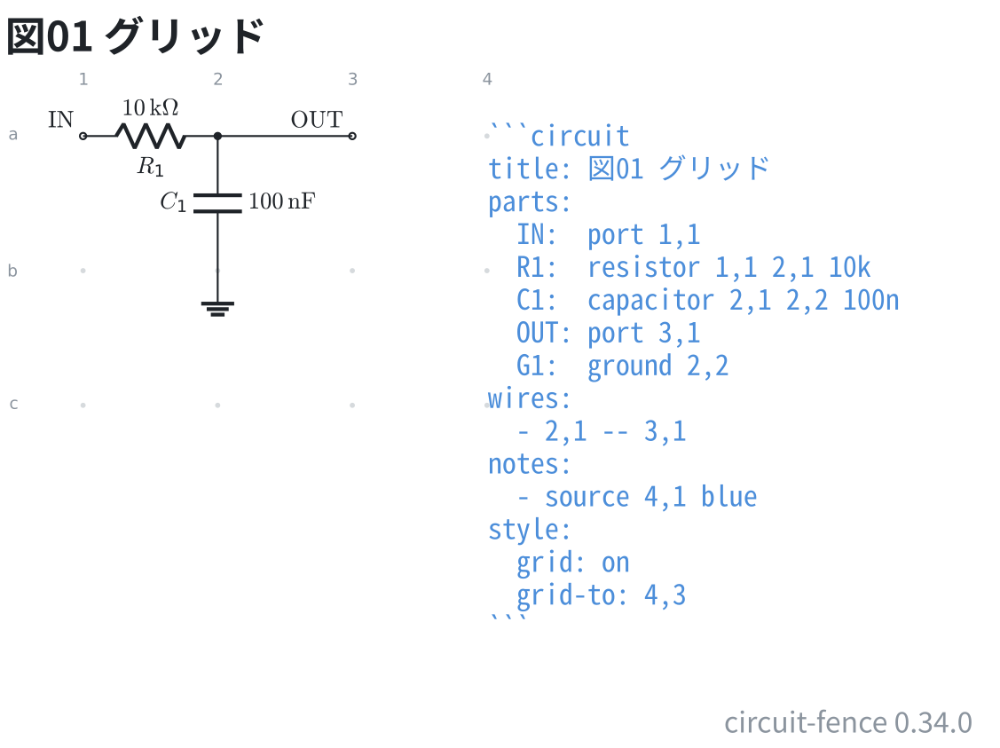

# グリッドを見ながら置く

`style: grid: on` にすると、部品を置ける位置が点で出る。
行は左に英字、列は上に数字で、ブレッドボードと同じ読み方。

```circuit
title: 図01 グリッド
parts:
  IN:  port 1,1
  R1:  resistor 1,1 2,1 10k
  C1:  capacitor 2,1 2,2 100n
  OUT: port 3,1
  G1:  ground 2,2
wires:
  - 2,1 -- 3,1
notes:
  - source 4,1 blue
style:
  grid: on
  grid-to: 4,3
```



`grid-to` を書くと、使っていない範囲までグリッドが伸びる。
部品を動かす先が見えるので、番地を書き換えながら組むときに使う。
