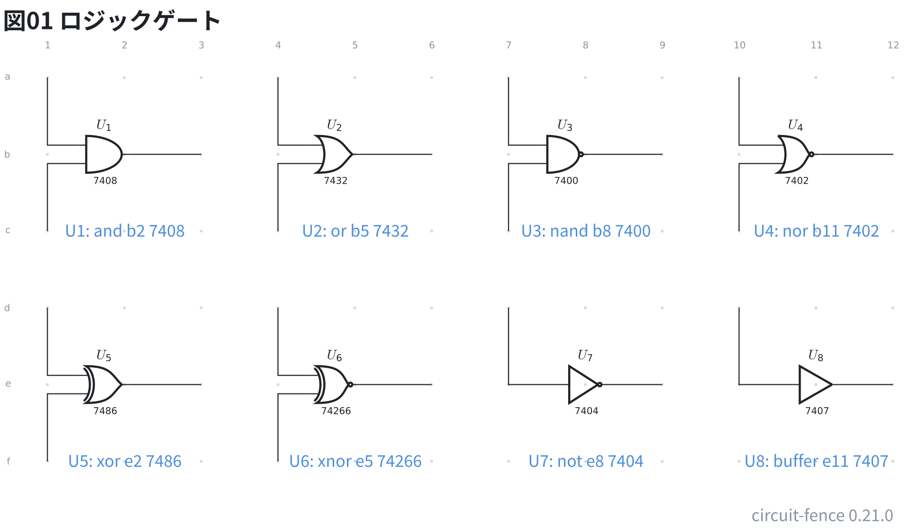
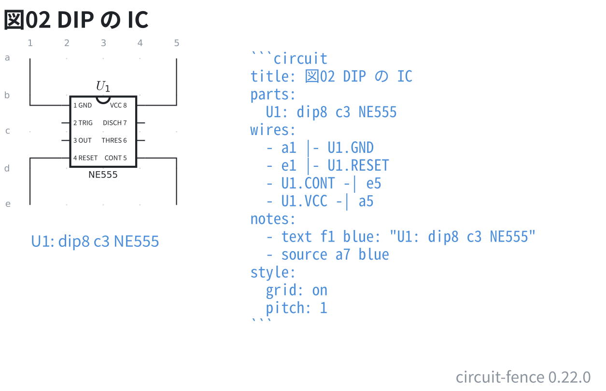
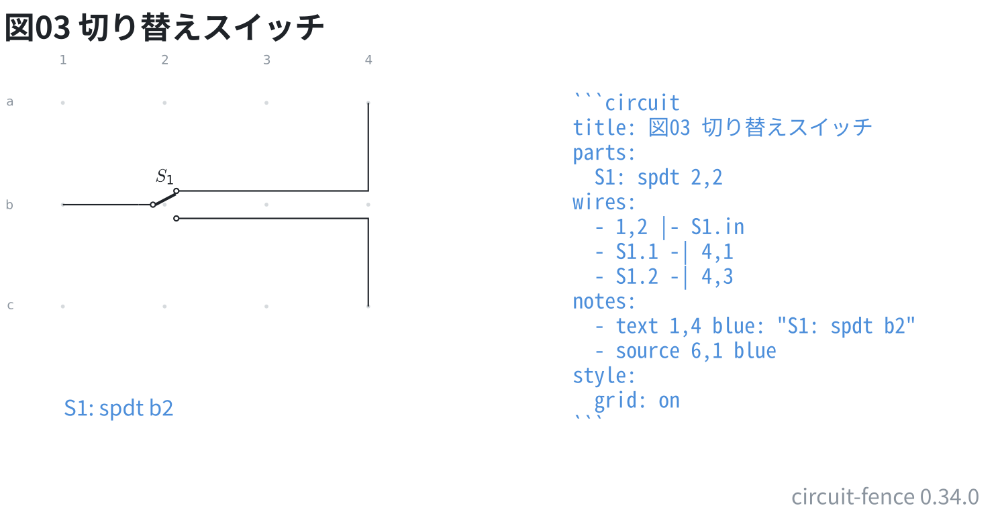
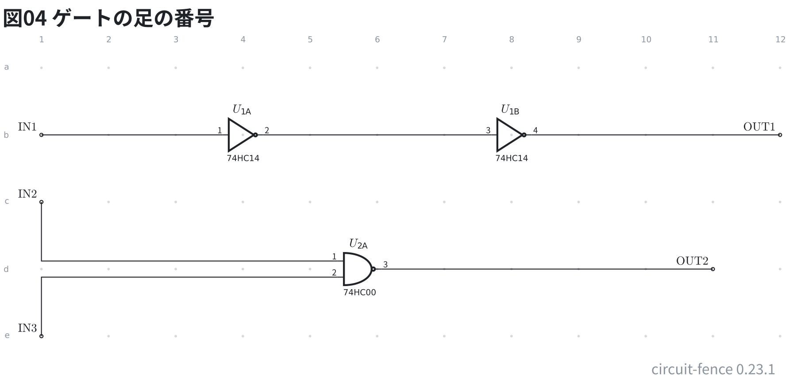

# ロジックゲートと IC

ロジックゲートは 1 つの番地に置き、足を名前で指す。入力は `a` `b`、
出力は `out`。入力は番号でも呼べる (`U1.1` `U1.2`)。

```circuit
title: 図01 ロジックゲート
parts:
  U1: and b2 7408
  U2: or b5 7432
  U3: nand b8 7400
  U4: nor b11 7402
  U5: xor e2 7486
  U6: xnor e5 74266
  U7: not e8 7404
  U8: buffer e11 7407
wires:
  - a1 |- U1.a
  - c1 |- U1.b
  - U1.out -| b3
  - a4 |- U2.a
  - c4 |- U2.b
  - U2.out -| b6
  - a7 |- U3.a
  - c7 |- U3.b
  - U3.out -| b9
  - a10 |- U4.a
  - c10 |- U4.b
  - U4.out -| b12
  - d1 |- U5.a
  - f1 |- U5.b
  - U5.out -| e3
  - d4 |- U6.a
  - f4 |- U6.b
  - U6.out -| e6
  - d7 |- U7.in
  - U7.out -| e9
  - d10 |- U8.in
  - U8.out -| e12
notes:
  - text c2 blue center: "U1: and b2 7408"
  - text c5 blue center: "U2: or b5 7432"
  - text c8 blue center: "U3: nand b8 7400"
  - text c11 blue center: "U4: nor b11 7402"
  - text f2 blue center: "U5: xor e2 7486"
  - text f5 blue center: "U6: xnor e5 74266"
  - text f8 blue center: "U7: not e8 7404"
  - text f11 blue center: "U8: buffer e11 7407"
style:
  grid: on
```



上の段が `and` / `or` / `nand` / `nor`、下の段が `xor` / `xnor` / `not` /
`buffer`。`not` と `buffer` は入力が 1 本なので、足の名前は `in` と `out`。
番地の後ろに書いた型番は記号の下に出る。

## DIP の IC

`dip8` `dip14` `dip16` `dip20` `dip28` `dip40` があり、足は**番号で指す**
(`U1.1`)。型番は箱の**下**に出る (箱の中は足の番号で埋まる。寝かせた
`r90` / `r270` の箱では中に入る)。**型番が足の名前の表にあれば** (`NE555` など)、
箱の中に名前と番号が出て、名前でも指せる (`U1.GND` = `U1.1`)。

```circuit
title: 図02 DIP の IC
parts:
  U1: dip8 c3 NE555
wires:
  - a1 |- U1.GND
  - e1 |- U1.RESET
  - U1.CONT -| e5
  - U1.VCC -| a5
notes:
  - text f1 blue: "U1: dip8 c3 NE555"
  - source a7 blue
style:
  grid: on
  pitch: 1
```



足の番号は DIP の実物と同じで、左上が 1、左を下りて、右下から上がって戻る
(8 ピンなら左が 1〜4、右が 5〜8)。名前は番号の内側に並ぶ (`1 GND` / `VCC 8`)。

## 切り替えスイッチ

`spdt` は共通が `in`、行き先が `1` と `2`。

```circuit
title: 図03 切り替えスイッチ
parts:
  S1: spdt b2
wires:
  - b1 |- S1.in
  - S1.1 -| a4
  - S1.2 -| c4
notes:
  - text d1 blue: "S1: spdt b2"
  - source a6 blue
style:
  grid: on
```



## ゲートの足の番号

IC の 1 回路を記号 1 つで描くとき、**ID の末尾の大文字が IC の何番目の回路か** (`U1A` は 1 つ目、
`U1B` は 2 つ目 …)、**型番が足の名前の表にあれば**、記号の足に IC の足の番号が添わる
(74HC00 の `U2A` は入力が 1・2、出力が 3)。組むときに「この線は何番ピンか」が図から読める。
型番が表に無い・ID に回路の字が無いときは、今までどおり番号は出ない。

```circuit
title: 図04 ゲートの足の番号
parts:
  IN1: port b1
  U1A: not b4 74HC14
  U1B: not b8 74HC14
  OUT1: port b12
  IN2: port c1
  IN3: port e1
  U2A: nand d6 74HC00
  OUT2: port d11
wires:
  - b1 -- U1A.in
  - U1A.out -- U1B.in
  - U1B.out -- b12
  - c1 |- U2A.in1
  - e1 |- U2A.in2
  - U2A.out -- d11
style:
  grid: on
```



回路の字が IC の回路の数を超えたとき (`U1E` の 74HC00 は A〜D まで) と、記号の入力の数が回路と合わない
とき (3 入力の 74HC10 を `nand` で描く) は、番号を添えずにお知らせを出す。
