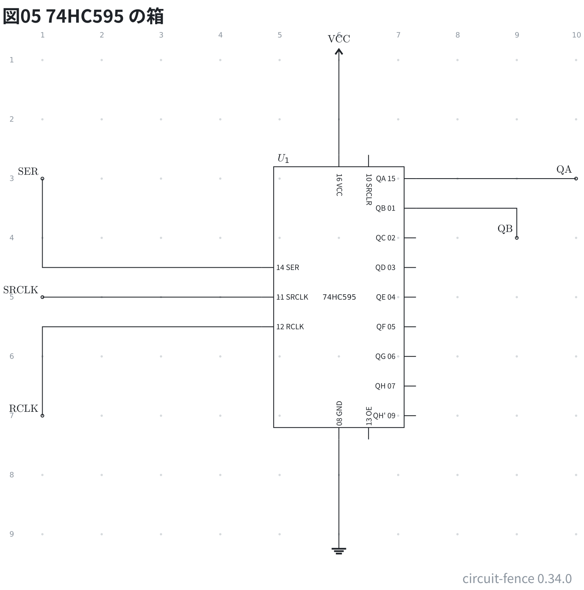
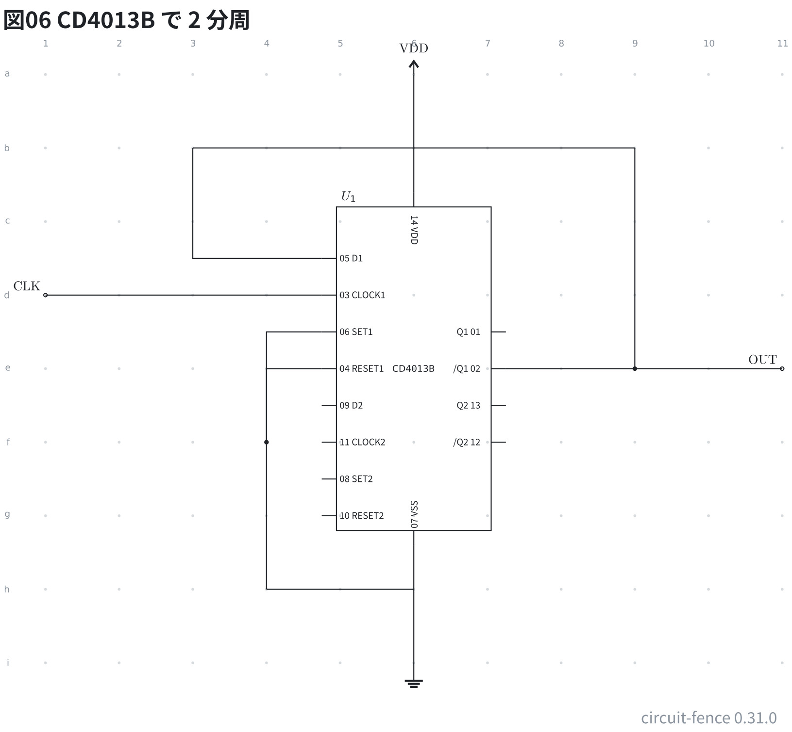
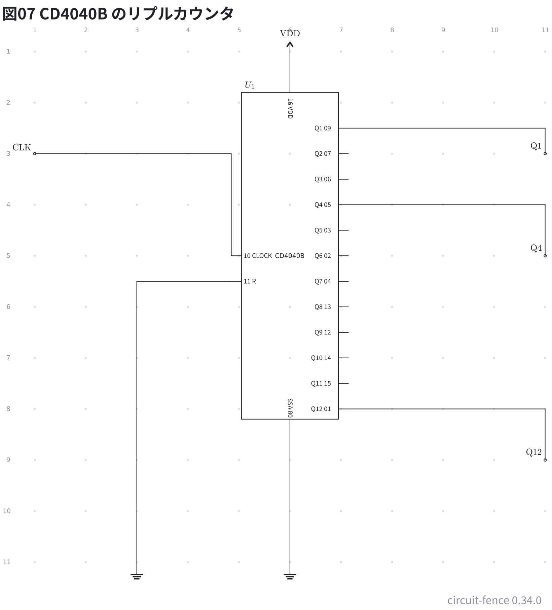

# ロジックゲートと IC

ロジックゲートは 1 つの番地に置き、ピンを名前で指す。入力は `a` `b`、
出力は `out`。入力は番号でも呼べる (`U1.1` `U1.2`)。

```circuit
title: 図01 ロジックゲート
parts:
  U1: and 2,2 7408
  U2: or 5,2 7432
  U3: nand 8,2 7400
  U4: nor 11,2 7402
  U5: xor 2,5 7486
  U6: xnor 5,5 74266
  U7: not 8,5 7404
  U8: buffer 11,5 7407
wires:
  - 1,1 |- U1.a
  - 1,3 |- U1.b
  - U1.out -| 3,2
  - 4,1 |- U2.a
  - 4,3 |- U2.b
  - U2.out -| 6,2
  - 7,1 |- U3.a
  - 7,3 |- U3.b
  - U3.out -| 9,2
  - 10,1 |- U4.a
  - 10,3 |- U4.b
  - U4.out -| 12,2
  - 1,4 |- U5.a
  - 1,6 |- U5.b
  - U5.out -| 3,5
  - 4,4 |- U6.a
  - 4,6 |- U6.b
  - U6.out -| 6,5
  - 7,4 |- U7.in
  - U7.out -| 9,5
  - 10,4 |- U8.in
  - U8.out -| 12,5
notes:
  - text 2,3 blue center: "U1: and b2 7408"
  - text 5,3 blue center: "U2: or b5 7432"
  - text 8,3 blue center: "U3: nand b8 7400"
  - text 11,3 blue center: "U4: nor b11 7402"
  - text 2,6 blue center: "U5: xor e2 7486"
  - text 5,6 blue center: "U6: xnor e5 74266"
  - text 8,6 blue center: "U7: not e8 7404"
  - text 11,6 blue center: "U8: buffer e11 7407"
style:
  grid: on
```


上の段が `and` / `or` / `nand` / `nor`、下の段が `xor` / `xnor` / `not` /
`buffer`。`not` と `buffer` は入力が 1 本なので、ピンの名前は `in` と `out`。
番地の後ろに書いた型番は記号の下に出る。

## DIP の IC

`dip8` `dip14` `dip16` `dip20` `dip28` `dip40` があり、ピンは**番号で指す**
(`U1.1`)。型番は箱の**下**に出る (箱の中はピンの番号で埋まる。寝かせた
`r90` / `r270` の箱では中に入る)。**型番がピンの名前の表にあれば** (`NE555` など)、
箱の中に名前と番号が出て、名前でも指せる (`U1.GND` = `U1.1`)。

```circuit
title: 図02 DIP の IC
parts:
  U1: dip8 3,3 NE555
wires:
  - 1,1 |- U1.GND
  - 1,5 |- U1.RESET
  - U1.CONT -| 5,5
  - U1.VCC -| 5,1
notes:
  - text 1,6 blue: "U1: dip8 c3 NE555"
  - source 7,1 blue
style:
  grid: on
  pitch: 1
```


ピンの番号は DIP の実物と同じで、左上が 1、左を下りて、右下から上がって戻る
(8 ピンなら左が 1〜4、右が 5〜8)。名前は番号の内側に並ぶ (`1 GND` / `VCC 8`)。

## 切り替えスイッチ

`spdt` は共通が `in`、行き先が `1` と `2`。

```circuit
title: 図03 切り替えスイッチ
parts:
  S1: spdt 2,2
wires:
  - 1,2 |- S1.in
  - S1.1 -| 4,1
  - S1.2 -| 4,3
notes:
  - text 1,4 blue: "S1: spdt b2"
  - source 6,1 blue
style:
  grid: on
```


## ゲートのピンの番号

IC の 1 回路を記号 1 つで描くとき、**ID の末尾の大文字が IC の何番目の回路か** (`U1A` は 1 つ目、
`U1B` は 2 つ目 …)、**型番がピンの名前の表にあれば**、記号のピンに IC のピンの番号が添わる
(74HC00 の `U2A` は入力が 1・2、出力が 3)。組むときに「この線は何番ピンか」が図から読める。
型番が表に無い・ID に回路の字が無いときは、今までどおり番号は出ない。

```circuit
title: 図04 ゲートの足の番号
parts:
  IN1: port 1,2
  U1A: not 4,2 74HC14
  U1B: not 8,2 74HC14
  OUT1: port 12,2
  IN2: port 1,3
  IN3: port 1,5
  U2A: nand 6,4 74HC00
  OUT2: port 11,4
wires:
  - 1,2 -- U1A.in
  - U1A.out -- U1B.in
  - U1B.out -- 12,2
  - 1,3 |- U2A.in1
  - 1,5 |- U2A.in2
  - U2A.out -- 11,4
style:
  grid: on
```


回路の字が IC の回路の数を超えたとき (`U1E` の 74HC00 は A〜D まで) と、記号の入力の数が回路と合わない
とき (3 入力の 74HC10 を `nand` で描く) は、番号を添えずにお知らせを出す。

## 74HC の箱 (ic)

**回路図ではピンを働きで並べた箱 `ic` が使える。** 74HC のシフトレジスタ・デコーダ・ラッチ・カウンタなどに
並びがあり、データとクロックは左、出力は右に同じ順、電源は上、GND は下に並ぶ
(`74HC595` `74HC138` `74HC573` `74HC283` `74HC4060` など。一覧は文法リファレンス)。
下は 74HC595 に直列データ・クロック・ラッチを入れて、並列の出力 2 本を取り出す。

```circuit
title: 図05 74HC595 の箱
parts:
  SER: port 1,3
  SRCLK: port 1,5
  RCLK: port 1,7
  U1: ic 6,5 74HC595
  QA: port 10,3
  QB: port 9,4
  VCC: vcc 6,1
  G1: ground 6,9
wires:
  - 1,3 |- U1.SER
  - 1,5 |- U1.SRCLK
  - 1,7 |- U1.RCLK
  - U1.QA -| 10,3
  - U1.QB -| 9,4
  - 6,1 |- U1.VCC
  - U1.GND |- 6,9
style:
  grid: on
```



ピンの名前と実物の番号が箱に刷られ、`U1.QA` も `U1.15` も同じピンを指す。

## CMOS 4000 系の箱 (ic)

4000 系の `CD4013B` (D フリップフロップ ×2) と `CD4040B` (12 段リプルカウンタ) も同じ流儀で、
電源のピンは `VDD` (上) と `VSS` (下)。下は CD4013B の /Q を D に戻して、クロックを 2 分周する
(SET・RESET は H で効くので、使わないピンは GND に結ぶ)。

```circuit
title: 図06 CD4013B で 2 分周
parts:
  CLK: port 1,4
  U1: ic 6,5 CD4013B
  OUT: port 11,5
  VDD: vcc 6,1
  G1: ground 6,9
wires:
  - 1,4 -| U1.CLOCK1
  - U1./Q1 -| 9,5
  - 9,5 -- 11,5
  - 9,5 -- 9,2
  - 9,2 -- 3,2
  - 3,2 |- U1.D1
  - U1.SET1 -| 4,6
  - U1.RESET1 -| 4,6
  - 4,6 -- 4,8
  - 4,8 -- 6,8
  - 6,1 |- U1.VDD
  - U1.VSS |- 6,9
style:
  grid: on
```



CD4040B はクロック `CLOCK` を左から入れ、`Q1` (2 分周) から `Q12` (4096 分周) までを右に下の桁から並べる。
`R` は H でクリアなので、普段は GND に結ぶ。

```circuit
title: 図07 CD4040B のリプルカウンタ
parts:
  CLK: port 1,3
  U1: ic 6,5 CD4040B
  Q1: port 11,3
  Q4: port 11,5
  Q12: port 11,9
  VDD: vcc 6,1
  G1: ground 6,11
  G2: ground 3,11
wires:
  - 1,3 -| U1.CLOCK
  - U1.R -| 3,11
  - U1.Q1 -| 11,3
  - U1.Q4 -| 11,5
  - U1.Q12 -| 11,9
  - 6,1 |- U1.VDD
  - U1.VSS |- 6,11
style:
  grid: on
```


