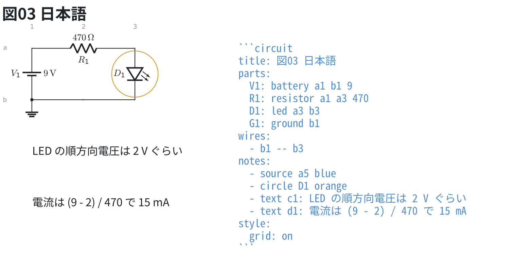
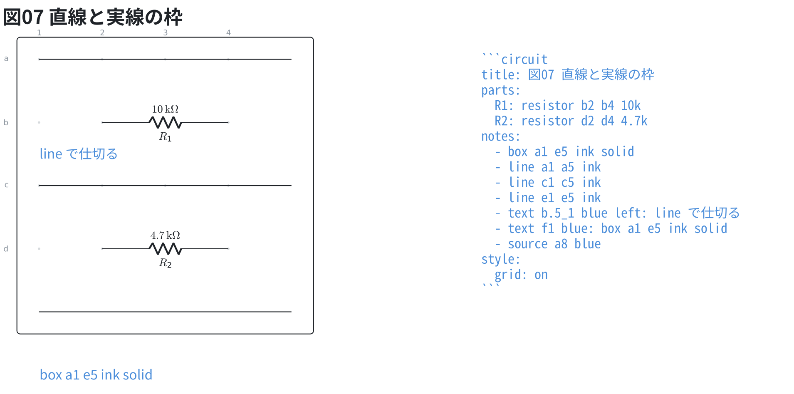
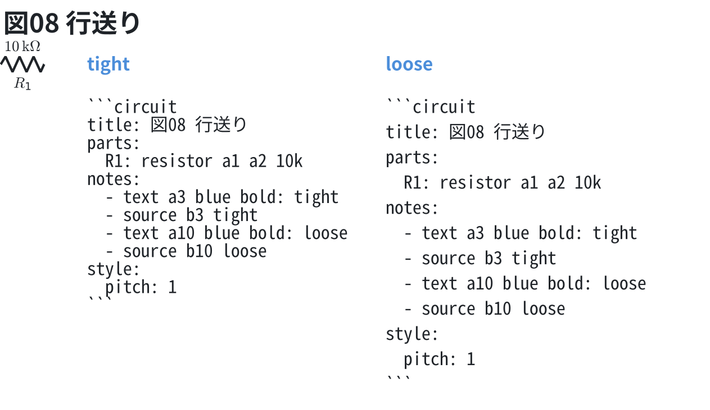

# 図に注釈を重ねる

`notes:` に書いたものは図の上に重なる。**回路の一員ではない**ので、
ネットリストにも分岐の黒丸にも数えない。

```circuit
title: 図01 注釈
parts:
  IN:  port a1
  R1:  resistor a1 a2 10k
  C1:  capacitor a2 b2 100n
  OUT: port a3
  G1:  ground b2
wires:
  - a2 -- a3
notes:
  - source a4 blue
  - circle R1
  - text c1: ここでカットオフ 159 Hz
style:
  grid: on
```


印は `- circle 指し先 [色]` の 1 行。指し先は**部品 ID か番地**で、
部品を指すと記号の真ん中に、番地を指すとその交点に丸が出る。

字は `- text 番地 [色]: 文字` と書く。番地が字の**左端**になる。
字は YAML の値なので、`:` を含むときは `"…"` で囲む。

`- source 番地 [色]` は、**そのフェンスの中身をそのまま図に並べる**。
上の図の右がそれで、囲みの ``` も付く。プレビューではフェンスが図に
差し替わって書いた YAML が見えなくなるので、図と並べて読めるようにしておく。
中身はフェンス自身から作るので、図を直すと書き出しも動く。

**行番号は添えない**。そのまま書き写せる形であることが値打ちなので、
書いていない字は混ぜない。

## 色

書ける色は 4 つ。明るいテーマでも暗いテーマでも読める値にしてある。
印は書かなければ赤、字は書かなければ図のほかの文字と同じ色。

```circuit
title: 図02 注釈の色
parts:
  R1: resistor a1 a3
  R2: resistor a4 a6
  R3: resistor c1 c3
  R4: resistor c4 c6
notes:
  - circle R1 red
  - circle R2 blue
  - circle R3 green
  - circle R4 orange
  - text a.7_2 red center: red
  - text a.7_5 blue center: blue
  - text b1 blue: "R1: resistor a1 a3"
  - text b4 blue: "R2: resistor a4 a6"
  - text c.7_2 green center: green
  - text c.7_5 orange center: orange
  - text d1 blue: "R3: resistor c1 c3"
  - text d4 blue: "R4: resistor c4 c6"
style:
  grid: on
```


## 日本語

**注釈の字はプレビューでも日本語が出る**。部品の値とは違って、フェンスの
TeX には字を渡さず、描き上がった図に差し込んでいるため。

```circuit
title: 図03 日本語
parts:
  V1: battery a1 b1 9
  R1: resistor a1 a3 470
  D1: led a3 b3
  G1: ground b1
wires:
  - b1 -- b3
notes:
  - source a5 blue
  - circle D1 orange
  - text c1: LED の順方向電圧は 2 V ぐらい
  - text d1: 電流は (9 - 2) / 470 で 15 mA
style:
  grid: on
```



## 字の大きさ

`- text 番地 大きさ: 文字` と書くと、字の大きさを 5 段から選べる。
書かなければ普通の大きさ。

```circuit
title: 図04 字の大きさ
parts:
  R1: resistor a1 a2 10k
notes:
  - text b1 tiny: tiny (極小)
  - text c1 small: small (小)
  - text d1: 書かなければ普通
  - text e1 large: large (大)
  - text f1 huge: huge (極大)
  - source a3 blue
style:
  grid: on
  grid-to: f2
```


pt の直接指定は書けない。色と同じで、**実機に通した指定だけ**を名前で引く
(プレビューの TeX はフォントが無いと例外ではなくプロセスごと落ちる)。

## 寄せと太字

`left` / `center` / `right` で、番地を字のどこにするかを決める。
書かなければ `left` で、番地が字の左端になる。`bold` は太字。

```circuit
title: 図05 寄せと太字
parts:
  R1: resistor a1 a2 10k
notes:
  - circle b2
  - text b2 left: left (番地が左端)
  - circle c2
  - text c2 center: center (番地が真ん中)
  - circle d2
  - text d2 right: right (番地が右端)
  - text e2 bold: bold で太字になる
  - source a5 blue
style:
  grid: on
  grid-to: e3
```


色・大きさ・寄せ・太字は**どの順に書いてもよい**。
`- text b1 bold blue huge: …` も `- text b1 huge bold blue: …` も同じ。

## 枠 (`box`) と指し棒 (`arrow`)

`- box 番地 番地 [色]` は 2 つの番地を対角にした枠を引く。
`- arrow 起点 終点 [色]` は指し棒で、両端とも**部品 ID か番地**。

```circuit
title: 図06 枠と指し棒
parts:
  IN:  port a1
  R1:  resistor a1 a2 10k
  C1:  capacitor a2 b2 100n
  OUT: port a3
  G1:  ground b2
wires:
  - a2 -- a3
notes:
  - box a1 c3 blue
  - text d2 blue center: box a1 c3 blue
  - arrow b4 R1
  - text b4 red: R1のコメント
  - source a7 blue
style:
  grid: on
  grid-to: c6
```


部品を指した指し棒は、印 (`circle`) と同じ丸の縁で止まる。
真ん中まで伸ばすと、先端が記号の下に隠れて何を指しているか分からなくなるため。

## 直線 (`line`) と実線の枠

`- line 起点 終点 [色]` は指し棒と同じ書き方で、**先端の矢が付かない**。
表の罫線や区切りのように、向きを持たない線を引くためのもの。
枠は `solid` を書くと破線ではなく実線になる。

```circuit
title: 図07 直線と実線の枠
parts:
  R1: resistor b2 b4 10k
  R2: resistor d2 d4 4.7k
notes:
  - box a1 e5 ink solid
  - line a1 a5 ink
  - line c1 c5 ink
  - line e1 e5 ink
  - text b.5_1 blue left: line で仕切る
  - text f1 blue: box a1 e5 ink solid
  - source a8 blue
style:
  grid: on
```



枠 (`box`) は角の番地の外へ余白を取るので、隣り合う枠は近づけると重なる。
**線には余白が無い**ので、細かく仕切りたいときはこちらを使う
(文法リファレンスの部品一覧の表は、この線で 1 部品 1 マスに区切ってある)。

## 書き出しの行送り

`- source` にだけ、行送りを選ぶ `tight` / `loose` が書ける。
書かなければその中間 (既定)。長いフェンスを図の高さに収めたいときは `tight`、
1 行ずつ指しながら説明したいときは `loose`。

```circuit
title: 図08 行送り
parts:
  R1: resistor a1 a2 10k
notes:
  - text a3 blue bold: tight
  - source b3 tight
  - text a10 blue bold: loose
  - source b10 loose
style:
  pitch: 1
```



`tight` でも字の高さは下回らない。それより詰めると、上の行の下がりと
下の行の上がりが噛む。
