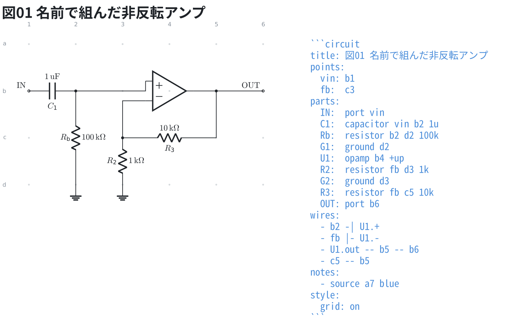

# 番地に名前を付ける

`points:` に「名前: 番地」を書くと、**番地を書ける場所ならどこでも**
その名前で書ける。図には出ないが、名前の乗った節点はネットリストに
その名前で出る。

```circuit
title: 図01 名前で組んだ非反転アンプ
points:
  vin: b1
  fb:  c3
parts:
  IN:  port vin
  C1:  capacitor vin b2 1u
  Rb:  resistor b2 d2 100k
  G1:  ground d2
  U1:  opamp b4 +up
  R2:  resistor fb d3 1k
  G2:  ground d3
  R3:  resistor fb c5 10k
  OUT: port b6
wires:
  - b2 -| U1.+
  - fb |- U1.-
  - U1.out -- b5 -- b6
  - c5 -- b5
notes:
  - source a7 blue
style:
  grid: on
```



帰還の節点を `fb` と名付けてある。`R2` と `R3` と配線の 3 か所から同じ名前で
指すので、**動かすときに直すのは `points:` の 1 行だけ**になる。
番地を 3 か所に書いていると、1 か所だけ直し忘れても図は描けてしまい、
つながり方が変わったことに気づけない。

名前に**番地の形は使えない** (`a1: c5` は書けない)。どちらの意味で書いたのかを
読む順で決めることになり、書いた人には見えないため。
部品 ID と同じ名前も使えない (注釈の指し先がどちらを指すか決まらない)。

ネットリストでは `fb` がそのままネットの名前になる。
ポートやグラウンドが乗っているネットは**そちらの名前が勝つ** —
図に見えている名前のほうが、図と突き合わせるときに探しやすい。

```text
IN  : IN, C1.1
N1  : C1.2, Rb.1, U1.+
GND : Rb.2, G1, R2.2, G2
fb  : R2.1, R3.1, U1.-
OUT : R3.2, OUT, U1.out
```
