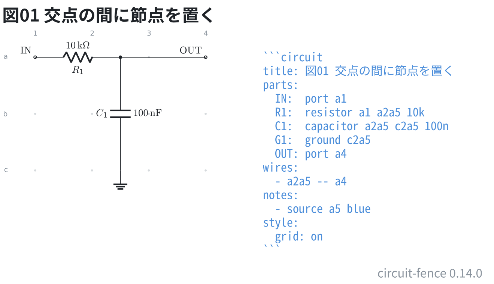
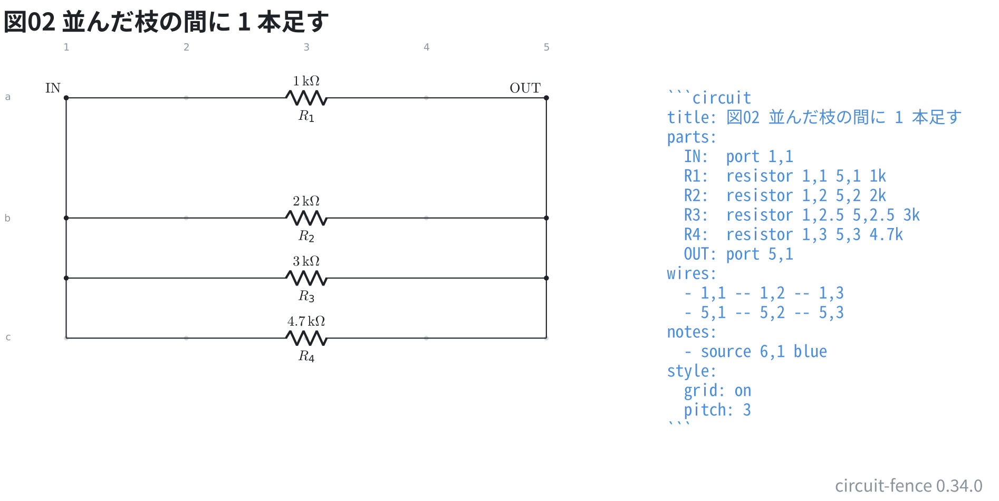
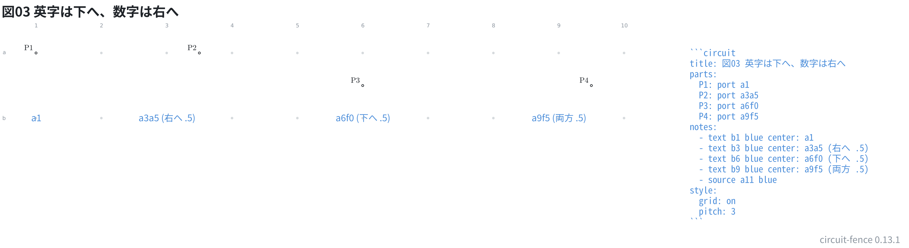

# 交点の間に置く

交点と交点の間に置きたいときは、番地の後ろに**「行の英字 + 列の数字」の組**を足す
(`a1a5` は列が 1 と 2 の間、`a1f0` は行が a と b の間)。**英字が行のずれ、
数字が列のずれ**で、英字は `a` = 0 の 10 段 (`f` が半分)。2 組で 1/100 まで。

`a1.5` のような小数は通さない。`.` はピンの区切りでもあるので (`U1.5` は DIP の
5 番ピン)、番地から `.` を外して**「`.` があればピン」**と分かれるようにしてある。

```circuit
title: 図01 交点の間に節点を置く
parts:
  IN:  port 1,1
  R1:  resistor 1,1 2.5,1 10k
  C1:  capacitor 2.5,1 2.5,3 100n
  G1:  ground 2.5,3
  OUT: port 4,1
wires:
  - 2.5,1 -- 4,1
notes:
  - source 5,1 blue
style:
  grid: on
```



抵抗の右端を `a2` と `a3` の間に置いた。**他の番地を振り直さずに**節点を
ずらせるのが、間を書ける理由。グリッドの点は**交点の上にだけ**打つので、
間に置いた部品は点と点の間に乗る。

```circuit
title: 図02 並んだ枝の間に 1 本足す
parts:
  IN:  port 1,1
  R1:  resistor 1,1 5,1 1k
  R2:  resistor 1,2 5,2 2k
  R3:  resistor 1,2.5 5,2.5 3k
  R4:  resistor 1,3 5,3 4.7k
  OUT: port 5,1
wires:
  - 1,1 -- 1,2 -- 1,3
  - 5,1 -- 5,2 -- 5,3
notes:
  - source 6,1 blue
style:
  grid: on
  pitch: 3
```



`R3` だけが行 b と c の**間**にいる。後から 1 ピンしたくなっても、
**`R4` から下を振り直さずに済む**のがここでの効き目。左右の縦線の途中に
乗るので、つなぎ方はほかの枝と変わらない (ネットリストでも同じ節点に入る)。

**間隔が詰まると記号も詰まる**。この図が `pitch: 3` を書いているのはそのため —
既定の 2cm のままだと、半マス (1cm) しか離れていない `R2` と `R3` で、
値の字と ID の字が重なる。狭いと感じたら、番地ではなくマスのほうを広げる。

## どちらへずれるか

組の**英字が下へ、数字が右へ**動かす。同じ `.5` でも、書く場所で向きが変わる。

```circuit
title: 図03 英字は下へ、数字は右へ
parts:
  P1: port 1,1
  P2: port 3.5,1
  P3: port 6,1.5
  P4: port 9.5,1.5
notes:
  - text 1,2 blue center: a1
  - text 3,2 blue center: a3a5 (右へ .5)
  - text 6,2 blue center: a6f0 (下へ .5)
  - text 9,2 blue center: a9f5 (両方 .5)
  - source 11,1 blue
style:
  grid: on
  pitch: 3
```



`a1a5` は `a1` の右、`a1f0` は下、`a1f5` はその両方。**組の中の並びは
番地そのものと同じ (行 → 列)** なので、覚えるものは増えない。
