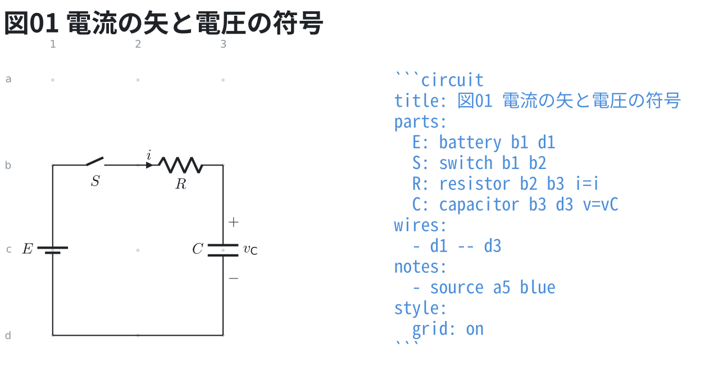
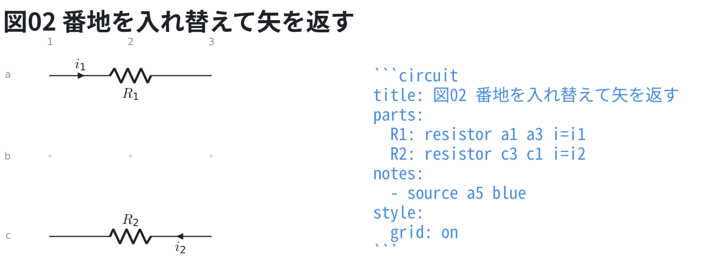
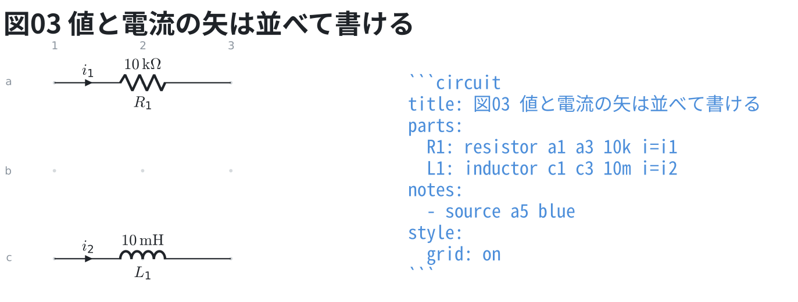

# 電流の矢と電圧の符号

2 端子部品の行に `i=字` と `v=字` を書くと、電流の矢と電圧の符号が付く。
教科書の回路図は、記号よりも「どこを流れる電流を $i$ と呼ぶか」
「どちらを + と数えるか」を図で決める。

**向きは先に書いた番地が基準**で、極性のある部品と同じ規則。
電流は先に書いた番地から後に書いた番地へ流れる向き、
電圧は先に書いた番地が + になる。逆にしたいときは番地を入れ替える。

```circuit
title: 図01 電流の矢と電圧の符号
parts:
  E: battery b1 d1
  S: switch b1 b2
  R: resistor b2 b3 i=i
  C: capacitor b3 d3 v=vC
wires:
  - d1 -- d3
notes:
  - source a5 blue
style:
  grid: on
```



字は ID と同じ組み方で、先頭 1 文字が本体・残りが添字になる
(`i=i1` は i の添字 1、`v=vC` は v の添字 C)。

矢を逆に向けたいだけなら、番地を入れ替えて書く。

```circuit
title: 図02 番地を入れ替えて矢を返す
parts:
  R1: resistor a1 a3 i=i1
  R2: resistor c3 c1 i=i2
notes:
  - source a5 blue
style:
  grid: on
```



## 値と並べて書けるか

| 組み合わせ | 書けるか |
| --- | --- |
| 値 + `i=` | 書ける (図の別の場所に出る) |
| 値 + `v=` | **書けない** — 同じ側に出て重なる |
| `i=` + `v=` | **書けない** — 同じ側に出て重なる |

書けない組み合わせは、重ねて描かずに行番号つきで返す。
値は問題文や表に書き、図には記号だけを置くのが元々の書き方に近い。

```circuit
title: 図03 値と電流の矢は並べて書ける
parts:
  R1: resistor a1 a3 10k i=i1
  L1: inductor c1 c3 10m i=i2
notes:
  - source a5 blue
style:
  grid: on
```


