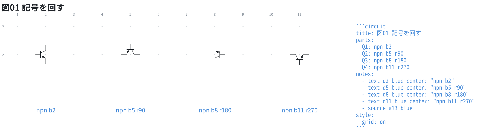
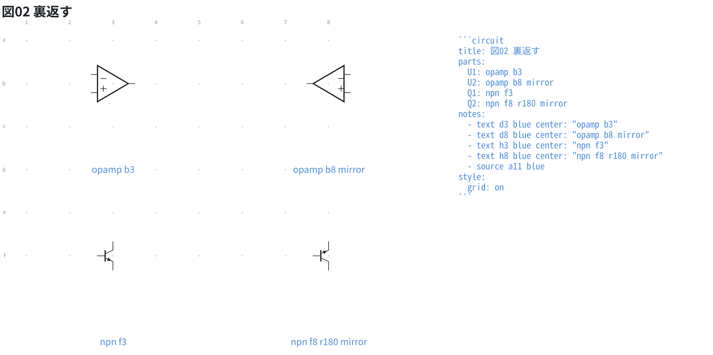
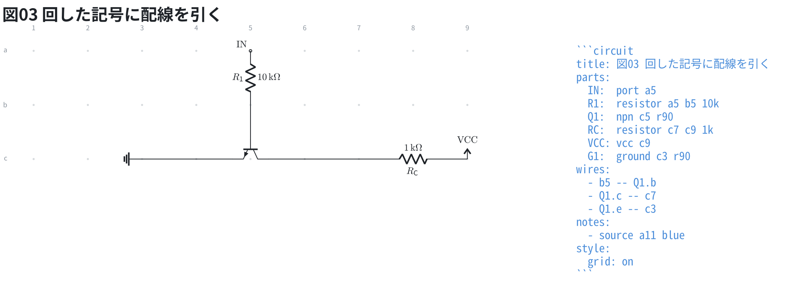

# 記号の向き

多端子部品と `ground` は、番地のあとに向きの語を書いて回したり裏返したりできる。
回転は `r90` / `r180` / `r270` で**時計回り**、左右反転は `mirror`。

```circuit
title: 図01 記号を回す
parts:
  Q1: npn b2
  Q2: npn b5 r90
  Q3: npn b8 r180
  Q4: npn b11 r270
notes:
  - text d2 blue center: "npn b2"
  - text d5 blue center: "npn b5 r90"
  - text d8 blue center: "npn b8 r180"
  - text d11 blue center: "npn b11 r270"
  - source a13 blue
style:
  grid: on
```



`r90` はコレクタが右を向く。信号が横に流れる図で、トランジスタだけ縦に
立たせたくないときに使う。

## 裏返す

`mirror` は左右反転。上下反転の語は無く、`mirror` と `r180` を並べて書く。

```circuit
title: 図02 裏返す
parts:
  U1: opamp b3
  U2: opamp b8 mirror
  Q1: npn f3
  Q2: npn f8 r180 mirror
notes:
  - text d3 blue center: "opamp b3"
  - text d8 blue center: "opamp b8 mirror"
  - text h3 blue center: "npn f3"
  - text h8 blue center: "npn f8 r180 mirror"
  - source a11 blue
style:
  grid: on
```



裏返したオペアンプは入力が右、出力が左になる。信号を右から左へ流す図で、
線を交差させずに描ける。

## 足は記号と一緒に回る

名前で指した足 (`Q1.B`) は記号に付いて回るので、**配線は書き換えなくてよい**。
まっすぐ引ける向きも一緒に回る。

```circuit
title: 図03 回した記号に配線を引く
parts:
  IN:  port a5
  R1:  resistor a5 b5 10k
  Q1:  npn c5 r90
  RC:  resistor c7 c9 1k
  VCC: vcc c9
  G1:  ground c3 r90
wires:
  - b5 -- Q1.b
  - Q1.c -- c7
  - Q1.e -- c3
notes:
  - source a11 blue
style:
  grid: on
```



`r90` にしたトランジスタは**ベースが上、コレクタが右、エミッタが左**を向く。
だから `b5` からベースへも、コレクタから `c7` へも**まっすぐ** (`--`) 引ける。
立っているままの向きで同じ引き方をすると、斜めに入るとお知らせが出る。
グラウンドも `r90` で横倒しにして、左から来た線に付けている。

## 書ける範囲

種類によって書ける向きが違う。書けない語を書くと、行番号つきで断る。

| 種類 | 回転 | 反転 |
| --- | --- | --- |
| 多端子 (既定) | ○ | ○ |
| `dip8`〜`dip40` | ○ | ✗ (足番号も型番も鏡文字になる) |
| `transformer` | ✗ (巻線と鉄心がばらける) | ○ |
| `ground` | ○ | ✗ (左右対称で図が変わらない) |
| `port` / `vcc` / `vee` | ✗ | ✗ (上下がその記号の意味) |
| 2 端子 | ✗ | ✗ (番地の順が向き) |

2 端子部品は**番地の順そのものが向き**なので、向きの語を持たない。
回すのは後の番地を動かすこと、裏返すのは 2 つを入れ替えることで書ける。
