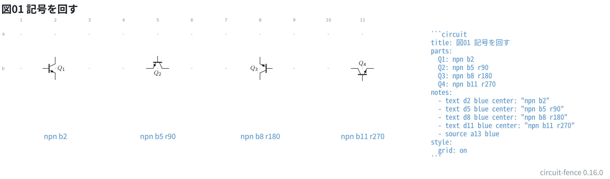
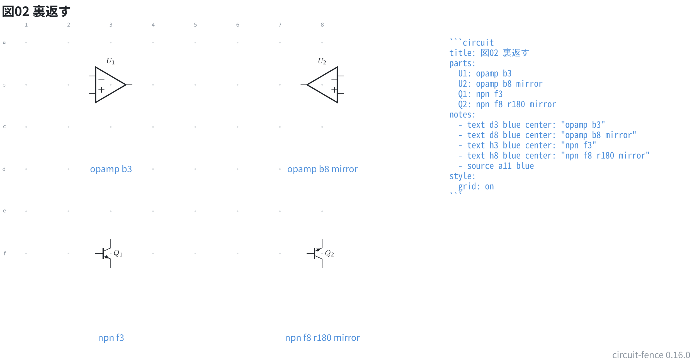
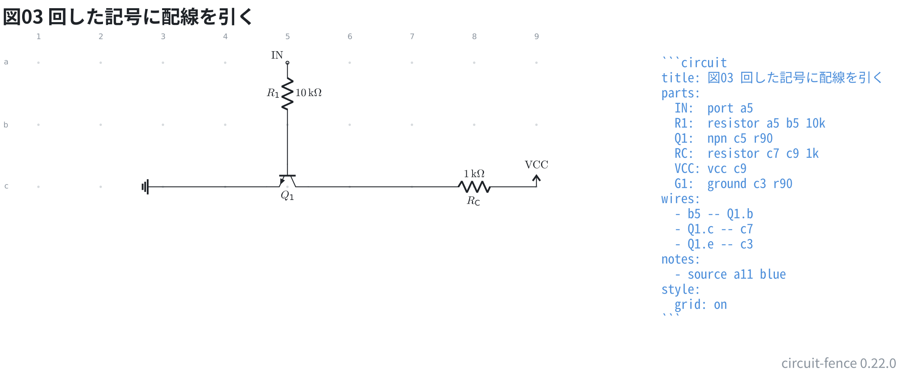

# 記号の向き

多端子部品と `ground` は、番地のあとに向きの語を書いて回したり裏返したりできる。
回転は `r90` / `r180` / `r270` で**時計回り**、左右反転は `mirror`。

```circuit
title: 図01 記号を回す
parts:
  Q1: npn 2,2
  Q2: npn 5,2 r90
  Q3: npn 8,2 r180
  Q4: npn 11,2 r270
notes:
  - text 2,4 blue center: "npn b2"
  - text 5,4 blue center: "npn b5 r90"
  - text 8,4 blue center: "npn b8 r180"
  - text 11,4 blue center: "npn b11 r270"
  - source 13,1 blue
style:
  grid: on
```



`r90` はコレクタが右を向く。信号が横に流れる図で、トランジスタだけ縦に
立たせたくないときに使う。

## 裏返す

`mirror` は左右反転。上下反転の語は無く、`mirror` と `r180` を並べて書く。

```circuit
title: 図02 裏返す
parts:
  U1: opamp 3,2
  U2: opamp 8,2 mirror
  Q1: npn 3,6
  Q2: npn 8,6 r180 mirror
notes:
  - text 3,4 blue center: "opamp b3"
  - text 8,4 blue center: "opamp b8 mirror"
  - text 3,8 blue center: "npn f3"
  - text 8,8 blue center: "npn f8 r180 mirror"
  - source 11,1 blue
style:
  grid: on
```



裏返したオペアンプは入力が右、出力が左になる。信号を右から左へ流す図で、
線を交差させずに描ける。

## ピンは記号と一緒に回る

名前で指したピン (`Q1.B`) は記号に付いて回るので、**配線は書き換えなくてよい**。
まっすぐ引ける向きも一緒に回る。

```circuit
title: 図03 回した記号に配線を引く
parts:
  IN:  port 5,1
  R1:  resistor 5,1 5,2 10k
  Q1:  npn 5,3 r90
  RC:  resistor 7,3 9,3 1k
  VCC: vcc 9,3
  G1:  ground 3,3 r90
wires:
  - 5,2 -- Q1.b
  - Q1.c -- 7,3
  - Q1.e -- 3,3
notes:
  - source 11,1 blue
style:
  grid: on
```



`r90` にしたトランジスタは**ベースが上、コレクタが右、エミッタが左**を向く。
だから `5,2` からベースへも、コレクタから `7,3` へも**まっすぐ** (`--`) 引ける。
立っているままの向きで同じ引き方をすると、斜めに入るとお知らせが出る。
グラウンドも `r90` で横倒しにして、左から来た線に付けている。

## 書ける範囲

種類によって書ける向きが違う。書けない語を書くと、行番号つきで断る。

| 種類 | 回転 | 反転 |
| --- | --- | --- |
| 多端子 (既定) | ○ | ○ |
| `dip8`〜`dip40` | ○ | ✗ (ピン番号も型番も鏡文字になる) |
| `transformer` | ✗ (巻線と鉄心がばらける) | ○ |
| `ground` | ○ | ✗ (左右対称で図が変わらない) |
| `port` / `vcc` / `vee` | ✗ | ✗ (上下がその記号の意味) |
| 2 端子 | ✗ | ✗ (番地の順が向き) |

2 端子部品は**番地の順そのものが向き**なので、向きの語を持たない。
回すのは後の番地を動かすこと、裏返すのは 2 つを入れ替えることで書ける。
