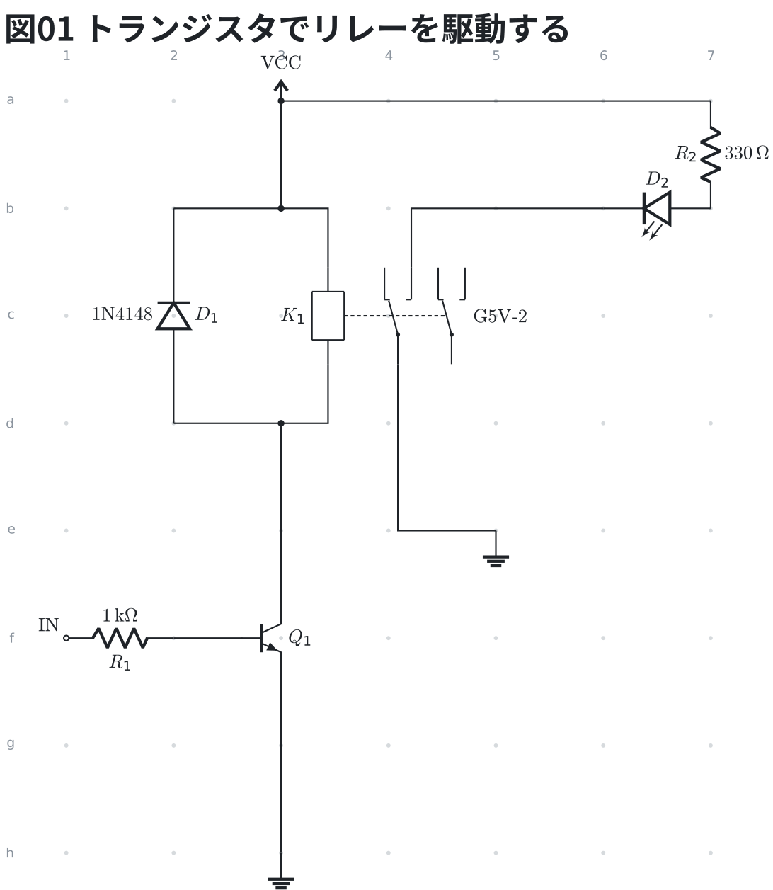
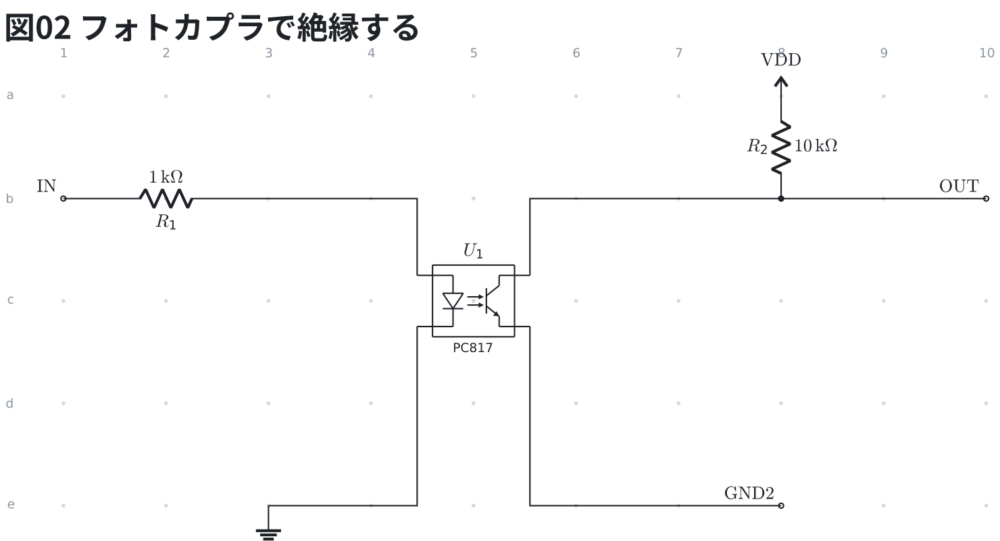
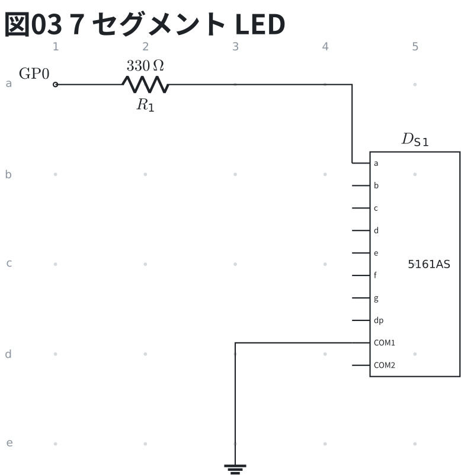

# 足に名前のある部品 (リレー・フォトカプラ・7 セグ)

リレー (`relay`)、フォトカプラ (`photocoupler`)、7 セグメント LED (`seg7`) は、
**足の名前と番号が実体配線図の 2 つと同じ表**から出る。配線からは名前でも
番号でも指せる (`K1.COM1` も `K1.4` も同じ)。ネットリストには名前で出る。

```circuit
title: 図01 トランジスタでリレーを駆動する
parts:
  VCC: vcc a3
  D1:  diode d2 b2 1N4148
  K1:  relay c4 G5V-2
  Q1:  npn f3
  R1:  resistor f1 f2 1k
  IN:  port f1
  G1:  ground h3
  R2:  resistor a7 b7 330
  D2:  led b7 b6
  G2:  ground e5
wires:
  - a3 -- b3 -- b2
  - a3 -- a7
  - K1.A1 |- b3
  - K1.A2 |- d3
  - d2 -- d3 -- Q1.C
  - f2 -- Q1.B
  - Q1.E -- h3
  - K1.NO1 |- b6
  - K1.COM1 |- e5
style:
  grid: on
```



リレーは**左にコイル、右に c 接点 2 つ**で、コイルに電流が流れていない形
(共通 `COM` が `NC` 側) で描く。足は上下の辺だけに出る — 上がコイルの `A1` と
接点の `NC` `NO`、下が `A2` と `COM`。足の番号は G5V-2 (DIP16 の位置) のもの。
**使わない接点は ERC が言わない** — 2 回路のうち 1 つしか使わないのが普通のため。

足は格子の上に無いので、`|-` か `-|` で引く (上の図の `K1.NO1 |- b6`)。

```circuit
title: 図02 フォトカプラで絶縁する
parts:
  IN:   port b1
  R1:   resistor b1 b3 1k
  U1:   photocoupler c5 PC817
  G1:   ground e3
  VDD:  vcc a8
  R2:   resistor a8 b8 10k
  OUT:  port b10
  GND2: port e8
wires:
  - b3 -| U1.A
  - U1.K |- e3
  - U1.C |- b8
  - b8 -- b10
  - U1.E |- e8
style:
  grid: on
```



フォトカプラは**左に LED (`A` `K`)、右にフォトトランジスタ (`C` `E`)**。
外枠が 1 つの部品であることの印。足の番号は PC817 のもの
(1 `A` / 2 `K` / 3 `E` / 4 `C`)。出口の側のグラウンドは入口と別のネットに
したいので、`ground` ではなくポート (`GND2`) で書いている — `ground` はどれも
1 つのネット (`GND`) になる。

```circuit
title: 図03 7 セグメント LED
parts:
  GP0: port a1
  R1:  resistor a1 a3 330
  DS1: seg7 c5 5161AS
  G1:  ground e3
wires:
  - a3 -| DS1.a
  - DS1.COM1 -| e3
style:
  grid: on
```



7 セグは**足の名前を刷った箱**で描く (機器と同じ形)。並びはセグメント
`a`〜`g`、点 `dp`、共通 `COM1` `COM2` の順で、番号は 5161AS (DIP10 の位置) の
もの — `DS1.3` は `COM1`。使わない足は ERC が言わない。
